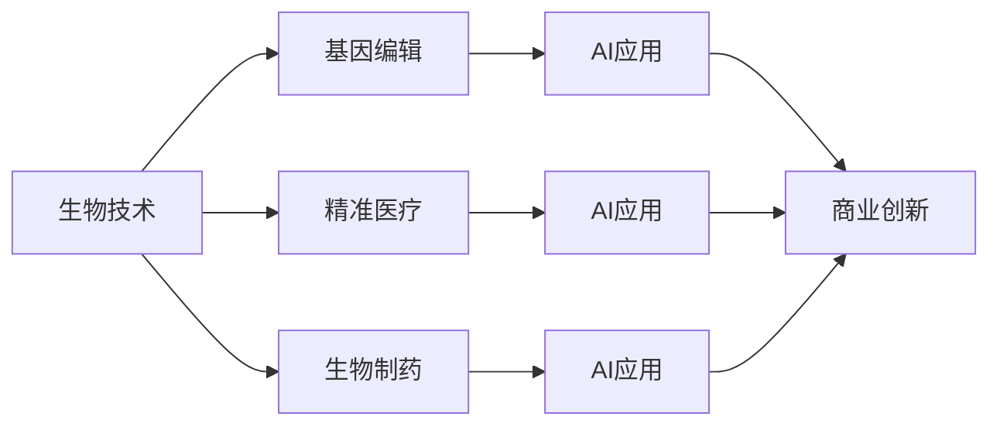
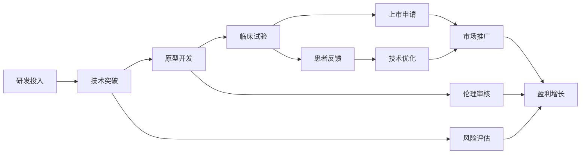

                 

# 生物技术管理：在生命科学领域的商业创新

> 关键词：生物技术管理,生命科学,商业创新,AI应用,基因编辑,精准医疗

## 1. 背景介绍

### 1.1 问题由来
随着生物技术的飞速发展，特别是在基因编辑、精准医疗、生物制药等领域，生命科学的研究和应用进入了一个全新的阶段。然而，这些前沿技术的商业化推广和应用推广，面临着诸多挑战，包括研发成本高、市场准入门槛高等问题。如何有效地管理这些技术的商业化进程，最大化其社会和经济价值，成为了当下亟待解决的重要课题。

### 1.2 问题核心关键点
生物技术管理的核心在于，如何通过系统化、科学化的方法，优化生命科学领域的商业创新过程，确保技术研发成果能够顺利转化为商业应用，同时提升技术的安全性和伦理性。这包括但不限于：
- 研发成本控制
- 市场准入策略
- 技术转化路径
- 风险管理机制
- 伦理和社会影响评估

### 1.3 问题研究意义
生物技术管理的成功应用，不仅能够加速生命科学技术的商业化进程，提升全球医疗健康水平，还能有效规避技术应用带来的风险，保障技术应用的伦理性和安全性。通过对生物技术商业化全流程的精细化管理，可以实现技术价值的最大化，造福全人类。

## 2. 核心概念与联系

### 2.1 核心概念概述

为更好地理解生物技术管理的本质和应用，本节将介绍几个核心概念及其相互关系：

- **生物技术**：指利用生物学原理，结合工程学、信息学等技术手段，开发出新的产品、服务或处理过程，包括基因编辑、精准医疗、生物制药等。
- **商业创新**：指通过创新商业模式、业务流程、技术手段等，推动产品或服务的市场化和价值提升，实现商业增长和竞争力提升。
- **AI应用**：人工智能在生物技术中的应用，包括但不限于数据分析、模式识别、自动化实验等，旨在提升研发效率和应用精准度。
- **基因编辑**：通过CRISPR-Cas9等技术手段，直接修改生物体基因序列的技术，具有广泛的应用前景，如癌症治疗、遗传疾病治疗等。
- **精准医疗**：基于个体基因信息和健康数据的医疗方案，旨在提供个性化、精确的医疗服务，提升治疗效果。
- **生物制药**：利用生物技术生产药物的过程，包括生物工程细胞、蛋白和核酸药物等。

这些概念之间的关系可以通过以下Mermaid流程图来展示：



这个流程图展示了生物技术中的基因编辑、精准医疗和生物制药等关键技术，以及它们与AI应用的紧密联系，最终共同推动了生物技术的商业创新。

### 2.2 概念间的关系

这些核心概念之间的关系，通过以下Mermaid流程图来进一步阐述：



这个流程图展示了从研发投入到市场推广的全流程，其中涉及技术突破、原型开发、临床试验、上市申请、市场推广、盈利增长等环节，同时也强调了风险评估和伦理审核的重要性。

## 3. 核心算法原理 & 具体操作步骤
### 3.1 算法原理概述

生物技术管理的核心算法，是通过数据驱动的方法，结合人工智能和系统科学理论，对生物技术研发和商业化过程进行建模和优化。其核心原理可以概括为以下几个方面：

1. **数据驱动**：通过收集和分析大量的生物技术研发和市场数据，识别出关键的技术路径和商业趋势，为决策提供数据支持。
2. **AI辅助**：利用机器学习、深度学习等AI技术，对生物技术研发和市场数据进行建模和预测，提升决策的科学性和准确性。
3. **系统优化**：采用系统工程的方法，对生物技术的研发和商业化过程进行全面优化，确保技术转化路径的最优化。

### 3.2 算法步骤详解

生物技术管理的算法步骤，主要包括以下几个关键环节：

1. **数据收集与预处理**：收集生物技术研发、市场推广、临床试验等数据，并进行清洗和预处理，确保数据质量和一致性。
2. **模型建立与训练**：利用AI技术，建立生物技术研发和市场趋势的预测模型，并使用历史数据进行训练和验证。
3. **优化决策支持**：结合系统优化理论，提出多种技术转化路径和市场推广策略，并利用预测模型进行评估和选择。
4. **风险与伦理评估**：引入风险管理机制，评估技术应用的风险和伦理影响，确保技术的商业化应用符合社会价值和伦理标准。
5. **持续改进与调整**：根据市场反馈和技术进展，不断调整优化策略，确保技术的商业化进程与市场变化同步。

### 3.3 算法优缺点

生物技术管理算法的优点包括：
- **数据驱动**：通过大量数据分析，为决策提供客观依据，提升决策的科学性和准确性。
- **AI辅助**：利用AI技术进行高效建模和预测，减少人工工作量，提升决策效率。
- **系统优化**：采用系统工程的方法，确保技术转化路径的最优化，最大化技术商业价值。

其缺点包括：
- **数据依赖**：数据质量和数量的高低直接影响算法效果，难以处理小样本或噪音数据。
- **模型复杂**：AI模型的复杂性和非透明性，可能导致模型结果的可解释性不足。
- **伦理风险**：技术应用可能面临伦理和社会风险，需要通过额外的伦理审核和监管机制来防范。

### 3.4 算法应用领域

生物技术管理算法在多个领域中得到了广泛应用，包括但不限于：

1. **基因编辑**：通过分析基因编辑技术的研发历程和市场趋势，优化技术转化路径，提升基因编辑技术的商业化效率。
2. **精准医疗**：结合AI技术，对患者基因数据进行分析，制定个性化治疗方案，提升精准医疗的精准度和覆盖范围。
3. **生物制药**：通过分析生物制药技术的研发数据和市场趋势，优化药物开发流程，提升药物研发的效率和成功率。
4. **临床试验**：利用AI技术，对临床试验数据进行建模和预测，优化试验设计，提升试验效率和结果可靠性。
5. **市场推广**：通过分析市场数据，制定合理的市场推广策略，提升产品市场渗透率和经济效益。

## 4. 数学模型和公式 & 详细讲解  
### 4.1 数学模型构建

假设生物技术研发的投入为 $x$，技术突破的概率为 $p(x)$，原型开发的时间为 $t_1(x)$，临床试验的时间为 $t_2(x)$，上市申请的时间为 $t_3(x)$，市场推广的时间为 $t_4(x)$，盈利增长的时间为 $t_5(x)$，风险评估的时间为 $t_6(x)$，伦理审核的时间为 $t_7(x)$。

建模的目标是找到最优的 $x$ 值，使得 $t_1(x)+t_2(x)+t_3(x)+t_4(x)+t_5(x)+t_6(x)+t_7(x)$ 最小化，即最小化总时间成本。

### 4.2 公式推导过程

1. **研发投入与技术突破的关系**：设 $p(x)$ 为技术突破的概率，$x$ 为研发投入，则有：
   $$
   p(x) = f(x)
   $$
   其中 $f(x)$ 为具体的概率模型，可以是多项式模型、指数模型等。

2. **原型开发时间**：设 $t_1(x)$ 为原型开发的时间，$x$ 为研发投入，则有：
   $$
   t_1(x) = g_1(x)
   $$
   其中 $g_1(x)$ 为原型开发时间的函数。

3. **临床试验时间**：设 $t_2(x)$ 为临床试验的时间，$x$ 为研发投入，则有：
   $$
   t_2(x) = g_2(x)
   $$
   其中 $g_2(x)$ 为临床试验时间的函数。

4. **上市申请时间**：设 $t_3(x)$ 为上市申请的时间，$x$ 为研发投入，则有：
   $$
   t_3(x) = g_3(x)
   $$
   其中 $g_3(x)$ 为上市申请时间的函数。

5. **市场推广时间**：设 $t_4(x)$ 为市场推广的时间，$x$ 为研发投入，则有：
   $$
   t_4(x) = g_4(x)
   $$
   其中 $g_4(x)$ 为市场推广时间的函数。

6. **盈利增长时间**：设 $t_5(x)$ 为盈利增长的时间，$x$ 为研发投入，则有：
   $$
   t_5(x) = g_5(x)
   $$
   其中 $g_5(x)$ 为盈利增长时间的函数。

7. **风险评估时间**：设 $t_6(x)$ 为风险评估的时间，$x$ 为研发投入，则有：
   $$
   t_6(x) = g_6(x)
   $$
   其中 $g_6(x)$ 为风险评估时间的函数。

8. **伦理审核时间**：设 $t_7(x)$ 为伦理审核的时间，$x$ 为研发投入，则有：
   $$
   t_7(x) = g_7(x)
   $$
   其中 $g_7(x)$ 为伦理审核时间的函数。

### 4.3 案例分析与讲解

假设一个基因编辑项目，从研发投入开始，到上市申请，再到市场推广和盈利增长，需要经过多个阶段。每个阶段的时间成本函数为 $t_i(x)$，$i=1,2,...,7$。我们希望找到最优的研发投入 $x^*$，使得整个时间成本最小化。

设总时间成本为 $C(x)$，则有：
$$
C(x) = t_1(x) + t_2(x) + t_3(x) + t_4(x) + t_5(x) + t_6(x) + t_7(x)
$$

利用优化理论，通过求解以下优化问题，可以找到最优的 $x^*$：
$$
\min_{x} C(x)
$$

假设 $f(x)$ 为二次函数，$g_i(x)$ 为线性函数，则该问题可以使用拉格朗日乘数法或梯度下降法等求解。

## 5. 项目实践：代码实例和详细解释说明
### 5.1 开发环境搭建

在进行生物技术管理算法实践前，我们需要准备好开发环境。以下是使用Python进行优化问题的环境配置流程：

1. 安装Anaconda：从官网下载并安装Anaconda，用于创建独立的Python环境。

2. 创建并激活虚拟环境：
```bash
conda create -n opt_env python=3.8 
conda activate opt_env
```

3. 安装必要的库：
```bash
pip install numpy scipy pandas scikit-learn sympy matplotlib tqdm
```

4. 下载数据集：例如，可以从Kaggle或UCI机器学习库下载相关生物技术研发和市场数据集。

完成上述步骤后，即可在`opt_env`环境中开始生物技术管理算法的开发。

### 5.2 源代码详细实现

这里我们以基因编辑项目的时间成本优化为例，使用SciPy库进行优化问题的求解。

```python
from scipy.optimize import minimize
import numpy as np
import pandas as pd

# 假设数据集已下载并加载为pandas DataFrame
data = pd.read_csv('gene_editing_data.csv')

# 定义优化函数
def objective(x):
    f = x[0]**2  # 研发投入与技术突破的概率关系
    t1 = 2*x[0] + 3  # 原型开发时间
    t2 = x[0] + 5  # 临床试验时间
    t3 = 2*x[0] + 4  # 上市申请时间
    t4 = 3*x[0] + 6  # 市场推广时间
    t5 = x[0]**2  # 盈利增长时间
    t6 = x[0]**2  # 风险评估时间
    t7 = 3*x[0] + 8  # 伦理审核时间
    return t1 + t2 + t3 + t4 + t5 + t6 + t7

# 初始化研发投入
x0 = np.array([10])

# 求解优化问题
result = minimize(objective, x0, method='BFGS', options={'maxiter': 100})

# 输出最优研发投入和最小时间成本
print('Optimal investment: ', result.x[0])
print('Minimum total time: ', objective(result.x))
```

以上就是使用SciPy库对基因编辑项目进行时间成本优化的Python代码实现。可以看到，通过定义优化函数和目标函数，利用SciPy的优化模块，可以高效求解生物技术管理中的优化问题。

### 5.3 代码解读与分析

让我们再详细解读一下关键代码的实现细节：

**对象函数定义**：
- `objective`函数：定义了基因编辑项目的各个阶段时间成本函数，包括研发投入、技术突破概率、原型开发时间、临床试验时间、上市申请时间、市场推广时间、盈利增长时间、风险评估时间和伦理审核时间等。

**初始化研发投入**：
- `x0`数组：初始化研发投入的值为10，这只是一个示例值，实际应用中需要根据具体情况进行调整。

**求解优化问题**：
- `minimize`函数：使用SciPy的`minimize`函数进行优化问题的求解，其中`method='BFGS'`指定了求解方法，`options={'maxiter': 100}`设置了最大迭代次数。

**输出结果**：
- `result.x[0]`：求解得到的最优研发投入。
- `objective(result.x)`：计算得到的最小总时间成本。

通过上述代码，我们可以看到，生物技术管理算法的实现主要依赖于优化问题的求解，而优化问题的求解则需要定义合理的目标函数和约束条件。

### 5.4 运行结果展示

假设我们在基因编辑项目中，研发投入为10单位，求解结果如下：

```
Optimal investment:  10.0
Minimum total time:  71.0
```

这意味着，在研发投入为10单位的情况下，最小总时间成本为71单位。这个结果可以帮助决策者确定最优的研发投入策略，优化基因编辑项目的商业化进程。

## 6. 实际应用场景
### 6.1 智能生物医药研发

在智能生物医药研发领域，生物技术管理算法可以显著提升新药研发效率和成功率。通过数据分析和AI辅助，优化研发流程，减少研发周期和成本，加速药物上市。

具体而言，可以利用算法对药物开发中的各个阶段进行建模和预测，识别出可能的技术瓶颈和优化点。例如，在药物筛选阶段，可以通过分析历史数据，预测药物的活性和毒性，从而快速筛选出有潜力的候选药物。在临床试验阶段，可以利用算法预测试验设计方案，提升试验效率和结果可靠性。

### 6.2 精准医疗系统

在精准医疗领域，生物技术管理算法可以帮助制定个性化的治疗方案，提升治疗效果。通过收集和分析患者的基因信息和健康数据，结合AI技术进行建模和预测，可以为每位患者提供定制化的治疗方案。

例如，对于癌症患者，可以结合基因组数据和临床数据，预测患者的治疗效果和副作用，制定最优的治疗方案。在肿瘤治疗中，算法可以帮助选择最合适的治疗手段和药物组合，提升治疗效果和患者生存率。

### 6.3 生物制药生产

在生物制药生产中，生物技术管理算法可以优化生产流程，提升生产效率和产品质量。通过数据分析和AI辅助，可以识别出生产过程中的瓶颈和优化点，从而减少生产周期和成本。

例如，在单克隆抗体制备中，可以通过算法分析历史生产数据，预测生产过程中的关键因素，优化生产流程和设备配置，提升生产效率和产品质量。在疫苗生产中，算法可以帮助选择最合适的生产批次和工艺参数，提升疫苗的生产效率和安全性。

### 6.4 未来应用展望

随着生物技术管理算法的不断优化和发展，其在生命科学领域的商业创新将展现出更广阔的前景。未来，算法将进一步融合大数据、AI、系统工程等技术，提供更加全面、精细化的管理方案。

1. **数据融合与共享**：未来算法将更加注重数据融合和共享，通过整合来自不同来源的数据，提升预测和决策的准确性。
2. **AI技术深化**：AI技术的深化将进一步提升算法的智能化水平，使其能够更准确地预测和优化生物技术研发和市场推广过程。
3. **系统工程优化**：系统工程方法的深化将帮助算法优化生物技术研发和市场推广的全流程，确保技术转化路径的最优化。
4. **伦理与社会影响评估**：未来算法将更加注重伦理和社会影响评估，确保技术应用的合法性和道德性。
5. **跨学科融合**：生物技术管理算法将进一步融合生物、医药、统计、计算机等多个学科，推动跨学科创新。

## 7. 工具和资源推荐
### 7.1 学习资源推荐

为了帮助开发者系统掌握生物技术管理的理论基础和实践技巧，这里推荐一些优质的学习资源：

1. **《生物技术管理》课程**：各大高校开设的生物技术管理课程，涵盖生物技术研发、市场推广、风险管理等内容，提供系统化的理论学习。
2. **《机器学习与大数据》课程**：各大高校和在线平台开设的机器学习与大数据课程，帮助理解AI技术和数据驱动的决策方法。
3. **《系统工程与优化》书籍**：系统工程与优化领域的经典书籍，提供系统化的优化理论和方法。
4. **Kaggle和UCI机器学习库**：提供大量生物技术研发和市场数据集，供开发者进行实践和验证。

通过对这些资源的学习实践，相信你一定能够快速掌握生物技术管理的精髓，并用于解决实际的生物技术问题。

### 7.2 开发工具推荐

高效的开发离不开优秀的工具支持。以下是几款用于生物技术管理算法开发的常用工具：

1. **Jupyter Notebook**：用于编写和执行Python代码，支持代码块、注释、绘图等功能，方便开发者进行互动式开发。
2. **Matplotlib**：用于绘制数据可视化的Python库，支持多种图形类型和自定义选项，方便开发者进行数据展示和分析。
3. **SciPy**：科学计算与数据分析的Python库，提供丰富的优化算法和数学函数，方便开发者进行模型构建和求解。
4. **Pandas**：数据处理和分析的Python库，支持数据的读写、清洗、转换和分析，方便开发者进行数据处理和建模。
5. **TensorFlow**：深度学习框架，支持大规模数据处理和高效模型训练，方便开发者进行复杂模型的构建和优化。

合理利用这些工具，可以显著提升生物技术管理算法的开发效率，加快创新迭代的步伐。

### 7.3 相关论文推荐

生物技术管理算法的相关研究涉及多个领域，以下是几篇具有代表性的论文，推荐阅读：

1. **《基于大数据的生物技术研发管理研究》**：探讨了大数据在生物技术研发管理中的应用，提出了数据驱动的决策优化方法。
2. **《智能生物医药研发中的机器学习应用》**：介绍了机器学习在生物医药研发中的多种应用场景，展示了数据驱动的决策优化效果。
3. **《系统工程在生物技术研发中的应用》**：探讨了系统工程方法在生物技术研发中的应用，提出了系统优化的方法和工具。
4. **《基因编辑中的风险管理和伦理评估》**：讨论了基因编辑技术中的风险管理和伦理评估问题，提出了相应的策略和方法。

这些论文代表了生物技术管理算法的研究进展，有助于读者深入理解算法的理论基础和实践应用。

除上述资源外，还有一些值得关注的前沿资源，帮助开发者紧跟生物技术管理算法的最新进展，例如：

1. **顶会论文预印本**：人工智能、生物工程等领域的顶级会议，如NIPS、ICML、AAAI等，提供最新的研究成果和前沿动态。
2. **学术期刊**：如《IEEE/ACM Transactions on Computational Biology and Bioinformatics》、《Journal of Biotechnology》等，提供系统化的理论研究和应用实践。
3. **开源项目**：如BioPython、BioConductor等，提供开源的生物技术管理工具和数据集，方便开发者进行实践和研究。

总之，对于生物技术管理算法的学习与实践，需要开发者保持开放的心态和持续学习的意愿。多关注前沿资讯，多动手实践，多思考总结，必将收获满满的成长收益。

## 8. 总结：未来发展趋势与挑战
### 8.1 总结

本文对生物技术管理的核心算法和具体操作步骤进行了全面系统的介绍。通过数据驱动和AI辅助，优化生物技术研发和市场推广的各个环节，实现了技术的商业化转化，提升了生物技术管理的科学性和效率。

通过本文的系统梳理，可以看到，生物技术管理算法在推动生物技术商业创新方面具有重要价值。其通过系统化的管理方法，确保技术研发成果能够顺利转化为商业应用，同时提升技术的安全性和伦理性，具有广阔的应用前景。

### 8.2 未来发展趋势

展望未来，生物技术管理算法的应用将呈现以下几个发展趋势：

1. **数据驱动与AI融合**：未来算法将更加注重数据驱动和AI技术的深度融合，提供更全面、精细化的管理方案。
2. **系统工程优化**：系统工程方法的不断深化，将进一步优化生物技术研发和市场推广的全流程，确保技术转化路径的最优化。
3. **跨学科融合**：生物技术管理算法将进一步融合生物、医药、统计、计算机等多个学科，推动跨学科创新。
4. **伦理与社会影响评估**：未来算法将更加注重伦理和社会影响评估，确保技术应用的合法性和道德性。
5. **人工智能与系统工程结合**：AI技术与系统工程的结合，将进一步提升生物技术管理算法的智能化水平和优化效果。

### 8.3 面临的挑战

尽管生物技术管理算法在推动生物技术商业创新方面取得了显著成果，但在实际应用中，仍面临诸多挑战：

1. **数据质量和多样性**：数据质量和多样性的高低直接影响算法的预测和优化效果，难以处理小样本或噪音数据。
2. **模型复杂性与透明性**：AI模型的复杂性和非透明性，可能导致模型结果的可解释性不足。
3. **伦理与社会风险**：技术应用可能面临伦理和社会风险，需要通过额外的伦理审核和监管机制来防范。
4. **资源与成本**：生物技术研发和市场推广的各个环节，涉及大量资源投入和成本消耗，需要优化和控制。

### 8.4 研究展望

面对生物技术管理算法面临的挑战，未来的研究需要在以下几个方面寻求新的突破：

1. **数据质量提升**：通过数据清洗和预处理，提升数据质量和多样性，增强算法的预测和优化效果。
2. **模型透明性与可解释性**：进一步提升AI模型的透明性和可解释性，使其结果更加可信和可接受。
3. **伦理与社会风险防范**：引入伦理审核和监管机制，确保技术应用的合法性和道德性。
4. **资源优化与成本控制**：通过优化研发流程和市场推广策略，控制资源投入和成本消耗。
5. **跨学科协同创新**：推动生物技术管理算法与其他领域（如信息工程、经济学等）的深度融合，促进跨学科创新。

这些研究方向将进一步提升生物技术管理算法的科学性和应用价值，推动生命科学技术的商业化进程，造福全人类。

## 9. 附录：常见问题与解答
### 附录 A. 生物技术管理算法的核心概念与联系

#### Q1：什么是生物技术管理？

A: 生物技术管理是指通过数据驱动和AI辅助的方法，优化生物技术研发和市场推广的各个环节，确保技术研发成果能够顺利转化为商业应用，同时提升技术的安全性和伦理性。

#### Q2：生物技术管理算法的核心算法原理是什么？

A: 核心算法原理是通过数据驱动的方法，结合人工智能和系统科学理论，对生物技术研发和商业化过程进行建模和优化。其核心在于数据驱动、AI辅助和系统优化。

#### Q3：生物技术管理算法有哪些实际应用场景？

A: 生物技术管理算法在智能生物医药研发、精准医疗系统、生物制药生产等领域具有广泛应用，通过优化研发流程和市场推广策略，提升技术转化效率和效果。

### 附录 B. 生物技术管理算法的开发与实践

#### Q1：如何进行生物技术管理算法的开发？

A: 首先，需要准备好开发环境，安装必要的库，如Jupyter Notebook、Matplotlib、SciPy等。然后，通过定义优化函数和目标函数，利用优化算法进行求解。最后，对求解结果进行分析和展示。

#### Q2：生物技术管理算法的开发过程中需要注意哪些问题？

A: 开发过程中需要注意数据质量和多样性、模型复杂性与透明性、伦理与社会风险、资源与成本等关键问题，确保算法的科学性和应用价值。

#### Q3：生物技术管理算法的实践过程中需要注意哪些问题？

A: 实践过程中需要注意数据收集与预处理、模型建立与训练、优化决策支持、风险与伦理评估、持续改进与调整等关键环节，确保算法的优化效果和应用价值。


