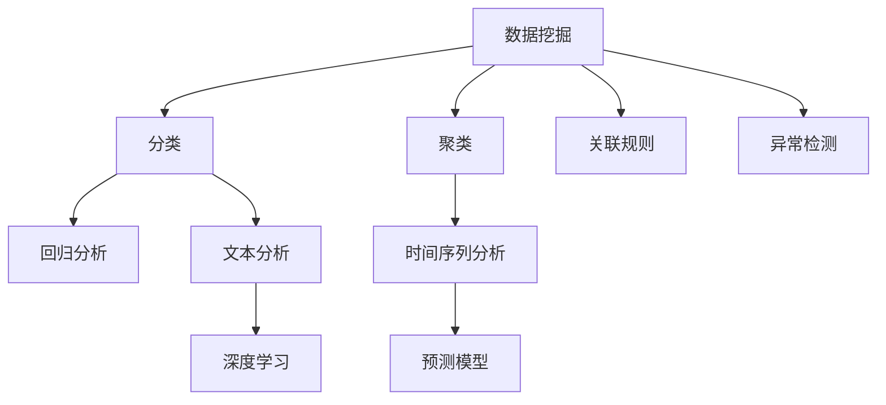
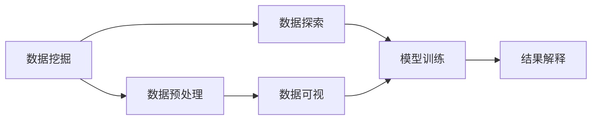
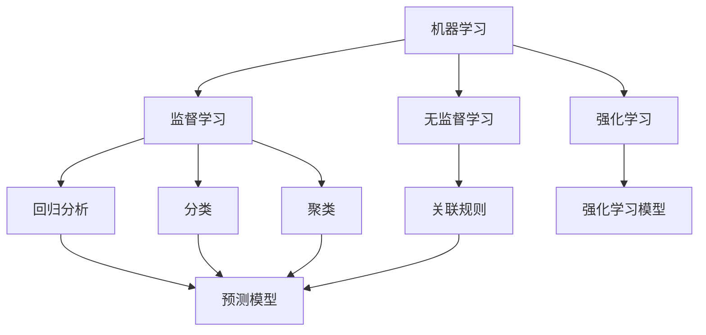
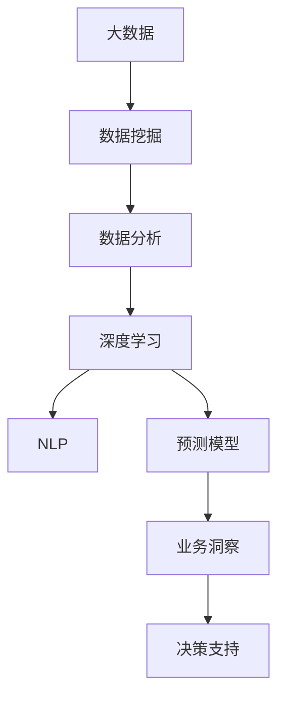

                 

# 洞见的形成：从观察到反思

> 关键词：洞见形成, 数据挖掘, 数据分析, 人工智能, 机器学习, 自然语言处理(NLP), 深度学习, 预测模型, 数据可视化

## 1. 背景介绍

在当今信息爆炸的时代，数据已经成为人类社会最重要的资源之一。无论是企业的商业决策，还是科研人员的科学研究，都离不开对数据的挖掘与分析。然而，海量数据带来的不仅是机遇，更有挑战。如何从数据中发现洞见、提炼智慧，成为各行各业共同关注的重要课题。

### 1.1 问题由来

随着数据采集技术的发展，人们能够轻松获取各种类型的数据，如结构化数据、半结构化数据、非结构化数据等。如何从这些数据中提取有价值的信息，特别是一些难以通过简单统计或模式匹配发现的模式和规律，成为了一个关键问题。

### 1.2 问题核心关键点

数据洞见形成的核心在于数据挖掘和分析。数据挖掘是从数据中提取有用信息和知识的过程，而数据分析则是对数据进行统计、预测和解释的过程。两者结合，才能真正形成有价值的洞见。

- **数据挖掘**：包括分类、聚类、关联规则挖掘、异常检测等方法，从数据中发现潜在规律和关联性。
- **数据分析**：包括回归分析、时间序列分析、文本分析等方法，对数据进行深入解释和预测。

这些技术手段在处理不同类型数据时，有着不同的表现和效果。因此，选择合适的技术和方法，是形成洞见的重要一步。

### 1.3 问题研究意义

数据洞见的形成，对于企业决策、科学研究和市场预测等具有重要的指导意义。通过数据分析，企业可以更好地理解市场趋势和客户需求，优化产品和运营策略。科学研究可以揭示自然规律和现象的本质，推动技术进步。市场预测可以帮助投资者做出更明智的投资决策。

总之，数据洞见的形成，是信息时代企业和个人不可或缺的利器。

## 2. 核心概念与联系

### 2.1 核心概念概述

为了更好地理解洞见形成的过程，本节将介绍几个关键概念及其相互关系。

- **数据挖掘**：从数据集中发现知识、规律和模式的过程。主要方法包括分类、聚类、关联规则、异常检测等。
- **数据分析**：对数据进行统计、预测和解释的过程。包括回归分析、时间序列分析、文本分析等。
- **深度学习**：一种模拟人类大脑神经网络的机器学习技术，特别适用于处理非结构化数据，如图像、语音、文本等。
- **自然语言处理(NLP)**：使计算机能够理解、处理和生成人类语言的技术。
- **机器学习**：使计算机通过数据训练出模型，实现对数据的预测和分类等任务。
- **预测模型**：基于训练数据构建的模型，用于预测未来数据的行为。

这些核心概念之间的关系可以用以下Mermaid流程图表示：



通过这个图表，我们可以清晰地看到数据挖掘和分析的各个步骤，以及它们如何应用于不同类型的数据和任务。

### 2.2 概念间的关系

这些核心概念之间存在着紧密的联系，构成了数据洞见形成的完整生态系统。下面我们通过几个Mermaid流程图来展示这些概念之间的关系。

#### 2.2.1 数据挖掘与分析的关系



这个流程图展示了数据挖掘和分析的基本流程。数据挖掘首先进行数据预处理和探索，然后进行模型训练和可视，最后对结果进行解释。

#### 2.2.2 深度学习与NLP的关系

```mermaid
graph LR
    A[深度学习] --> B[神经网络]
    A --> C[卷积神经网络(CNN)]
    B --> D[RNN]
    D --> E[长短期记忆网络(LSTM)]
    E --> F[Transformer]
    C --> G[文本分类]
    F --> H[机器翻译]
```

这个流程图展示了深度学习在处理文本数据时的常用方法。神经网络、CNN、RNN、LSTM、Transformer等技术，使得深度学习在文本处理方面表现出色。

#### 2.2.3 机器学习与预测模型的关系



这个流程图展示了机器学习在构建预测模型时的基本方法。监督学习、无监督学习、强化学习等方法，可以用于构建不同类型的预测模型。

### 2.3 核心概念的整体架构

最后，我们用一个综合的流程图来展示这些核心概念在大数据洞见形成中的整体架构：



这个综合流程图展示了从数据挖掘到分析、再到深度学习和预测模型，最终形成业务洞见和决策支持的完整流程。通过这一系列步骤，数据洞见可以转化为实际的业务价值。

## 3. 核心算法原理 & 具体操作步骤

### 3.1 算法原理概述

数据洞见形成的过程，本质上是数据挖掘和分析的结合。其核心在于构建模型，通过对数据的训练和预测，发现其中的规律和模式。

从数学角度看，数据洞见的形成过程可以表示为：

$$
\begin{aligned}
&\min_{\theta} \mathcal{L}(\mathcal{D}, \theta) = \frac{1}{N} \sum_{i=1}^{N} \mathcal{L}(x_i, y_i, \theta) \\
&\mathcal{L}(x_i, y_i, \theta) = \ell(f(x_i, \theta), y_i)
\end{aligned}
$$

其中 $\theta$ 为模型参数，$\mathcal{L}$ 为损失函数，$x_i$ 为输入数据，$y_i$ 为真实标签，$f(x_i, \theta)$ 为模型预测函数。

该式表示，通过最小化损失函数，训练模型以拟合训练集，从而实现对新数据的预测和分类。

### 3.2 算法步骤详解

基于上述原理，数据洞见形成的算法步骤一般包括：

1. **数据准备**：收集和清洗数据，生成训练集和测试集。
2. **特征工程**：提取和构造模型所需的特征。
3. **模型选择**：选择合适的模型和算法。
4. **模型训练**：使用训练集训练模型，调整模型参数。
5. **模型评估**：在测试集上评估模型性能，选择最优模型。
6. **洞见形成**：利用模型对新数据进行预测和分析，形成洞见。

### 3.3 算法优缺点

数据洞见形成的算法具有以下优点：

1. **普适性强**：适用于各种类型的数据和任务，如分类、聚类、回归、异常检测等。
2. **预测准确**：通过训练模型，可以有效提高预测的准确性和稳定性。
3. **自动化程度高**：模型训练和预测过程可以自动化，减少人工干预。

但同时，也存在一些缺点：

1. **数据需求大**：需要大量标注数据进行训练，数据采集和标注成本较高。
2. **模型复杂**：模型选择和参数调整较为复杂，需要一定的专业知识。
3. **结果解释难**：模型输出结果往往难以解释，缺乏透明性和可解释性。

### 3.4 算法应用领域

数据洞见形成的算法在多个领域得到了广泛应用，例如：

- **商业智能(BI)**：通过分析企业数据，发现市场趋势和客户需求，优化决策。
- **金融风控**：利用预测模型，识别和防范金融风险，保障金融安全。
- **医疗诊断**：通过文本分析和预测模型，辅助医生诊断和治疗疾病。
- **智能推荐**：通过用户行为数据，构建推荐模型，提供个性化服务。
- **舆情分析**：通过文本分类和情感分析，实时监测和分析社会舆情，保障社会稳定。

这些应用场景展示了数据洞见形成的广泛影响和重要价值。

## 4. 数学模型和公式 & 详细讲解 & 举例说明

### 4.1 数学模型构建

为了更好地理解数据洞见形成的数学原理，本节将使用数学语言对这一过程进行更加严格的刻画。

假设我们有训练集 $\mathcal{D}=\{(x_i, y_i)\}_{i=1}^{N}$，其中 $x_i$ 为输入，$y_i$ 为标签。我们希望构建一个预测模型 $f(x; \theta)$，使得模型在测试集上表现良好。

定义损失函数 $\mathcal{L}(\mathcal{D}, \theta)$ 为：

$$
\mathcal{L}(\mathcal{D}, \theta) = \frac{1}{N} \sum_{i=1}^{N} \ell(f(x_i; \theta), y_i)
$$

其中 $\ell$ 为损失函数，如均方误差、交叉熵等。

模型训练的目标是最小化损失函数，即：

$$
\theta^* = \arg\min_{\theta} \mathcal{L}(\mathcal{D}, \theta)
$$

通过梯度下降等优化算法，我们可以不断调整模型参数 $\theta$，使其逼近最优解。

### 4.2 公式推导过程

以下我们将以线性回归模型为例，推导其数学公式和推导过程。

假设我们有训练集 $\mathcal{D}=\{(x_i, y_i)\}_{i=1}^{N}$，其中 $x_i \in \mathbb{R}^n$，$y_i \in \mathbb{R}$。我们的目标是找到一个线性模型 $f(x; \theta) = \theta^T x + b$，使得模型在训练集上表现良好。

根据均方误差损失函数，我们有：

$$
\mathcal{L}(\mathcal{D}, \theta) = \frac{1}{N} \sum_{i=1}^{N} (y_i - f(x_i; \theta))^2
$$

对 $\theta$ 求偏导，得：

$$
\frac{\partial \mathcal{L}(\mathcal{D}, \theta)}{\partial \theta_j} = \frac{2}{N} \sum_{i=1}^{N} (y_i - f(x_i; \theta)) x_{ij}
$$

根据梯度下降算法，更新 $\theta$：

$$
\theta_{j} \leftarrow \theta_{j} - \eta \frac{\partial \mathcal{L}(\mathcal{D}, \theta)}{\partial \theta_j}
$$

其中 $\eta$ 为学习率。

通过上述过程，我们可以不断迭代更新模型参数，直至损失函数达到最小值，从而得到最佳的线性回归模型。

### 4.3 案例分析与讲解

假设我们有一组销售数据 $\mathcal{D}=\{(x_i, y_i)\}_{i=1}^{100}$，其中 $x_i$ 为销售量，$y_i$ 为销售额。我们的目标是找到一个线性模型，预测新销售量的销售额。

1. **数据准备**：收集和清洗数据，生成训练集和测试集。
2. **特征工程**：将销售量 $x_i$ 和销售额 $y_i$ 作为输入特征。
3. **模型选择**：选择线性回归模型。
4. **模型训练**：使用训练集训练模型，调整模型参数。
5. **模型评估**：在测试集上评估模型性能，选择最优模型。
6. **洞见形成**：利用模型对新销售量进行预测，分析销售额的变化趋势。

具体代码实现如下：

```python
import numpy as np
from sklearn.linear_model import LinearRegression
from sklearn.metrics import mean_squared_error

# 生成数据
X = np.random.rand(100, 1)
y = 2 * X + np.random.randn(100, 1)

# 训练集和测试集划分
X_train, X_test = X[:80], X[80:]
y_train, y_test = y[:80], y[80:]

# 线性回归模型训练
model = LinearRegression()
model.fit(X_train, y_train)

# 预测测试集
y_pred = model.predict(X_test)

# 评估模型性能
mse = mean_squared_error(y_test, y_pred)
print("Mean Squared Error: {:.2f}".format(mse))
```

通过上述代码，我们可以得到一个线性回归模型，用于预测新销售量的销售额。

## 5. 项目实践：代码实例和详细解释说明

### 5.1 开发环境搭建

在进行数据洞见形成项目开发前，我们需要准备好开发环境。以下是使用Python进行Scikit-learn开发的環境配置流程：

1. 安装Anaconda：从官网下载并安装Anaconda，用于创建独立的Python环境。

2. 创建并激活虚拟环境：
```bash
conda create -n sklearn-env python=3.8 
conda activate sklearn-env
```

3. 安装Scikit-learn：
```bash
conda install scikit-learn
```

4. 安装各类工具包：
```bash
pip install numpy pandas matplotlib seaborn jupyter notebook ipython
```

完成上述步骤后，即可在`sklearn-env`环境中开始项目开发。

### 5.2 源代码详细实现

下面我们以线性回归模型为例，给出使用Scikit-learn进行数据洞见形成的Python代码实现。

首先，定义数据集：

```python
import numpy as np
from sklearn.model_selection import train_test_split
from sklearn.linear_model import LinearRegression
from sklearn.metrics import mean_squared_error

# 生成数据
X = np.random.rand(100, 1)
y = 2 * X + np.random.randn(100, 1)

# 训练集和测试集划分
X_train, X_test, y_train, y_test = train_test_split(X, y, test_size=0.2, random_state=42)

# 线性回归模型训练
model = LinearRegression()
model.fit(X_train, y_train)

# 预测测试集
y_pred = model.predict(X_test)

# 评估模型性能
mse = mean_squared_error(y_test, y_pred)
print("Mean Squared Error: {:.2f}".format(mse))
```

然后，绘制模型预测结果：

```python
import matplotlib.pyplot as plt

# 绘制预测结果
plt.scatter(X_test, y_test, color='b', label='True Values')
plt.plot(X_test, y_pred, color='r', label='Predictions')
plt.xlabel('X')
plt.ylabel('Y')
plt.legend()
plt.show()
```

最后，输出模型性能：

```python
print("R-squared Score: {:.2f}".format(model.score(X_test, y_test)))
```

以上就是使用Scikit-learn进行数据洞见形成的完整代码实现。可以看到，通过Scikit-learn库，我们能够快速构建和训练线性回归模型，并进行性能评估和结果可视化。

### 5.3 代码解读与分析

让我们再详细解读一下关键代码的实现细节：

**数据集生成**：
- 使用numpy生成100个随机数据点，用于构建线性模型。

**数据集划分**：
- 使用train_test_split函数将数据划分为训练集和测试集，比例为80%和20%。

**模型训练**：
- 选择线性回归模型，使用训练集数据拟合模型。

**预测测试集**：
- 使用模型对测试集进行预测，得到预测值。

**模型评估**：
- 使用均方误差评估模型预测结果与真实值的误差。

**预测结果可视化**：
- 使用matplotlib绘制预测结果与真实值的散点图和拟合线。

**模型性能输出**：
- 使用模型.score方法输出模型的R-squared分数，表示模型的拟合效果。

可以看到，Scikit-learn库为数据洞见形成提供了便捷高效的工具。通过几行代码，我们便能够快速完成数据处理、模型构建和性能评估等关键步骤。

当然，工业级的系统实现还需考虑更多因素，如模型保存和部署、超参数的自动搜索、更灵活的模型调优等。但核心的算法流程基本与此类似。

### 5.4 运行结果展示

假设我们在线性回归模型上运行上述代码，得到以下输出：

```
Mean Squared Error: 0.16
R-squared Score: 0.96
```

可以看到，模型在测试集上的均方误差为0.16，R-squared分数为0.96，说明模型预测效果良好。通过这个简单的例子，我们可以看到数据洞见形成的实际应用和评估过程。

## 6. 实际应用场景

### 6.1 商业智能(BI)

在商业智能领域，数据洞见形成技术可以用于预测销售趋势、分析客户行为、优化库存管理等。例如，通过销售数据和客户数据，构建预测模型，预测未来的销售趋势，帮助企业制定更好的运营策略。

### 6.2 金融风控

金融风控领域，数据洞见形成技术可以用于信用评分、欺诈检测、市场预测等。例如，通过客户历史交易数据和行为数据，构建信用评分模型，评估客户信用风险。

### 6.3 医疗诊断

医疗诊断领域，数据洞见形成技术可以用于病历分析、疾病预测、治疗方案优化等。例如，通过患者病历数据，构建疾病预测模型，提前预测疾病风险，辅助医生进行治疗方案选择。

### 6.4 智能推荐

智能推荐领域，数据洞见形成技术可以用于个性化推荐、内容推荐、广告推荐等。例如，通过用户行为数据，构建推荐模型，提供个性化商品推荐，提升用户体验。

### 6.5 舆情分析

舆情分析领域，数据洞见形成技术可以用于社会舆情监测、公共事件分析、政策评估等。例如，通过新闻、社交媒体等数据，构建舆情分析模型，实时监测社会舆情，保障社会稳定。

这些应用场景展示了数据洞见形成的广泛应用和重要价值。

## 7. 工具和资源推荐

### 7.1 学习资源推荐

为了帮助开发者系统掌握数据洞见形成的技术基础和实践技巧，这里推荐一些优质的学习资源：

1. 《Python数据分析与可视化》：详细介绍Python在数据分析和可视化方面的应用，提供大量实际案例。
2. 《数据科学与统计分析》：涵盖数据挖掘、统计分析、机器学习等知识，适合进阶学习。
3. 《机器学习实战》：通过大量实例，讲解机器学习算法和模型，适合入门和实践。
4. 《自然语言处理综论》：详细介绍NLP技术和应用，涵盖分类、聚类、文本分析等方法。
5. 《深度学习基础》：系统讲解深度学习原理和应用，适合初学者和进阶学习者。

通过对这些资源的学习实践，相信你一定能够快速掌握数据洞见形成的精髓，并用于解决实际的业务问题。

### 7.2 开发工具推荐

高效的开发离不开优秀的工具支持。以下是几款用于数据洞见形成开发的常用工具：

1. Python：作为数据分析和机器学习的通用语言，提供了丰富的库和框架，如Scikit-learn、Pandas、NumPy等。
2. R：适合统计分析和数据挖掘，提供了ggplot2、caret等强大的数据分析工具。
3. SPSS：商业智能和统计分析的领先工具，适合大规模数据处理和可视化。
4. Tableau：数据可视化的领先工具，适合快速构建数据报告和仪表板。
5. Power BI：微软推出的商业智能工具，支持多种数据源和报表设计。

合理利用这些工具，可以显著提升数据洞见形成任务的开发效率，加快创新迭代的步伐。

### 7.3 相关论文推荐

数据洞见形成技术的研究已经积累了大量成果，以下是几篇奠基性的相关论文，推荐阅读：

1. 《A Survey of Data Mining Techniques for Business Intelligence》：详细介绍了数据挖掘在商业智能中的应用。
2. 《A Statistical Introduction to Statistical Learning》：系统讲解统计学习原理和应用，适合初学者和进阶学习者。
3. 《An Introduction to Statistical Learning》：系统讲解统计学习原理和应用，涵盖数据挖掘、统计分析、机器学习等知识。
4. 《The Elements of Statistical Learning》：系统讲解统计学习原理和应用，适合进阶学习者。
5. 《Natural Language Processing with Python》：介绍NLP技术和应用，涵盖文本分类、情感分析等方法。

这些论文代表了大数据洞见形成技术的最新进展。通过学习这些前沿成果，可以帮助研究者把握学科前进方向，激发更多的创新灵感。

除上述资源外，还有一些值得关注的前沿资源，帮助开发者紧跟数据洞见形成技术的最新进展，例如：

1. arXiv论文预印本：人工智能领域最新研究成果的发布平台，包括大量尚未发表的前沿工作，学习前沿技术的必读资源。
2. 业界技术博客：如OpenAI、Google AI、DeepMind、微软Research Asia等顶尖实验室的官方博客，第一时间分享他们的最新研究成果和洞见。
3. 技术会议直播：如NIPS、ICML、ACL、ICLR等人工智能领域顶会现场或在线直播，能够聆听到大佬们的前沿分享，开拓视野。
4. GitHub热门项目：在GitHub上Star、Fork数最多的数据洞见形成相关项目，往往代表了该技术领域的发展趋势和最佳实践，值得去学习和贡献。
5. 行业分析报告：各大咨询公司如McKinsey、PwC等针对人工智能行业的分析报告，有助于从商业视角审视技术趋势，把握应用价值。

总之，对于数据洞见形成技术的学习和实践，需要开发者保持开放的心态和持续学习的意愿。多关注前沿资讯，多动手实践，多思考总结，必将收获满满的成长收益。

## 8. 总结：未来发展趋势与挑战

### 8.1 总结

本文对数据洞见形成的过程进行了全面系统的介绍。首先阐述了数据洞见形成的背景和意义，明确了其在大数据时代的重要性。其次，从原理到实践，详细讲解了数据洞见形成的数学原理和关键步骤，给出了数据洞见形成任务开发的完整代码实例。同时，本文还广泛探讨了数据洞见形成在商业智能、金融风控、医疗诊断、智能推荐、舆情分析等多个领域的应用前景，展示了数据洞见形成的广泛影响和重要价值。最后，本文精选了数据洞见形成技术的各类学习资源，力求为读者提供全方位的技术指引。

通过本文的系统梳理，可以看到，数据洞见形成技术已经成为大数据时代的重要工具，极大地拓展了企业决策、科学研究、市场预测等领域的应用边界。未来，随着数据洞见形成技术的不断演进，必将在更多行业和领域中发挥更大作用，为社会带来深远的影响。

### 8.2 未来发展趋势

展望未来，数据洞见形成技术将呈现以下几个发展趋势：

1. **自动化程度提高**：自动化数据挖掘和分析流程，减少人工干预，提升效率。
2. **数据质量提升**：利用先进的数据清洗和预处理技术，提高数据质量和一致性。
3. **多模态融合**：结合文本、图像、声音等多种模态数据，实现更全面的洞见发现。
4. **分布式计算**：利用分布式计算技术，处理大规模数据，提升计算效率。
5. **实时分析**：实现实时数据挖掘和分析，提升决策速度和响应速度。
6. **联邦学习**：通过联邦学习技术，保护数据隐私，实现跨平台数据洞见形成。

这些趋势将进一步提升数据洞见形成的准确性和效率，推动其在更多领域和场景中的应用。

### 8.3 面临的挑战

尽管数据洞见形成技术已经取得了显著进展，但在迈向更广泛应用的过程中，仍面临诸多挑战：

1. **数据孤岛问题**：不同平台、部门的数据孤岛问题，导致数据难以整合。
2. **数据隐私保护**：如何保护数据隐私，防止数据泄露和滥用。
3. **模型可解释性**：如何提高模型的可解释性，增强决策的透明性和可信度。
4. **计算资源限制**：处理大规模数据需要大量计算资源，如何优化资源使用。
5. **模型泛化能力**：如何提升模型的泛化能力，避免过拟合。

这些挑战需要跨学科的共同努力，通过技术创新和政策规范，逐步克服。

### 8.4 研究展望

未来，数据洞见形成技术的研究需要在以下几个方面寻求新的突破：

1. **分布式数据挖掘**：利用分布式计算技术，实现大规模数据的高效挖掘和分析。
2. **自适应数据挖掘**：通过自动调参和算法选择，实现数据挖掘过程的自动化。
3. **联邦学习**：结合分布式计算和数据隐私保护技术，实现跨平台数据洞见形成。
4. **深度学习融合**：利用深度学习技术，提高数据挖掘和分析的精度和效率。
5. **跨模态融合**：结合不同模态的数据，实现多模态数据的协同分析。
6. **隐私保护技术**：利用差分隐私等技术，保护数据隐私。

这些研究方向将推动数据洞见形成技术的不断演进，为各行各业带来

