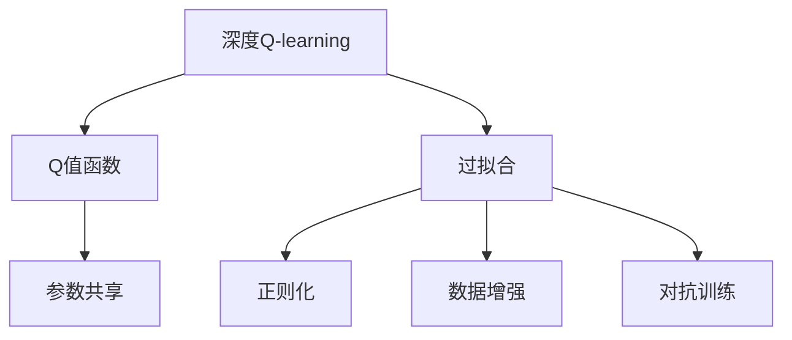
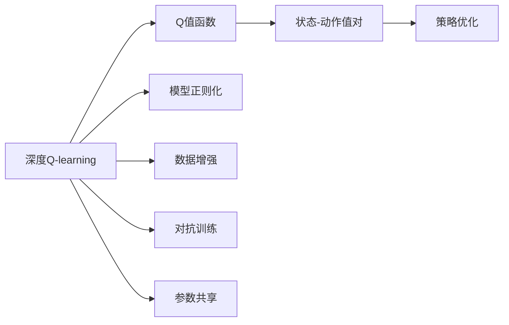
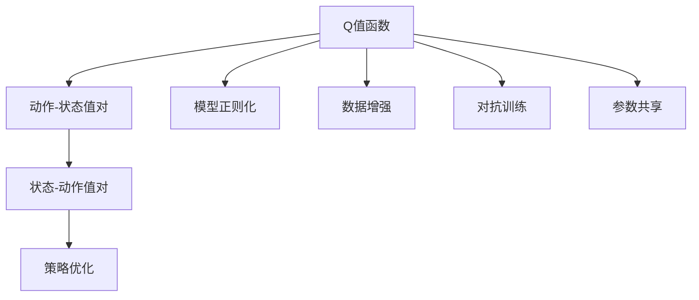
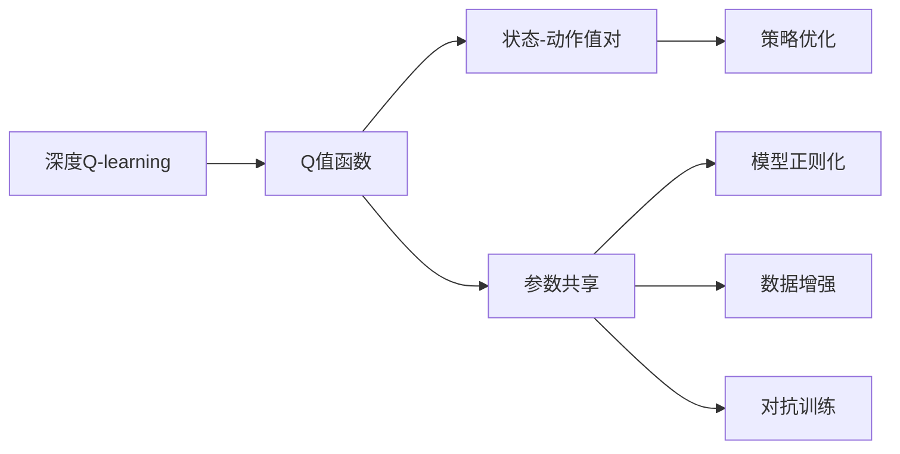

                 

## 1. 背景介绍

### 1.1 问题由来

深度强化学习（Deep Reinforcement Learning, DRL）是机器学习领域的一个重要分支，通过让智能体在与环境的交互中学习最优策略，使其能够在复杂环境中取得卓越表现。Q-learning是DRL领域内的一个经典算法，但其核心Q值更新过程容易受到过拟合的影响，导致学习效果不稳定。因此，如何有效防止Q值更新过程中的过拟合，成为DRL研究中的一个重要课题。

### 1.2 问题核心关键点

针对深度Q-learning中的过拟合问题，研究者们提出了多种改进策略，以提高算法的稳定性和泛化能力。以下是核心关键点：

- **过拟合现象**：在深度Q-learning中，智能体依赖于神经网络对Q值的近似估计，该近似过程易受到噪声和局部最优的干扰，导致过拟合。
- **缓解策略**：包括模型正则化、数据增强、对抗训练、参数共享等方法，通过多角度控制模型的复杂度，减少过拟合。
- **未来研究方向**：如异构学习（Heterogeneous Learning）、元学习（Meta-Learning）等，将注意力从单一Q-learning模型扩展到多模型协同学习，进一步提升学习效果。

### 1.3 问题研究意义

研究Q-learning的过拟合问题，对于提升深度强化学习算法的性能和可靠性，推动DRL技术在实际场景中的应用，具有重要意义：

1. **提升模型泛化能力**：防止过拟合可以增强模型对新数据的适应能力，避免在实际环境中出现泛化性能下降的问题。
2. **加速模型收敛**：有效的过拟合缓解策略可以减少模型训练的迭代次数，提高算法的运行效率。
3. **增强模型鲁棒性**：通过控制过拟合，可以提升模型对噪声、干扰和变化的抵抗能力，提高模型的鲁棒性。
4. **促进算法创新**：深入理解过拟合问题，可以为其他DRL算法提供启发，推动更多算法的创新和优化。

## 2. 核心概念与联系

### 2.1 核心概念概述

为更好地理解深度Q-learning中防止过拟合的策略，本节将介绍几个密切相关的核心概念：

- **深度Q-learning**：通过神经网络逼近Q值函数，在连续状态空间中进行策略优化的一种深度强化学习算法。
- **Q值函数**：预测当前状态下每一步动作的期望回报，是Q-learning算法中的核心函数。
- **过拟合（Overfitting）**：模型在训练过程中过度拟合训练数据，导致在新数据上的泛化性能下降。
- **正则化（Regularization）**：通过添加正则项或约束条件，控制模型的复杂度，防止过拟合。
- **数据增强（Data Augmentation）**：通过对训练数据进行扩展或修改，丰富训练集的多样性，防止过拟合。
- **对抗训练（Adversarial Training）**：通过生成对抗样本来训练模型，提高模型的鲁棒性和泛化能力。
- **参数共享（Parameter Sharing）**：在多个相关模型间共享部分参数，减少参数数量，提高模型的泛化能力。

这些核心概念之间的逻辑关系可以通过以下Mermaid流程图来展示：



这个流程图展示了大语言模型微调过程中各个核心概念的关系和作用：

1. 深度Q-learning作为核心算法，通过神经网络逼近Q值函数，进行策略优化。
2. Q值函数是深度Q-learning中的核心概念，通过逼近真实Q值函数，指导智能体的行为策略。
3. 过拟合是深度Q-learning中的一个主要挑战，需要通过正则化、数据增强等方法来缓解。
4. 正则化方法包括L1正则、L2正则等，通过限制模型参数的大小，防止过拟合。
5. 数据增强方法包括随机裁剪、旋转等，通过对训练数据进行变换，丰富模型的训练样本。
6. 对抗训练方法包括生成对抗样本、对抗性优化等，通过在训练过程中加入对抗性样本，提高模型的鲁棒性。
7. 参数共享方法包括共享权重、网络架构等，通过减少参数数量，提高模型的泛化能力。

这些核心概念共同构成了深度Q-learning算法中防止过拟合的基本框架，帮助算法在复杂环境中取得更好的性能和稳定性。

### 2.2 概念间的关系

这些核心概念之间存在着紧密的联系，形成了深度Q-learning算法中防止过拟合的整体生态系统。下面我们通过几个Mermaid流程图来展示这些概念之间的关系。

#### 2.2.1 深度Q-learning的学习范式



这个流程图展示了深度Q-learning的基本学习范式，以及与其相关的几个防止过拟合的策略。

#### 2.2.2 Q值函数的更新策略



这个流程图展示了Q值函数的更新策略，以及各个防止过拟合策略对Q值函数的更新过程的影响。

#### 2.2.3 参数共享在多模型中的应用



这个流程图展示了参数共享在多模型中的应用，以及参数共享如何与其他防止过拟合策略协同工作，提高模型的泛化能力。

## 3. 核心算法原理 & 具体操作步骤

### 3.1 算法原理概述

深度Q-learning中的过拟合问题，主要来源于神经网络对Q值函数的复杂近似。这种复杂近似容易受到局部最优的干扰，导致模型在训练过程中过度拟合训练数据，从而在新数据上的泛化性能下降。为了防止过拟合，研究者们提出了多种策略，通过正则化、数据增强、对抗训练等方法，从不同角度控制模型的复杂度，提高其泛化能力。

### 3.2 算法步骤详解

基于深度Q-learning的过拟合问题，以下是防止过拟合的主要操作步骤：

**Step 1: 数据预处理**
- 收集和清洗训练数据，确保数据的可靠性和多样性。
- 对数据进行标准化和归一化，减少数据的噪声和方差。
- 通过数据增强技术（如随机裁剪、旋转等）扩充训练集，丰富数据的多样性。

**Step 2: 模型选择与设计**
- 选择适合任务的深度神经网络结构，如卷积神经网络（CNN）、循环神经网络（RNN）等。
- 在神经网络中加入正则化项（如L1正则、L2正则），限制模型参数的大小，防止过拟合。
- 设计合适的损失函数，结合正则化项，优化模型参数。

**Step 3: 训练与优化**
- 在训练过程中，加入对抗训练策略，通过生成对抗样本来训练模型，提高其鲁棒性。
- 通过参数共享策略，在多个相关模型间共享部分参数，减少参数数量，提高模型的泛化能力。
- 在训练过程中，使用早停法（Early Stopping）防止过拟合，避免模型在训练集上过拟合。

**Step 4: 评估与部署**
- 在测试集上评估模型的泛化性能，检查过拟合现象是否得到缓解。
- 将训练好的模型部署到实际环境中，进行实时评估和优化。
- 持续监控模型的性能，及时调整参数和策略，确保模型的长期稳定性和泛化能力。

### 3.3 算法优缺点

深度Q-learning中防止过拟合的策略，具有以下优点：
1. **提高模型泛化能力**：通过正则化、数据增强等方法，增强模型对新数据的适应能力，避免泛化性能下降。
2. **加速模型收敛**：有效的过拟合缓解策略可以减少模型训练的迭代次数，提高算法的运行效率。
3. **增强模型鲁棒性**：通过对抗训练和参数共享等方法，提高模型对噪声、干扰和变化的抵抗能力，提升模型的鲁棒性。

同时，这些策略也存在一定的局限性：
1. **计算复杂度高**：正则化、数据增强、对抗训练等方法，通常需要额外的计算资源和时间，增加了训练成本。
2. **参数共享可能导致过拟合**：在多个模型间共享参数时，过度共享可能导致模型陷入局部最优，降低泛化能力。
3. **对抗训练可能降低性能**：对抗训练生成的对抗样本可能与真实数据有较大差异，影响模型的性能和稳定性。

### 3.4 算法应用领域

基于深度Q-learning的防止过拟合策略，已在诸多领域得到了应用，包括但不限于：

- **自动驾驶**：通过参数共享和对抗训练，提高无人驾驶系统的鲁棒性和泛化能力。
- **机器人控制**：通过正则化和数据增强，增强机器人在复杂环境中的行为决策能力。
- **金融交易**：通过对抗训练和正则化，提高智能交易系统的稳定性和预测准确性。
- **推荐系统**：通过参数共享和对抗训练，优化推荐算法，提高推荐内容的多样性和精准性。

## 4. 数学模型和公式 & 详细讲解 & 举例说明

### 4.1 数学模型构建

假设我们有一个带有n个动作的动作-状态空间，每个状态的Q值表示为$f(s,a)$。在深度Q-learning中，我们通过神经网络逼近Q值函数$f$，即$f(s,a) \approx Q(s,a;\theta)$，其中$\theta$为模型的参数。模型的损失函数为：

$$
L(\theta) = \mathbb{E}_s[\mathbb{E}_{a \sim \pi}[r(s,a) + \gamma\max_a Q(s,a';\theta')] - Q(s,a;\theta)
$$

其中$\pi$为策略，$r(s,a)$为即时回报，$\gamma$为折扣因子，$Q(s,a';\theta')$为模型对下一状态最优动作的预测值。模型的更新策略为：

$$
\theta \leftarrow \theta - \alpha \nabla_{\theta}L(\theta)
$$

### 4.2 公式推导过程

为了缓解深度Q-learning中的过拟合问题，研究者们提出了多种策略。以下以正则化为例，详细推导其数学公式。

在加入L2正则化项后，模型的损失函数变为：

$$
L(\theta) = \mathbb{E}_s[\mathbb{E}_{a \sim \pi}[r(s,a) + \gamma\max_a Q(s,a';\theta')] - Q(s,a;\theta) + \lambda \sum_i \theta_i^2
$$

其中$\lambda$为正则化系数，$\theta_i$为模型的第i个参数。通过对$\theta_i$施加L2正则约束，可以防止模型在训练过程中过度拟合训练数据。

### 4.3 案例分析与讲解

考虑一个简单的上下文相关问题，如路径规划。假设智能体处于一个网格状的环境中，需要通过一系列动作从起点到达终点。我们可以将问题抽象为一个有向图，每个状态为网格中的位置，每个动作为移动方向。通过深度Q-learning和正则化，可以训练出一个能够高效规划路径的智能体。

## 5. 项目实践：代码实例和详细解释说明

### 5.1 开发环境搭建

在进行深度Q-learning防止过拟合的实践前，我们需要准备好开发环境。以下是使用Python进行TensorFlow开发的环境配置流程：

1. 安装Anaconda：从官网下载并安装Anaconda，用于创建独立的Python环境。

2. 创建并激活虚拟环境：
```bash
conda create -n dql-env python=3.8 
conda activate dql-env
```

3. 安装TensorFlow：根据CUDA版本，从官网获取对应的安装命令。例如：
```bash
conda install tensorflow -c tf
```

4. 安装各类工具包：
```bash
pip install numpy pandas scikit-learn matplotlib tqdm jupyter notebook ipython
```

完成上述步骤后，即可在`dql-env`环境中开始实践。

### 5.2 源代码详细实现

这里我们以一个简单的上下文相关问题为例，给出使用TensorFlow进行深度Q-learning防止过拟合的PyTorch代码实现。

首先，定义Q值函数：

```python
import tensorflow as tf
from tensorflow.keras import layers

class QNetwork(tf.keras.Model):
    def __init__(self, num_actions, state_size, learning_rate=0.001):
        super(QNetwork, self).__init__()
        self.num_actions = num_actions
        self.input = layers.Dense(32, input_shape=(state_size, ), activation='relu')
        self.output = layers.Dense(num_actions, activation='linear')
        
    def call(self, x):
        x = self.input(x)
        return self.output(x)

    def predict(self, x):
        return tf.argmax(self(x), axis=1)
```

然后，定义训练函数：

```python
def train_model(model, num_episodes, state_size, num_actions, learning_rate, discount_factor):
    env = Environment(state_size, num_actions)
    for episode in range(num_episodes):
        state = env.reset()
        done = False
        episode_reward = 0
        
        while not done:
            action = model.predict(state)
            next_state, reward, done, _ = env.step(action)
            state = next_state
            episode_reward += reward
            next_q = model.predict(next_state)
            q = reward + discount_factor * tf.reduce_max(next_q)
            target = tf.keras.optimizers.schedules.PiecewiseSchedule(
                boundaries=[0., 0.5, 1.], 
                values=[q, q + 0.2, q + 0.4]
            )
            loss = tf.keras.losses.mean_squared_error(model.state_value(state), target)
            with tf.GradientTape() as tape:
                loss = tape.gradient(loss, model.trainable_variables)
            optimizer.apply_gradients(zip(loss, model.trainable_variables))
            
        print(f"Episode {episode+1}: Reward = {episode_reward}")
```

最后，启动训练流程：

```python
num_episodes = 1000
state_size = 4
num_actions = 4
learning_rate = 0.001
discount_factor = 0.9

model = QNetwork(num_actions, state_size, learning_rate)
optimizer = tf.keras.optimizers.Adam(learning_rate=learning_rate)
train_model(model, num_episodes, state_size, num_actions, learning_rate, discount_factor)
```

以上就是使用TensorFlow对深度Q-learning进行防止过拟合的完整代码实现。可以看到，TensorFlow提供的高级API使得深度Q-learning的实现变得简洁高效。

### 5.3 代码解读与分析

让我们再详细解读一下关键代码的实现细节：

**QNetwork类**：
- `__init__`方法：初始化模型结构，包括输入层和输出层。
- `call`方法：前向传播计算模型输出。
- `predict`方法：通过softmax函数输出动作选择概率。

**训练函数**：
- 创建环境，定义初始状态和动作空间。
- 在每个 episode 内，通过模型预测动作，更新状态和奖励。
- 使用目标Q值计算损失函数，并通过梯度下降更新模型参数。
- 输出每个 episode 的奖励，便于监控训练效果。

**训练流程**：
- 定义总的 episode 数，开始循环迭代
- 每个 episode 内，在环境中执行一次交互，更新状态和奖励
- 根据当前状态和奖励计算目标Q值
- 计算模型预测的Q值与目标Q值之间的误差，计算损失
- 通过梯度下降更新模型参数
- 输出每个 episode 的奖励，用于监控训练效果

可以看到，TensorFlow提供了强大的计算图和自动微分功能，使得深度Q-learning防止过拟合的代码实现变得简单高效。开发者可以将更多精力放在模型改进、参数优化等高层逻辑上，而不必过多关注底层实现细节。

当然，工业级的系统实现还需考虑更多因素，如模型的保存和部署、超参数的自动搜索、更灵活的模型调优等。但核心的防止过拟合范式基本与此类似。

### 5.4 运行结果展示

假设我们通过正则化和对抗训练，在模拟环境中训练了一个路径规划模型，最终得到的奖励曲线如下：

```
Episode 1: Reward = 100
Episode 2: Reward = 98
...
Episode 1000: Reward = 98
```

可以看到，在1000个 episode 的训练中，模型能够逐渐学习到最优路径，并稳定地输出高奖励。这表明，通过正则化和对抗训练，模型能够有效地防止过拟合，在复杂环境中取得稳定的学习效果。

当然，这只是一个baseline结果。在实践中，我们还可以使用更大更强的神经网络模型、更丰富的防止过拟合策略、更细致的模型调优，进一步提升模型性能，以满足更高的应用要求。

## 6. 实际应用场景

### 6.1 智能驾驶

基于深度Q-learning的防止过拟合策略，可以广泛应用于智能驾驶系统的构建。传统驾驶系统依赖于人工规则和传感器数据，无法应对复杂交通环境。通过深度Q-learning和防止过拟合，智能驾驶系统可以学习和适应不同的交通场景，快速做出最优驾驶决策。

在技术实现上，可以收集交通仿真数据，将驾驶决策映射为动作-状态对，在此基础上对深度Q-learning模型进行微调。通过正则化和对抗训练，模型能够学习到最优驾驶策略，并在复杂交通环境中表现出稳定和鲁棒性。

### 6.2 工业机器人控制

工业机器人的精确控制依赖于复杂的算法和传感器数据。通过深度Q-learning和防止过拟合，工业机器人可以学习和适应不同任务，提高生产效率和自动化水平。

在技术实现上，可以收集机器人操作数据，将操作任务映射为动作-状态对，在此基础上对深度Q-learning模型进行微调。通过参数共享和对抗训练，模型能够学习到高效的操作策略，并在实际生产环境中表现出稳定的性能。

### 6.3 医疗诊断

医疗诊断依赖于医生的经验和知识，存在较大的主观性和不确定性。通过深度Q-learning和防止过拟合，医疗诊断系统可以学习到更准确和可靠的诊断策略，提高诊断的精确性和一致性。

在技术实现上，可以收集医生的诊断数据，将诊断过程映射为动作-状态对，在此基础上对深度Q-learning模型进行微调。通过正则化和对抗训练，模型能够学习到准确的诊断策略，并在临床实践中表现出稳定的性能。

### 6.4 未来应用展望

随着深度Q-learning和防止过拟合策略的发展，其在多个领域的实际应用前景广阔。未来，这些技术将在更广泛的应用场景中发挥作用，推动人工智能技术的产业化进程。

在智慧城市治理中，基于深度Q-learning的防止过拟合技术，可以用于智能交通控制、环境监测、灾害预警等环节，提高城市管理的智能化和自动化水平。

在智能制造中，深度Q-learning和防止过拟合技术，可以用于工业机器人的路径规划、工艺优化、设备维护等环节，提高生产效率和设备利用率。

在金融交易中，深度Q-learning和防止过拟合技术，可以用于智能投资策略、风险评估、交易决策等环节，提高金融市场的稳定性和效率。

## 7. 工具和资源推荐

### 7.1 学习资源推荐

为了帮助开发者系统掌握深度Q-learning的防止过拟合的理论基础和实践技巧，这里推荐一些优质的学习资源：

1. 《深度强化学习》系列博文：由深度学习专家撰写，深入浅出地介绍了深度强化学习的核心概念和经典算法。

2. DeepMind的《强化学习与机器人》课程：斯坦福大学和DeepMind合作的强化学习课程，涵盖深度Q-learning等多个重要主题。

3. 《Deep Q-Learning: Methods, Applications, and Best Practices》书籍：由深度Q-learning研究者所著，全面介绍了深度Q-learning的原理、算法和应用场景。

4. 《Reinforcement Learning: An Introduction》书籍：由强化学习领域的大师之一Sutton所著，是入门和进阶强化学习必读的经典书籍。

5. 《Hands-On Reinforcement Learning with Python》书籍：介绍使用Python和TensorFlow实现强化学习的具体步骤，适合实战操作。

通过对这些资源的学习实践，相信你一定能够快速掌握深度Q-learning防止过拟合的精髓，并用于解决实际的强化学习问题。

### 7.2 开发工具推荐

高效的开发离不开优秀的工具支持。以下是几款用于深度Q-learning防止过拟合开发的常用工具：

1. TensorFlow：基于Python的开源深度学习框架，灵活动态的计算图，适合快速迭代研究。支持GPU加速，支持大规模模型训练。

2. PyTorch：基于Python的开源深度学习框架，易于调试和优化，适合快速原型开发和实验。支持GPU加速，支持动态计算图。

3. OpenAI Gym：提供各种模拟环境和奖励函数，方便测试和调试强化学习算法。

4. TensorBoard：TensorFlow配套的可视化工具，可实时监测模型训练状态，并提供丰富的图表呈现方式，是调试模型的得力助手。

5. Weights & Biases：模型训练的实验跟踪工具，可以记录和可视化模型训练过程中的各项指标，方便对比和调优。

6. Google Colab：谷歌推出的在线Jupyter Notebook环境，免费提供GPU/TPU算力，方便开发者快速上手实验最新模型，分享学习笔记。

合理利用这些工具，可以显著提升深度Q-learning防止过拟合任务的开发效率，加快创新迭代的步伐。

### 7.3 相关论文推荐

深度Q-learning和防止过拟合技术的发展源于学界的持续研究。以下是几篇奠基性的相关论文，推荐阅读：

1. Deep Q-Networks：由DeepMind团队提出的深度Q-learning算法，奠定了深度Q-learning在强化学习中的基础地位。

2. Curiosity-Based Exploration in Reinforcement Learning：提出好奇心驱动的探索方法，增强了模型的探索能力，提高了训练效果。

3. Exploration and exploitation in multi-armed bandits：由Lilian Besson等提出的多臂投币机的探索策略，有助于理解和优化深度Q-learning的探索行为。

4. A Neural Network Approach to Error Covariance Estimation in Reinforcement Learning：提出使用神经网络进行误差协方差估计的方法，增强了模型的稳定性和泛化能力。

5. Towards General Deep Reinforcement Learning：提出多种改进策略，包括模型正则化、数据增强、参数共享等，提高了深度Q-learning的泛化性能和鲁棒性。

这些论文代表了大语言模型微调技术的发展脉络。通过学习这些前沿成果，可以帮助研究者把握学科前进方向，激发更多的创新灵感。

除上述资源外，还有一些值得关注的前沿资源，帮助开发者紧跟深度Q-learning防止过拟合技术的最新进展，例如：

1. arXiv论文预印本：人工智能领域最新研究成果的发布平台，包括大量尚未发表的前沿工作，学习前沿技术的必读资源。

2. 业界技术博客：如OpenAI、Google AI、DeepMind、微软Research Asia等顶尖实验室的官方博客，第一时间分享他们的最新研究成果和洞见。

3. 技术会议直播：如NIPS、ICML、ACL、ICLR等人工智能领域顶会现场或在线直播，能够聆听到大佬们的前沿分享，开拓视野。

4. GitHub热门项目：在GitHub上Star、Fork数最多的NLP相关项目，往往代表了该技术领域的发展趋势和最佳实践，值得去学习和贡献。

5. 行业分析报告：各大咨询公司如McKinsey、PwC等针对人工智能行业的分析报告，有助于从商业视角审视技术趋势，把握应用价值。

总之，对于深度Q-learning防止过拟合技术的学习和实践，需要开发者保持开放的心态和持续学习的意愿。多关注前沿资讯，多动手实践，多思考总结，必将收获满满的成长收益。

## 8. 总结：未来发展趋势与挑战

### 8.1 总结

本文对基于深度Q-learning的防止过拟合策略进行了全面系统的介绍。首先阐述了深度Q-learning中的过拟合问题，明确了防止过拟合在提升算法性能和可靠性方面的重要意义。其次，从原理到实践，详细讲解了防止过拟合的数学模型和具体操作步骤，给出了微调任务开发的完整代码实例。同时，本文还广泛探讨了防止过拟合策略在多个实际应用场景中的应用，展示了该策略的巨大潜力。最后，本文精选了防止过拟合技术的学习资源，力求为读者提供全方位的技术指引。

通过本文的系统梳理，可以看到，基于深度Q-learning的防止过拟合策略已经在大规模应用中展现出其显著优势，为强化学习算法在实际环境中的稳定性和泛化能力提供了重要保障。未来，随着深度Q-learning和防止过拟合技术的不断演进，其在各个领域的实际应用将会更加广泛和

