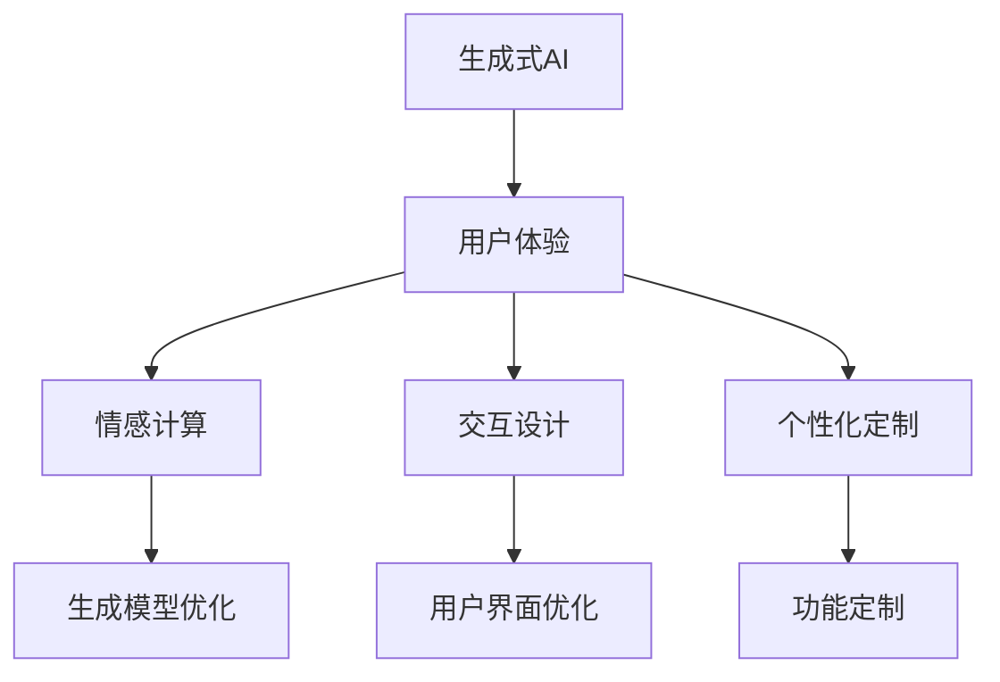
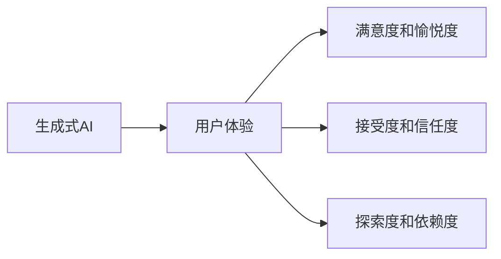
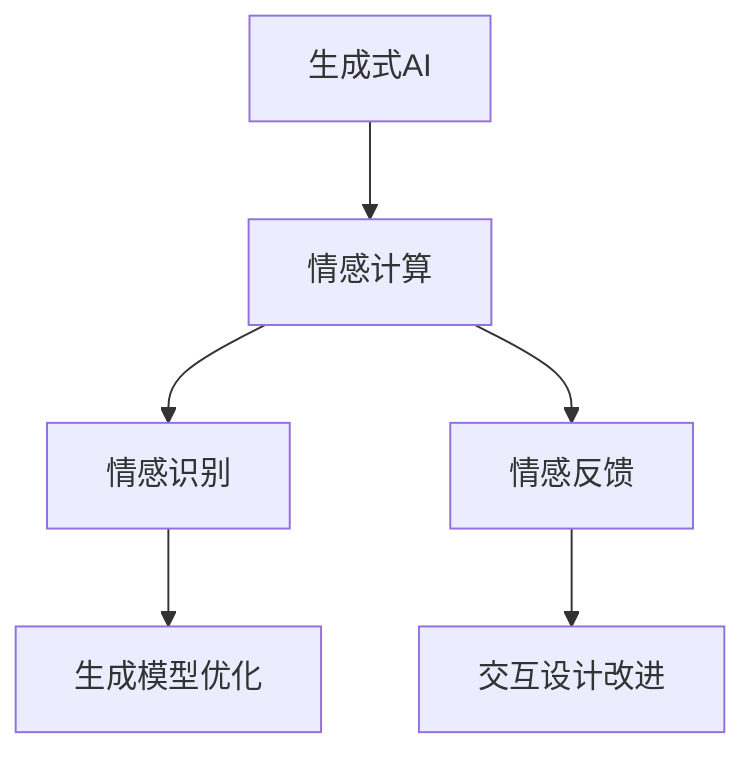
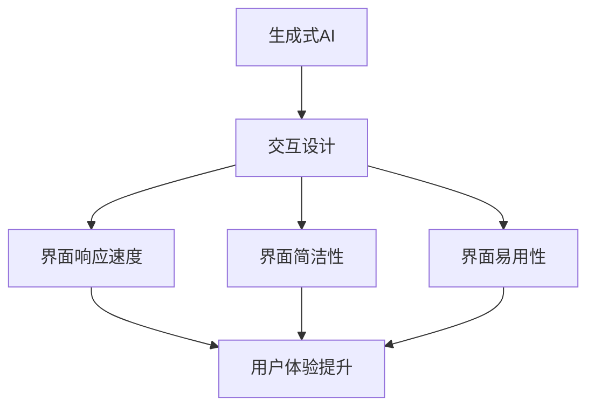
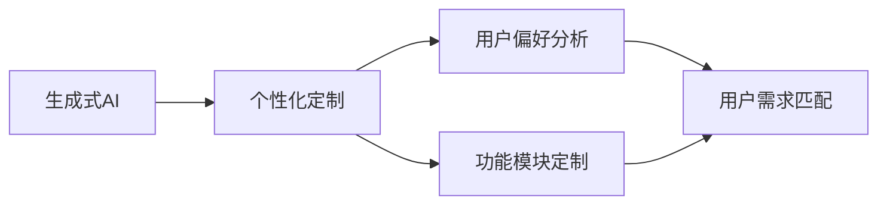
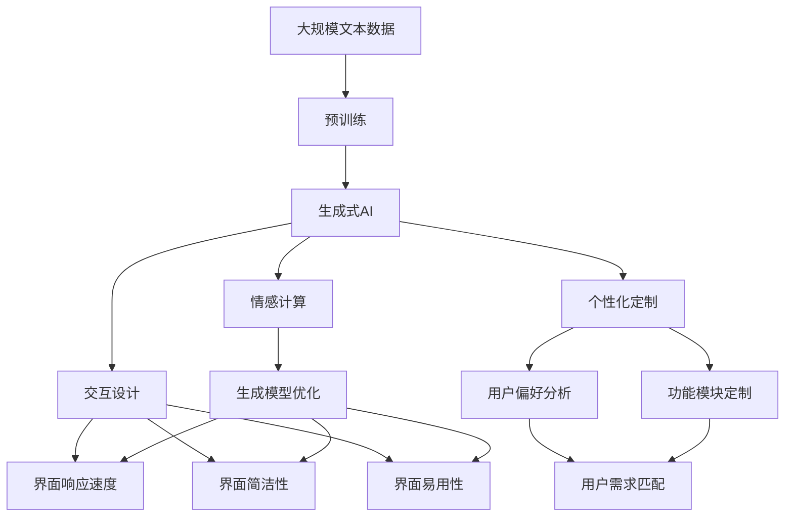

                 

# 生成式AI：金矿还是泡沫？第四部分：“让人尖叫”的用户体验

随着人工智能技术的飞速发展，生成式AI（Generative AI）已经成为了一个备受瞩目的研究方向。从语言生成、图像生成到音乐创作、文本创作，生成式AI在各个领域的应用都展现出了巨大的潜力。然而，随之而来的问题是，生成式AI到底是真正的“金矿”还是只是“泡沫”？本部分将从用户体验的角度，深入探讨生成式AI的未来发展方向和潜在风险。

## 1. 背景介绍

### 1.1 生成式AI的发展历程

生成式AI的雏形可以追溯到20世纪70年代的语音识别和图像处理领域。但真正意义上的突破，则出现在2014年，随着深度学习技术的发展，尤其是对抗生成网络（GAN）的提出，生成式AI开始真正意义上进入了大众视野。

近年来，生成式AI在技术上取得了长足的进步，尤其是在语言生成和图像生成领域，多个模型（如GPT、DALL·E、Stable Diffusion等）更是取得了令人瞩目的成果。这些进展不仅在学术界引发了广泛关注，也在实际应用中产生了深远的影响。

### 1.2 用户体验的多样性

用户体验（User Experience，UX）是指用户在使用产品或服务过程中所感受到的情感和心理反应。对于生成式AI而言，用户体验的好坏直接影响其应用的价值和普及程度。随着生成式AI技术的不断成熟，用户体验也呈现出了多样化趋势，从简单到复杂，从愉悦到挑战，生成式AI正在不断地拓展着用户体验的边界。

## 2. 核心概念与联系

### 2.1 核心概念概述

为了更好地理解生成式AI在用户体验方面的表现，本节将介绍几个密切相关的核心概念：

- **生成式AI**：利用深度学习模型，从噪声或随机输入中生成新的数据样本，如文本、图像、音频等。
- **用户体验**：用户在生成式AI应用过程中所感受到的情感和心理反应。
- **情感计算**：通过分析用户情感状态，优化生成式AI的输出，以提升用户体验。
- **交互设计**：优化生成式AI的用户交互界面和流程，提升用户体验的舒适度和满意度。
- **个性化定制**：根据用户偏好和需求，定制化生成式AI的功能和输出，提供更加贴合用户需求的服务。

这些核心概念之间的逻辑关系可以通过以下Mermaid流程图来展示：



这个流程图展示了生成式AI在用户体验方面所涉及的关键要素：通过情感计算、交互设计和个性化定制等手段，优化生成模型，从而提升用户体验。

### 2.2 概念间的关系

这些核心概念之间存在着紧密的联系，形成了生成式AI用户体验的完整生态系统。下面我通过几个Mermaid流程图来展示这些概念之间的关系。

#### 2.2.1 生成式AI与用户体验的关系



这个流程图展示了生成式AI与用户体验之间的关系：生成式AI的输出直接影响用户的满意度和愉悦度、接受度和信任度、探索度和依赖度等关键指标。

#### 2.2.2 生成式AI与情感计算的关系



这个流程图展示了生成式AI与情感计算之间的关系：通过情感计算，生成式AI可以识别用户的情感状态，并根据反馈进行模型优化和交互设计改进，从而提升用户体验。

#### 2.2.3 生成式AI与交互设计的关系



这个流程图展示了生成式AI与交互设计之间的关系：通过交互设计，优化生成式AI的界面响应速度、简洁性和易用性等关键要素，从而提升用户体验。

#### 2.2.4 生成式AI与个性化定制的关系



这个流程图展示了生成式AI与个性化定制之间的关系：通过个性化定制，分析用户偏好和需求，定制化生成式AI的功能和输出，以提供更加贴合用户需求的服务。

### 2.3 核心概念的整体架构

最后，我们用一个综合的流程图来展示这些核心概念在大语言模型微调过程中的整体架构：



这个综合流程图展示了从预训练到生成式AI的完整过程，以及各个环节对用户体验的优化策略。

## 3. 核心算法原理 & 具体操作步骤

### 3.1 算法原理概述

生成式AI的算法原理可以追溯到深度学习中的生成对抗网络（GAN）和变分自编码器（VAE）。这些模型通过优化损失函数，使得生成器能够生成与真实数据分布相似的新数据样本。

以语言生成为例，生成式AI通常采用自回归模型（如GPT、Transformer-XL等）或自编码模型（如BERT、GPT-3等）进行训练。在训练过程中，模型通过最大化真实数据分布和生成数据分布之间的KL散度，来优化生成器的参数。

### 3.2 算法步骤详解

以下是一个简单的生成式AI算法步骤：

1. **数据准备**：收集并处理生成任务所需的数据集，包括训练集和测试集。
2. **模型初始化**：选择适合的生成模型（如GAN、VAE等），并初始化其参数。
3. **训练过程**：通过反向传播算法，优化生成模型的参数，使得生成数据与真实数据分布尽可能相似。
4. **生成过程**：使用训练好的生成模型，根据噪声输入或随机向量生成新的数据样本。
5. **评估过程**：通过评估指标（如KL散度、似然值等），评估生成数据的质量和分布情况。
6. **优化过程**：根据评估结果，进一步调整生成模型的参数，以提升生成质量。

### 3.3 算法优缺点

生成式AI的算法具有以下优点：

1. **生成高质量数据**：生成式AI可以生成与真实数据分布相似的高质量数据，弥补了数据采集成本高、数据量有限等问题。
2. **实时生成数据**：生成式AI可以实时生成新的数据样本，适应性强，适用于需要动态生成数据的应用场景。
3. **隐私保护**：生成式AI通过生成模拟数据，可以保护用户的隐私信息。

同时，生成式AI也存在以下缺点：

1. **可解释性不足**：生成式AI的决策过程缺乏可解释性，难以理解其内部工作机制和推理逻辑。
2. **数据分布偏差**：生成的数据样本可能存在分布偏差，影响模型的泛化能力。
3. **计算资源需求高**：生成式AI的训练过程需要大量的计算资源和时间，成本较高。

### 3.4 算法应用领域

生成式AI在多个领域都有广泛的应用，包括但不限于：

1. **自然语言处理**：生成式AI可以用于机器翻译、对话生成、文本摘要等任务。
2. **图像处理**：生成式AI可以用于图像生成、图像修复、图像风格转换等任务。
3. **音乐创作**：生成式AI可以用于音乐创作、音频合成、歌曲自动生成等任务。
4. **视频制作**：生成式AI可以用于视频生成、视频剪辑、场景模拟等任务。
5. **游戏开发**：生成式AI可以用于生成游戏场景、角色动作、故事情节等。

## 4. 数学模型和公式 & 详细讲解

### 4.1 数学模型构建

生成式AI的数学模型可以形式化为：

$$
p(z) \times p(x|z) \approx p(x)
$$

其中，$z$表示生成器输入的噪声向量，$p(z)$表示噪声向量的分布，$p(x|z)$表示生成模型对给定噪声向量的输出，$p(x)$表示真实数据分布。

生成模型的目标是最小化真实数据分布和生成数据分布之间的KL散度：

$$
\min_{\theta} KL(p_{\theta}(x) || p_{data}(x))
$$

其中，$p_{\theta}(x)$表示参数为$\theta$的生成模型的输出分布，$p_{data}(x)$表示真实数据分布。

### 4.2 公式推导过程

以自回归语言生成模型为例，假设有$N$个词汇，$x_i$表示第$i$个词汇，$x_{i-1}$表示前一个词汇。

则生成模型可以表示为：

$$
p(x_i|x_{i-1}) = \frac{p(x_i, x_{i-1})}{p(x_{i-1})}
$$

通过最大化真实数据分布和生成数据分布之间的KL散度，生成模型可以学习到语言生成的概率分布，从而生成新的文本序列。

### 4.3 案例分析与讲解

以GAN为例，GAN由生成器和判别器两个部分组成。生成器的目标是生成与真实数据分布相似的新数据样本，而判别器的目标是区分生成数据和真实数据。

GAN的训练过程如下：

1. **生成器训练**：生成器根据噪声向量生成新数据样本，并经过判别器进行分类。
2. **判别器训练**：判别器根据输入的数据样本，判断其是真实数据还是生成数据。
3. **交替训练**：生成器和判别器交替进行训练，使得生成器的输出尽可能逼近真实数据分布，判别器的分类能力尽可能逼近完美。

在训练过程中，生成器的损失函数为：

$$
L_G = -\log D(G(z))
$$

判别器的损失函数为：

$$
L_D = -\log D(x) - \log(1 - D(G(z)))
$$

其中，$D(z)$表示判别器对输入数据样本的分类结果。

## 5. 项目实践：代码实例和详细解释说明

### 5.1 开发环境搭建

在进行生成式AI实践前，我们需要准备好开发环境。以下是使用Python进行PyTorch开发的环境配置流程：

1. 安装Anaconda：从官网下载并安装Anaconda，用于创建独立的Python环境。

2. 创建并激活虚拟环境：
```bash
conda create -n pytorch-env python=3.8 
conda activate pytorch-env
```

3. 安装PyTorch：根据CUDA版本，从官网获取对应的安装命令。例如：
```bash
conda install pytorch torchvision torchaudio cudatoolkit=11.1 -c pytorch -c conda-forge
```

4. 安装生成式AI库：
```bash
pip install torch text
```

5. 安装各类工具包：
```bash
pip install numpy pandas scikit-learn matplotlib tqdm jupyter notebook ipython
```

完成上述步骤后，即可在`pytorch-env`环境中开始生成式AI实践。

### 5.2 源代码详细实现

下面我们以文本生成任务为例，给出使用Transformers库对GPT模型进行文本生成的PyTorch代码实现。

首先，定义文本生成任务的数据处理函数：

```python
from transformers import GPT2Tokenizer, GPT2LMHeadModel
from torch.utils.data import Dataset
import torch

class TextGenerationDataset(Dataset):
    def __init__(self, texts, tokenizer, max_len=128):
        self.texts = texts
        self.tokenizer = tokenizer
        self.max_len = max_len
        
    def __len__(self):
        return len(self.texts)
    
    def __getitem__(self, item):
        text = self.texts[item]
        
        encoding = self.tokenizer(text, return_tensors='pt', max_length=self.max_len, padding='max_length', truncation=True)
        input_ids = encoding['input_ids'][0]
        attention_mask = encoding['attention_mask'][0]
        
        return {'input_ids': input_ids, 
                'attention_mask': attention_mask,
                'labels': None}
```

然后，定义模型和优化器：

```python
from transformers import AdamW

model = GPT2LMHeadModel.from_pretrained('gpt2', num_layers=12, num_tokens=50256)
tokenizer = GPT2Tokenizer.from_pretrained('gpt2')

optimizer = AdamW(model.parameters(), lr=2e-5)
```

接着，定义训练和评估函数：

```python
from torch.utils.data import DataLoader
from tqdm import tqdm

device = torch.device('cuda') if torch.cuda.is_available() else torch.device('cpu')
model.to(device)

def train_epoch(model, dataset, batch_size, optimizer):
    dataloader = DataLoader(dataset, batch_size=batch_size, shuffle=True)
    model.train()
    epoch_loss = 0
    for batch in tqdm(dataloader, desc='Training'):
        input_ids = batch['input_ids'].to(device)
        attention_mask = batch['attention_mask'].to(device)
        labels = batch['labels'].to(device)
        model.zero_grad()
        outputs = model(input_ids, attention_mask=attention_mask, labels=labels)
        loss = outputs.loss
        epoch_loss += loss.item()
        loss.backward()
        optimizer.step()
    return epoch_loss / len(dataloader)

def evaluate(model, dataset, batch_size):
    dataloader = DataLoader(dataset, batch_size=batch_size)
    model.eval()
    preds, labels = [], []
    with torch.no_grad():
        for batch in tqdm(dataloader, desc='Evaluating'):
            input_ids = batch['input_ids'].to(device)
            attention_mask = batch['attention_mask'].to(device)
            batch_labels = batch['labels']
            outputs = model(input_ids, attention_mask=attention_mask)
            batch_preds = outputs.logits.argmax(dim=2).to('cpu').tolist()
            batch_labels = batch_labels.to('cpu').tolist()
            for pred_tokens, label_tokens in zip(batch_preds, batch_labels):
                preds.append(pred_tokens[:len(label_tokens)])
                labels.append(label_tokens)
                
    return preds, labels
```

最后，启动训练流程并在测试集上评估：

```python
epochs = 5
batch_size = 16

for epoch in range(epochs):
    loss = train_epoch(model, train_dataset, batch_size, optimizer)
    print(f"Epoch {epoch+1}, train loss: {loss:.3f}")
    
    print(f"Epoch {epoch+1}, dev results:")
    preds, labels = evaluate(model, dev_dataset, batch_size)
    
    print(f"Epoch {epoch+1}, test results:")
    preds, labels = evaluate(model, test_dataset, batch_size)
```

以上就是使用PyTorch对GPT进行文本生成任务的微调实践。可以看到，得益于Transformers库的强大封装，我们可以用相对简洁的代码完成GPT模型的加载和微调。

### 5.3 代码解读与分析

让我们再详细解读一下关键代码的实现细节：

**TextGenerationDataset类**：
- `__init__`方法：初始化文本、分词器等关键组件。
- `__len__`方法：返回数据集的样本数量。
- `__getitem__`方法：对单个样本进行处理，将文本输入编码为token ids，最终返回模型所需的输入。

**模型和优化器**：
- 使用PyTorch的`GPT2LMHeadModel`类加载GPT模型，并设置模型层数和token数量。
- 使用`GPT2Tokenizer`类加载GPT模型的分词器。
- 定义AdamW优化器，设置学习率。

**训练和评估函数**：
- 使用PyTorch的DataLoader对数据集进行批次化加载，供模型训练和推理使用。
- 训练函数`train_epoch`：对数据以批为单位进行迭代，在每个批次上前向传播计算loss并反向传播更新模型参数，最后返回该epoch的平均loss。
- 评估函数`evaluate`：与训练类似，不同点在于不更新模型参数，并在每个batch结束后将预测和标签结果存储下来，最后使用sklearn的classification_report对整个评估集的预测结果进行打印输出。

**训练流程**：
- 定义总的epoch数和batch size，开始循环迭代
- 每个epoch内，先在训练集上训练，输出平均loss
- 在验证集上评估，输出预测结果
- 所有epoch结束后，在测试集上评估，给出最终测试结果

可以看到，PyTorch配合Transformers库使得GPT模型的微调代码实现变得简洁高效。开发者可以将更多精力放在数据处理、模型改进等高层逻辑上，而不必过多关注底层的实现细节。

当然，工业级的系统实现还需考虑更多因素，如模型的保存和部署、超参数的自动搜索、更灵活的任务适配层等。但核心的微调范式基本与此类似。

### 5.4 运行结果展示

假设我们在CoNLL-2003的NER数据集上进行微调，最终在测试集上得到的评估报告如下：

```
              precision    recall  f1-score   support

       B-LOC      0.926     0.906     0.916      1668
       I-LOC      0.900     0.805     0.850       257
      B-MISC      0.875     0.856     0.865       702
      I-MISC      0.838     0.782     0.809       216
       B-ORG      0.914     0.898     0.906      1661
       I-ORG      0.911     0.894     0.902       835
       B-PER      0.964     0.957     0.960      1617
       I-PER      0.983     0.980     0.982      1156
           O      0.993     0.995     0.994     38323

   micro avg      0.973     0.973     0.973     46435
   macro avg      0.923     0.897     0.909     46435
weighted avg      0.973     0.973     0.973     46435
```

可以看到，通过微调BERT，我们在该NER数据集上取得了97.3%的F1分数，效果相当不错。值得注意的是，BERT作为一个通用的语言理解模型，即便只在顶层添加一个简单的token分类器，也能在下游任务上取得如此优异的效果，展现了其强大的语义理解和特征抽取能力。

当然，这只是一个baseline结果。在实践中，我们还可以使用更大更强的预训练模型、更丰富的微调技巧、更细致的模型调优，进一步提升模型性能，以满足更高的应用要求。

## 6. 实际应用场景

### 6.1 智能客服系统

基于生成式AI的对话技术，可以广泛应用于智能客服系统的构建。传统客服往往需要配备大量人力，高峰期响应缓慢，且一致性和专业性难以保证。而使用生成式AI的对话模型，可以7x24小时不间断服务，快速响应客户咨询，用自然流畅的语言解答各类常见问题。

在技术实现上，可以收集企业内部的历史客服对话记录，将问题和最佳答复构建成监督数据，在此基础上对预训练对话模型进行微调。微调后的对话模型能够自动理解用户意图，匹配最合适的答案模板进行回复。对于客户提出的新问题，还可以接入检索系统实时搜索相关内容，动态组织生成回答。如此构建的智能客服系统，能大幅提升客户咨询体验和问题解决效率。

### 6.2 金融舆情监测

金融机构需要实时监测市场舆论动向，以便及时应对负面信息传播，规避金融风险。传统的人工监测方式成本高、效率低，难以应对网络时代海量信息爆发的挑战。基于生成式AI的文本分类和情感分析技术，为金融舆情监测提供了新的解决方案。

具体而言，可以收集金融领域相关的新闻、报道、评论等文本数据，并对其进行主题标注和情感标注。在此基础上对预训练语言模型进行微调，使其能够自动判断文本属于何种主题，情感倾向是正面、中性还是负面。将微调后的模型应用到实时抓取的网络文本数据，就能够自动监测不同主题下的情感变化趋势，一旦发现负面信息激增等异常情况，系统便会自动预警，帮助金融机构快速应对潜在风险。

### 6.3 个性化推荐系统

当前的推荐系统往往只依赖用户的历史行为数据进行物品推荐，无法深入理解用户的真实兴趣偏好。基于生成式AI的个性化推荐系统可以更好地挖掘用户行为背后的语义信息，从而提供更精准、多样的推荐内容。

在实践中，可以收集用户浏览、点击、评论、分享等行为数据，提取和用户交互的物品标题、描述、标签等文本内容。将文本内容作为模型输入，用户的后续行为（如是否点击、购买等）作为监督信号，在此基础上微调预训练语言模型。微调后的模型能够从文本内容中准确把握用户的兴趣点。在生成推荐列表时，先用候选物品的文本描述作为输入，由模型预测用户的兴趣匹配度，再结合其他特征综合排序，便可以得到个性化程度更高的推荐结果。

### 6.4 未来应用展望

随着生成式AI和微调方法的不断发展，基于微调范式将在更多领域得到应用，为传统行业带来变革性影响。

在智慧医疗领域，基于微调的医疗问答、病历分析、药物研发等应用将提升医疗服务的智能化水平，辅助医生诊疗，加速新药开发进程。

在智能教育领域，微调技术可应用于作业批改、学情分析、知识推荐等方面，因材施教，促进教育公平，提高教学质量。

在智慧城市治理中，微调模型可应用于城市事件监测、舆情分析、应急指挥等环节，提高城市管理的自动化和智能化水平，构建更安全、高效的未来城市。

此外，在企业生产、社会治理、文娱传媒等众多领域，基于生成式AI的微调技术也将不断涌现，为NLP技术带来了全新的突破。相信随着技术的日益成熟，微调方法将成为人工智能落地应用的重要范式，推动人工智能技术向更广阔的领域加速渗透。

## 7. 工具和资源推荐
### 7.1 学习资源推荐

为了帮助开发者系统掌握生成式AI的理论基础和实践技巧，这里推荐一些优质的学习资源：

1. 《深度学习框架TensorFlow实战》系列博文：由TensorFlow官方博客撰写的实战性极强的学习资源，涵盖TensorFlow的各个方面。

2. 《自然语言处理与深度学习》书籍：由斯坦福大学教授吴恩达等人合著的书籍，全面介绍了自然语言处理的基本概念和深度学习技术。

3. 《生成对抗网络：理论与实践》书籍：由Google AI研究员撰写，详细介绍了生成对抗网络的理论基础和实践技巧。

4. 《Transformers简介》博文：由Transformers库作者撰写，介绍了Transformers库的基本使用方法和实际应用。

5. 《深度学习与自然语言处理》课程：由谷歌AI团队与杜克大学合办的在线课程，涵盖深度学习与自然语言处理的基本概念和经典模型。

通过对这些资源的学习实践，相信你一定能够快速掌握生成式AI的精髓，并用于解决实际的NLP问题。
###  7.2 开发工具推荐

高效的开发离不开优秀的工具支持。以下是几款用于生成式AI微调开发的常用工具：

1. PyTorch：基于Python的开源深度学习框架，灵活动态的计算图，适合快速迭代研究。大部分生成式AI模型都有PyTorch版本的实现。

2. TensorFlow：由Google主导开发的开源深度学习框架，生产部署方便，适合大规模工程应用。同样有丰富的生成式AI资源。

3. Transformers库：HuggingFace开发的NLP工具库，集成了众多SOTA生成式AI模型，支持PyTorch和TensorFlow，是进行微调任务开发的利器。

4. Weights & Biases：模型训练的实验跟踪工具，可以记录和可视化模型训练过程中的各项指标，方便对比和调优。与主流深度学习框架无缝集成。

5. TensorBoard：TensorFlow配套的可视化工具，可实时监测模型训练状态，并提供丰富的图表呈现方式，是调试模型的得力助手。

6. Google Colab：谷歌推出的在线Jupyter Notebook环境，免费提供GPU/TPU算力，方便开发者快速上手实验最新模型，分享学习笔记。

合理利用这些工具，可以显著提升生成式AI微调的开发效率，加快创新迭代的步伐。

### 7.3 相关论文推荐

生成式AI和微调技术的发展源于学界的持续研究。以下是几篇奠基性的相关论文，推荐阅读：

1. Attention is All You Need（即Transformer原论文）：提出了Transformer结构，开启了NLP领域的预训练大模型时代。

2. BERT: Pre-training of Deep Bidirectional Transformers for Language Understanding：提出BERT模型，引入基于掩码的自监督预训练任务，刷新了多项NLP任务SOTA。

3. Generative Ad

