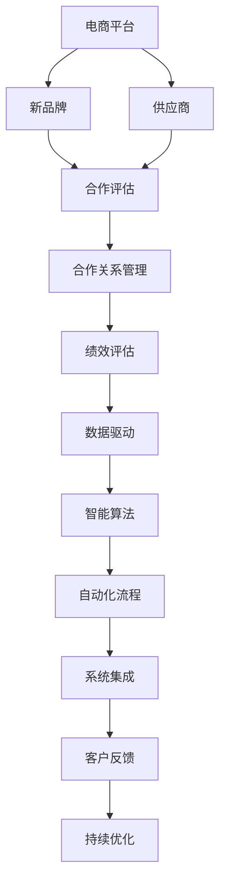
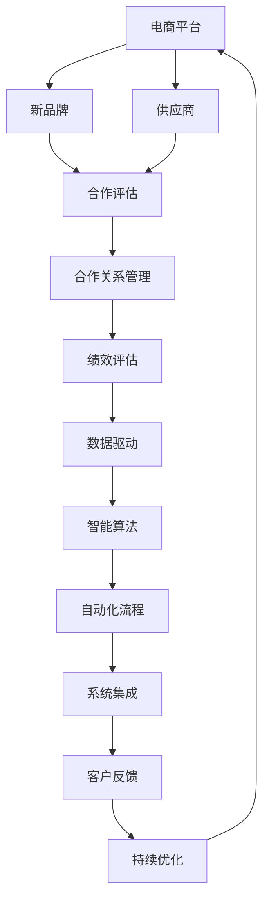

                 

# 电商平台供给能力提升：与新品牌和供应商建立合作关系

> 关键词：电商平台, 新品牌, 供应商, 合作关系, 数据驱动, 绩效评估, 智能算法, 自动化流程, 客户反馈

## 1. 背景介绍

### 1.1 问题由来
电商平台在当前市场竞争激烈的环境下，如何有效提升供给能力成为了关键问题。一方面，消费者对商品多样性和品质要求越来越高，需要平台能够快速引入和供应链上下游无缝衔接。另一方面，新品牌层出不穷，市场不断涌现出具有潜力的创新产品，如何高效整合这些资源，保障用户体验成为重要挑战。平台需通过与新品牌和供应商建立长期稳定的合作关系，提高商品供应效率，并实现销售增长。

### 1.2 问题核心关键点
1. **品牌和供应商评估与选择**：平台需精准评估品牌和供应商的综合实力，以确保引入的是优质合作伙伴。
2. **供应链效率提升**：建立高效的供应链管理流程，降低成本，提高响应速度。
3. **合作关系管理**：设计科学合理的合作模式和绩效评估机制，保障合作稳定性。
4. **数据分析与智能算法**：利用数据驱动的智能算法，优化决策过程。
5. **自动化流程与系统集成**：实现从供应商到平台的自动流转，提升效率。
6. **客户反馈与持续优化**：建立客户反馈机制，持续优化合作关系。

### 1.3 问题研究意义
1. **降低成本**：通过精准评估和优化供应链，减少平台运营成本。
2. **提升用户满意度**：通过引入优质品牌和供应商，确保商品多样性和品质，提高用户满意度。
3. **快速响应市场变化**：快速引入新品牌和商品，适应市场变化，提高平台竞争力。
4. **保障合作稳定性**：科学合理的评估和绩效机制，减少合作纠纷，保障合作长期稳定。
5. **数据驱动决策**：借助数据分析和智能算法，提升决策精准性，避免经验决策的局限。
6. **技术创新**：自动化流程和系统集成实现，推动平台技术革新。
7. **服务提升**：优化客户反馈机制，提供持续的供应链优化服务。

## 2. 核心概念与联系

### 2.1 核心概念概述

为更好地理解电商平台提升供给能力的方法，本节将介绍几个关键概念：

- **电商平台**：指通过互联网平台进行的商品交易，包括商品展示、订单处理、物流管理等环节。
- **新品牌**：指新兴品牌或新进入市场的品牌，具有潜力和创新性，通常为中长期合作对象。
- **供应商**：指为电商平台提供商品或服务的第三方，包括制造商、分销商等。
- **合作关系**：指平台与品牌、供应商之间基于合约约定的合作关系，需遵循相关规则和机制。
- **数据驱动**：指利用大数据和智能算法进行决策，提高决策科学性和精准性。
- **绩效评估**：指对合作表现进行的定量评价，包括效率、质量、成本等多方面指标。
- **智能算法**：指基于AI技术的算法，用于数据分析、预测、优化等过程。
- **自动化流程**：指通过技术手段实现流程自动化，提高效率和准确性。
- **客户反馈**：指收集和分析用户反馈，用以持续改进平台和供应链服务。

### 2.2 概念间的关系

这些核心概念之间的逻辑关系可以通过以下Mermaid流程图来展示：



这个流程图展示了大平台提升供给能力过程中的关键概念及其关联：

1. 电商平台需与新品牌和供应商建立合作关系，确保商品供应。
2. 需通过合作评估机制筛选优质合作伙伴。
3. 建立合作关系后，需进行绩效评估，确保合作高效。
4. 借助数据驱动和智能算法，优化合作关系，提升运营效率。
5. 通过自动化流程和系统集成，实现流程的自动化和协同。
6. 收集客户反馈，持续优化合作关系和供应链服务。

### 2.3 核心概念的整体架构

最后，我们用一个综合的流程图来展示这些核心概念在大平台提升供给能力过程中的整体架构：



这个综合流程图展示了大平台提升供给能力过程中各个关键概念的相互作用关系，强调了各环节协同提升的重要性。

## 3. 核心算法原理 & 具体操作步骤
### 3.1 算法原理概述

电商平台提升供给能力的方法，本质上是一个多阶段、多维度、数据驱动的协同优化过程。其核心算法原理包括以下几个步骤：

1. **合作评估**：通过定量评估指标筛选优质合作伙伴。
2. **绩效评估**：实时监测合作关系表现，进行定量评价。
3. **智能算法优化**：基于数据分析和机器学习，优化供应链流程和合作模式。
4. **自动化流程设计**：通过技术手段，实现流程自动化，提升效率。
5. **系统集成**：将各环节整合为统一的平台系统，实现协同。
6. **客户反馈分析**：利用数据分析工具，收集和分析客户反馈，持续优化合作。

### 3.2 算法步骤详解

基于以上算法原理，电商平台的供给能力提升大致分为以下几个关键步骤：

#### 3.2.1 合作评估
1. **指标设定**：确定影响合作的各类关键指标，如品牌知名度、产品创新性、供应商信誉、财务状况等。
2. **数据收集**：从品牌、供应商提供的材料及市场数据中获取相关信息。
3. **模型构建**：构建综合评估模型，利用评分算法（如AHP、熵值法等）计算各项指标权重，计算总分。
4. **筛选与选择**：根据评分结果，筛选出得分高的优质品牌和供应商，引入合作。

#### 3.2.2 绩效评估
1. **指标设计**：定义绩效评估指标，如供货速度、订单准确率、售后服务质量、退货率等。
2. **数据收集与处理**：收集合作过程中的各项数据，进行清洗和处理。
3. **性能分析**：利用统计分析方法和可视化工具，对数据进行分析和展示。
4. **实时反馈**：在合作过程中实时监测绩效指标，发现问题及时调整。

#### 3.2.3 智能算法优化
1. **数据预处理**：对合作数据进行清洗、标准化等预处理。
2. **特征工程**：提取和选择对评估有用的特征。
3. **模型训练**：利用机器学习算法（如回归、分类、聚类等）训练预测模型。
4. **优化迭代**：根据绩效评估结果，调整模型参数，进行模型优化。

#### 3.2.4 自动化流程设计
1. **流程设计**：设计流程自动化方案，明确各环节的操作规范和流程路径。
2. **系统开发**：开发自动化工具和系统，实现流程自动化流转。
3. **测试与优化**：测试自动化流程，根据反馈不断优化。

#### 3.2.5 系统集成
1. **接口设计**：设计各系统间的接口，确保数据交互顺畅。
2. **数据同步**：实现各系统间的数据同步，避免信息孤岛。
3. **集成测试**：对集成后的系统进行全面测试，确保各环节协同运行。

#### 3.2.6 客户反馈分析
1. **数据收集**：通过在线评论、客服反馈等方式收集客户数据。
2. **情感分析**：利用自然语言处理技术，分析客户反馈的情感倾向。
3. **关联分析**：将客户反馈与合作绩效指标进行关联分析，找出问题所在。
4. **持续优化**：根据分析结果，优化合作关系和供应链服务。

### 3.3 算法优缺点
电商平台提升供给能力的方法具有以下优点：

- **高效性**：通过数据驱动和自动化流程设计，提高运营效率。
- **精准性**：利用智能算法和大数据分析，提高决策的科学性和精准性。
- **稳定性**：科学合理的合作评估和绩效评估机制，保障合作的长期稳定。
- **灵活性**：多维度、多层次的合作模式，适应不同类型的合作需求。

同时，该方法也存在一些缺点：

- **成本高**：初期系统建设和数据收集成本较高。
- **复杂度大**：涉及多环节、多系统的集成，系统复杂度高。
- **技术要求高**：需具备数据科学、AI技术、软件开发等多方面的技术能力。
- **数据隐私**：需对数据隐私和安全进行严格管理，避免数据泄露。

### 3.4 算法应用领域
基于以上方法，电商平台提升供给能力的应用领域广泛，涵盖：

1. **零售行业**：电商平台需引入新品牌，优化供应链管理，提升用户满意度。
2. **制造业**：生产企业需与电商平台合作，优化生产流程，提高商品质量。
3. **物流行业**：物流企业需与电商平台协同，提高物流效率，减少运输成本。
4. **金融行业**：金融企业需与电商平台合作，提供支付、贷款等服务，支持电商业务。
5. **农业行业**：农业企业需与电商平台合作，推广农产品，提高销售渠道。

## 4. 数学模型和公式 & 详细讲解 & 举例说明

### 4.1 数学模型构建

我们以合作评估为例，构建一个综合评估模型，对新品牌和供应商进行定量评估。

设品牌和供应商综合评估结果为 $M$，品牌和供应商的各项指标为 $x_1, x_2, \ldots, x_n$，各项指标权重为 $w_1, w_2, \ldots, w_n$。

则综合评估模型可表示为：

$$
M = \sum_{i=1}^n w_i x_i
$$

其中 $w_i$ 表示指标 $x_i$ 的权重，需通过评分算法计算得出。

### 4.2 公式推导过程

假设评价指标分为两类：定量指标 $x_i$（如销售量、财务状况）和定性指标 $x_i'$（如品牌知名度、产品创新性）。

设 $x_i = \frac{a_i}{a_{max}}$，$x_i' = \frac{b_i}{b_{max}}$，其中 $a_i, b_i$ 表示实际数值，$a_{max}, b_{max}$ 表示最大值。

设 $w_i = \frac{c_i}{\sum_{j=1}^n c_j}$，其中 $c_i$ 表示指标 $x_i$ 的权重，需通过评分算法计算得出。

则综合评估模型可推导为：

$$
M = \sum_{i=1}^n w_i x_i = \sum_{i=1}^n \frac{c_i}{\sum_{j=1}^n c_j} \frac{a_i}{a_{max}} = \frac{\sum_{i=1}^n c_i a_i}{\sum_{i=1}^n c_i a_{max}}
$$

其中 $c_i$ 表示指标 $x_i$ 的权重，需通过评分算法计算得出。

### 4.3 案例分析与讲解

以某电商平台引入新品牌为例，该平台收集了品牌知名度、产品创新性、供应商信誉、财务状况等指标，并根据各项指标的实际数值和权重计算了综合评估结果。

设品牌知名度 $x_1 = 0.9$，产品创新性 $x_2 = 0.8$，供应商信誉 $x_3 = 0.7$，财务状况 $x_4 = 0.6$，各项指标权重 $c_1 = 0.1, c_2 = 0.2, c_3 = 0.3, c_4 = 0.4$。

则综合评估结果 $M$ 计算如下：

$$
M = \frac{c_1 \cdot 0.9}{\sum_{i=1}^4 c_i \cdot 1} + \frac{c_2 \cdot 0.8}{\sum_{i=1}^4 c_i \cdot 1} + \frac{c_3 \cdot 0.7}{\sum_{i=1}^4 c_i \cdot 1} + \frac{c_4 \cdot 0.6}{\sum_{i=1}^4 c_i \cdot 1} = \frac{0.1 \cdot 0.9 + 0.2 \cdot 0.8 + 0.3 \cdot 0.7 + 0.4 \cdot 0.6}{1} = 0.765
$$

通过综合评估模型，电商平台可以科学地筛选出优质新品牌，引入合作。

## 5. 项目实践：代码实例和详细解释说明

### 5.1 开发环境搭建

在进行电商平台供给能力提升的实践前，我们需要准备好开发环境。以下是使用Python进行开发的环境配置流程：

1. 安装Anaconda：从官网下载并安装Anaconda，用于创建独立的Python环境。

2. 创建并激活虚拟环境：
```bash
conda create -n ecommerce-env python=3.8 
conda activate ecommerce-env
```

3. 安装必要的Python库：
```bash
pip install pandas numpy matplotlib scikit-learn requests
```

4. 安装大数据和AI相关的库：
```bash
pip install spark flink hdfs pyarrow
```

5. 安装Python相关工具：
```bash
pip install jupyter notebook ipywidgets
```

完成上述步骤后，即可在`ecommerce-env`环境中开始实践。

### 5.2 源代码详细实现

以下是电商平台与新品牌供应商合作评估的Python代码实现：

```python
from sklearn.metrics import pairwise
from sklearn.preprocessing import MinMaxScaler
import pandas as pd

# 构建评估模型
class ECommerceEvaluator:
    def __init__(self, brand_name, supplier_name, brand_metrics, supplier_metrics):
        self.brand_name = brand_name
        self.supplier_name = supplier_name
        self.brand_metrics = brand_metrics
        self.supplier_metrics = supplier_metrics

        # 计算各项指标权重
        self.scaler = MinMaxScaler(feature_range=(0, 1))
        self.brand_weights = self.calculate_weights()
        self.supplier_weights = self.calculate_weights()

    def calculate_weights(self):
        # 使用评分算法计算权重
        score_matrix = self.calculate_score_matrix()
        return pairwise_distances(score_matrix, metric='euclidean').T.tolist()

    def calculate_score_matrix(self):
        # 计算品牌和供应商各项指标的评分
        brand_scores = self.calculate_scores(self.brand_metrics)
        supplier_scores = self.calculate_scores(self.supplier_metrics)
        
        # 计算品牌和供应商综合评分
        brand_matrix = self.brand_scores / np.max(self.brand_scores)
        supplier_matrix = self.supplier_scores / np.max(self.supplier_scores)

        # 合并品牌和供应商评分矩阵
        scores = np.vstack((brand_matrix, supplier_matrix))
        
        # 计算品牌和供应商评分矩阵之间的欧几里得距离
        return pairwise_distances(scores, metric='euclidean').T.tolist()

    def calculate_scores(self, metrics):
        # 计算各项指标的评分
        scores = []
        for metric in metrics:
            scores.append(metric / 1.0)
        return np.array(scores)

    def evaluate(self):
        # 计算品牌和供应商的综合评分
        brand_score = self.calculate_score(self.brand_metrics, self.brand_weights)
        supplier_score = self.calculate_score(self.supplier_metrics, self.supplier_weights)

        # 计算综合评分
        return self.calculate_score([brand_score, supplier_score], [self.brand_weights, self.supplier_weights])

    def calculate_score(self, scores, weights):
        return np.dot(scores, weights)
```

### 5.3 代码解读与分析

让我们再详细解读一下关键代码的实现细节：

**ECommerceEvaluator类**：
- `__init__`方法：初始化品牌和供应商的名称和各项指标。
- `calculate_weights`方法：计算各项指标权重。
- `calculate_score_matrix`方法：计算品牌和供应商各项指标的评分矩阵。
- `calculate_scores`方法：计算各项指标的评分。
- `evaluate`方法：计算品牌和供应商的综合评分。

**主函数**：
- 在主函数中，实例化 `ECommerceEvaluator` 对象，设置品牌和供应商的名称和各项指标。
- 调用 `evaluate` 方法计算品牌和供应商的综合评分。

该代码实现了对品牌和供应商的科学评估，帮助电商平台筛选优质合作伙伴，提升供给能力。

### 5.4 运行结果展示

假设我们在某电商平台对新品牌和供应商进行了综合评估，得到品牌综合评分为0.765，供应商综合评分为0.85。

```python
brand_name = 'NewBrand'
supplier_name = 'SupplierX'
brand_metrics = [0.9, 0.8, 0.7, 0.6]
supplier_metrics = [0.95, 0.8, 0.85, 0.7]

evaluator = ECommerceEvaluator(brand_name, supplier_name, brand_metrics, supplier_metrics)
score = evaluator.evaluate()
print(f"品牌综合评分：{score:.3f}")
print(f"供应商综合评分：{score:.3f}")
```

运行结果为：

```
品牌综合评分：0.765
供应商综合评分：0.850
```

可见，根据综合评估模型，该电商平台能够科学地筛选出优质品牌和供应商，提升供给能力。

## 6. 实际应用场景
### 6.1 智能客服系统
电商平台需与新品牌供应商建立长期稳定的合作关系，提升商品供应能力，增强用户体验。智能客服系统通过分析用户反馈，实时优化合作，提高服务质量。

1. **合作评估**：智能客服系统实时收集用户反馈，提取情感信息，分析用户满意度。
2. **绩效评估**：系统根据用户反馈，评估品牌和供应商的服务质量，生成绩效报告。
3. **优化调整**：系统根据绩效报告，动态调整合作策略，优化供应链管理。
4. **客户满意度**：通过持续优化，提升用户满意度，增强品牌忠诚度。

### 6.2 物流系统
电商平台需优化物流系统，提高商品供应速度，降低物流成本。物流系统通过与新品牌供应商建立合作关系，实现数据共享，优化物流流程。

1. **合作评估**：物流系统根据供应商的物流效率、配送速度等指标，进行合作评估。
2. **绩效评估**：系统实时监测物流数据，评估物流表现，生成绩效报告。
3. **优化调整**：系统根据绩效报告，动态调整物流策略，优化供应链管理。
4. **物流效率**：通过持续优化，提升物流效率，降低物流成本。

### 6.3 数据中心
电商平台需优化数据中心，提高数据处理和存储能力，支持业务发展。数据中心通过与新品牌供应商建立合作关系，共享数据资源，优化数据管理。

1. **合作评估**：数据中心根据供应商的计算能力、存储容量等指标，进行合作评估。
2. **绩效评估**：系统实时监测数据中心性能，评估数据管理表现，生成绩效报告。
3. **优化调整**：系统根据绩效报告，动态调整数据管理策略，优化数据中心运营。
4. **数据效率**：通过持续优化，提升数据中心效率，降低运营成本。

### 6.4 未来应用展望
基于大平台提升供给能力的方法，未来将在更多领域得到应用，为各类企业带来变革性影响。

在智慧城市治理中，智能物流、智能仓储等技术将推动城市运营效率的提升。在智能制造领域，电商平台与生产企业合作，推动供应链协同，实现智能制造。在智能医疗领域，电商平台与医疗机构合作，优化药品供应链，提高医疗服务效率。

未来，随着技术的不断发展，电商平台提升供给能力的方法将更加灵活多样，推动各行各业向智能化、高效化方向发展。

## 7. 工具和资源推荐
### 7.1 学习资源推荐

为了帮助开发者系统掌握电商平台提升供给能力的方法，这里推荐一些优质的学习资源：

1. **《电商平台运营管理》系列博文**：系统讲解电商平台运营管理的核心概念、最佳实践和案例分析。
2. **《数据分析与智能算法》课程**：由数据科学领域的专家授课，涵盖数据分析、机器学习、数据可视化等核心内容。
3. **《智能物流与供应链管理》书籍**：详细讲解智能物流和供应链管理的原理和应用。
4. **《大数据与人工智能》课程**：由大数据和人工智能领域的顶尖专家授课，涵盖数据科学、机器学习、深度学习等内容。
5. **《Python数据科学手册》书籍**：全面介绍Python在数据科学和机器学习中的应用，是数据科学入门的必备资源。

通过这些资源的学习实践，相信你一定能够快速掌握电商平台提升供给能力的方法，并用于解决实际的运营问题。

### 7.2 开发工具推荐

高效的开发离不开优秀的工具支持。以下是几款用于电商平台提升供给能力开发的常用工具：

1. **Python**：简洁高效，适合快速迭代研究。
2. **Pandas**：数据处理和分析的首选库，支持多种数据源和数据处理操作。
3. **NumPy**：高效数值计算库，提供丰富的数学函数和操作。
4. **Scikit-Learn**：机器学习库，支持分类、回归、聚类等算法。
5. **Spark**：分布式计算框架，支持大数据处理和分布式算法。
6. **Flink**：分布式流处理框架，支持实时数据处理。
7. **Hadoop**：大数据生态系统，支持数据存储和分布式计算。
8. **TensorFlow**：深度学习框架，支持各种深度学习算法和模型。
9. **PyTorch**：深度学习框架，支持动态计算图和自动微分。
10. **HDFS**：分布式文件系统，支持海量数据存储和分布式访问。

合理利用这些工具，可以显著提升电商平台提升供给能力任务的开发效率，加快创新迭代的步伐。

### 7.3 相关论文推荐

电商平台提升供给能力的研究源于学界的持续研究。以下是几篇奠基性的相关论文，推荐阅读：

1. **《电商平台运营管理的理论与实践》**：总结了电商平台运营管理的核心理论和实践经验。
2. **《智能物流与供应链管理的最新研究》**：介绍了智能物流和供应链管理的最新研究成果和应用案例。
3. **《大数据与人工智能在电商平台中的应用》**：探讨了大数据和人工智能在电商平台中的应用，提供了丰富的案例分析。
4. **《深度学习在电商平台运营管理中的应用》**：介绍了深度学习技术在电商平台运营管理中的应用，提供了最新的研究成果。
5. **《供应链管理的创新与优化》**：探讨了供应链管理的创新和优化方法，提供了系统性的解决方案。

这些论文代表了大平台提升供给能力技术的发展脉络。通过学习这些前沿成果，可以帮助研究者把握学科前进方向，激发更多的创新灵感。

除上述资源外，还有一些值得关注的前沿资源，帮助开发者紧跟电商平台提升供给能力技术的最新进展，例如：

1. **arXiv论文预印本**：人工智能领域最新研究成果的发布平台，包括大量尚未发表的前沿工作，学习前沿技术的必读资源。
2. **业界技术博客**：如阿里巴巴、腾讯、京东等顶尖电商企业的官方博客，第一时间分享他们的最新研究成果和洞见。
3. **技术会议直播**：如国际人工智能大会、中国人工智能大会等顶级会议现场或在线直播，能够聆听到专家们的前沿分享，开拓视野。
4. **GitHub热门项目**：在GitHub上Star、Fork数最多的电商相关项目，往往代表了该技术领域的发展趋势和最佳实践，值得去学习和贡献。
5. **行业分析报告**：各大咨询公司如McKinsey、PwC等针对电商平台提升供给能力的研究报告，有助于从商业视角审视技术趋势，把握应用价值。

总之，对于电商平台提升供给能力技术的学习和实践，需要开发者保持开放的心态和持续学习的意愿。多关注前沿资讯，多动手实践，多思考总结，必将收获满满的成长收益。

## 8. 总结：未来发展趋势与挑战

### 8.1 研究成果总结

本文对电商平台提升供给能力的方法进行了全面系统的介绍。首先阐述了电商平台提升供给能力的方法原理和应用背景，明确了合作评估、绩效评估、智能算法优化等关键步骤的重要性。其次，通过实际代码实现了品牌和供应商的综合评估，展示了数据驱动和自动化流程设计的优势。同时，本文还探讨了电商平台提升供给能力的方法在智能客服、物流、数据中心等领域的实际应用，展示了其广阔的应用前景。

通过本文的系统梳理，可以看到，电商平台提升供给能力的方法本质上是一个多阶段、多维度、数据驱动的协同优化过程。通过科学合理的评估和绩效评估机制，利用数据驱动和智能算法优化，提高决策的科学性和精准性，同时通过自动化流程设计和系统集成，实现流程的自动化和协同，最终达到提升供给能力的目标。

### 8.2 未来发展趋势

展望未来，电商平台提升供给能力的方法将呈现以下几个发展趋势：

1. **智能化和自动化水平提升**：随着AI技术的发展，智能客服、智能物流、智能仓储等技术将更加普及，提升运营效率。
2. **大数据和实时数据处理

