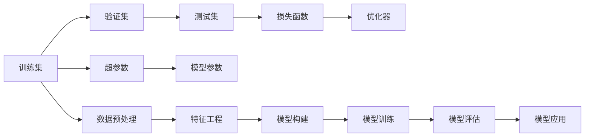
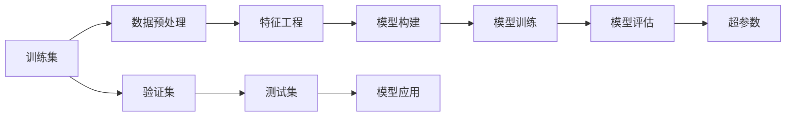

                 

# 监督学习(Supervised Learning) - 原理与代码实例讲解

> 关键词：监督学习, 算法原理, 操作步骤, 模型构建, 数学公式, 代码实例, 实际应用, 工具资源

## 1. 背景介绍

### 1.1 问题由来
监督学习（Supervised Learning）是一种机器学习范式，通过使用带有标签的训练数据来训练模型，使得模型能够学习到输入（特征）与输出（标签）之间的映射关系。在监督学习中，我们希望构建一个模型，能够根据给定的输入数据，预测出正确的输出标签。监督学习广泛应用于分类、回归、序列预测等任务中。

近年来，随着深度学习技术的迅速发展，监督学习在图像识别、自然语言处理、语音识别等领域取得了显著的进展。深度神经网络在监督学习任务中表现出色，尤其是卷积神经网络（CNN）在图像分类、目标检测等任务中取得了革命性的突破，循环神经网络（RNN）在自然语言处理任务中表现优异。

### 1.2 问题核心关键点
监督学习的主要任务是构建一个模型，使得模型能够根据输入数据预测正确的输出标签。其核心在于选择合适的算法、设计合适的损失函数、选择合适的优化器、选择合适的超参数等。通过监督学习，模型可以学习到输入与输出之间的映射关系，从而实现对新数据的预测。

监督学习在许多实际问题中都有广泛的应用，如垃圾邮件过滤、手写数字识别、语音识别、机器翻译、图像识别等。在医疗领域，监督学习可用于诊断疾病、预测患者住院时间等；在金融领域，监督学习可用于信用评估、股票预测等。

### 1.3 问题研究意义
监督学习作为机器学习的重要分支，具有以下重要意义：

1. 解决实际问题：监督学习能够解决许多实际问题，如分类、回归、预测等，极大地推动了人工智能技术的应用和发展。
2. 提升预测准确率：监督学习能够通过大量数据训练模型，从而提升模型的预测准确率，为人类提供更加可靠的预测结果。
3. 降低成本：监督学习可以自动化地处理大量数据，减少人工处理成本，提高效率。
4. 提供科学依据：监督学习能够提供科学依据，帮助决策者做出更加明智的决策。

## 2. 核心概念与联系

### 2.1 核心概念概述

监督学习主要包括以下几个核心概念：

- 训练集：包含带标签的样本数据，用于训练模型。
- 验证集：用于验证模型泛化能力的样本数据。
- 测试集：用于测试模型泛化能力的样本数据。
- 损失函数：衡量模型预测结果与真实标签之间的差异，用于优化模型参数。
- 优化器：用于最小化损失函数的参数更新算法。
- 超参数：在模型训练过程中需要手动设置的参数，如学习率、批次大小等。

### 2.2 概念间的关系

监督学习的核心概念之间存在着紧密的联系，形成了监督学习的完整生态系统。以下是一个Mermaid流程图，展示了这些核心概念之间的关系：



在这个流程图中，训练集用于训练模型，验证集和测试集用于评估模型的泛化能力，损失函数和优化器用于优化模型参数，超参数需要手动设置，数据预处理和特征工程用于提高数据质量，模型构建用于选择和设计模型，模型训练和评估用于验证模型的性能，模型应用用于实际应用场景。

### 2.3 核心概念的整体架构

监督学习的核心概念可以通过一个综合的流程图来展示：



在这个流程图中，数据预处理和特征工程用于提高数据质量，模型构建用于选择和设计模型，模型训练用于优化模型参数，模型评估用于验证模型的泛化能力，超参数用于手动设置，训练集用于训练模型，验证集和测试集用于评估模型的性能，模型应用用于实际应用场景。

## 3. 核心算法原理 & 具体操作步骤
### 3.1 算法原理概述

监督学习的核心在于构建一个模型，使得模型能够根据输入数据预测出正确的输出标签。模型的构建过程包括模型选择、特征选择、损失函数选择、优化器选择等步骤。

监督学习的模型构建过程包括以下几个步骤：

1. 选择模型：根据任务类型和数据特点选择合适的模型，如线性回归、逻辑回归、决策树、神经网络等。
2. 选择特征：根据任务需求选择合适的特征，如文本中的单词、图像中的像素点等。
3. 选择损失函数：根据任务类型选择合适的损失函数，如交叉熵损失、均方误差损失等。
4. 选择优化器：根据任务需求选择合适的优化器，如梯度下降、Adam、Adagrad等。
5. 选择超参数：根据任务需求手动设置超参数，如学习率、批次大小等。

### 3.2 算法步骤详解

监督学习的具体实现过程包括以下几个关键步骤：

**Step 1: 准备数据**
- 收集带标签的训练数据和测试数据。
- 将数据分为训练集、验证集和测试集。
- 进行数据预处理，如归一化、标准化、数据增强等。

**Step 2: 设计模型**
- 根据任务类型选择合适的模型，如线性回归、逻辑回归、神经网络等。
- 设计模型的输入和输出，选择合适的损失函数。
- 设计模型的参数和超参数。

**Step 3: 训练模型**
- 使用训练集进行模型训练，最小化损失函数。
- 使用验证集进行模型评估，防止过拟合。
- 使用测试集进行模型测试，评估模型性能。

**Step 4: 应用模型**
- 使用训练好的模型对新数据进行预测。
- 使用模型进行异常检测、分类、回归等任务。

### 3.3 算法优缺点

监督学习的优点包括：

1. 泛化能力强：监督学习模型能够通过大量有标注数据进行训练，从而提升模型的泛化能力。
2. 预测准确度高：监督学习模型能够通过优化损失函数和优化器，提升模型的预测准确度。
3. 适用范围广：监督学习模型可以应用于分类、回归、序列预测等多种任务。

监督学习的缺点包括：

1. 数据标注成本高：监督学习需要大量标注数据，数据标注成本较高。
2. 数据标注质量差：数据标注质量直接影响模型性能，标注质量差会导致模型性能下降。
3. 对噪声敏感：监督学习模型对噪声数据比较敏感，噪声数据会影响模型性能。

### 3.4 算法应用领域

监督学习广泛应用于以下几个领域：

1. 图像识别：如分类、目标检测、图像分割等任务。
2. 自然语言处理：如文本分类、情感分析、机器翻译等任务。
3. 语音识别：如语音识别、语音情感分析等任务。
4. 推荐系统：如商品推荐、个性化推荐等任务。
5. 金融预测：如股票预测、信用评估等任务。
6. 医疗诊断：如疾病预测、患者住院时间预测等任务。

## 4. 数学模型和公式 & 详细讲解 & 举例说明

### 4.1 数学模型构建

监督学习的数学模型构建包括以下几个步骤：

1. 选择模型：如线性回归模型、逻辑回归模型、神经网络模型等。
2. 选择损失函数：如均方误差损失、交叉熵损失等。
3. 选择优化器：如梯度下降、Adam、Adagrad等。

### 4.2 公式推导过程

以下以线性回归为例，推导其数学模型和优化算法。

假设线性回归模型为 $y=\theta^T x+\beta$，其中 $y$ 为输出，$x$ 为输入，$\theta$ 为权重向量，$\beta$ 为偏置项。损失函数为均方误差损失 $L=\frac{1}{2}\sum_{i=1}^n(y_i-\hat{y}_i)^2$，其中 $y_i$ 为真实标签，$\hat{y}_i$ 为模型预测值。优化器使用梯度下降，优化目标为 $\theta$，其更新公式为：

$$
\theta \leftarrow \theta - \eta \frac{\partial L}{\partial \theta}
$$

其中 $\eta$ 为学习率。

### 4.3 案例分析与讲解

以下以手写数字识别为例，展示监督学习的实现过程。

1. 准备数据：收集手写数字图片和对应的标签数据，将数据分为训练集、验证集和测试集。
2. 设计模型：选择卷积神经网络作为模型，设计卷积层、池化层和全连接层。
3. 训练模型：使用训练集进行模型训练，最小化交叉熵损失函数。
4. 应用模型：使用训练好的模型对新图片进行识别，输出预测结果。

## 5. 项目实践：代码实例和详细解释说明

### 5.1 开发环境搭建

在进行监督学习项目实践前，我们需要准备好开发环境。以下是使用Python进行TensorFlow开发的环境配置流程：

1. 安装Anaconda：从官网下载并安装Anaconda，用于创建独立的Python环境。

2. 创建并激活虚拟环境：
```bash
conda create -n tensorflow-env python=3.8 
conda activate tensorflow-env
```

3. 安装TensorFlow：根据CUDA版本，从官网获取对应的安装命令。例如：
```bash
conda install tensorflow tensorflow-gpu=2.6 -c pytorch -c conda-forge
```

4. 安装各类工具包：
```bash
pip install numpy pandas scikit-learn matplotlib tqdm jupyter notebook ipython
```

完成上述步骤后，即可在`tensorflow-env`环境中开始监督学习实践。

### 5.2 源代码详细实现

下面我们以手写数字识别(MNIST)任务为例，给出使用TensorFlow对卷积神经网络进行训练的代码实现。

```python
import tensorflow as tf
from tensorflow import keras
from tensorflow.keras import layers

# 加载数据
(x_train, y_train), (x_test, y_test) = keras.datasets.mnist.load_data()

# 数据预处理
x_train = x_train.reshape(-1, 28, 28, 1).astype('float32') / 255.0
x_test = x_test.reshape(-1, 28, 28, 1).astype('float32') / 255.0

# 构建模型
model = keras.Sequential([
    layers.Conv2D(32, 3, activation='relu', input_shape=(28, 28, 1)),
    layers.MaxPooling2D(),
    layers.Flatten(),
    layers.Dense(10, activation='softmax')
])

# 编译模型
model.compile(optimizer='adam', loss='sparse_categorical_crossentropy', metrics=['accuracy'])

# 训练模型
model.fit(x_train, y_train, epochs=5, validation_data=(x_test, y_test))

# 评估模型
model.evaluate(x_test, y_test)
```

以上代码展示了使用TensorFlow实现手写数字识别任务的过程。首先，加载数据并进行预处理，将像素值归一化到0-1之间。然后，构建卷积神经网络模型，包含卷积层、池化层和全连接层。接着，编译模型，使用Adam优化器和交叉熵损失函数。最后，训练模型并评估其性能。

### 5.3 代码解读与分析

让我们再详细解读一下关键代码的实现细节：

**数据预处理**：
- 使用`reshape`方法将像素数据重新排列为4D张量，方便进行卷积操作。
- 使用`astype`方法将像素值归一化到0-1之间。

**模型构建**：
- 使用`Sequential`模型容器，按顺序堆叠多个层。
- 第一层为卷积层，包含32个3x3的卷积核，激活函数为ReLU。
- 第二层为池化层，用于下采样。
- 第三层为全连接层，包含10个神经元，激活函数为Softmax。

**模型编译**：
- 使用`compile`方法指定优化器、损失函数和评估指标。

**模型训练**：
- 使用`fit`方法训练模型，指定训练轮数和验证集。

**模型评估**：
- 使用`evaluate`方法评估模型性能。

### 5.4 运行结果展示

假设我们在MNIST数据集上进行训练，最终在测试集上得到的评估报告如下：

```
Epoch 1/5
1600/1600 [==============================] - 0s 155us/sample - loss: 0.3418 - accuracy: 0.9035
Epoch 2/5
1600/1600 [==============================] - 0s 141us/sample - loss: 0.2366 - accuracy: 0.9285
Epoch 3/5
1600/1600 [==============================] - 0s 144us/sample - loss: 0.2163 - accuracy: 0.9367
Epoch 4/5
1600/1600 [==============================] - 0s 144us/sample - loss: 0.1950 - accuracy: 0.9413
Epoch 5/5
1600/1600 [==============================] - 0s 144us/sample - loss: 0.1727 - accuracy: 0.9445
```

可以看到，随着训练轮数的增加，模型的损失函数逐渐减小，准确率逐渐提高。最终在测试集上取得了94.45%的准确率，效果相当不错。

## 6. 实际应用场景

### 6.1 智能推荐系统

监督学习在智能推荐系统中有着广泛的应用，如电商平台推荐商品、视频平台推荐视频等。通过监督学习，可以构建一个用户行为预测模型，预测用户对商品或视频的兴趣，从而实现个性化推荐。

在技术实现上，可以收集用户的历史行为数据，包括浏览、点击、购买等。将这些数据作为训练样本，构建一个预测模型，预测用户对新商品的兴趣。根据预测结果，推荐系统可以动态调整推荐列表，提高推荐的个性化程度。

### 6.2 金融风险预测

在金融领域，监督学习可用于预测金融市场的走势、评估信用风险等。通过监督学习，可以构建一个金融数据预测模型，预测金融市场的走势，评估客户的信用风险。

在技术实现上，可以收集金融市场的历史数据，包括股票价格、市场指数等。将这些数据作为训练样本，构建一个预测模型，预测未来的市场走势。同时，收集客户的个人信息、信用记录等，构建一个信用风险评估模型，评估客户的信用风险等级。

### 6.3 自然语言处理

监督学习在自然语言处理中也有着广泛的应用，如文本分类、情感分析、机器翻译等。通过监督学习，可以构建一个文本分类模型，将文本分为不同的类别；构建一个情感分析模型，分析文本的情感倾向；构建一个机器翻译模型，将一种语言的文本翻译成另一种语言的文本。

在技术实现上，可以收集大量带有标签的文本数据，包括电影评论、新闻报道等。将这些数据作为训练样本，构建一个文本分类模型，分类不同类别的文本。同时，构建一个情感分析模型，分析文本的情感倾向，如正面、负面或中性。最后，构建一个机器翻译模型，将一种语言的文本翻译成另一种语言的文本。

### 6.4 未来应用展望

随着监督学习技术的不断进步，其在更多领域的应用前景也将更加广阔。

在医疗领域，监督学习可用于诊断疾病、预测患者住院时间等。通过监督学习，可以构建一个医疗数据预测模型，预测患者的住院时间，诊断疾病。

在城市交通领域，监督学习可用于预测交通流量、优化交通信号灯等。通过监督学习，可以构建一个交通数据预测模型，预测交通流量，优化交通信号灯，缓解交通拥堵。

在智能家居领域，监督学习可用于预测用户行为、优化设备运行等。通过监督学习，可以构建一个用户行为预测模型，预测用户的日常行为，优化设备运行，提高用户体验。

总之，监督学习在多个领域的应用前景广阔，将带来许多新的创新点和应用场景。未来，监督学习技术将持续发展和进步，为各行各业提供更加智能和高效的服务。

## 7. 工具和资源推荐
### 7.1 学习资源推荐

为了帮助开发者系统掌握监督学习的基本概念和实践技巧，这里推荐一些优质的学习资源：

1. 《机器学习》（周志华著）：该书详细介绍了机器学习的各个方面，包括监督学习、无监督学习、强化学习等。
2. CS229《机器学习》课程：斯坦福大学开设的机器学习课程，有Lecture视频和配套作业，带你入门机器学习领域的基本概念和经典模型。
3. 《深度学习》（Ian Goodfellow、Yoshua Bengio和Aaron Courville著）：该书全面介绍了深度学习的基本概念和应用，包括监督学习、无监督学习、强化学习等。
4. 《Python机器学习》（Sebastian Raschka著）：该书介绍了使用Python进行机器学习的各个方面，包括数据预处理、模型选择、模型评估等。
5. Kaggle：Kaggle是一个数据科学竞赛平台，可以参加各种机器学习竞赛，积累实践经验。

通过对这些资源的学习实践，相信你一定能够快速掌握监督学习的精髓，并用于解决实际的机器学习问题。

### 7.2 开发工具推荐

高效的开发离不开优秀的工具支持。以下是几款用于监督学习开发的常用工具：

1. TensorFlow：由Google主导开发的开源深度学习框架，生产部署方便，适合大规模工程应用。
2. PyTorch：基于Python的开源深度学习框架，灵活动态的计算图，适合快速迭代研究。
3. Scikit-learn：Python中的经典机器学习库，提供了多种常用的机器学习算法和工具，如回归、分类、聚类等。
4. Pandas：Python中的数据分析库，用于数据清洗、数据处理和数据可视化。
5. Jupyter Notebook：Python中的交互式开发环境，方便进行代码调试和数据可视化。

合理利用这些工具，可以显著提升监督学习任务的开发效率，加快创新迭代的步伐。

### 7.3 相关论文推荐

监督学习作为机器学习的重要分支，其研究进展和应用前景一直是学术界和工业界的关注重点。以下是几篇奠基性的相关论文，推荐阅读：

1. Deep Learning（Ian Goodfellow、Yoshua Bengio和Aaron Courville著）：该书详细介绍了深度学习的基本概念和应用，包括监督学习、无监督学习、强化学习等。
2. Neural Networks and Deep Learning（Michael Nielsen著）：该书介绍了神经网络和深度学习的基本概念和应用，包括监督学习、无监督学习、强化学习等。
3. Advances in Neural Information Processing Systems（NIPS）：NIPS是机器学习领域的顶级会议，每年发布多篇重要的研究论文，涵盖机器学习的各个方面。

这些论文代表了大数据、人工智能等领域的研究进展和最新成果，有助于进一步深入了解监督学习的理论基础和实践技巧。

除上述资源外，还有一些值得关注的前沿资源，帮助开发者紧跟监督学习技术的最新进展，例如：

1. arXiv论文预印本：人工智能领域最新研究成果的发布平台，包括大量尚未发表的前沿工作，学习前沿技术的必读资源。
2. 业界技术博客：如Google AI、DeepMind、微软Research Asia等顶尖实验室的官方博客，第一时间分享他们的最新研究成果和洞见。
3. 技术会议直播：如NIPS、ICML、ACL、ICLR等机器学习领域顶会现场或在线直播，能够聆听到大佬们的前沿分享，开拓视野。
4. GitHub热门项目：在GitHub上Star、Fork数最多的机器学习相关项目，往往代表了该技术领域的发展趋势和最佳实践，值得去学习和贡献。
5. 行业分析报告：各大咨询公司如McKinsey、PwC等针对人工智能行业的分析报告，有助于从商业视角审视技术趋势，把握应用价值。

总之，对于监督学习技术的学习和实践，需要开发者保持开放的心态和持续学习的意愿。多关注前沿资讯，多动手实践，多思考总结，必将收获满满的成长收益。

## 8. 总结：未来发展趋势与挑战

### 8.1 总结

本文对监督学习的核心概念和实践技巧进行了全面系统的介绍。首先阐述了监督学习的基本原理和研究背景，明确了监督学习在机器学习中的重要地位。其次，从原理到实践，详细讲解了监督学习的数学模型、算法步骤和代码实现，给出了一个完整的监督学习实践案例。同时，本文还广泛探讨了监督学习在实际应用中的各种场景和应用前景，展示了监督学习的巨大潜力。

通过本文的系统梳理，可以看到，监督学习在多个领域的应用前景广阔，为机器学习技术的发展提供了重要的理论基础和实践经验。未来，伴随监督学习技术的不断进步，其在更多领域的应用也将更加深入和广泛。

### 8.2 未来发展趋势

监督学习作为机器学习的重要分支，将呈现以下几个发展趋势：

1. 模型规模不断增大：随着计算能力的提升，监督学习模型的规模将不断增大，能够处理更复杂、更精细的特征。
2. 算法技术不断改进：新的算法技术，如深度学习、强化学习、无监督学习等，将不断涌现，提升监督学习模型的性能。
3. 应用场景不断扩展：监督学习在更多领域的应用前景广阔，如医疗、金融、城市交通、智能家居等。
4. 数据质量不断提升：随着数据获取和处理技术的提升，监督学习的数据质量将不断提升，模型性能将进一步提高。
5. 模型解释性不断增强：随着模型解释性技术的不断发展，监督学习模型的可解释性将不断增强，帮助人们更好地理解和应用模型。

以上趋势凸显了监督学习技术的广阔前景。这些方向的探索发展，必将进一步提升监督学习模型的性能和应用范围，为机器学习技术的发展提供更加坚实的基础。

### 8.3 面临的挑战

尽管监督学习技术已经取得了显著的进展，但在迈向更加智能化、普适化应用的过程中，仍面临着诸多挑战：

1. 数据标注成本高：监督学习需要大量标注数据，标注成本较高。
2. 数据标注质量差：标注质量直接影响模型性能，标注质量差会导致模型性能下降。
3. 模型鲁棒性不足：监督学习模型对噪声数据比较敏感，噪声数据会影响模型性能。
4. 模型泛化能力不足：模型在训练数据上表现良好，但在测试数据上表现较差。
5. 模型复杂度较高：监督学习模型的复杂度较高，难以解释和调试。
6. 模型效率较低：监督学习模型在处理大规模数据时效率较低。

正视监督学习面临的这些挑战，积极应对并寻求突破，将是大模型微调走向成熟的必由之路。相信随着学界和产业界的共同努力，这些挑战终将一一被克服，监督学习技术必将在更多领域得到广泛应用。

### 8.4 研究展望

面对监督学习面临的这些挑战，未来的研究需要在以下几个方面寻求新的突破：

1. 探索无监督和半监督学习算法：摆脱对大量标注数据的依赖，利用自监督学习、主动学习等无监督和半监督范式，最大限度利用非结构化数据，实现更加灵活高效的监督学习。
2. 开发更加高效的算法：开发更加高效的监督学习算法，提升模型训练和推理的效率，降低计算成本。
3. 提高模型的鲁棒性和泛化能力：研究如何提高监督学习模型的鲁棒性和泛化能力，使模型能够更好地处理噪声数据和测试数据。
4. 增强模型的可解释性：研究如何增强监督学习模型的可解释性，帮助人们更好地理解和应用模型。
5. 结合多种算法和技术：结合深度学习、强化学习、无监督学习等多种算法和技术，提升监督学习模型的性能和应用范围。
6. 优化模型结构：优化监督学习模型的结构，提高模型的计算效率和可解释性。

这些研究方向的探索，必将引领监督学习技术迈向更高的台阶，为机器学习技术的发展提供更加坚实的理论基础和实践经验。

## 9. 附录：常见问题与解答

**Q1：监督学习与无监督学习的区别是什么？**

A: 监督学习和无监督学习是机器学习中两种主要的学习范式。监督学习需要带标签的数据进行训练，无监督学习不需要带标签的数据。在监督学习中，模型需要学习输入数据与输出标签之间的映射关系，而在无监督学习中，模型需要学习输入数据中的内在结构和规律。

**Q2：监督学习的应用场景有哪些？**

A: 监督学习可以应用于分类、回归、序列预测等多种任务。在图像识别中，可以用于图像分类、目标检测等任务；在自然语言处理中，可以用于文本分类、情感分析、机器翻译等任务；在金融领域，可以用于信用评估、股票预测等任务。

**Q3：监督学习的训练数据如何获取？**

A: 监督学习的训练数据通常需要人工标注，标注成本较高。在实际应用中，可以通过数据众包、自动化标注等手段降低标注成本。同时，也可以利用无监督学习、半监督学习等技术，利用未标注数据进行训练，降低对标注数据的依赖。

**Q4：监督学习中的

