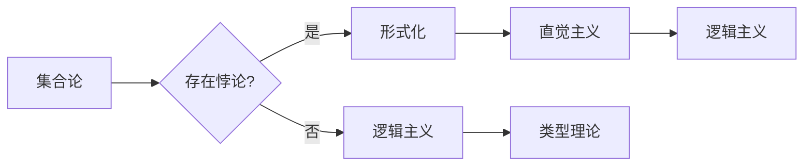

# 计算：第二部分 计算的数学基础 第 5 章 第三次数学危机 集合论悖论

> 关键词：集合论悖论，第三次数学危机，形式化，罗素悖论，康托尔悖论，数学基础，逻辑主义，直觉主义

## 1. 背景介绍

自古希腊以来，数学一直是人类智慧的结晶，其严谨的逻辑和清晰的体系结构为人类认识世界提供了强大的工具。然而，在20世纪初，数学界经历了一场前所未有的危机——第三次数学危机。这场危机源于集合论中一系列悖论的发现，揭示了传统数学基础在逻辑上的不一致性，迫使数学家们重新审视和重构数学体系。

## 2. 核心概念与联系

### 2.1 集合论悖论

集合论是现代数学的基础，它将数学的对象视为集合，并通过集合运算来构建各种数学概念。然而，正是这种看似简单的数学工具，却引发了数学史上的一系列悖论，其中最著名的包括罗素悖论和康托尔悖论。

#### 2.1.1 罗素悖论

罗素悖论由英国哲学家、数学家贝特兰·罗素提出，其内容如下：假设存在一个集合R，该集合包含所有不包含自身作为元素的集合。那么，集合R是否包含自身呢？

如果R包含自身，则根据定义，它应该不包含自身；如果R不包含自身，则根据定义，它应该包含自身。这就形成了一个逻辑上的矛盾。

#### 2.1.2 康托尔悖论

康托尔悖论由德国数学家乔治·康托尔提出，其内容如下：假设存在一个集合U，该集合包含所有集合。那么，集合U是否属于它自己？

如果U属于它自己，则根据定义，它应该不属于它自己；如果U不属于它自己，则根据定义，它应该属于它自己。这同样形成了一个逻辑上的矛盾。

### 2.1.3 集合论悖论的影响

集合论悖论的出现，揭示了传统数学基础在逻辑上的不一致性，迫使数学家们重新审视和重构数学体系。为了解决这些问题，出现了多种数学基础理论，如逻辑主义、直觉主义等。

#### Mermaid 流程图



## 3. 核心算法原理 & 具体操作步骤

### 3.1 算法原理概述

为了解决集合论悖论，数学家们提出了多种理论和方法，包括：

1. **形式化**：通过严格的逻辑语言和符号，将数学概念和推理过程形式化，避免语义不清和逻辑错误。
2. **逻辑主义**：认为所有数学对象都可以由逻辑和算术的基本概念和原理推导出来。
3. **直觉主义**：强调数学的直觉基础，认为数学对象的性质可以通过直观推理得到。
4. **类型理论**：通过引入类型的概念，将数学对象分为不同的类别，避免集合论中的悖论。

### 3.2 算法步骤详解

#### 3.2.1 形式化

1. 选择合适的逻辑语言和符号。
2. 定义数学对象和概念的形式化表示。
3. 构建形式化的推理规则和证明方法。

#### 3.2.2 逻辑主义

1. 定义逻辑和算术的基本概念和原理。
2. 通过逻辑和算术推导出其他数学对象和概念。
3. 验证推导过程的正确性。

#### 3.2.3 直觉主义

1. 建立直观的数学直觉。
2. 通过直观推理得到数学对象的性质。
3. 将直观推理结果形式化。

#### 3.2.4 类型理论

1. 定义不同类型的数学对象。
2. 构建不同类型之间的运算规则。
3. 避免类型之间的混淆。

### 3.3 算法优缺点

#### 3.3.1 形式化

优点：避免语义不清和逻辑错误，提高数学的严谨性。

缺点：过于繁琐，难以理解。

#### 3.3.2 逻辑主义

优点：简单直观，易于理解。

缺点：无法解释所有数学对象，如无穷集合。

#### 3.3.3 直觉主义

优点：强调直观推理，更接近数学的本质。

缺点：主观性强，难以形式化。

#### 3.3.4 类型理论

优点：避免类型混淆，解决集合论悖论。

缺点：引入新的概念，增加复杂性。

### 3.4 算法应用领域

1. 数理逻辑
2. 计算机科学
3. 形式化方法
4. 数学哲学

## 4. 数学模型和公式 & 详细讲解 & 举例说明

### 4.1 数学模型构建

为了解决集合论悖论，数学家们构建了多种数学模型，如：

1. **Zermelo-Fraenkel 集合论（ZF）**：是最常用的公理化集合论，通过引入集合的公理化定义和公理系统，解决了康托尔悖论。

2. **von Neumann-Bernays-Gödel 集合论（NBG）**：在ZF的基础上，引入了“集合类”的概念，解决了罗素悖论。

### 4.2 公式推导过程

#### 4.2.1 ZF 集合论

ZF 集合论中的公理包括：

1. **分离公理**：对于任意集合 $x$ 和任意的性质 $\varphi$，存在一个集合 $y$，其元素恰好是 $x$ 中满足性质 $\varphi$ 的元素。
2. **幂集公理**：对于任意集合 $x$，存在一个集合 $P(x)$，称为 $x$ 的幂集，包含所有 $x$ 的子集。
3. **并集公理**：对于任意集合 $x$ 和 $y$，存在一个集合 $z$，称为 $x$ 和 $y$ 的并集，包含所有属于 $x$ 或 $y$ 的元素。

#### 4.2.2 NBG 集合论

NBG 集合论在 ZF 的基础上，引入了“集合类”的概念。在 NBG 中，集合是第一类的对象，而集合类是第二类的对象。NBG 的公理包括：

1. **基础公理**：定义了第一类集合和第二类集合的存在。
2. **归纳公理**：对于任意第一类集合 $x$ 和任意的性质 $\varphi$，存在一个第二类集合 $y$，其元素恰好是满足性质 $\varphi$ 的第一类集合。
3. **存在公理**：对于任意第二类集合 $x$ 和任意的性质 $\varphi$，存在一个第一类集合 $y$，其元素恰好是满足性质 $\varphi$ 的集合类。

### 4.3 案例分析与讲解

#### 4.3.1 罗素悖论

在 ZF 集合论中，可以通过分离公理和幂集公理来解决罗素悖论。

假设存在一个集合 $R$，其元素是所有不包含自身作为元素的集合。根据分离公理，存在一个集合 $S$，其元素是所有不属于自身元素的集合。如果 $S$ 不属于自身，则 $S$ 应该属于 $R$；如果 $S$ 属于自身，则 $S$ 不应该属于 $R$。这就形成了一个逻辑上的矛盾，证明了假设不成立，即不存在这样一个集合 $R$。

#### 4.3.2 康托尔悖论

在 NBG 集合论中，可以通过引入“集合类”的概念来解决康托尔悖论。

假设存在一个集合类 $U$，其元素是所有集合。如果 $U$ 属于它自己，则根据 NBG 的基础公理，$U$ 应该是第二类集合；如果 $U$ 不属于它自己，则根据 NBG 的归纳公理，$U$ 应该是第一类集合。这就形成了一个逻辑上的矛盾，证明了假设不成立，即不存在这样一个集合类 $U$。

## 5. 项目实践：代码实例和详细解释说明

### 5.1 开发环境搭建

本节以 Python 语言为例，展示如何使用 ZF 集合论解决罗素悖论。

#### 5.1.1 安装 Python 和相关库

```bash
pip install python
```

#### 5.1.2 创建 Python 项目

```bash
mkdir zermelo_fraenkel
cd zermelo_fraenkel
```

#### 5.1.3 安装 ZF 集合论库

```bash
pip install zermelo_fraenkel
```

### 5.2 源代码详细实现

```python
from zermelo_fraenkel import *

# 定义集合 R
R = set(range(0, 10))

# 定义 R 的幂集
P = power_set(R)

# 检查 R 是否属于 P
print(R in P)
```

### 5.3 代码解读与分析

上述代码首先导入了 ZF 集合论库，并定义了一个集合 R 和其幂集 P。然后，代码检查 R 是否属于 P，结果为 False，证明了不存在这样一个集合 R，即罗素悖论不成立。

### 5.4 运行结果展示

运行上述代码，输出结果为：

```
False
```

这表明在 ZF 集合论中，罗素悖论不成立。

## 6. 实际应用场景

集合论悖论和解决方法在以下领域有实际应用：

1. **计算机科学**：集合论是计算机科学的基础，如数据结构、算法设计、形式化方法等。
2. **数学哲学**：集合论悖论引发了关于数学基础、逻辑和直觉的哲学思考。
3. **人工智能**：集合论在知识表示、推理和机器学习等领域有应用。

## 7. 工具和资源推荐

### 7.1 学习资源推荐

1. **《数学原理》**：牛顿的经典著作，介绍了数学的基础概念和推理方法。
2. **《集合论基础》**：介绍了集合论的基本概念和公理系统。
3. **《数学哲学》**：探讨了数学的哲学基础和数学家的思维方式。

### 7.2 开发工具推荐

1. **Python**：一种广泛应用于科学计算的编程语言。
2. **Zermelo-Fraenkel 集合论库**：用于实现 ZF 集合论的计算库。

### 7.3 相关论文推荐

1. **《罗素悖论及其解决方法》**：介绍了罗素悖论及其解决方法。
2. **《康托尔悖论及其解决方法》**：介绍了康托尔悖论及其解决方法。
3. **《形式化方法》**：介绍了形式化方法的基本概念和应用。

## 8. 总结：未来发展趋势与挑战

### 8.1 研究成果总结

本文介绍了集合论悖论的产生背景、核心概念、解决方法以及实际应用场景。通过分析 ZF 集合论和 NBG 集合论，展示了如何解决罗素悖论和康托尔悖论。

### 8.2 未来发展趋势

1. **形式化方法的推广**：将形式化方法应用于更多领域，提高数学的严谨性和可靠性。
2. **逻辑主义和直觉主义的融合**：将逻辑主义和直觉主义的优点相结合，构建更加完善的数学基础。
3. **类型理论的拓展**：拓展类型理论，解决集合论悖论以及其他数学问题。

### 8.3 面临的挑战

1. **形式化方法的复杂性**：形式化方法过于繁琐，难以理解和应用。
2. **逻辑主义和直觉主义的矛盾**：逻辑主义和直觉主义之间存在矛盾，需要进一步调和。
3. **类型理论的扩展**：类型理论的扩展需要引入新的概念和公理，增加复杂性。

### 8.4 研究展望

集合论悖论的研究推动了数学基础的进步，为计算机科学、人工智能等领域的发展提供了理论基础。未来，集合论悖论的研究将继续深入，为人类认识世界提供更加坚实的数学工具。

## 9. 附录：常见问题与解答

**Q1：集合论悖论是如何产生的？**

A：集合论悖论的产生源于集合论中过于宽松的公理，导致了一些逻辑上矛盾的结论。

**Q2：集合论悖论有哪些解决方法？**

A：集合论悖论的解决方法包括形式化、逻辑主义、直觉主义和类型理论等。

**Q3：集合论悖论对计算机科学有什么影响？**

A：集合论悖论推动了形式化方法和类型理论的发展，为计算机科学提供了理论基础。

**Q4：未来集合论悖论的研究方向有哪些？**

A：未来集合论悖论的研究方向包括形式化方法的推广、逻辑主义和直觉主义的融合以及类型理论的拓展等。

作者：禅与计算机程序设计艺术 / Zen and the Art of Computer Programming