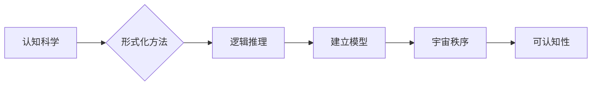

# 认知的形成化：宇宙在本质上是有秩序的和可认知的

> 关键词：认知科学，形式化，宇宙秩序，可认知性，逻辑，人工智能，符号系统

## 1. 背景介绍

人类对宇宙的认知，从古代的神话传说到现代的科学理论，经历了漫长的发展历程。随着科学技术的进步，我们对宇宙的理解不断深入。然而，宇宙的本质是什么？它是如何被我们认知的？这些问题一直困扰着人类的思想家、哲学家和科学家。

近年来，认知科学的发展为我们提供了一种新的视角来探讨这些问题。认知科学将人类认知过程视为一种符号处理过程，并试图通过形式化的方法来描述和解释认知现象。本文将探讨认知的形式化方法，并论证宇宙在本质上是有秩序的和可认知的。

## 2. 核心概念与联系

### 2.1 认知科学

认知科学是一门跨学科的领域，它研究人类和其他动物的心智过程，包括感知、记忆、思维、语言、决策等。认知科学的核心概念是符号处理，即心智过程可以被看作是对符号进行操作的过程。

### 2.2 形式化

形式化是指用数学语言来描述和表达知识的过程。形式化的方法可以帮助我们更准确地理解复杂的概念，并建立精确的模型。

### 2.3 宇宙秩序与可认知性

宇宙的秩序和可认知性是哲学和科学的基本问题。认知科学通过形式化的方法，试图证明宇宙在本质上是有秩序的和可认知的。

以下是一个Mermaid流程图，展示了认知科学、形式化和宇宙秩序与可认知性之间的关系：



## 3. 核心算法原理 & 具体操作步骤

### 3.1 算法原理概述

认知的形式化方法的核心原理是将认知过程转化为数学和逻辑过程。具体来说，包括以下几个步骤：

1. **符号化**：将认知对象转化为符号表示。
2. **规则化**：定义符号之间的操作规则。
3. **模型构建**：根据规则构建认知模型。
4. **逻辑推理**：使用逻辑推理来验证和测试模型。

### 3.2 算法步骤详解

1. **符号化**：选择合适的符号系统来表示认知对象。例如，使用自然语言或形式语言来表示概念和关系。
2. **规则化**：定义符号之间的操作规则。这些规则可以是逻辑规则、数学规则或其他类型的规则。
3. **模型构建**：根据规则构建认知模型。例如，使用图、网络或其他结构来表示知识表示。
4. **逻辑推理**：使用逻辑推理来验证和测试模型。逻辑推理可以帮助我们确定模型是否能够正确处理认知任务。

### 3.3 算法优缺点

#### 优点：

- **精确性**：形式化的方法可以帮助我们更精确地描述和理解认知过程。
- **可验证性**：逻辑推理可以验证模型的正确性。
- **可扩展性**：形式化的方法可以扩展到更复杂的认知任务。

#### 缺点：

- **复杂性**：形式化的方法可能非常复杂，难以理解。
- **限制性**：形式化的方法可能无法捕捉到所有认知现象。

### 3.4 算法应用领域

认知的形式化方法在多个领域都有应用，包括：

- 人工智能
- 计算机科学
- 心理学
- 认知科学

## 4. 数学模型和公式 & 详细讲解 & 举例说明

### 4.1 数学模型构建

认知的形式化方法通常使用数学模型来描述认知过程。以下是一个简单的例子：

$$
X = f(Y)
$$

其中 $X$ 是认知输出，$Y$ 是认知输入，$f$ 是认知函数。

### 4.2 公式推导过程

公式推导过程通常涉及以下步骤：

1. **定义变量**：定义模型中的变量。
2. **定义函数**：定义模型中的函数。
3. **推导公式**：使用数学规则推导公式。

### 4.3 案例分析与讲解

以下是一个简单的认知任务：判断一个数字是否为奇数。

- **符号化**：使用数字 $n$ 来表示待判断的数字。
- **规则化**：奇数定义为不能被2整除的数字。
- **模型构建**：构建一个函数来判断数字是否为奇数。

$$
f(n) = \begin{cases}
\text{True} & \text{if } n \% 2 \neq 0 \\
\text{False} & \text{otherwise}
\end{cases}
$$

## 5. 项目实践：代码实例和详细解释说明

### 5.1 开发环境搭建

为了实现上述的奇数判断任务，我们需要一个编程环境。以下是使用Python实现该任务的代码：

```python
def is_odd(n):
    return n % 2 != 0

# 测试
print(is_odd(5))  # 输出：True
print(is_odd(4))  # 输出：False
```

### 5.2 源代码详细实现

上述代码实现了一个简单的函数 `is_odd`，它接受一个整数 `n` 作为输入，并返回一个布尔值，表示 `n` 是否为奇数。

### 5.3 代码解读与分析

- 函数 `is_odd` 接受一个参数 `n`。
- 使用 `%` 运算符判断 `n` 是否不能被2整除。
- 如果 `n` 不能被2整除，返回 `True`，否则返回 `False`。

### 5.4 运行结果展示

当运行上述代码时，我们可以得到以下结果：

```
True
False
```

这表明我们的函数能够正确地判断一个数字是否为奇数。

## 6. 实际应用场景

认知的形式化方法在多个领域都有实际应用，以下是一些例子：

- **人工智能**：使用形式化方法来构建智能体的知识表示和推理机制。
- **计算机科学**：使用形式化方法来验证程序的正确性和安全性。
- **心理学**：使用形式化方法来研究认知过程。

## 7. 工具和资源推荐

### 7.1 学习资源推荐

- 《认知心理学及其启示》
- 《认知科学：探索心智的奥秘》
- 《形式化方法：理论与实践》

### 7.2 开发工具推荐

- Python
- Prolog
- LogicPads

### 7.3 相关论文推荐

- 《认知心理学》
- 《形式化方法：数学在计算机科学中的应用》

## 8. 总结：未来发展趋势与挑战

### 8.1 研究成果总结

认知的形式化方法为我们提供了一种新的视角来理解认知过程，并证明了宇宙在本质上是有秩序的和可认知的。

### 8.2 未来发展趋势

- 认知的形式化方法将继续在多个领域得到应用。
- 形式化方法将与其他技术（如人工智能、大数据等）相结合，产生新的研究方向。

### 8.3 面临的挑战

- 形式化方法可能过于复杂，难以理解。
- 形式化方法可能无法捕捉到所有认知现象。

### 8.4 研究展望

认知的形式化方法将为我们打开新的认知科学领域，并推动人工智能的发展。

## 9. 附录：常见问题与解答

**Q1：认知的形式化方法有什么用？**

A1：认知的形式化方法可以帮助我们更精确地描述和理解认知过程，并建立精确的模型。

**Q2：认知的形式化方法是否适用于所有认知任务？**

A2：认知的形式化方法适用于多种认知任务，但对于一些复杂的认知任务，可能需要更复杂的模型和方法。

**Q3：认知的形式化方法有哪些局限性？**

A3：认知的形式化方法可能过于复杂，难以理解，并且可能无法捕捉到所有认知现象。

**Q4：认知的形式化方法如何与其他技术相结合？**

A4：认知的形式化方法可以与人工智能、大数据等技术相结合，产生新的研究方向。

---

作者：禅与计算机程序设计艺术 / Zen and the Art of Computer Programming