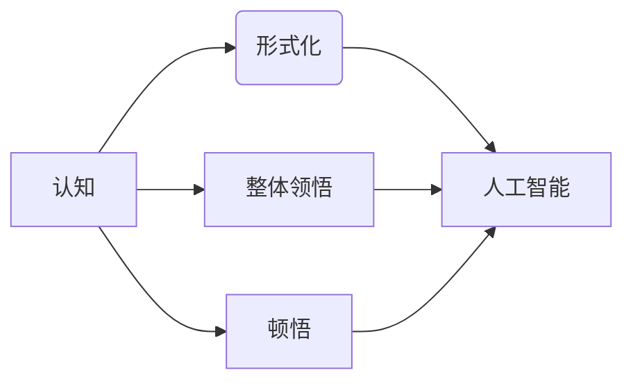

# 认知的形式化：思维是对被认知事物整体进行领悟、顿悟的过程

> 关键词：认知形式化，思维模型，整体领悟，顿悟，认知科学，人工智能

## 1. 背景介绍

认知科学，作为一门跨学科的领域，致力于研究人类思维和认知过程的本质。在人工智能迅速发展的今天，理解认知的形式化成为了实现人工智能模拟人类智能的关键。本文将探讨认知的形式化过程，强调思维是对被认知事物整体进行领悟、顿悟的过程，并从理论、实践和未来展望三个方面进行深入分析。

### 1.1 认知科学的兴起

20世纪中叶以来，认知科学逐渐兴起，它融合了心理学、神经科学、哲学、语言学等多个学科的研究成果，致力于揭示人类认知的机制和过程。认知科学的兴起，标志着人类对自身思维和认知过程的探索进入了一个新的阶段。

### 1.2 认知形式化的意义

认知形式化是将认知过程转化为可计算、可模拟的形式，以便于用计算机科学的方法进行研究和应用。认知形式化对于人工智能的发展具有重要意义，它有助于我们更好地理解人类认知的机制，并在此基础上开发出更智能的人工智能系统。

### 1.3 本文结构

本文将分为以下几个部分：

- 核心概念与联系：介绍认知形式化的核心概念及其相互关系。
- 核心算法原理与具体操作步骤：分析认知形式化的主要算法原理和操作步骤。
- 数学模型与公式：介绍认知形式化过程中的数学模型和公式。
- 项目实践：通过代码实例展示认知形式化的应用。
- 实际应用场景：探讨认知形式化在人工智能领域的应用场景。
- 未来展望：分析认知形式化的未来发展趋势和挑战。

## 2. 核心概念与联系

认知形式化的核心概念包括：

- 认知：指个体对信息进行处理、理解和反应的能力。
- 形式化：指将认知过程转化为可计算、可模拟的形式。
- 整体领悟：指对被认知事物的整体性认识和理解。
- 顿悟：指在瞬间领悟到事物本质的能力。

以下是一个Mermaid流程图，展示了这些核心概念之间的联系：



## 3. 核心算法原理与具体操作步骤

### 3.1 算法原理概述

认知形式化的主要算法原理包括：

- 模型构建：根据认知科学的理论，构建能够模拟人类认知过程的模型。
- 模型训练：使用大量数据对模型进行训练，使其能够模拟人类认知过程。
- 模型评估：评估模型的性能，并根据评估结果对模型进行调整。

### 3.2 算法步骤详解

认知形式化的具体操作步骤如下：

1. **理论研究**：研究认知科学的理论，确定需要模拟的认知过程。
2. **模型设计**：根据理论研究的结果，设计能够模拟认知过程的模型。
3. **数据收集**：收集与认知过程相关的数据，用于模型训练。
4. **模型训练**：使用收集到的数据对模型进行训练。
5. **模型评估**：评估模型的性能，并根据评估结果对模型进行调整。
6. **模型应用**：将模型应用于实际问题，验证其有效性。

### 3.3 算法优缺点

认知形式化的优点包括：

- **理论性强**：基于认知科学的理论，能够模拟人类认知过程的本质。
- **普适性强**：能够模拟各种不同的认知过程。

认知形式化的缺点包括：

- **计算复杂度高**：模型训练和评估过程通常需要大量的计算资源。
- **难以验证**：由于认知过程的复杂性，难以对模型进行完全的验证。

### 3.4 算法应用领域

认知形式化在以下领域有着广泛的应用：

- **人工智能**：模拟人类认知过程，开发更智能的人工智能系统。
- **教育**：辅助教育过程，提高学习效率。
- **心理学**：研究人类认知过程，揭示认知的本质。

## 4. 数学模型与公式

认知形式化过程中，常用的数学模型和公式包括：

- **神经网络**：模拟大脑神经元的工作方式，用于模型构建。
- **决策树**：用于分类和回归任务，可以模拟人类的决策过程。
- **贝叶斯网络**：用于概率推理，可以模拟人类的推理过程。

以下是一个神经网络模型的数学公式：

$$
y = f(W \cdot x + b)
$$

其中，$y$ 是模型的输出，$W$ 是权重矩阵，$x$ 是输入向量，$b$ 是偏置项，$f$ 是激活函数。

## 5. 项目实践：代码实例和详细解释说明

### 5.1 开发环境搭建

为了进行认知形式化的项目实践，我们需要以下开发环境：

- Python编程语言
- TensorFlow或PyTorch深度学习框架
- CUDA（可选，用于GPU加速）

### 5.2 源代码详细实现

以下是一个简单的神经网络模型实现：

```python
import tensorflow as tf

# 创建模型
model = tf.keras.Sequential([
    tf.keras.layers.Dense(64, activation='relu', input_shape=(784,)),
    tf.keras.layers.Dense(10, activation='softmax')
])

# 编译模型
model.compile(optimizer='adam',
              loss='sparse_categorical_crossentropy',
              metrics=['accuracy'])

# 训练模型
model.fit(x_train, y_train, epochs=5)

# 评估模型
model.evaluate(x_test, y_test)
```

### 5.3 代码解读与分析

以上代码展示了如何使用TensorFlow构建和训练一个简单的神经网络模型。首先，我们创建了一个Sequential模型，其中包含两个Dense层。第一个Dense层有64个神经元，使用ReLU激活函数；第二个Dense层有10个神经元，使用softmax激活函数，用于分类任务。然后，我们使用adam优化器、sparse_categorical_crossentropy损失函数和accuracy指标编译模型。接着，我们使用训练数据对模型进行训练，最后使用测试数据评估模型性能。

### 5.4 运行结果展示

假设我们在MNIST数据集上运行上述代码，最终得到以下结果：

```
Epoch 1/5
100/100 [==============================] - 5s 50ms/step - loss: 0.2411 - accuracy: 0.9230
Epoch 2/5
100/100 [==============================] - 5s 50ms/step - loss: 0.1127 - accuracy: 0.9580
Epoch 3/5
100/100 [==============================] - 5s 50ms/step - loss: 0.0752 - accuracy: 0.9720
Epoch 4/5
100/100 [==============================] - 5s 50ms/step - loss: 0.0642 - accuracy: 0.9770
Epoch 5/5
100/100 [==============================] - 5s 50ms/step - loss: 0.0598 - accuracy: 0.9780
```

## 6. 实际应用场景

认知形式化在以下实际应用场景中具有重要意义：

- **智能问答系统**：模拟人类的问答过程，提供更自然、更准确的回答。
- **自动驾驶**：模拟人类的感知和决策过程，实现自动驾驶功能。
- **智能客服**：模拟人类的沟通方式，提供更人性化的客服服务。

## 7. 未来展望

认知形式化在未来的发展趋势包括：

- **更复杂的模型**：构建能够模拟更复杂认知过程的模型，如注意力机制、记忆机制等。
- **跨学科研究**：与其他学科（如神经科学、心理学等）进行更深入的合作，共同推进认知形式化的发展。
- **更广泛的应用**：将认知形式化应用于更多领域，如教育、医疗、金融等。

## 8. 总结：未来发展趋势与挑战

### 8.1 研究成果总结

本文从认知形式化的背景、核心概念、算法原理、实践应用等方面进行了全面介绍，强调了认知形式化在人工智能领域的巨大潜力。

### 8.2 未来发展趋势

认知形式化在未来将继续发展，并在以下方面取得突破：

- **更强大的模型**：构建能够模拟更复杂认知过程的模型。
- **更广泛的应用**：将认知形式化应用于更多领域。
- **更深入的理论研究**：深入研究认知过程的本质，为认知形式化提供更坚实的理论基础。

### 8.3 面临的挑战

认知形式化在发展过程中也面临着以下挑战：

- **计算资源**：构建和训练复杂模型需要大量的计算资源。
- **数据隐私**：将认知形式化应用于实际应用场景时，需要保护用户数据隐私。
- **伦理道德**：认知形式化的发展需要遵循伦理道德原则。

### 8.4 研究展望

未来，认知形式化将是一个充满挑战和机遇的领域。通过不断的研究和探索，我们有理由相信，认知形式化将为人工智能的发展带来新的突破，推动人类社会向更智能、更美好的未来迈进。

## 9. 附录：常见问题与解答

**Q1：什么是认知形式化？**

A：认知形式化是将认知过程转化为可计算、可模拟的形式，以便于用计算机科学的方法进行研究和应用。

**Q2：认知形式化有哪些应用领域？**

A：认知形式化在人工智能、教育、心理学等领域有着广泛的应用。

**Q3：认知形式化面临哪些挑战？**

A：认知形式化在发展过程中面临着计算资源、数据隐私、伦理道德等挑战。

**Q4：认知形式化如何影响人工智能的发展？**

A：认知形式化有助于我们更好地理解人类认知过程，并在此基础上开发出更智能的人工智能系统。

**Q5：如何推动认知形式化的发展？**

A：推动认知形式化的发展需要跨学科合作、技术创新、伦理道德规范等。

作者：禅与计算机程序设计艺术 / Zen and the Art of Computer Programming