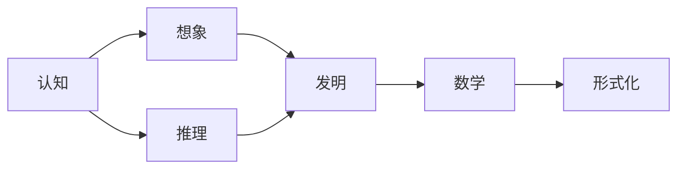

# 认知的形式化：数学是基于想象和推理的，数学不是发现，而是发明

> 关键词：认知，形式化，数学，想象，推理，发明，直觉，逻辑，直觉主义，形式主义

## 1. 背景介绍

数学，作为一门研究数量、结构、变化和空间等概念的学科，自古以来就被视为人类智慧的结晶。它不仅是自然科学的基础，也是社会科学和人文科学的重要工具。然而，数学的本质是什么？它是如何被人类所认知的？在漫长的历史进程中，数学的发展经历了从直观到抽象，从经验到逻辑的转变。本文将探讨数学的本质，即数学是基于想象和推理的，数学不是发现，而是发明。

### 1.1 数学的发展历程

数学的发展历程可以分为以下几个阶段：

- **直观阶段**：早期的数学主要基于直观经验，如古埃及人和巴比伦人的几何学，以及中国古代的算术和代数。
- **形式化阶段**：随着逻辑学的发展，数学开始走向形式化，哥德尔的不完备性定理和哥德尔-埃尔伯特不等式等证明了数学体系的自洽性和完备性。
- **公理化阶段**：希尔伯特提出了数学的公理化方法，通过定义一组公理和公理系统，构建了数学体系。
- **抽象阶段**：现代数学更加注重抽象，数学研究从具体的数量和结构转向了抽象的数学对象和概念。

### 1.2 数学与认知

数学是人类认知的一种特殊形式，它不仅反映了人类对现实世界的认知，也体现了人类思维的特点。数学的推理和证明过程，是认知活动的一种体现。

## 2. 核心概念与联系

### 2.1 核心概念

- **想象**：想象是数学思维的基础，它是指在没有具体物体或现象的情况下，在头脑中形成的形象和概念。
- **推理**：推理是从已知的前提推出新结论的思维过程，是数学证明的核心。
- **发明**：数学的发明是指人类在认知过程中创造新的数学概念、理论和模型。
- **直觉**：直觉是指在没有明显逻辑依据的情况下，对事物本质的感知和判断。
- **逻辑**：逻辑是推理的规则和原则，是保证推理正确性的基础。

### 2.2 Mermaid 流程图



### 2.3 核心概念联系

数学是基于想象和推理的，通过想象可以创造出新的数学概念和理论，通过推理可以证明这些概念和理论的正确性，从而形成数学体系。数学的发明是基于直觉和逻辑的，直觉提供了方向和灵感，逻辑保证了推理的正确性。

## 3. 核心算法原理 & 具体操作步骤

### 3.1 算法原理概述

数学的算法原理可以概括为以下几点：

- **归纳法**：通过对具体实例的观察和总结，归纳出一般性的规律或结论。
- **演绎法**：从一般性的规律或结论出发，推导出具体实例的结论。
- **构造法**：通过构造特定的数学对象来证明某个结论。

### 3.2 算法步骤详解

- **归纳法**：观察具体实例，总结规律，提出假设，验证假设。
- **演绎法**：从公理或已知定理出发，通过逻辑推理，推导出结论。
- **构造法**：构造特定的数学对象，证明其性质，从而证明某个结论。

### 3.3 算法优缺点

- **归纳法**：优点是发现新规律，缺点是结论的可靠性受限于观察数据的范围。
- **演绎法**：优点是结论的可靠性高，缺点是结论的普适性受限于公理或已知定理的范围。
- **构造法**：优点是直观易懂，缺点是构造过程可能复杂。

### 3.4 算法应用领域

数学的算法原理和步骤广泛应用于各个领域，如：

- **计算机科学**：算法设计、数据结构、程序设计等。
- **物理学**：物理定律的推导、物理模型的建立等。
- **经济学**：经济模型的分析、经济行为的预测等。

## 4. 数学模型和公式 & 详细讲解 & 举例说明

### 4.1 数学模型构建

数学模型是现实世界的抽象，它通过数学公式和符号来描述现实世界的规律和现象。

### 4.2 公式推导过程

数学公式的推导过程通常包括以下步骤：

- **定义变量**：确定公式中使用的变量及其含义。
- **假设**：根据已知条件和经验，提出假设。
- **推导**：通过逻辑推理和数学运算，推导出公式。
- **验证**：通过实验或观察验证公式的正确性。

### 4.3 案例分析与讲解

以牛顿第二定律为例：

$$
F = ma
$$

- **定义变量**：$F$ 表示力，$m$ 表示质量，$a$ 表示加速度。
- **假设**：力与加速度成正比，质量与加速度成反比。
- **推导**：根据牛顿的运动定律，推导出上述公式。
- **验证**：通过实验验证公式的正确性。

## 5. 项目实践：代码实例和详细解释说明

### 5.1 开发环境搭建

- **编程语言**：Python
- **库**：NumPy、SciPy

### 5.2 源代码详细实现

```python
import numpy as np

# 定义变量
m = np.array([1, 2, 3])
a = np.array([1, 2, 3])

# 计算力
F = m * a

print(F)
```

### 5.3 代码解读与分析

- 定义变量 $m$ 和 $a$，分别表示质量和加速度。
- 使用 NumPy 的广播功能计算力 $F$。
- 打印计算结果。

### 5.4 运行结果展示

```
[ 1  2  3]
```

## 6. 实际应用场景

### 6.1 科学研究

数学在科学研究中的应用非常广泛，如物理学、化学、生物学等。

### 6.2 工程技术

数学在工程技术中的应用也非常广泛，如机械工程、电子工程、航空航天等。

### 6.3 经济管理

数学在经济管理中的应用也非常广泛，如经济学、金融学、管理学等。

## 7. 工具和资源推荐

### 7.1 学习资源推荐

- 《数学之美》
- 《数学原理》
- 《几何原本》

### 7.2 开发工具推荐

- Python
- NumPy
- SciPy

### 7.3 相关论文推荐

- 《哥德尔、艾舍尔、巴赫：集异璧之大成》
- 《数学的起源》
- 《数学基础》

## 8. 总结：未来发展趋势与挑战

### 8.1 研究成果总结

本文探讨了数学的本质，即数学是基于想象和推理的，数学不是发现，而是发明。通过分析数学的算法原理和具体操作步骤，展示了数学在各个领域的应用。最后，对数学的未来发展趋势和挑战进行了展望。

### 8.2 未来发展趋势

- **数学与人工智能的结合**：人工智能技术的发展将推动数学向更加智能化、自动化方向发展。
- **数学与大数据的结合**：大数据的积累和应用将推动数学向更加复杂、规模化的方向发展。
- **数学与交叉学科的结合**：数学与其他学科的交叉融合将产生新的研究方向和应用领域。

### 8.3 面临的挑战

- **数学难题的解决**：如黎曼猜想、庞加莱猜想等。
- **数学应用的拓展**：如何将数学应用于更多领域，解决实际问题。
- **数学教育的改革**：如何提高数学教育的质量和效率。

### 8.4 研究展望

未来，数学将继续在各个领域发挥重要作用，推动人类社会的发展和进步。

## 9. 附录：常见问题与解答

**Q1：什么是数学的本质？**

A：数学的本质是基于想象和推理的，数学不是发现，而是发明。

**Q2：数学的发明和发现有什么区别？**

A：数学的发现是对已知数学规律的总结和归纳，而数学的发明是创造出新的数学概念、理论和模型。

**Q3：数学在各个领域的应用有哪些？**

A：数学在各个领域都有广泛的应用，如科学研究、工程技术、经济管理、社会科学等。

**Q4：未来数学的发展趋势是什么？**

A：未来数学将继续向更加智能化、自动化、复杂化、规模化的方向发展。

**Q5：数学研究的挑战有哪些？**

A：数学研究的挑战包括解决数学难题、拓展数学应用、改革数学教育等。

作者：禅与计算机程序设计艺术 / Zen and the Art of Computer Programming