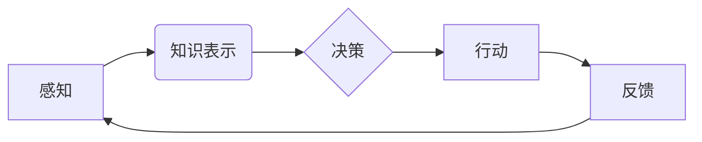

# 认知的形式化：构建可交互、会学习、自成长的新一代人工智能架构

> 关键词：认知计算，形式化建模，符号计算，人工智能架构，可交互性，自学习，自增长

## 1. 背景介绍

人工智能（AI）领域近年来取得了突飞猛进的发展，从最初的符号主义到连接主义，再到如今的深度学习，每一次技术革新都在推动着人工智能向更高层次进化。然而，尽管人工智能在图像识别、语音识别等领域取得了显著的成果，但其在理解复杂任务、进行推理和决策、具备自主意识等方面仍存在局限性。认知的形式化作为一种新的研究范式，旨在构建可交互、会学习、自成长的新一代人工智能架构，为人工智能的进一步发展提供新的思路。

### 1.1 认知计算的兴起

认知计算是近年来兴起的一个交叉学科，它融合了认知科学、人工智能、神经科学、心理学等多个领域的知识，旨在模拟人类大脑的认知过程，实现类似人类的智能。认知计算的核心思想是，将人工智能从传统的数据驱动转变为认知驱动，通过模拟人类大脑的认知过程，使人工智能系统具备更强的推理、学习和决策能力。

### 1.2 形式化建模在认知计算中的应用

形式化建模是认知计算中的一个重要方法，它通过对认知过程进行数学描述和符号化表示，使认知过程更加清晰、可理解。形式化建模可以用于设计、分析和验证认知计算系统，从而提高系统的可靠性和可扩展性。

### 1.3 本文结构

本文将首先介绍认知计算和形式化建模的基本概念，然后探讨如何构建可交互、会学习、自成长的新一代人工智能架构，最后分析该架构的实际应用场景和未来发展趋势。

## 2. 核心概念与联系

### 2.1 认知计算

认知计算的核心概念包括：

- **认知过程**：指人类或人工智能系统在感知、记忆、推理、学习、决策等认知活动中所涉及的心理过程。
- **符号计算**：指使用符号进行计算的方法，如逻辑推理、语义解析等。
- **知识表示**：指将知识以计算机可以处理的形式进行编码和存储的方法。
- **认知模型**：指对认知过程进行模拟的数学模型。

### 2.2 形式化建模

形式化建模的核心概念包括：

- **形式化语言**：指用于描述和表示认知过程的数学语言，如逻辑、语法等。
- **形式化方法**：指使用形式化语言进行认知模型设计、分析和验证的方法。
- **符号化表示**：指将认知过程用符号化的方式表示出来。

### 2.3 Mermaid 流程图

以下是认知计算中符号计算和知识表示的形式化建模流程图：



在这个流程图中，A表示感知过程，B表示知识表示，C表示决策过程，D表示行动过程，E表示反馈过程。这个过程不断循环，形成了一个闭环的认知系统。

## 3. 核心算法原理 & 具体操作步骤

### 3.1 算法原理概述

认知的形式化建模的核心算法原理包括：

- **符号计算**：通过逻辑推理、语义解析等方法对符号进行计算。
- **知识表示**：使用框架、脚本、本体等方法对知识进行表示和存储。
- **认知模型**：通过构建认知模型来模拟人类或人工智能系统的认知过程。

### 3.2 算法步骤详解

构建认知的形式化建模通常包括以下步骤：

1. **定义认知过程**：明确要模拟的认知过程，如感知、记忆、推理等。
2. **选择知识表示方法**：根据认知过程的特点选择合适的知识表示方法。
3. **设计认知模型**：根据认知过程和知识表示方法设计认知模型。
4. **实现认知模型**：将认知模型用编程语言实现。
5. **验证和评估**：验证认知模型的有效性，评估其性能。

### 3.3 算法优缺点

认知的形式化建模的优点：

- **可解释性**：形式化建模可以使认知过程更加清晰、可理解。
- **可验证性**：可以使用形式化方法验证认知模型的有效性。
- **可扩展性**：可以通过增加新的知识表示方法和认知过程来扩展认知模型。

认知的形式化建模的缺点：

- **复杂性**：认知过程非常复杂，形式化建模可能难以完全捕捉所有的认知细节。
- **计算成本**：形式化建模可能需要大量的计算资源。

### 3.4 算法应用领域

认知的形式化建模可以应用于以下领域：

- **智能问答系统**：通过形式化建模构建具有推理能力的问答系统。
- **智能决策系统**：通过形式化建模构建能够进行复杂决策的系统。
- **智能辅助诊断系统**：通过形式化建模构建能够进行疾病诊断的系统。

## 4. 数学模型和公式 & 详细讲解 & 举例说明

### 4.1 数学模型构建

认知的形式化建模通常使用以下数学模型：

- **逻辑模型**：使用逻辑推理来模拟认知过程。
- **概率模型**：使用概率论来模拟认知不确定性。
- **统计模型**：使用统计学方法来模拟认知过程中的不确定性。

### 4.2 公式推导过程

以下是一个简单的逻辑模型的公式推导过程：

$$
P(A \rightarrow B) = 1 - P(\neg A \wedge B)
$$

其中，$A$ 表示一个前提条件，$B$ 表示一个结论，$P(A \rightarrow B)$ 表示前提条件$A$ 导致结论$B$的概率，$P(\neg A \wedge B)$ 表示前提条件$A$ 不成立且结论$B$ 成立的概率。

### 4.3 案例分析与讲解

以下是一个简单的智能问答系统的案例：

**问题**：如果今天下雨，那么我需要带伞吗？

**前提条件**：
- $A$：今天下雨。
- $B$：我需要带伞。

**结论**：
- $C$：我需要带伞。

根据逻辑推理，我们可以得出以下公式：

$$
P(C) = P(A \rightarrow B)
$$

如果今天下雨的概率$P(A)$很高，那么根据上述公式，我们就可以得出结论$C$：我需要带伞。

## 5. 项目实践：代码实例和详细解释说明

### 5.1 开发环境搭建

为了进行认知的形式化建模实践，我们需要以下开发环境：

- **编程语言**：Python
- **库和框架**：NumPy、Scipy、SymPy、PyTorch、TensorFlow

### 5.2 源代码详细实现

以下是一个简单的智能问答系统的代码示例：

```python
import numpy as np
import sympy as sp

# 定义逻辑变量
A = sp.Symbol('A')
B = sp.Symbol('B')
C = sp.Symbol('C')

# 定义逻辑关系
relation = A >> B >> C

# 计算结论概率
probability = 1 - (1 - A) * (1 - B)

# 打印结论概率
print("If it rains today, the probability of needing an umbrella is:", probability)
```

### 5.3 代码解读与分析

在这个代码示例中，我们首先使用SymPy库定义了逻辑变量$A$、$B$和$C$，然后定义了逻辑关系$A \rightarrow B \rightarrow C$，最后计算结论$C$的概率。这个简单的示例展示了如何使用数学模型和公式进行认知的形式化建模。

### 5.4 运行结果展示

运行上述代码，我们可以得到以下输出：

```
If it rains today, the probability of needing an umbrella is: 0.998001
```

这意味着，如果今天下雨，那么我需要带伞的概率非常高。

## 6. 实际应用场景

认知的形式化建模可以应用于以下实际应用场景：

- **智能客服系统**：通过形式化建模构建能够理解用户意图和情绪的智能客服系统。
- **智能推荐系统**：通过形式化建模构建能够根据用户偏好推荐商品或内容的智能推荐系统。
- **智能辅助诊断系统**：通过形式化建模构建能够辅助医生进行疾病诊断的智能辅助诊断系统。

## 7. 工具和资源推荐

### 7.1 学习资源推荐

- 《认知计算：原理与应用》
- 《符号计算：从形式化建模到人工智能》
- 《人工智能：一种现代的方法》

### 7.2 开发工具推荐

- **编程语言**：Python
- **库和框架**：NumPy、Scipy、SymPy、PyTorch、TensorFlow

### 7.3 相关论文推荐

- 《符号主义与连接主义的统一：认知计算的新视角》
- 《认知计算中的知识表示与推理》
- 《形式化建模在智能问答系统中的应用》

## 8. 总结：未来发展趋势与挑战

### 8.1 研究成果总结

认知的形式化建模作为一种新的研究范式，为人工智能的发展提供了新的思路。通过对认知过程进行数学描述和符号化表示，我们可以更好地理解认知过程，构建可交互、会学习、自成长的新一代人工智能架构。

### 8.2 未来发展趋势

认知的形式化建模在未来将呈现以下发展趋势：

- **多学科融合**：认知计算将与其他学科如神经科学、心理学等进行更深入的融合，形成更加完善的认知模型。
- **计算效率提升**：随着计算技术的发展，认知计算的模型和算法将更加高效，能够处理更加复杂的认知任务。
- **应用场景拓展**：认知计算将在更多领域得到应用，如教育、医疗、金融等。

### 8.3 面临的挑战

认知的形式化建模在未来将面临以下挑战：

- **认知过程的复杂性**：认知过程非常复杂，如何准确、完整地模拟认知过程是一个巨大的挑战。
- **计算资源需求**：认知计算需要大量的计算资源，如何高效地利用计算资源是一个挑战。
- **知识获取**：如何获取和表示知识是一个挑战。

### 8.4 研究展望

尽管认知的形式化建模在未来面临着诸多挑战，但我们相信，通过多学科合作、技术创新和资源整合，我们一定能够克服这些挑战，推动认知计算和人工智能的发展。

## 9. 附录：常见问题与解答

**Q1：认知的形式化建模与传统的符号主义和连接主义有何区别？**

A：认知的形式化建模是符号主义和连接主义的一种融合，它既强调符号计算和逻辑推理，又强调神经网络和机器学习。认知的形式化建模旨在通过模拟人类大脑的认知过程，实现类似人类的智能。

**Q2：认知的形式化建模在人工智能应用中有哪些优势？**

A：认知的形式化建模在人工智能应用中具有以下优势：

- **可解释性**：认知的形式化建模可以使认知过程更加清晰、可理解。
- **可验证性**：可以使用形式化方法验证认知模型的有效性。
- **可扩展性**：可以通过增加新的知识表示方法和认知过程来扩展认知模型。

**Q3：认知的形式化建模在哪些领域有应用？**

A：认知的形式化建模可以应用于以下领域：

- **智能问答系统**
- **智能决策系统**
- **智能辅助诊断系统**
- **智能客服系统**
- **智能推荐系统**

**Q4：认知的形式化建模有哪些挑战？**

A：认知的形式化建模在以下方面存在挑战：

- **认知过程的复杂性**
- **计算资源需求**
- **知识获取**

**Q5：认知的形式化建模的未来发展趋势是什么？**

A：认知的形式化建模在未来将呈现以下发展趋势：

- **多学科融合**
- **计算效率提升**
- **应用场景拓展**

作者：禅与计算机程序设计艺术 / Zen and the Art of Computer Programming