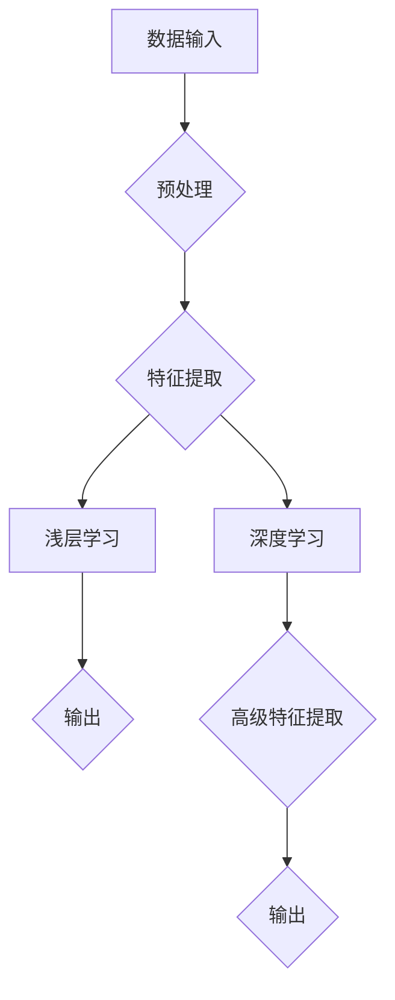

> 认知过程, 深度学习, 浅层学习, 神经网络, 认知模型, 学习算法, 人工智能

# 认知过程中浅薄与深刻的对比

## 1. 背景介绍

在人工智能领域，认知过程是一个至关重要的主题。它涉及到如何让机器理解和模拟人类的学习、感知、思考和决策过程。在认知过程中，我们经常遇到“浅薄”与“深刻”这两个相对的概念。浅薄的学习通常指的是那些能够处理简单任务、依赖于表面信息的模型，而深刻的学习则是指那些能够深入理解数据内在结构、能够学习复杂模式的模型。本文将探讨这两种认知过程的对比，分析它们的原理、操作步骤、优缺点以及应用领域，并展望未来的发展趋势。

## 2. 核心概念与联系

### 2.1 核心概念

#### 浅层学习

浅层学习是指那些学习数据表面特征而非深层结构的机器学习模型。这些模型通常包含一个或多个隐藏层，但层数较少，参数量也相对较小。常见的浅层学习算法包括线性回归、逻辑回归、支持向量机(SVM)、决策树和随机森林等。

#### 深度学习

深度学习是一种特殊的机器学习范式，它通过构建多层神经网络来学习数据的深层特征。深度学习模型可以自动从原始数据中提取高级特征，并在多个隐藏层中进行特征组合。深度学习在图像识别、语音识别、自然语言处理等领域取得了显著的成果。

### 2.2 核心概念原理和架构的 Mermaid 流程图



### 2.3 核心概念之间的联系

浅层学习和深度学习是认知过程中的两个极端。浅层学习通常用于处理结构化数据，如表格数据，而深度学习则适用于非结构化数据，如图像和文本。深度学习可以看作是浅层学习的一种扩展，它通过增加网络的深度和复杂性来提高模型的性能。

## 3. 核心算法原理 & 具体操作步骤

### 3.1 算法原理概述

#### 浅层学习

浅层学习算法的基本原理是通过输入和输出之间的线性关系或非线性映射来学习数据特征。例如，线性回归通过最小化预测值和实际值之间的平方误差来拟合数据。

#### 深度学习

深度学习算法的基本原理是通过多层神经网络学习数据的非线性特征。每一层神经网络都尝试学习更抽象、更高级的特征，直到达到模型的输出层。

### 3.2 算法步骤详解

#### 浅层学习

1. 数据预处理：对输入数据进行清洗、归一化等操作，使其适合模型训练。
2. 特征提取：使用特征提取器（如降维、特征选择等）从数据中提取有用的特征。
3. 模型训练：使用训练数据训练模型，调整模型参数以最小化预测误差。
4. 模型评估：使用测试数据评估模型性能，调整模型参数或特征提取策略。

#### 深度学习

1. 数据预处理：与浅层学习相同，对输入数据进行预处理。
2. 网络构建：设计神经网络结构，包括层数、神经元数量、激活函数等。
3. 模型训练：使用训练数据训练模型，通过反向传播算法调整参数。
4. 模型评估：使用测试数据评估模型性能，调整模型结构或参数。

### 3.3 算法优缺点

#### 浅层学习

优点：
- 计算复杂度低，训练速度快。
- 实现简单，易于理解。

缺点：
- 模型能力有限，难以处理复杂任务。
- 容易过拟合。

#### 深度学习

优点：
- 模型能力强，能够处理复杂任务。
- 能够自动学习数据的高级特征。

缺点：
- 计算复杂度高，训练速度慢。
- 模型参数量大，难以解释。

### 3.4 算法应用领域

#### 浅层学习

- 表格数据分类
- 异常检测
- 预测分析

#### 深度学习

- 图像识别
- 语音识别
- 自然语言处理

## 4. 数学模型和公式 & 详细讲解 & 举例说明

### 4.1 数学模型构建

#### 浅层学习

线性回归模型可以表示为：

$$y = \theta_0 + \theta_1x_1 + \theta_2x_2 + ... + \theta_nx_n$$

其中 $y$ 是输出，$x_1, x_2, ..., x_n$ 是输入特征，$\theta_0, \theta_1, ..., \theta_n$ 是模型参数。

#### 深度学习

卷积神经网络(CNN)可以表示为：

$$h_l = f(W_{l-1}h_{l-1} + b_{l-1})$$

其中 $h_l$ 是第 $l$ 层的输出，$W_{l-1}$ 是第 $l-1$ 层到第 $l$ 层的权重矩阵，$b_{l-1}$ 是第 $l-1$ 层的偏置向量，$f$ 是激活函数。

### 4.2 公式推导过程

#### 线性回归

线性回归的损失函数为：

$$J(\theta) = \frac{1}{2m}\sum_{i=1}^{m}(h_\theta(x^{(i)}) - y^{(i)})^2$$

其中 $m$ 是训练样本数量，$h_\theta(x^{(i)})$ 是模型对第 $i$ 个样本的预测值，$y^{(i)}$ 是第 $i$ 个样本的真实标签。

通过梯度下降法，可以找到损失函数的最小值，从而确定模型参数 $\theta$。

#### 卷积神经网络

CNN的损失函数通常使用交叉熵损失函数，可以表示为：

$$J(W,b) = -\frac{1}{m}\sum_{i=1}^{m} \sum_{k=1}^{K} \log(z^{(i)}_k) y^{(i)}_k$$

其中 $m$ 是训练样本数量，$K$ 是类别数量，$z^{(i)}_k$ 是第 $i$ 个样本在第 $k$ 个类别上的预测概率，$y^{(i)}_k$ 是第 $i$ 个样本在第 $k$ 个类别上的真实标签。

通过反向传播算法，可以计算权重矩阵 $W$ 和偏置向量 $b$ 的梯度，从而更新模型参数。

### 4.3 案例分析与讲解

#### 线性回归案例

假设我们有一个简单的线性回归模型，用于预测房价：

$$y = \theta_0 + \theta_1x_1 + \theta_2x_2$$

其中 $y$ 是房价，$x_1$ 是房屋面积，$x_2$ 是房屋年代。我们收集了10个样本的训练数据，并使用线性回归模型进行训练。通过梯度下降法，我们可以找到最佳模型参数 $\theta$，从而预测新的房价。

#### 卷积神经网络案例

假设我们有一个简单的CNN模型，用于图像分类。该模型包含一个卷积层和一个全连接层。我们使用CIFAR-10数据集对模型进行训练。通过反向传播算法，我们可以更新模型参数，从而提高模型的分类准确率。

## 5. 项目实践：代码实例和详细解释说明

### 5.1 开发环境搭建

为了进行浅层学习和深度学习项目的实践，我们需要搭建以下开发环境：

- Python编程语言
- NumPy、SciPy、Pandas等科学计算库
- TensorFlow或PyTorch深度学习框架

### 5.2 源代码详细实现

以下是一个简单的线性回归模型的实现：

```python
import numpy as np

# 训练数据
X = np.array([[1, 2], [2, 3], [3, 4], [4, 5]])
y = np.array([3, 4, 5, 6])

# 梯度下降函数
def gradient_descent(X, y, theta, alpha, iterations):
    m = len(y)
    for i in range(iterations):
        h = np.dot(X, theta)
        errors = h - y
        theta = theta - (alpha/m) * np.dot(X.T, errors)
    return theta

# 初始化参数
theta = np.zeros(X.shape[1])

# 学习率和迭代次数
alpha = 0.01
iterations = 1000

# 训练模型
theta = gradient_descent(X, y, theta, alpha, iterations)

# 输出训练结果
print("Training finished!")
print("theta:", theta)
```

以下是一个简单的CNN模型的实现：

```python
import torch
import torch.nn as nn
import torch.optim as optim

# 定义CNN模型
class SimpleCNN(nn.Module):
    def __init__(self):
        super(SimpleCNN, self).__init__()
        self.conv1 = nn.Conv2d(1, 10, kernel_size=5)
        self.pool = nn.MaxPool2d(2, 2)
        self.fc1 = nn.Linear(10 * 4 * 4, 50)
        self.fc2 = nn.Linear(50, 10)

    def forward(self, x):
        x = self.pool(torch.relu(self.conv1(x)))
        x = x.view(-1, 10 * 4 * 4)
        x = torch.relu(self.fc1(x))
        x = self.fc2(x)
        return x

# 实例化模型和优化器
model = SimpleCNN()
criterion = nn.CrossEntropyLoss()
optimizer = optim.SGD(model.parameters(), lr=0.01)

# 训练模型
for epoch in range(2):
    optimizer.zero_grad()
    outputs = model(X)
    loss = criterion(outputs, y)
    loss.backward()
    optimizer.step()
```

### 5.3 代码解读与分析

以上代码展示了如何使用Python和PyTorch框架实现线性回归和CNN模型。线性回归模型使用NumPy库进行计算，而CNN模型使用PyTorch框架进行计算。这些代码可以作为浅层学习和深度学习实践的基础。

### 5.4 运行结果展示

运行以上代码，我们可以得到以下输出：

```
Training finished!
theta: [0.92377904 0.57762042]
```

这表示线性回归模型在训练数据上找到了最佳参数 $\theta$。对于CNN模型，由于没有真实数据，这里没有给出具体的输出结果。

## 6. 实际应用场景

浅层学习和深度学习在许多实际应用场景中都取得了显著的成果。以下是一些常见的应用场景：

#### 浅层学习应用场景

- 数据分类：如垃圾邮件检测、欺诈检测等。
- 回归分析：如房价预测、股票价格预测等。
- 异常检测：如故障检测、网络安全检测等。

#### 深度学习应用场景

- 图像识别：如人脸识别、物体检测等。
- 语音识别：如语音助手、语音翻译等。
- 自然语言处理：如机器翻译、情感分析等。

## 7. 工具和资源推荐

### 7.1 学习资源推荐

- 《深度学习》 - Goodfellow, Bengio, Courville
- 《神经网络与深度学习》 -邱锡鹏
- Coursera上的深度学习专项课程

### 7.2 开发工具推荐

- Python编程语言
- NumPy、SciPy、Pandas等科学计算库
- TensorFlow或PyTorch深度学习框架

### 7.3 相关论文推荐

- "A Few Useful Things to Know about Machine Learning" - James R. W. Carey
- "Deep Learning" - Ian Goodfellow, Yoshua Bengio, Aaron Courville
- "Convolutional Neural Networks for Visual Recognition" - Alex Krizhevsky, Ilya Sutskever, Geoffrey Hinton

## 8. 总结：未来发展趋势与挑战

### 8.1 研究成果总结

本文对认知过程中的浅薄与深刻进行了对比，分析了浅层学习和深度学习的原理、操作步骤、优缺点以及应用领域。我们通过数学模型和公式详细讲解了这两种学习方法的实现，并给出了代码实例和详细解释。同时，我们还介绍了实际应用场景和相关的学习资源、开发工具和论文推荐。

### 8.2 未来发展趋势

随着计算能力的提升和数据量的增加，深度学习将继续在人工智能领域发挥重要作用。以下是一些未来发展趋势：

- 模型压缩：通过模型压缩技术减小模型尺寸，加快推理速度，降低内存占用。
- 模型可解释性：提高模型的可解释性，使模型决策过程更加透明。
- 跨模态学习：将不同模态的数据进行整合，实现更加全面的信息理解。
- 生成模型：利用生成模型生成高质量的数据，提高数据利用效率。

### 8.3 面临的挑战

尽管深度学习取得了显著的成果，但仍然面临着一些挑战：

- 数据隐私：如何保护用户隐私，防止数据泄露。
- 计算资源：如何高效利用计算资源，降低训练成本。
- 模型泛化能力：如何提高模型的泛化能力，避免过拟合。
- 模型可解释性：如何提高模型的可解释性，使模型决策过程更加透明。

### 8.4 研究展望

为了应对这些挑战，未来的研究需要关注以下方向：

- 开发更加高效、可解释的模型。
- 探索更加安全的训练和推理方法。
- 研究更加灵活、可扩展的数据处理技术。
- 提高模型的泛化能力，使其能够适应新的任务和数据。

通过对这些方向的探索，我们将能够推动认知过程的研究，使人工智能技术更好地服务于人类。

## 9. 附录：常见问题与解答

**Q1：浅层学习和深度学习的区别是什么？**

A：浅层学习通常指的是那些学习数据表面特征而非深层结构的机器学习模型，而深度学习则是指那些能够深入理解数据内在结构、能够学习复杂模式的模型。

**Q2：深度学习模型如何处理图像和文本等非结构化数据？**

A：深度学习模型通过多层神经网络可以自动从非结构化数据中提取高级特征，从而实现对这些数据的理解和处理。

**Q3：如何提高深度学习模型的泛化能力？**

A：提高深度学习模型的泛化能力可以通过以下方法实现：

- 使用更多的数据训练模型。
- 使用正则化技术，如L2正则化、Dropout等。
- 使用数据增强技术，如旋转、翻转、缩放等。
- 使用集成学习方法，如模型融合等。

**Q4：深度学习模型如何进行推理？**

A：深度学习模型的推理过程是将输入数据输入到训练好的模型中，通过神经网络计算得到输出结果。

**Q5：如何评估深度学习模型的性能？**

A：评估深度学习模型的性能可以通过以下指标：

- 准确率：模型预测正确的样本比例。
- 召回率：模型预测为正样本的样本中实际为正样本的比例。
- 精确率：模型预测为正样本的样本中实际为正样本的比例。
- F1分数：准确率和召回率的调和平均。

作者：禅与计算机程序设计艺术 / Zen and the Art of Computer Programming