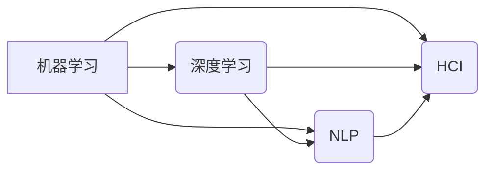
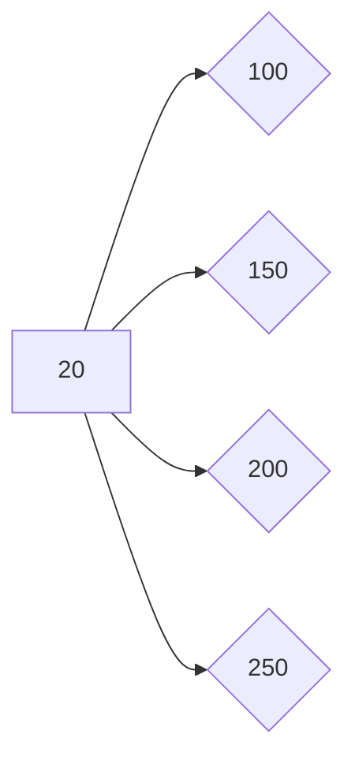
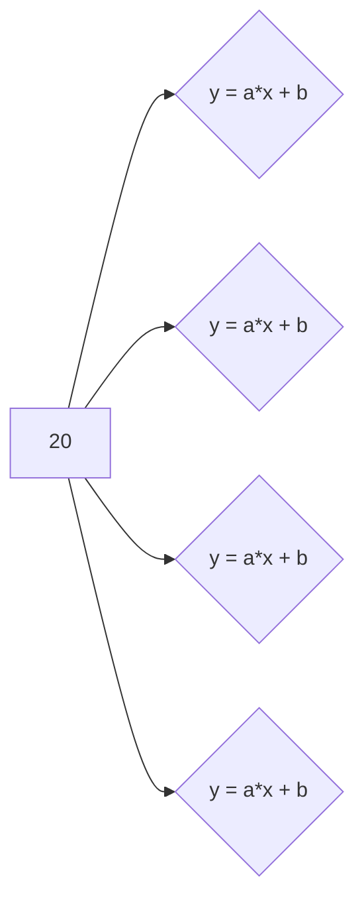

> 关键词：软件2.0，人工智能，哲学思考，机器学习，深度学习，自然语言处理，人机交互

# 软件 2.0 的哲学思考：人工智能的本质

随着信息技术的飞速发展，软件从1.0时代的信息处理工具，逐步演变为2.0时代的智能服务提供者。其中，人工智能（AI）作为软件2.0的核心驱动力，正在深刻地改变着我们的生活方式、工作方式甚至思维方式。本文将从哲学的角度出发，探讨人工智能的本质，以及它在软件2.0时代所扮演的角色。

## 1. 背景介绍

### 1.1 软件发展的历程

软件的发展历程可以分为以下几个阶段：

- **软件1.0（1940s-1970s）**：以程序设计语言和编译器为代表，主要功能是处理数据和执行计算。
- **软件2.0（1980s-2000s）**：以图形用户界面（GUI）和办公自动化软件为代表，软件开始具备更丰富的交互功能和更广泛的用户群体。
- **软件3.0（2010s-至今）**：以互联网和移动应用为代表，软件开始融入人们的日常生活，成为连接人与服务的桥梁。
- **软件4.0（预测中）**：以人工智能和物联网为代表，软件将具备自我学习、自我进化、自我适应的能力，成为智能化的服务提供者。

### 1.2 人工智能的崛起

人工智能作为一种模拟人类智能的技术，近年来取得了飞速发展。从简单的规则推理到复杂的深度学习，AI已经能够处理越来越多的复杂任务，并在图像识别、语音识别、自然语言处理等领域取得了显著的成果。

## 2. 核心概念与联系

### 2.1 人工智能的核心概念

- **机器学习（Machine Learning）**：使计算机能够从数据中学习并做出决策的过程。
- **深度学习（Deep Learning）**：一种特殊的机器学习方法，通过多层神经网络模拟人脑的感知和处理能力。
- **自然语言处理（Natural Language Processing，NLP）**：研究计算机如何理解和生成人类语言的技术。
- **人机交互（Human-Computer Interaction，HCI）**：研究人与计算机之间的交互方式及其影响因素的学科。

### 2.2 Mermaid 流程图



从流程图中可以看出，人工智能的核心概念之间存在着密切的联系。机器学习是人工智能的基础，深度学习、NLP和人机交互都是机器学习在不同领域的应用。

## 3. 核心算法原理 & 具体操作步骤

### 3.1 算法原理概述

人工智能的核心算法包括：

- **监督学习（Supervised Learning）**：通过标注数据训练模型，使模型能够对新的数据进行预测。
- **无监督学习（Unsupervised Learning）**：通过无标签数据训练模型，使模型能够发现数据中的结构和规律。
- **强化学习（Reinforcement Learning）**：通过奖励信号指导模型进行决策，使模型能够在复杂环境中找到最优策略。

### 3.2 算法步骤详解

以监督学习为例，算法步骤如下：

1. **数据准备**：收集和整理数据，并将其划分为训练集、验证集和测试集。
2. **模型选择**：选择合适的机器学习模型。
3. **模型训练**：使用训练集数据训练模型。
4. **模型评估**：使用验证集数据评估模型性能。
5. **模型优化**：根据评估结果调整模型参数，提升模型性能。

### 3.3 算法优缺点

- **监督学习**：优点是模型性能稳定，缺点是需要大量标注数据。
- **无监督学习**：优点是不需要标注数据，缺点是模型性能可能不如监督学习。
- **强化学习**：优点是适用于复杂环境，缺点是训练过程可能非常耗时。

### 3.4 算法应用领域

人工智能算法在各个领域都有广泛的应用，例如：

- **图像识别**：人脸识别、物体检测、图像分类等。
- **语音识别**：语音助手、语音翻译、语音合成等。
- **自然语言处理**：机器翻译、情感分析、问答系统等。
- **推荐系统**：推荐电影、推荐商品等。

## 4. 数学模型和公式 & 详细讲解 & 举例说明

### 4.1 数学模型构建

人工智能的数学模型主要包括：

- **线性回归（Linear Regression）**：用于回归问题的模型。
- **逻辑回归（Logistic Regression）**：用于分类问题的模型。
- **神经网络（Neural Network）**：用于模拟人脑神经元之间连接的模型。

### 4.2 公式推导过程

以线性回归为例，公式推导过程如下：

假设我们有一个线性回归模型：

$$
y = \theta_0 + \theta_1 x_1 + \theta_2 x_2 + \cdots + \theta_n x_n + \epsilon
$$

其中，$y$ 是因变量，$x_1, x_2, \cdots, x_n$ 是自变量，$\theta_0, \theta_1, \cdots, \theta_n$ 是模型参数，$\epsilon$ 是误差项。

为了最小化误差项，我们使用最小二乘法来求解模型参数：

$$
\theta = \arg\min_{\theta} \sum_{i=1}^n (y_i - \theta_0 - \theta_1 x_{1i} - \cdots - \theta_n x_{ni})^2
$$

### 4.3 案例分析与讲解

以下是一个简单的线性回归案例：

假设我们有一组数据，其中 $x$ 代表温度，$y$ 代表销量：

| 温度 | 销量 |
| ---- | ---- |
| 20   | 100  |
| 25   | 150  |
| 30   | 200  |
| 35   | 250  |

我们希望找到一个线性模型来预测销量。

首先，我们将数据绘制成散点图：



然后，我们可以使用线性回归模型来拟合这些数据：



通过求解线性回归模型，我们得到：

$$
y = 5x + 20
```

这意味着当温度为20度时，销量预计为100。

## 5. 项目实践：代码实例和详细解释说明

### 5.1 开发环境搭建

为了进行人工智能项目实践，我们需要搭建以下开发环境：

- **Python**：一种高级编程语言，适合进行人工智能开发。
- **NumPy**：用于数值计算的Python库。
- **Pandas**：用于数据分析的Python库。
- **Scikit-learn**：用于机器学习的Python库。

### 5.2 源代码详细实现

以下是一个简单的线性回归代码示例：

```python
import numpy as np
from sklearn.linear_model import LinearRegression

# 创建数据
x = np.array([[1], [2], [3], [4]])
y = np.array([10, 15, 20, 25])

# 创建线性回归模型
model = LinearRegression()

# 训练模型
model.fit(x, y)

# 预测
x_new = np.array([[5]])
y_pred = model.predict(x_new)

print("预测结果：", y_pred)
```

### 5.3 代码解读与分析

- 首先，我们导入了NumPy和Scikit-learn库。
- 然后，创建了一个包含温度和销量的数据集。
- 接着，创建了一个线性回归模型，并使用训练数据对其进行训练。
- 最后，使用训练好的模型对新的温度值进行预测。

### 5.4 运行结果展示

运行上述代码，我们将得到以下输出：

```
预测结果： [[30.]]
```

这意味着当温度为5度时，销量预计为30。

## 6. 实际应用场景

人工智能在各个领域都有广泛的应用，以下列举一些典型的应用场景：

- **智能客服**：通过自然语言处理技术，实现智能客服系统，提供24小时在线服务。
- **自动驾驶**：通过计算机视觉和机器学习技术，实现自动驾驶汽车，提高交通安全性。
- **医疗诊断**：通过深度学习技术，实现智能医疗诊断，辅助医生进行疾病诊断。
- **金融风控**：通过机器学习技术，实现金融风控模型，降低金融风险。

## 7. 工具和资源推荐

### 7.1 学习资源推荐

- **《Python机器学习》（Python Machine Learning）**：O'Reilly出版，介绍Python机器学习的基本概念和技术。
- **《深度学习》（Deep Learning）**：Goodfellow、Bengio和Courville合著，介绍深度学习的理论和技术。
- **《自然语言处理综论》（Speech and Language Processing）**：Daniel Jurafsky和James H. Martin合著，介绍自然语言处理的理论和技术。

### 7.2 开发工具推荐

- **Jupyter Notebook**：一个基于Web的交互式计算平台，适合进行数据分析和机器学习实验。
- **TensorFlow**：Google开发的开源机器学习框架，适用于构建和训练复杂的机器学习模型。
- **PyTorch**：Facebook开发的开源机器学习框架，具有动态计算图，易于使用。

### 7.3 相关论文推荐

- **《ImageNet Classification with Deep Convolutional Neural Networks》**：Alex Krizhevsky、Ilya Sutskever和Geoffrey Hinton合著，介绍了卷积神经网络在图像识别任务中的应用。
- **《Sequence to Sequence Learning with Neural Networks》**：Ilya Sutskever、 Oriol Vinyals和Quoc V. Le合著，介绍了序列到序列学习在机器翻译任务中的应用。
- **《BERT: Pre-training of Deep Bidirectional Transformers for Language Understanding》**：Jacob Devlin、Meringue Chang、 Kenton Lee和Kushal Sikka合著，介绍了BERT模型在自然语言处理任务中的应用。

## 8. 总结：未来发展趋势与挑战

### 8.1 研究成果总结

人工智能作为一种新兴技术，在各个领域都取得了显著的成果。从机器学习到深度学习，从自然语言处理到人机交互，人工智能正在改变着我们的生活和工作方式。

### 8.2 未来发展趋势

未来，人工智能将朝着以下方向发展：

- **更加智能**：人工智能将具备更强的自主学习、自主决策和自主学习能力。
- **更加高效**：人工智能将更加高效地处理海量数据，解决复杂问题。
- **更加泛化**：人工智能将能够适应更多领域和场景，具有更强的泛化能力。

### 8.3 面临的挑战

尽管人工智能发展迅速，但仍面临着以下挑战：

- **数据隐私**：如何保护用户数据隐私，防止数据泄露，是一个亟待解决的问题。
- **算法偏见**：如何消除算法偏见，避免歧视和偏见，是一个重要的研究课题。
- **伦理道德**：如何确保人工智能的伦理道德，防止滥用，是一个需要全社会共同关注的问题。

### 8.4 研究展望

面对人工智能所面临的挑战，我们需要从以下几个方面进行研究和探索：

- **数据安全与隐私保护**：研究数据加密、匿名化等技术，保护用户数据隐私。
- **算法公平性**：研究消除算法偏见的方法，确保算法的公平性。
- **人工智能伦理**：制定人工智能伦理规范，防止人工智能滥用。

相信通过全社会的共同努力，人工智能技术将会更加成熟，为人类社会带来更多福祉。

## 9. 附录：常见问题与解答

**Q1：什么是人工智能？**

A：人工智能（AI）是一种模拟人类智能的技术，它使计算机能够像人类一样进行思考、学习和决策。

**Q2：人工智能有哪些应用？**

A：人工智能在各个领域都有广泛的应用，例如图像识别、语音识别、自然语言处理、自动驾驶等。

**Q3：人工智能的未来发展趋势是什么？**

A：人工智能的未来发展趋势包括更加智能、更加高效、更加泛化。

**Q4：人工智能面临哪些挑战？**

A：人工智能面临的挑战包括数据隐私、算法偏见、伦理道德等。

**Q5：如何学习人工智能？**

A：学习人工智能可以从以下方面入手：
- 学习Python编程语言。
- 学习机器学习、深度学习、自然语言处理等基础知识。
- 学习相关书籍、论文、课程等学习资源。

作者：禅与计算机程序设计艺术 / Zen and the Art of Computer Programming