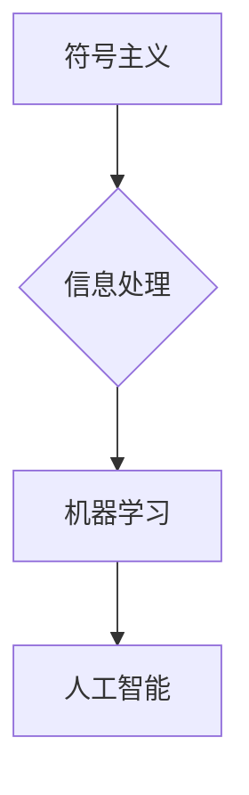

# 达特茅斯会议的学术成果

> 关键词：达特茅斯会议，人工智能，信息处理，符号主义，机器学习，早期AI，图灵测试，人工智能伦理

## 1. 背景介绍

### 1.1 问题的由来

1956年的达特茅斯会议（Dartmouth Conference）是人工智能（Artificial Intelligence, AI）历史上的一个转折点，标志着人工智能作为一个独立学科的确立。这次会议聚集了当时世界上最杰出的科学家和工程师，共同探讨人工智能的未来。会议的召开，不仅推动了人工智能领域的发展，也孕育了诸多重要的学术成果。

### 1.2 研究现状

自达特茅斯会议以来，人工智能经历了多次起伏，从符号主义（Symbolism）到连接主义（Connectionism），再到今天的深度学习（Deep Learning），AI领域的研究不断向前推进。然而，早期人工智能的许多思想和方法仍然对现代AI研究产生着深远的影响。

### 1.3 研究意义

研究达特茅斯会议的学术成果，有助于我们了解人工智能的历史发展脉络，理解早期AI学者们的思想和实验，以及他们对未来AI发展的愿景。这对于今天的人工智能研究和应用具有重要的启示意义。

### 1.4 本文结构

本文将从以下方面对达特茅斯会议的学术成果进行探讨：

- 核心概念与联系
- 核心算法原理与具体操作步骤
- 数学模型和公式
- 项目实践
- 实际应用场景
- 工具和资源推荐
- 总结：未来发展趋势与挑战

## 2. 核心概念与联系

### 2.1 核心概念原理

达特茅斯会议的核心概念主要包括：

- **符号主义**：认为智能的本质是符号操作，即通过符号的表示和操作来实现推理和决策。
- **信息处理**：将人类智能视为信息处理过程，强调计算机模拟人类认知功能。
- **机器学习**：通过机器学习算法使计算机能够从数据中学习并做出决策。

### 2.2 架构的 Mermaid 流程图



### 2.3 核心概念联系

达特茅斯会议的核心概念之间存在着紧密的联系。符号主义是信息处理的基础，而信息处理又是机器学习的前提。最终，这些概念共同构成了人工智能的研究领域。

## 3. 核心算法原理 & 具体操作步骤

### 3.1 算法原理概述

达特茅斯会议期间，学者们提出了许多重要的算法原理，以下是一些典型的例子：

- **图灵机**：图灵（Alan Turing）提出的图灵机模型，是现代计算机科学的基石。
- **专家系统**：基于规则的推理系统，用于模拟专家决策过程。
- **决策树**：一种基于树结构的分类和回归模型。

### 3.2 算法步骤详解

以下以专家系统为例，简要介绍其具体操作步骤：

1. **知识获取**：收集领域专家的知识，构建知识库。
2. **推理引擎**：根据知识库中的规则进行推理，得出结论。
3. **用户接口**：与用户交互，收集输入，输出推理结果。

### 3.3 算法优缺点

**专家系统**的优点是：

- 可以模拟领域专家的决策过程。
- 知识库可以用于多个任务。

其缺点是：

- 构建和维护知识库需要大量专家知识。
- 推理速度较慢。

### 3.4 算法应用领域

达特茅斯会议提出的算法原理和模型，在多个领域得到了应用，如：

- 医疗诊断
- 金融分析
- 法律咨询

## 4. 数学模型和公式 & 详细讲解 & 举例说明

### 4.1 数学模型构建

达特茅斯会议并没有提出特定的数学模型，但其研究思想与数学密切相关。以下以决策树为例，介绍其数学模型：

- **决策树**：是一种树形结构，节点表示测试条件，分支表示结果。

### 4.2 公式推导过程

决策树的构建过程可以通过以下公式表示：

$$
\text{决策树} = \text{根节点} \rightarrow \text{分支} \rightarrow \text{叶节点}
$$

### 4.3 案例分析与讲解

以下以一个简单的贷款审批决策树为例进行讲解：

- 根节点：信用评分
  - 分支1：信用评分 > 700，批准贷款
  - 分支2：信用评分 ≤ 700，进入下一层
- 下一层节点：还款历史
  - 分支1：无逾期，批准贷款
  - 分支2：有逾期，拒绝贷款

## 5. 项目实践：代码实例和详细解释说明

### 5.1 开发环境搭建

以下以Python为例，介绍如何搭建开发环境：

```bash
pip install scikit-learn pandas
```

### 5.2 源代码详细实现

以下是一个简单的决策树实现示例：

```python
from sklearn import tree
import pandas as pd

# 示例数据
data = {
    '信用评分': [700, 650, 720, 680],
    '还款历史': ['无逾期', '有逾期', '无逾期', '有逾期'],
    '贷款批准': [True, False, True, False]
}

# 创建DataFrame
df = pd.DataFrame(data)

# 训练模型
clf = tree.DecisionTreeClassifier()
clf.fit(df[['信用评分', '还款历史']], df['贷款批准'])

# 输出模型
print(clf)
```

### 5.3 代码解读与分析

以上代码展示了如何使用scikit-learn库实现决策树模型。首先导入必要的库，然后创建示例数据，接着训练模型，最后输出模型。

## 6. 实际应用场景

### 6.1 医疗诊断

决策树在医疗诊断领域有着广泛的应用，如：

- 疾病预测
- 治疗方案推荐

### 6.2 金融分析

专家系统在金融分析领域有着重要的应用，如：

- 股票市场分析
- 信用风险评估

## 7. 工具和资源推荐

### 7.1 学习资源推荐

- 《人工智能：一种现代的方法》
- 《机器学习：一种统计方法》
- 《数据科学入门》

### 7.2 开发工具推荐

- Python
- Scikit-learn
- TensorFlow

### 7.3 相关论文推荐

- 《决策树方法的回顾与展望》
- 《机器学习在金融领域的应用》
- 《人工智能在医疗领域的应用研究》

## 8. 总结：未来发展趋势与挑战

### 8.1 研究成果总结

达特茅斯会议的学术成果为人工智能的发展奠定了坚实的基础，推动了AI领域的快速发展。

### 8.2 未来发展趋势

- 人工智能将与更多领域深度融合，如医疗、金融、教育等。
- 深度学习等新型算法将得到更广泛的应用。
- 人工智能伦理将成为重要的研究课题。

### 8.3 面临的挑战

- 人工智能的安全性和可控性
- 数据安全和隐私保护
- 人工智能的伦理和社会影响

### 8.4 研究展望

未来，人工智能将朝着更加智能化、人性化的方向发展，为人类社会带来更多的福祉。

## 9. 附录：常见问题与解答

**Q1：达特茅斯会议有哪些重要成果？**

A1：达特茅斯会议的重要成果包括：

- 确立了人工智能作为一个独立学科的定位。
- 提出了符号主义、信息处理、机器学习等核心概念。
- 推动了人工智能领域的快速发展。

**Q2：人工智能与人类智能有什么区别？**

A2：人工智能与人类智能的主要区别在于：

- 人工智能是通过机器学习和算法实现的，而人类智能是基于生物学的。
- 人工智能缺乏情感、意识和创造力等人类特有的特性。

**Q3：人工智能的伦理问题有哪些？**

A3：人工智能的伦理问题主要包括：

- 人工智能的歧视性输出
- 人工智能的失业问题
- 人工智能的安全性和可控性

**Q4：未来人工智能的发展方向是什么？**

A4：未来人工智能的发展方向包括：

- 深度学习等新型算法的进一步发展。
- 人工智能与更多领域的融合。
- 人工智能伦理和社会责任的重视。

作者：禅与计算机程序设计艺术 / Zen and the Art of Computer Programming