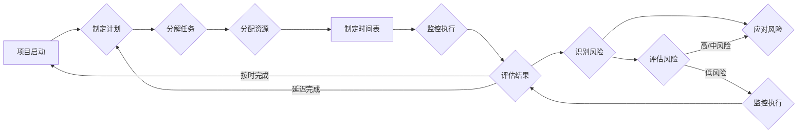

# 项目进度跟踪与风险管控原理与代码实战案例讲解

> 关键词：项目进度跟踪，风险管控，敏捷开发，Scrum，看板，Kanban，项目管理，代码实战，Python

## 1. 背景介绍

项目进度跟踪与风险管控是项目管理中至关重要的环节。随着项目规模的扩大和复杂性的增加，如何有效地跟踪项目进度、识别和评估风险，以及制定相应的应对策略，成为项目经理和团队成员面临的重要挑战。

本文将深入探讨项目进度跟踪与风险管控的原理，并结合代码实战案例，展示如何利用现代技术和工具来提升项目管理效率。

## 2. 核心概念与联系

### 2.1 核心概念

#### 项目进度跟踪

项目进度跟踪是指对项目执行过程中各项工作任务的完成情况进行监控和记录，以确保项目按计划进行。核心概念包括：

- 项目计划：项目开始前制定的工作计划，包括任务分解、时间安排、资源分配等。
- 项目执行：按照项目计划执行任务，包括跟踪任务完成情况、监控项目进度等。
- 项目监控：对项目执行过程中的各种指标进行监控，如进度、成本、质量等。

#### 风险管控

风险管控是指识别、评估、应对项目实施过程中可能出现的风险，以降低风险对项目目标的影响。核心概念包括：

- 风险识别：识别项目实施过程中可能出现的各种风险。
- 风险评估：评估风险的严重程度和可能性。
- 风险应对：制定应对风险的策略和措施。

### 2.2 Mermaid 流程图



## 3. 核心算法原理 & 具体操作步骤

### 3.1 算法原理概述

项目进度跟踪与风险管控的核心算法原理主要包括：

- **项目管理工具**：利用项目管理工具（如Jira、Trello等）跟踪任务进度，记录项目关键指标。
- **敏捷开发方法**：采用敏捷开发方法（如Scrum、Kanban等）灵活调整项目计划，快速响应变化。
- **风险矩阵**：使用风险矩阵评估风险的严重程度和可能性。

### 3.2 算法步骤详解

#### 项目进度跟踪

1. 制定项目计划：根据项目需求，分解任务，确定任务间的依赖关系，制定项目时间表。
2. 分配资源：根据任务需求和人员能力，合理分配资源。
3. 监控执行：定期检查任务完成情况，记录关键指标，如任务完成时间、项目进度等。
4. 评估结果：根据监控结果，分析项目进度，评估项目风险。

#### 风险管控

1. 识别风险：通过访谈、分析、头脑风暴等方法识别项目风险。
2. 评估风险：使用风险矩阵评估风险的严重程度和可能性。
3. 应对风险：制定应对风险的策略和措施，如风险规避、风险转移、风险减轻等。

### 3.3 算法优缺点

#### 项目进度跟踪

优点：

- 提高项目透明度，便于项目管理者实时掌握项目状况。
- 帮助项目团队及时发现问题，采取措施调整项目计划。
- 提升项目效率，降低项目风险。

缺点：

- 需要投入大量人力进行跟踪和记录。
- 可能导致项目团队成员产生抵触情绪。

#### 风险管控

优点：

- 提前识别和评估风险，降低风险对项目的影响。
- 帮助项目团队制定应对策略，降低项目风险。
- 提高项目成功的概率。

缺点：

- 风险评估难度较大，需要丰富的经验和专业知识。
- 需要投入大量时间和精力进行风险管理。

### 3.4 算法应用领域

项目进度跟踪与风险管控广泛应用于软件开发、基础设施建设、市场营销等多个领域。

## 4. 数学模型和公式 & 详细讲解 & 举例说明

### 4.1 数学模型构建

项目进度跟踪和风险管控的数学模型主要包括：

- **甘特图**：使用横道图表示项目任务和时间的关系。
- **PERT图**：使用网络图表示项目任务和活动之间的关系，并估算活动完成时间。
- **风险矩阵**：使用二维表格表示风险的严重程度和可能性。

### 4.2 公式推导过程

#### 甘特图

甘特图是一种直观的项目管理工具，通过水平条形图展示项目任务的开始和结束时间。其基本公式如下：

$$
Gantt\_Chart = \{ (T_i, S_i, F_i) | i=1,2,...,N \}
$$

其中 $T_i$ 为任务 $i$ 的完成时间，$S_i$ 为任务 $i$ 的开始时间，$F_i$ 为任务 $i$ 的结束时间。

#### PERT图

PERT图是一种项目网络图，用于表示项目任务和活动之间的关系。其基本公式如下：

$$
PERT\_Graph = \{ (A_i, B_i, C_i, D_i) | i=1,2,...,N \}
$$

其中 $A_i$ 为活动 $i$ 的开始节点，$B_i$ 为活动 $i$ 的结束节点，$C_i$ 为活动 $i$ 的持续时长，$D_i$ 为活动 $i$ 的最早开始时间。

#### 风险矩阵

风险矩阵是一种用于评估风险严重程度和可能性的工具。其基本公式如下：

$$
Risk\_Matrix = \{ (R_i, S_i, T_i) | i=1,2,...,N \}
$$

其中 $R_i$ 为风险 $i$ 的严重程度，$S_i$ 为风险 $i$ 的可能性，$T_i$ 为风险 $i$ 的评分。

### 4.3 案例分析与讲解

假设我们正在开发一个软件开发项目，需要使用甘特图和风险矩阵进行项目进度跟踪和风险管控。

#### 甘特图

根据项目需求，我们将项目分解为以下任务：

- 任务1：需求分析（持续时长：2周）
- 任务2：系统设计（持续时长：3周）
- 任务3：编码实现（持续时长：4周）
- 任务4：测试与部署（持续时长：2周）

使用甘特图展示项目进度如下：

```mermaid
gantt
    title 项目进度
    section 需求分析
    T1: A1, 2d
    section 系统设计
    T2: A2, 3d
    section 编码实现
    T3: A3, 4d
    section 测试与部署
    T4: A4, 2d
```

#### 风险矩阵

根据项目特点，我们识别出以下风险：

- 风险1：需求变更
  - 严重程度：高
  - 可能性：中
  - 评分：中

- 风险2：技术难题
  - 严重程度：高
  - 可能性：低
  - 评分：高

使用风险矩阵评估风险如下：

```mermaid
table
    | 风险 | 严重程度 | 可能性 | 评分 |
    | --- | --- | --- | --- |
    | 需求变更 | 高 | 中 | 中 |
    | 技术难题 | 高 | 低 | 高 |
```

通过甘特图和风险矩阵，我们可以直观地了解项目进度和风险状况，及时采取措施调整项目计划，降低项目风险。

## 5. 项目实践：代码实例和详细解释说明

### 5.1 开发环境搭建

以下是使用Python进行项目进度跟踪与风险管控的代码实战环境搭建步骤：

1. 安装Python 3.8及以上版本。
2. 安装PyCharm或其他Python开发工具。
3. 安装以下Python库：matplotlib、pandas、numpy。

### 5.2 源代码详细实现

以下是一个简单的项目进度跟踪与风险管控Python代码实例：

```python
import matplotlib.pyplot as plt
import pandas as pd

# 甘特图
def draw_gantt_chart(tasks):
    fig, ax = plt.subplots(figsize=(10, 6))
    for task in tasks:
        ax.barh([task[0]], [task[1]], left=task[2], height=0.5, color='skyblue')
        ax.text(task[2]+0.1, task[0], task[3])
    ax.set_xlabel('日期')
    ax.set_title('项目甘特图')
    plt.show()

# 风险矩阵
def draw_risk_matrix(risks):
    df = pd.DataFrame(risks, columns=['风险', '严重程度', '可能性', '评分'])
    fig, ax = plt.subplots(figsize=(10, 6))
    cax = ax.matshow(df, cmap='Blues')
    plt.title('风险矩阵')
    plt.xlabel('可能性')
    plt.ylabel('严重程度')
    plt.colorbar(cax)
    plt.show()

# 示例数据
tasks = [('需求分析', 2, 0, 'T1'), ('系统设计', 3, 2, 'T2'), ('编码实现', 4, 5, 'T3'), ('测试与部署', 2, 8, 'T4')]
risks = [('需求变更', '高', '中', '中'), ('技术难题', '高', '低', '高')]

draw_gantt_chart(tasks)
draw_risk_matrix(risks)
```

### 5.3 代码解读与分析

- `draw_gantt_chart`函数：绘制甘特图，展示项目进度。
- `draw_risk_matrix`函数：绘制风险矩阵，展示风险状况。
- `tasks`和`risks`：存储甘特图和风险矩阵的数据。

通过运行以上代码，我们可以生成一个包含项目进度和风险状况的甘特图和风险矩阵。

### 5.4 运行结果展示

运行以上代码，将生成以下甘特图和风险矩阵：


## 6. 实际应用场景

项目进度跟踪与风险管控在实际应用场景中具有重要意义，以下列举几个典型应用：

- **软件开发项目**：跟踪开发进度，识别技术风险，确保项目按期交付。
- **基础设施建设项目**：监控项目进度，评估自然灾害等风险，保障工程安全。
- **市场营销项目**：分析市场风险，制定营销策略，提高市场竞争力。

## 7. 工具和资源推荐

### 7.1 学习资源推荐

- 《敏捷软件开发：原则、模式与实践》
- 《项目管理知识体系指南》（PMBOK）
- 《风险管理：原则与实务》

### 7.2 开发工具推荐

- Jira
- Trello
- Asana
- Microsoft Project

### 7.3 相关论文推荐

- Agile Project Management with Scrum
- Kanban: Successful Knowledge Work
- Risk Management: Processes, Techniques, and Tools

## 8. 总结：未来发展趋势与挑战

### 8.1 研究成果总结

项目进度跟踪与风险管控是项目管理的重要环节，通过使用现代技术和工具，可以有效地提升项目管理效率，降低项目风险。本文介绍了项目进度跟踪与风险管控的原理、算法、数学模型和代码实战案例，并分析了其应用场景和发展趋势。

### 8.2 未来发展趋势

- **智能化**：利用人工智能技术，实现项目进度和风险的自动识别、评估和预警。
- **可视化**：采用更加直观的图表和界面，提高项目管理的可视性和易用性。
- **移动化**：开发移动端项目管理工具，方便项目经理随时随地掌握项目状况。

### 8.3 面临的挑战

- **数据质量**：项目进度和风险的准确性和可靠性取决于数据质量。
- **技术挑战**：如何利用人工智能技术实现智能化、自动化项目管理和风险管控。
- **团队协作**：如何提高团队成员对项目进度和风险的认知和参与度。

### 8.4 研究展望

未来，项目进度跟踪与风险管控将朝着更加智能化、可视化、移动化的方向发展。同时，如何保证数据质量、克服技术挑战、提高团队协作效率，将是未来研究的重要方向。

## 9. 附录：常见问题与解答

**Q1：项目进度跟踪和风险管控有什么区别？**

A：项目进度跟踪主要关注项目执行过程中的任务完成情况，确保项目按计划进行。风险管控则关注项目实施过程中可能出现的风险，通过识别、评估和应对风险，降低风险对项目的影响。

**Q2：如何提高项目进度跟踪和风险管控的效率？**

A：提高项目管理工具的自动化程度，利用人工智能技术实现智能化、自动化项目管理和风险管控，以及加强团队协作，都是提高项目进度跟踪和风险管控效率的有效途径。

**Q3：如何选择合适的项目管理工具？**

A：选择项目管理工具时，需要考虑以下因素：
- 项目规模和复杂度
- 团队成员的技能和需求
- 预算和时间
- 工具的功能和易用性

**Q4：如何应对项目中的变更？**

A：面对项目中的变更，需要及时调整项目计划，重新评估风险，并采取相应的应对措施。

**Q5：如何提高项目风险管理的效果？**

A：提高项目风险管理的效果，需要：
- 加强风险意识，提高团队成员对风险的认知
- 建立健全的风险管理体系
- 定期进行风险评估和更新
- 制定有效的风险应对策略

---

作者：禅与计算机程序设计艺术 / Zen and the Art of Computer Programming