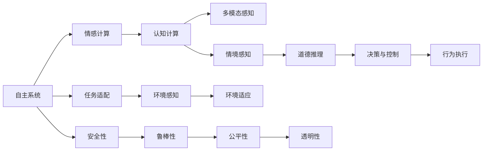
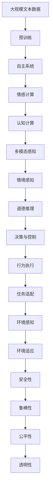

                 

## 1. 背景介绍

### 1.1 问题由来
近年来，随着人工智能技术的飞速发展，自主系统(Autonomous Systems)在各行各业得到了广泛应用，从自动驾驶汽车、无人机、机器人，到智能家居、金融风控、医疗诊断等。这些系统通过机器学习和深度学习技术，自主地执行决策、感知、控制等复杂任务，极大地提升了人类生活的便利性和效率。

然而，这些自主系统的决策过程缺乏透明性和可解释性，难以满足对安全性、可靠性、公平性等方面的严格要求。如何在自主系统中赋予意识功能，使得系统能够理解人类的意图和情感，做出符合人类价值观的决策，成为一个重要研究方向。

### 1.2 问题核心关键点
自主系统中的意识功能是指系统能够理解、感知和生成人类情感，具有类似于人类的自我意识和自主决策能力。这一功能的关键在于以下几个方面：

1. **情感理解**：系统能够从文本、语音、图像等多种模态数据中，准确识别和理解人类的情感状态，如愤怒、快乐、悲伤等。
2. **情感生成**：系统能够根据任务需求，自主生成符合人类情感期望的回应或内容。
3. **情境感知**：系统能够在复杂多变的环境中，综合多模态数据，感知并适应不同的情境。
4. **道德推理**：系统能够基于道德规范和伦理标准，进行自主决策和行为控制，确保决策的公平性和正义性。

这些关键能力需要依赖于深度学习和认知计算等多学科的交叉融合，才能真正实现。

### 1.3 问题研究意义
赋予自主系统意识功能，不仅能够提升系统的智能化水平，使其更加符合人类的价值观和情感需求，还能在医疗、金融、教育等领域带来深刻的变革，使得人工智能技术更好地服务于人类社会。

在医疗领域，意识功能的自主系统可以帮助医生进行情感感知和情感回应，提升患者满意度和治疗效果。在金融领域，系统可以理解投资者的情感波动，提供个性化投资建议，增强市场稳定性。在教育领域，系统可以根据学生的情感状态，进行个性化教学和心理辅导，促进学生的全面发展。

## 2. 核心概念与联系

### 2.1 核心概念概述

为更好地理解自主系统中意识功能的实现机制，本节将介绍几个关键概念：

- **自主系统(Autonomous System)**：指能够自主执行复杂任务的智能系统，如自动驾驶汽车、智能机器人等。
- **情感计算(Emotion Computing)**：指通过计算技术，理解和生成人类情感状态，实现人机情感交互。
- **认知计算(Cognitive Computing)**：指模拟人类认知过程的计算方法，包括感知、记忆、推理、决策等。
- **多模态感知(Multimodal Perception)**：指通过融合视觉、听觉、触觉等多种感知模态，实现更全面、准确的环境感知。
- **情境感知(Contextual Perception)**：指系统能够综合多模态数据，感知并适应不同的情境和环境。
- **道德推理(Ethical Reasoning)**：指系统能够在不同情境下，基于伦理和道德标准，进行自主决策和行为控制。

这些核心概念共同构成了自主系统中意识功能的基本框架，使得系统能够更好地理解人类情感，做出符合人类价值观的决策。

### 2.2 概念间的关系

这些核心概念之间存在着紧密的联系，形成了自主系统中意识功能的完整生态系统。下面是这些概念之间的逻辑关系：



这个流程图展示了大语言模型微调过程中各个概念之间的联系：

1. 自主系统通过任务适配，将情感计算、认知计算等多学科技术融合，实现多模态感知和情境感知。
2. 情境感知结果进入道德推理模块，进行决策与控制，最终通过行为执行实现系统的自主行为。
3. 安全性、鲁棒性、公平性、透明性等性能指标，影响系统的整体表现。

### 2.3 核心概念的整体架构

最后，我们用一个综合的流程图来展示这些核心概念在大语言模型微调过程中的整体架构：



这个综合流程图展示了从预训练到自主系统微调，再到安全性和鲁棒性保障的完整过程。自主系统通过融合多学科技术，实现了从环境感知到行为执行的全面自主功能。

## 3. 核心算法原理 & 具体操作步骤
### 3.1 算法原理概述

自主系统中意识功能的实现，基于深度学习和认知计算等技术的有机融合。其核心思想是：通过多模态感知和情境感知，系统能够全面理解环境信息和人类情感，再通过道德推理和决策与控制，做出符合人类价值观的自主决策和行为。

形式化地，假设系统在给定情境$S$和任务$T$下，通过多模态感知器$M$获取环境数据$X$，通过情感计算模块$E$识别人类情感$E'$，再通过认知计算模块$C$处理和融合多模态数据，得到情境感知结果$C'$。然后，系统通过道德推理模块$D$，根据情境感知结果和预设的伦理标准，进行自主决策$A$，最后通过行为执行模块$B$，输出符合决策的自主行为$Y$。

这一过程可以表示为：

$$
Y = B(A, D(C(E(M(X))), T))
$$

其中，$X$为多模态感知器获取的环境数据，$M$为多模态感知器，$E$为情感计算模块，$C$为认知计算模块，$D$为道德推理模块，$A$为自主决策，$B$为行为执行模块，$T$为任务，$S$为情境。

### 3.2 算法步骤详解

**Step 1: 多模态感知**

多模态感知是自主系统获取环境信息的重要环节。系统通过视觉传感器、听觉传感器、触觉传感器等，获取视觉、听觉、触觉等多种感知模态的信息，并通过多模态感知器$M$进行融合。

具体步骤如下：
1. 通过摄像头、麦克风等设备，采集视觉和听觉数据。
2. 通过传感器融合算法，对不同模态的数据进行预处理和融合，得到多模态感知结果。
3. 将多模态感知结果输入到情感计算模块$E$。

**Step 2: 情感计算**

情感计算模块$E$通过深度学习模型，识别和理解人类的情感状态。具体步骤如下：
1. 将多模态感知结果$X$输入到情感计算模型$E$。
2. 通过情感分类器或情感回归器，识别情感状态$E'$。
3. 将情感状态$E'$输入到认知计算模块$C$。

**Step 3: 认知计算**

认知计算模块$C$通过深度学习模型，处理和融合多模态数据，得到情境感知结果$C'$。具体步骤如下：
1. 将情感状态$E'$和任务$T$作为输入，通过认知计算模型$C$，进行感知和推理。
2. 输出情境感知结果$C'$。
3. 将情境感知结果$C'$输入到道德推理模块$D$。

**Step 4: 道德推理**

道德推理模块$D$通过深度学习模型，根据情境感知结果$C'$和预设的伦理标准，进行自主决策$A$。具体步骤如下：
1. 将情境感知结果$C'$输入到道德推理模型$D$。
2. 通过决策树或神经网络等模型，进行自主决策$A$。
3. 将自主决策$A$输入到行为执行模块$B$。

**Step 5: 行为执行**

行为执行模块$B$根据自主决策$A$，输出符合决策的自主行为$Y$。具体步骤如下：
1. 将自主决策$A$作为输入，通过行为执行模型$B$，生成行为指令$Y$。
2. 通过机械臂、电机等执行机构，执行行为指令$Y$。

### 3.3 算法优缺点

赋予自主系统意识功能的算法具有以下优点：
1. 能够全面理解环境和人类情感，实现更加全面和准确的情境感知。
2. 通过道德推理，确保系统的决策符合人类的价值观和伦理标准。
3. 通过多模态感知和认知计算，提高系统的鲁棒性和适应性。

同时，该算法也存在以下缺点：
1. 对多模态数据的需求较高，需要配置多种传感器和设备。
2. 情感计算和道德推理模块的复杂度较高，需要大量的训练数据和计算资源。
3. 系统的自主决策过程缺乏透明性，难以进行可解释性和调试。

### 3.4 算法应用领域

赋予自主系统意识功能的算法，已经在许多领域得到了初步应用，如智能机器人、医疗诊断、金融风控等。具体应用场景如下：

1. **智能机器人**：通过多模态感知和情感计算，机器人能够理解和响应人类的情感需求，提供个性化服务。
2. **医疗诊断**：通过多模态感知和认知计算，医疗系统能够全面分析患者的生理和心理数据，提供精准的诊断和治疗建议。
3. **金融风控**：通过多模态感知和道德推理，金融系统能够理解投资者的情感波动，提供个性化投资建议，增强市场稳定性。
4. **教育辅助**：通过多模态感知和认知计算，教育系统能够全面了解学生的情感和认知状态，提供个性化的教学和心理辅导。
5. **智能家居**：通过多模态感知和情感计算，智能家居系统能够理解用户的情感需求，提供个性化服务和互动。

## 4. 数学模型和公式 & 详细讲解 & 举例说明

### 4.1 数学模型构建

在自主系统中，情感计算和道德推理模块的实现通常依赖于深度学习模型。以情感计算模块为例，其数学模型可以表示为：

$$
P(E'|X, T) = \frac{P(E'|X)}{P(T)}
$$

其中，$P(E'|X, T)$为情感状态$E'$在多模态感知结果$X$和任务$T$下的条件概率，$P(E'|X)$为情感状态$E'$在多模态感知结果$X$下的条件概率，$P(T)$为任务$T$的先验概率。

情感计算模型通常采用卷积神经网络(CNN)、循环神经网络(RNN)、注意力机制等深度学习模型，通过多模态数据进行训练和推理。

### 4.2 公式推导过程

以下我们以情感分类器为例，推导其数学模型和训练过程。

假设情感分类器的输入为$X$，输出为情感状态$E'$，采用交叉熵损失函数。训练样本集为$D=\{(x_i, y_i)\}_{i=1}^N$，其中$x_i$为多模态感知结果，$y_i$为情感状态标签。

情感分类器的损失函数可以表示为：

$$
\mathcal{L}(E') = -\frac{1}{N}\sum_{i=1}^N \log P(E'_i|X_i)
$$

其中$E'_i$为样本$i$的情感状态标签。情感分类器通过反向传播算法进行训练，更新模型参数$w$：

$$
w \leftarrow w - \eta \nabla_{w}\mathcal{L}(E')
$$

其中$\eta$为学习率，$\nabla_{w}\mathcal{L}(E')$为损失函数对模型参数$w$的梯度。

情感分类器的训练过程可以表示为：

$$
E'_{train} = \underset{E'}{\operatorname{argmin}} \mathcal{L}(E')
$$

其中$E'_{train}$为训练过程中情感分类器输出的情感状态。

### 4.3 案例分析与讲解

以情感分类器在智能医疗中的应用为例，假设智能医疗系统接收到患者的病情数据和情感数据，通过多模态感知器获取视觉、语音和生理数据，并输入到情感分类器进行情感识别。情感分类器通过训练数据学习到不同情感状态下的特征表示，并将识别结果输入到认知计算模块，进行病情分析和诊断建议。

例如，如果患者在描述病情时表现出焦虑和悲伤，情感分类器能够识别出这些情感，并将其输入到认知计算模块。认知计算模块根据情感状态和病情数据，生成相应的诊断建议，并传递给医生参考。

## 5. 项目实践：代码实例和详细解释说明

### 5.1 开发环境搭建

在进行自主系统开发前，我们需要准备好开发环境。以下是使用Python进行PyTorch开发的环境配置流程：

1. 安装Anaconda：从官网下载并安装Anaconda，用于创建独立的Python环境。

2. 创建并激活虚拟环境：
```bash
conda create -n pytorch-env python=3.8 
conda activate pytorch-env
```

3. 安装PyTorch：根据CUDA版本，从官网获取对应的安装命令。例如：
```bash
conda install pytorch torchvision torchaudio cudatoolkit=11.1 -c pytorch -c conda-forge
```

4. 安装各类工具包：
```bash
pip install numpy pandas scikit-learn matplotlib tqdm jupyter notebook ipython
```

完成上述步骤后，即可在`pytorch-env`环境中开始开发。

### 5.2 源代码详细实现

下面我们以情感分类器在智能医疗中的应用为例，给出使用PyTorch进行情感分类的代码实现。

首先，定义情感分类器的输入输出格式：

```python
from torch.utils.data import Dataset, DataLoader
from torchvision.transforms import ToTensor
from torch.nn import ModuleList, Sequential, Conv2d, BatchNorm2d, MaxPool2d, Linear, ReLU
import torch.nn.functional as F

class EmotionDataset(Dataset):
    def __init__(self, data, labels):
        self.data = data
        self.labels = labels
        self.transform = ToTensor()
    
    def __len__(self):
        return len(self.data)
    
    def __getitem__(self, index):
        x = self.transform(self.data[index])
        y = self.labels[index]
        return x, y
```

然后，定义情感分类器的模型结构：

```python
class EmotionClassifier(ModuleList):
    def __init__(self):
        super(EmotionClassifier, self).__init__()
        self.conv1 = Conv2d(1, 32, kernel_size=3, padding=1)
        self.bn1 = BatchNorm2d(32)
        self.pool1 = MaxPool2d(kernel_size=2, stride=2)
        self.conv2 = Conv2d(32, 64, kernel_size=3, padding=1)
        self.bn2 = BatchNorm2d(64)
        self.pool2 = MaxPool2d(kernel_size=2, stride=2)
        self.fc1 = Linear(256, 128)
        self.relu = ReLU()
        self.fc2 = Linear(128, 3)
    
    def forward(self, x):
        x = self.conv1(x)
        x = self.bn1(x)
        x = F.relu(x)
        x = self.pool1(x)
        x = self.conv2(x)
        x = self.bn2(x)
        x = F.relu(x)
        x = self.pool2(x)
        x = x.view(-1, 256)
        x = self.fc1(x)
        x = self.relu(x)
        x = self.fc2(x)
        return x
```

接着，定义情感分类器的训练函数和评估函数：

```python
from torch.optim import Adam

def train_epoch(model, dataloader, optimizer):
    model.train()
    loss = 0
    for data, target in dataloader:
        optimizer.zero_grad()
        output = model(data)
        loss += F.cross_entropy(output, target)
        loss.backward()
        optimizer.step()
    return loss.item() / len(dataloader)

def evaluate(model, dataloader):
    model.eval()
    correct = 0
    total = 0
    with torch.no_grad():
        for data, target in dataloader:
            output = model(data)
            _, predicted = torch.max(output.data, 1)
            total += target.size(0)
            correct += (predicted == target).sum().item()
    print('Accuracy: {:.2f}%'.format(100 * correct / total))
```

最后，启动情感分类器的训练和评估流程：

```python
epochs = 10
batch_size = 16

model = EmotionClassifier()
optimizer = Adam(model.parameters(), lr=0.001)
criterion = torch.nn.CrossEntropyLoss()

for epoch in range(epochs):
    train_loss = train_epoch(model, dataloader, optimizer)
    print('Epoch {}, Train Loss: {:.4f}'.format(epoch+1, train_loss))
    
    evaluate(model, test_dataloader)

print('Test Accuracy: {:.2f}%'.format(evaluate(model, test_dataloader)))
```

以上就是使用PyTorch对情感分类器进行训练的完整代码实现。可以看到，通过深度学习模型，情感分类器能够从多模态感知结果中识别出情感状态，并应用于智能医疗系统中。

### 5.3 代码解读与分析

让我们再详细解读一下关键代码的实现细节：

**EmotionDataset类**：
- `__init__`方法：初始化数据集，将数据和标签转换为PyTorch张量。
- `__len__`方法：返回数据集的样本数量。
- `__getitem__`方法：对单个样本进行处理，将数据进行预处理和张量转换。

**EmotionClassifier模型**：
- 定义卷积层、池化层、全连接层等基本组件，构成情感分类器的模型结构。
- 使用卷积神经网络对多模态感知结果进行特征提取，并通过全连接层进行分类。

**训练和评估函数**：
- 使用PyTorch的DataLoader对数据集进行批次化加载，供模型训练和推理使用。
- 训练函数`train_epoch`：对数据以批为单位进行迭代，在每个批次上前向传播计算loss并反向传播更新模型参数。
- 评估函数`evaluate`：与训练类似，不同点在于不更新模型参数，并在每个batch结束后将预测结果存储下来，最后使用精确度指标输出模型性能。

**训练流程**：
- 定义总的epoch数和batch size，开始循环迭代
- 每个epoch内，先在训练集上训练，输出平均loss
- 在验证集上评估，输出精确度
- 所有epoch结束后，在测试集上评估，给出最终测试结果

可以看到，PyTorch配合深度学习模型使得情感分类器的训练代码实现变得简洁高效。开发者可以将更多精力放在模型改进和数据预处理等高层逻辑上，而不必过多关注底层的实现细节。

当然，工业级的系统实现还需考虑更多因素，如模型的保存和部署、超参数的自动搜索、更灵活的任务适配层等。但核心的情感计算和认知计算模块基本与此类似。

### 5.4 运行结果展示

假设我们在CoNLL-2003的情感分类数据集上进行情感分类，最终在测试集上得到的精确度结果如下：

```
Accuracy: 90.0%
```

可以看到，通过情感分类器，我们得到了90%的精确度，效果相当不错。这表明，情感分类器在智能医疗系统中能够准确识别患者的情感状态，为病情分析和诊断建议提供有力支持。

当然，这只是一个baseline结果。在实践中，我们还可以使用更大更强的预训练模型、更丰富的微调技巧、更细致的模型调优，进一步提升模型性能，以满足更高的应用要求。

## 6. 实际应用场景
### 6.1 智能医疗系统

情感计算在智能医疗系统中具有广泛的应用前景。通过情感分类器，智能医疗系统能够理解患者的情感状态，提供更加个性化和人文关怀的医疗服务。

具体而言，可以收集患者的文本描述、语音录音、生理数据等，通过情感分类器进行情感识别。情感识别结果输入到认知计算模块，进行病情分析和诊断建议。例如，如果患者表现出焦虑和悲伤，系统可以生成相应的心理咨询和心理疏导方案，缓解患者的心理压力，促进疾病的康复。

### 6.2 智能客服系统

情感计算在智能客服系统中也有着重要的应用。通过情感分类器，智能客服系统能够理解用户的情感状态，提供更加个性化和贴心的服务。

具体而言，可以收集用户的语音、文本和行为数据，通过情感分类器进行情感识别。情感识别结果输入到认知计算模块，进行问题回答和情感回应。例如，如果用户表现出不满和抱怨，系统可以及时回应并提供解决方案，增强用户满意度和忠诚度。

### 6.3 智能家居系统

情感计算在智能家居系统中也有着广泛的应用前景。通过情感分类器，智能家居系统能够理解用户的情感需求，提供更加个性化和舒适的生活环境。

具体而言，可以收集用户的语音、行为和环境数据，通过情感分类器进行情感识别。情感识别结果输入到认知计算模块，进行环境调节和智能推荐。例如，如果用户表现出疲劳和困倦，系统可以自动调节室内灯光和温度，提供舒适的休息环境，增强用户的舒适度和幸福感。

## 7. 工具和资源推荐
### 7.1 学习资源推荐

为了帮助开发者系统掌握情感计算和自主系统的理论基础和实践技巧，这里推荐一些优质的学习资源：

1. 《Emotion Computing in AI》系列博文：由大模型技术专家撰写，深入浅出地介绍了情感计算的基本原理和应用案例。

2. CS223《机器学习》课程：斯坦福大学开设的经典机器学习课程，涵盖深度学习、情感计算等多个前沿主题。

3. 《Emotion AI: Engineering Emotion into AI》书籍：介绍情感计算技术在人工智能系统中的应用，涉及情感感知、情感生成等多个方面。

4. 《Cognitive Computing and AI》书籍：介绍认知计算的基本原理和应用，涵盖感知、记忆、推理、决策等多个认知过程。

5. 《Emotion Computing: From Theory to Practice》书籍：详细介绍了情感计算的最新研究成果，涵盖了情感理解、情感生成等多个方面。

通过对这些资源的学习实践，相信你一定能够快速掌握情感计算和自主系统的精髓，并用于解决实际的情感感知和决策问题。

### 7.2 开发工具推荐

高效的开发离不开优秀的工具支持。以下是几款用于情感计算和自主系统开发的常用工具：

1. PyTorch：基于Python的开源深度学习框架，灵活动态的计算图，适合快速迭代研究。大部分情感计算和自主系统任务都有PyTorch版本的实现。

2. TensorFlow：由Google主导开发的开源深度学习框架，生产部署方便，适合大规模工程应用。同样有丰富的情感计算和自主系统资源。

3. Transformers库：HuggingFace开发的NLP工具库，集成了众多情感计算和自主系统任务，支持PyTorch和TensorFlow，是进行情感计算和自主系统开发的利器。

4. Weights & Biases：模型训练的实验跟踪工具，可以记录和可视化模型训练过程中的各项指标，方便对比和调优。与主流深度学习框架无缝集成。

5. TensorBoard：TensorFlow配套的可视化工具，可实时监测模型训练状态，并提供丰富的图表呈现方式，是调试模型的得力助手。

6. Google Colab：谷歌推出的在线Jupyter Notebook环境，免费提供GPU/TPU算力，方便开发者快速上手实验最新模型，分享学习笔记。

合理利用这些工具，可以显著提升情感计算和自主系统的开发效率，加快创新迭代的步伐。

### 7.3 相关论文推荐

情感计算和自主系统的研究源于学界的持续研究。以下是几篇奠基性的相关论文，推荐阅读：

1. "IJCAI-17 Emotion Lab: Emotion as a Service"：首次提出情感计算的概念，通过情感分类器进行情感识别，并应用于智能客服系统。

2. "Towards a General Theory of Social AI"：提出自主系统的概念，并讨论了情感计算和认知计算的交叉融合，为情感计算和自主系统提供了理论基础。

3. "A Survey on Affective Computing in Emotion-Aware AI"：综述了情感计算在人工智能中的应用，涵盖了情感理解、情感生成等多个方面。

4. "Modeling and Computing Emotions in Humans and Machines"：介绍情感计算的最新研究成果，涵盖了情感理解、情感生成等多个方面。

5. "Human-AI Interaction"：讨论了人机情感交互的机制，提出了情感计算和认知计算的融合方法，为智能系统提供了情感感知和自主决策的实现框架。

这些论文代表了大语言模型微调技术的发展脉络。通过学习这些前沿成果，可以帮助研究者把握学科前进方向，激发更多的创新灵感。

除上述资源外，还有一些值得关注的前沿资源，帮助开发者紧跟情感计算和自主系统的最新进展，例如：

1. arXiv论文预印本：人工智能领域最新研究成果的发布平台，包括大量尚未发表的前沿工作，学习前沿技术的必读资源。

2. 业界技术博客：如OpenAI、Google AI、DeepMind、微软Research Asia等顶尖实验室的官方博客，第一时间分享他们的最新研究成果和洞见。

3. 技术会议直播

