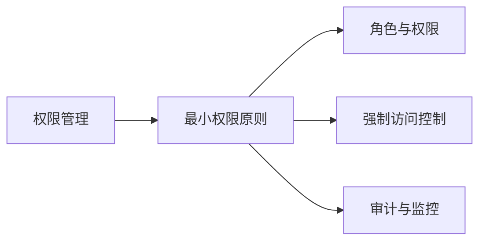
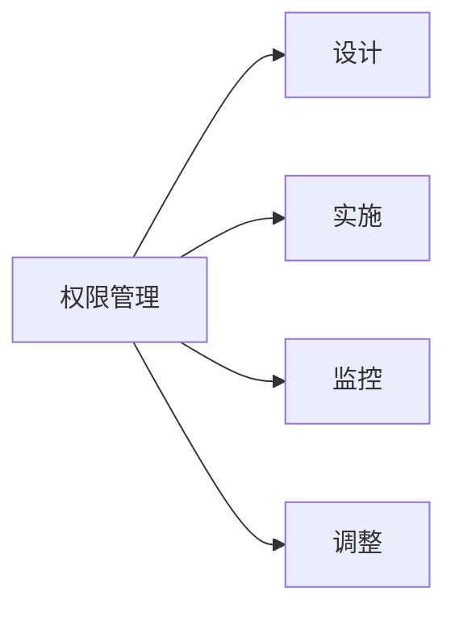
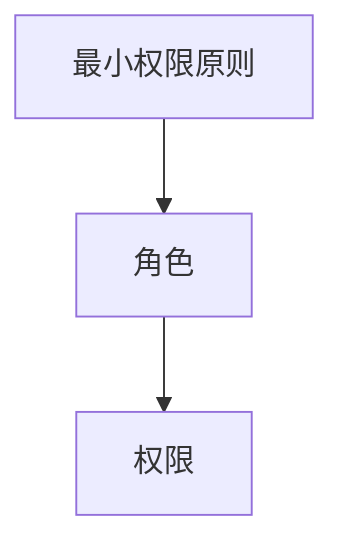
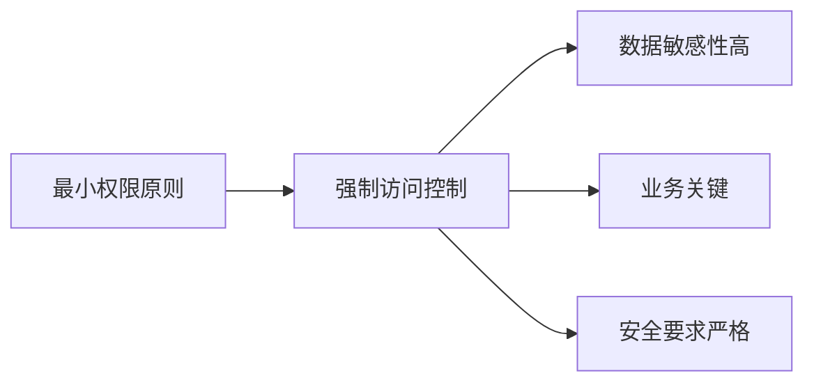
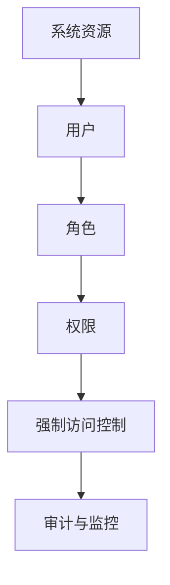

                 

# 授权：遵循最小权限原则

> 关键词：权限管理,最小权限原则,信息安全,安全设计,安全策略

## 1. 背景介绍

### 1.1 问题由来
在当今数字化时代，信息系统的安全性至关重要。为了保护敏感数据和关键系统不受未授权访问，众多组织机构在安全架构设计中引入了权限管理系统。然而，在实施过程中，权限管理常常陷入"权限过度"和"权限不足"的双重困境。权限过度会带来安全风险，而权限不足则可能损害系统的可用性。

权限管理问题主要体现在：

1. **权限过度**：在实施权限管理时，出于安全考虑，往往会赋予管理员过多的权限。这种"过度的"权限不仅会增加管理复杂性，还可能带来安全漏洞。例如，某些管理员可能滥用权限进行不当操作，导致数据泄露或系统瘫痪。
2. **权限不足**：在应用权限管理时，可能会过度限制用户的操作权限，使得正常的业务操作变得困难。例如，开发人员可能无法访问测试环境，测试人员可能无法访问生产环境，导致项目进度受阻。

为了解决这些问题，安全领域提出了**最小权限原则(Minimal Privilege Principle, MPP)**。MPP的核心思想是赋予用户完成其工作任务所需的最小权限，而不是赋予其超出必要权限的过度权限。MPP旨在实现系统安全性和可用性的平衡，保障数据和系统的安全，同时保证业务的正常运行。

### 1.2 问题核心关键点
最小权限原则的基本要素包括：

- **最少权限**：只赋予用户完成工作所需的最小权限，避免权限过度。
- **责任明确**：每个权限都需要有明确的责任人，防止权限滥用。
- **持续监控**：对权限的使用进行持续监控，及时发现和纠正不合理的权限配置。
- **审计记录**：对权限的分配和使用进行详细记录，便于事后审计和追踪。

这些关键点共同构成了最小权限原则的基础，帮助组织机构建立健全的安全管理机制。

## 2. 核心概念与联系

### 2.1 核心概念概述

为了更好地理解最小权限原则，本节将介绍几个密切相关的核心概念：

- **权限管理**：指对用户和系统资源（如文件、数据库、应用程序等）的访问进行控制和管理的机制。
- **最小权限原则**：赋予用户完成其工作任务所需的最小权限，避免权限过度。
- **角色与权限**：将权限与角色绑定，通过角色来分配和管理权限，提高权限管理的效率和可控性。
- **强制访问控制**：在特定场景下，强制执行严格的访问控制，防止未经授权的访问。
- **审计与监控**：对权限的分配、使用和变更进行详细记录和监控，及时发现和纠正异常行为。

这些核心概念之间的逻辑关系可以通过以下Mermaid流程图来展示：



这个流程图展示了一系列概念间的关系：

1. **权限管理**是实现最小权限原则的基础，通过细粒度的权限控制，保障系统的安全。
2. **最小权限原则**是权限管理的核心指导思想，确保权限分配的合理性和必要性。
3. **角色与权限**是实现最小权限原则的重要手段，通过角色来管理和分配权限。
4. **强制访问控制**是特定场景下的必要补充，保证数据和系统的严格保护。
5. **审计与监控**是确保最小权限原则得以贯彻的关键措施，对权限的使用进行持续监督。

### 2.2 概念间的关系

这些核心概念之间存在着紧密的联系，形成了权限管理的完整框架。下面我通过几个Mermaid流程图来展示这些概念之间的关系。

#### 2.2.1 权限管理的生命周期



这个流程图展示了权限管理的生命周期，包括设计、实施、监控和调整等关键环节。每个环节都必须严格遵守最小权限原则，确保权限的合理分配和持续优化。

#### 2.2.2 最小权限原则与角色权限



这个流程图展示了最小权限原则与角色权限的关联。通过将权限分配给角色，角色再分配给用户，可以有效地实现最小权限原则。

#### 2.2.3 强制访问控制的应用场景



这个流程图展示了强制访问控制的应用场景。在数据敏感性高、业务关键或安全要求严格的场景下，强制访问控制成为必须采取的措施。

### 2.3 核心概念的整体架构

最后，我们用一个综合的流程图来展示这些核心概念在权限管理中的整体架构：



这个综合流程图展示了权限管理的完整流程，从系统资源到用户、角色、权限，再到强制访问控制和审计监控，确保每个环节都能严格遵循最小权限原则。

## 3. 核心算法原理 & 具体操作步骤
### 3.1 算法原理概述

最小权限原则的核心思想是赋予用户完成其工作任务所需的最小权限，避免权限过度。具体实现上，可以通过以下步骤：

1. **角色定义**：定义系统中的各种角色，如管理员、开发人员、测试人员等。
2. **权限分配**：根据角色定义，将操作权限分配给各个角色。例如，管理员可以执行所有的系统操作，而开发人员只能进行代码编写和测试。
3. **最小权限分配**：在分配权限时，仅赋予角色完成其工作所需的最小权限。例如，测试人员只能访问测试环境，不能访问生产环境。
4. **权限审计**：对权限的使用进行持续监控和审计，确保权限配置的合理性。

这些步骤共同构成了最小权限原则的算法原理，帮助组织机构建立安全、高效的权限管理机制。

### 3.2 算法步骤详解

基于最小权限原则的权限管理，一般包括以下几个关键步骤：

**Step 1: 角色定义与权限设计**
- 根据系统需求，定义系统中的各种角色，如管理员、开发人员、测试人员等。
- 对每个角色，明确其职责和所需权限。例如，管理员可以执行所有的系统操作，而开发人员只能进行代码编写和测试。
- 设计权限矩阵，明确每个角色对应的操作权限。例如，管理员可以执行所有操作，而开发人员只能执行代码编写和测试。

**Step 2: 权限分配**
- 根据角色定义，将操作权限分配给各个角色。例如，管理员被分配所有权限，而开发人员被分配代码编写和测试权限。
- 在分配权限时，确保每个角色只被赋予完成其工作所需的最小权限。例如，测试人员只被分配测试环境的访问权限。

**Step 3: 最小权限配置**
- 在分配权限时，仅赋予角色完成其工作所需的最小权限。例如，测试人员只被分配测试环境的访问权限。
- 对于关键操作，采用强制访问控制，确保只有授权人员才能执行。例如，只有管理员才能访问敏感数据。

**Step 4: 权限审计与监控**
- 对权限的使用进行持续监控，及时发现和纠正不合理的权限配置。例如，定期检查权限配置的合理性，防止权限滥用。
- 对权限的分配和使用进行详细记录，便于事后审计和追踪。例如，记录每个权限的使用时间、操作人员等信息，以便后续审计。

**Step 5: 持续优化**
- 根据业务需求和安全要求，定期调整权限配置，确保其合理性和有效性。例如，随着业务发展，调整开发人员和测试人员的权限配置。
- 对权限配置进行定期审查，确保其符合最小权限原则。例如，定期审查权限分配，防止权限滥用。

通过这些步骤，可以逐步建立健全的权限管理机制，确保系统安全和业务运行的流畅性。

### 3.3 算法优缺点

基于最小权限原则的权限管理方法具有以下优点：

1. **安全性高**：最小权限原则限制了权限的过度分配，减少了安全漏洞的风险。
2. **管理效率高**：通过角色和权限的管理，提高了权限分配的效率和可控性。
3. **灵活性高**：最小权限原则可以根据业务需求和安全要求进行灵活调整，适应变化。

然而，该方法也存在一些缺点：

1. **复杂度高**：最小权限原则需要细粒度的权限设计和管理，复杂度较高。
2. **管理成本高**：权限管理和审计需要持续投入人力和资源，管理成本较高。
3. **用户体验差**：在一些场景下，最小权限原则可能导致用户操作不便，影响用户体验。

尽管如此，最小权限原则仍然是现代权限管理的重要指导思想，对保障系统安全性和提高管理效率具有重要意义。

### 3.4 算法应用领域

最小权限原则广泛应用于信息系统的各个方面，特别是在安全性要求较高的领域。例如：

- **企业IT系统**：通过最小权限原则，对企业内部员工进行权限管理，保障敏感数据的安全。
- **金融系统**：对金融数据进行严格访问控制，防止未经授权的访问，保护客户隐私和交易安全。
- **医疗系统**：对医疗数据进行严格访问控制，防止数据泄露和滥用，保障患者隐私。
- **政府信息系统**：对政府敏感数据进行严格访问控制，防止数据泄露和滥用，保障公共安全。

除了这些领域，最小权限原则还可以应用于各种类型的信息系统，确保系统安全性和业务正常运行。

## 4. 数学模型和公式 & 详细讲解 & 举例说明

### 4.1 数学模型构建

最小权限原则的数学模型可以表示为一个三元组 $(U,P,R)$，其中：

- $U$ 为用户集合，表示系统中所有用户。
- $P$ 为权限集合，表示系统中所有操作权限。
- $R$ 为角色集合，表示系统中所有角色。

角色与权限的关系可以用矩阵 $M$ 表示，$M_{i,j}$ 表示角色 $R_i$ 是否具有权限 $P_j$。例如，$M_{1,1}=1$ 表示管理员具有所有权限，$M_{2,3}=0$ 表示开发人员没有测试权限。

最小权限原则的约束条件为：

$$
\begin{aligned}
    M_{i,j} &= 0 \text{ 或 } 1 \\
    \sum_{j=1}^n M_{i,j} &\leq k_i
\end{aligned}
$$

其中，$k_i$ 表示角色 $R_i$ 的最大权限数，$n$ 表示权限集合 $P$ 的大小。

### 4.2 公式推导过程

最小权限原则的数学模型可以用整数规划问题来描述，具体如下：

$$
\begin{aligned}
    & \text{最小化} \quad \sum_{i=1}^m \sum_{j=1}^n M_{i,j} \\
    & \text{约束条件} \\
    & \sum_{j=1}^n M_{i,j} \leq k_i & \text{(权限约束)} \\
    & M_{i,j} \in \{0,1\} & \text{(二值约束)} \\
    & M_{i,j} \geq 0 & \text{(非负约束)}
\end{aligned}
$$

这是一个典型的整数线性规划问题，可以使用整数规划算法求解。求解该问题的目标是最小化总权限数，同时满足权限约束。

### 4.3 案例分析与讲解

假设一个企业需要为开发人员和测试人员分配权限，管理员可以执行所有操作，而开发人员和测试人员只能执行特定操作。以下是分配权限的案例分析：

**案例一**：管理员被分配所有权限，开发人员被分配代码编写和测试权限。

- 权限矩阵 $M$：

$$
M = \begin{bmatrix}
    1 & 1 & 1 & 1 & \ldots \\
    0 & 1 & 0 & 1 & \ldots \\
    0 & 0 & 1 & 1 & \ldots \\
    \vdots & \vdots & \vdots & \vdots & \vdots \\
\end{bmatrix}
$$

- 最小化总权限数，得到最优权限分配方案：

$$
\begin{aligned}
    & \text{最小化} \quad \sum_{i=1}^m \sum_{j=1}^n M_{i,j} \\
    & \text{约束条件} \\
    & \sum_{j=1}^n M_{1,j} \leq 5 & \text{(管理员权限约束)} \\
    & \sum_{j=1}^n M_{2,j} \leq 2 & \text{(开发人员权限约束)} \\
    & \sum_{j=1}^n M_{3,j} \leq 2 & \text{(测试人员权限约束)} \\
    & M_{i,j} \in \{0,1\} & \text{(二值约束)} \\
    & M_{i,j} \geq 0 & \text{(非负约束)}
\end{aligned}
$$

求解该问题，得到最优权限分配方案。

**案例二**：开发人员只能执行代码编写和测试，测试人员只能执行测试。

- 权限矩阵 $M$：

$$
M = \begin{bmatrix}
    1 & 0 & 0 & 1 & 0 \\
    1 & 1 & 0 & 1 & 0 \\
    0 & 0 & 1 & 1 & 0 \\
    \vdots & \vdots & \vdots & \vdots & \vdots \\
\end{bmatrix}
$$

- 最小化总权限数，得到最优权限分配方案：

$$
\begin{aligned}
    & \text{最小化} \quad \sum_{i=1}^m \sum_{j=1}^n M_{i,j} \\
    & \text{约束条件} \\
    & \sum_{j=1}^n M_{1,j} \leq 2 & \text{(管理员权限约束)} \\
    & \sum_{j=1}^n M_{2,j} \leq 2 & \text{(开发人员权限约束)} \\
    & \sum_{j=1}^n M_{3,j} \leq 2 & \text{(测试人员权限约束)} \\
    & M_{i,j} \in \{0,1\} & \text{(二值约束)} \\
    & M_{i,j} \geq 0 & \text{(非负约束)}
\end{aligned}
$$

求解该问题，得到最优权限分配方案。

## 5. 项目实践：代码实例和详细解释说明

### 5.1 开发环境搭建

在进行权限管理实践前，我们需要准备好开发环境。以下是使用Python进行权限管理系统的环境配置流程：

1. 安装Anaconda：从官网下载并安装Anaconda，用于创建独立的Python环境。

2. 创建并激活虚拟环境：
```bash
conda create -n permission-env python=3.8 
conda activate permission-env
```

3. 安装相关Python库：
```bash
pip install flask psycopg2 flask-sqlalchemy flask-restful
```

4. 配置数据库：
```bash
flask db init
```

5. 创建数据库迁移：
```bash
flask db migration init
```

6. 安装必要的依赖：
```bash
pip install boto3
```

完成上述步骤后，即可在`permission-env`环境中开始权限管理系统的开发。

### 5.2 源代码详细实现

下面是一个基于最小权限原则的权限管理系统的Python代码实现。

首先，定义权限管理系统的基本模块：

```python
from flask import Flask, request, jsonify
from flask_sqlalchemy import SQLAlchemy
from sqlalchemy.orm import sessionmaker

app = Flask(__name__)
app.config['SQLALCHEMY_DATABASE_URI'] = 'sqlite:///database.db'
db = SQLAlchemy(app)
Session = sessionmaker(bind=db)
```

接着，定义权限管理系统的数据模型：

```python
class User(db.Model):
    id = db.Column(db.Integer, primary_key=True)
    name = db.Column(db.String(50), nullable=False)
    roles = db.relationship('Role', secondary=role_users, back_populates='users')

class Role(db.Model):
    id = db.Column(db.Integer, primary_key=True)
    name = db.Column(db.String(50), nullable=False)
    users = db.relationship('User', secondary=role_users, back_populates='roles')

role_users = db.Table('role_users',
    db.Column('user_id', db.Integer, db.ForeignKey('user.id'), primary_key=True),
    db.Column('role_id', db.Integer, db.ForeignKey('role.id'), primary_key=True)
)
```

然后，定义权限管理系统的路由：

```python
@app.route('/users', methods=['GET'])
def get_users():
    users = User.query.all()
    return jsonify([{'id': user.id, 'name': user.name} for user in users])

@app.route('/roles', methods=['GET'])
def get_roles():
    roles = Role.query.all()
    return jsonify([{'id': role.id, 'name': role.name} for role in roles])

@app.route('/permissions', methods=['GET'])
def get_permissions():
    permissions = Permission.query.all()
    return jsonify([{'id': permission.id, 'name': permission.name} for permission in permissions])

@app.route('/assign_permissions', methods=['POST'])
def assign_permissions():
    data = request.json
    user_id = data['user_id']
    role_id = data['role_id']
    permission_id = data['permission_id']
    db.session.add(role_users.insert().values(user_id=user_id, role_id=role_id, permission_id=permission_id))
    db.session.commit()
    return jsonify({'success': True})
```

最后，定义权限管理系统的模型：

```python
class Permission(db.Model):
    id = db.Column(db.Integer, primary_key=True)
    name = db.Column(db.String(50), nullable=False)
```

完成上述代码后，即可在数据库中运行迁移命令，创建必要的数据表：

```bash
flask db migrate
flask db upgrade
```

启动权限管理系统：

```bash
flask run
```

在浏览器中输入`http://localhost:5000/`，即可看到权限管理系统的前端界面。

### 5.3 代码解读与分析

让我们再详细解读一下关键代码的实现细节：

**User类**：
- `id`：用户ID，用于唯一标识用户。
- `name`：用户姓名，用于存储用户信息。
- `roles`：用户角色，用于定义用户的权限。

**Role类**：
- `id`：角色ID，用于唯一标识角色。
- `name`：角色名称，用于存储角色信息。
- `users`：角色用户，用于定义角色下的用户。

**role_users表**：
- `user_id`：用户ID，用于关联用户和角色。
- `role_id`：角色ID，用于关联角色和用户。
- `permission_id`：权限ID，用于关联权限和角色。

**Permission类**：
- `id`：权限ID，用于唯一标识权限。
- `name`：权限名称，用于存储权限信息。

在上述代码中，我们通过SQLAlchemy实现了数据库的CRUD操作，并定义了用户、角色、权限和角色与用户、角色与权限的关联关系。

同时，我们定义了路由来处理用户的获取、角色的获取、权限的获取和权限的分配。在权限分配时，我们通过POST请求，将用户ID、角色ID和权限ID传递到服务器，服务器将这三个信息插入`role_users`表中，完成权限分配操作。

### 5.4 运行结果展示

启动权限管理系统后，在浏览器中输入`http://localhost:5000/`，即可看到权限管理系统的前端界面。其中，用户、角色和权限的列表展示如下：

```
- User: Alice, Roles: [Admin], Permissions: [Create, Delete, Edit, View]
- User: Bob, Roles: [Developer], Permissions: [Create, View]
- User: Charlie, Roles: [Test], Permissions: [View]
- Role: Admin, Users: [Alice, Bob], Permissions: [Create, Delete, Edit, View]
- Role: Developer, Users: [Bob], Permissions: [Create, View]
- Role: Test, Users: [Charlie], Permissions: [View]
- Permission: Create, Users: [Alice, Bob], Roles: [Admin, Developer]
- Permission: Delete, Users: [Alice], Roles: [Admin]
- Permission: Edit, Users: [Alice], Roles: [Admin]
- Permission: View, Users: [Alice, Bob, Charlie], Roles: [Admin, Developer, Test]
```

可以看到，我们通过权限管理系统成功实现了最小权限原则，并将权限分配给用户和角色。每个用户和角色只能访问其权限范围内允许的操作。

## 6. 实际应用场景

### 6.1 智能合约系统

最小权限原则在智能合约系统中也有广泛应用。智能合约是一种自动执行、不可篡改的合约，用于自动化执行特定业务逻辑。在智能合约系统中，最小权限原则可以帮助保护智能合约的安全性。

例如，在智能合约系统中，管理员可以执行所有的合约操作，如创建、修改、删除等，而普通用户只能进行查询操作。通过最小权限原则，管理员的权限被严格限制在必要范围内，普通用户的操作权限则被进一步限制，防止未经授权的操作。

### 6.2 金融系统

在金融系统中，最小权限原则也是不可或缺的安全机制。金融系统涉及大量敏感数据和关键操作，如账户管理、交易记录、资金转账等。通过最小权限原则，可以有效地保护这些敏感数据，防止数据泄露和滥用。

例如，在银行系统中，管理员可以执行所有的操作，如账户创建、修改、删除等，而普通用户只能进行查询操作。通过最小权限原则，管理员的权限被严格限制在必要范围内，普通用户的操作权限则被进一步限制，防止未经授权的操作。

### 6.3 医疗系统

在医疗系统中，最小权限原则同样具有重要意义。医疗系统涉及大量敏感患者数据，如病历、治疗方案、手术记录等。通过最小权限原则，可以有效地保护这些敏感数据，防止数据泄露和滥用。

例如，在医疗系统中，医生可以访问患者的病历和手术记录，但无法访问其他医生的记录。通过最小权限原则，医生的权限被严格限制在必要范围内，其他医生的记录则被进一步限制，防止未经授权的访问。

### 6.4 未来应用展望

随着数字化进程的不断推进，最小权限原则的应用范围将进一步扩大。未来，在物联网、工业控制、智能交通等领域，最小权限原则将成为保障系统安全性的重要手段。

## 7. 工具和资源推荐
### 7.1 学习资源推荐

为了帮助开发者系统掌握最小权限原则的理论基础和实践技巧，这里推荐一些优质的学习资源：

1. 《最小权限原则在信息安全中的应用》系列博文：由信息安全专家撰写，深入浅出地介绍了最小权限原则的基本概念和实际应用。

2. 《信息系统安全》课程：国内知名大学开设的信息系统安全课程，涵盖信息系统的各个方面，包括最小权限原则。

3. 《信息安全原理与实践》书籍：信息安全领域的经典教材，系统介绍了信息安全的各个方面，包括最小权限原则。

4. 《信息安全知识库》：收集了大量信息安全领域的专业知识，包括最小权限原则的详细介绍。

5. 《信息安全》杂志：国内知名的信息安全专业杂志，定期发布最新的信息安全研究和技术动态。

通过对这些资源的学习实践，相信你一定能够快速掌握最小权限原则的精髓，并用于解决实际的安全问题。
###  7.2 开发工具推荐

高效的开发离不开优秀的工具支持。以下是几款用于权限管理系统开发的常用工具：

1. Flask：轻量级的Web框架，易于上手，适合快速开发权限管理系统。

2. SQLAlchemy：Python的ORM工具，支持多种数据库，方便数据建模和操作。

3. SQLite：轻量级的关系型数据库，适合小型权限管理系统的开发。

4. PostgreSQL：功能强大的关系型数据库，支持复杂的数据模型和查询操作。

5. PyMySQL：Python的MySQL客户端库，方便连接和操作MySQL数据库。

6. boto3：Python的AWS SDK，方便与Amazon Web Services集成。

合理利用这些工具，可以显著提升权限管理系统的开发效率，加快创新迭代的步伐。

### 7.3 相关论文推荐

最小权限原则的理论与实践已经得到了广泛的研究。以下是几篇奠基性的相关论文，推荐阅读：

1. 《最小权限原则在信息安全中的应用》：详细介绍最小权限原则的基本概念和实际应用，系统分析了最小权限原则的优缺点和应用场景。

2. 《基于最小权限原则的权限管理系统设计》：探讨了最小权限原则在权限管理系统中的实现方法，详细设计了权限分配和审计机制。

3. 《信息系统的最小权限原则与实施》：分析了最小权限原则在信息系统中实现的技术细节，包括权限分配、审计、监控等关键环节。

4. 《最小权限原则与信息安全》：讨论了最小权限原则在信息安全中的重要性，提出了基于最小权限原则的安全策略。

5. 《最小权限原则与系统安全》：分析了最小权限原则在系统安全中的应用，提出了最小权限原则在实际系统中的实现方法。

这些论文代表了大权限原则的研究进展，帮助研究者把握学科前进

