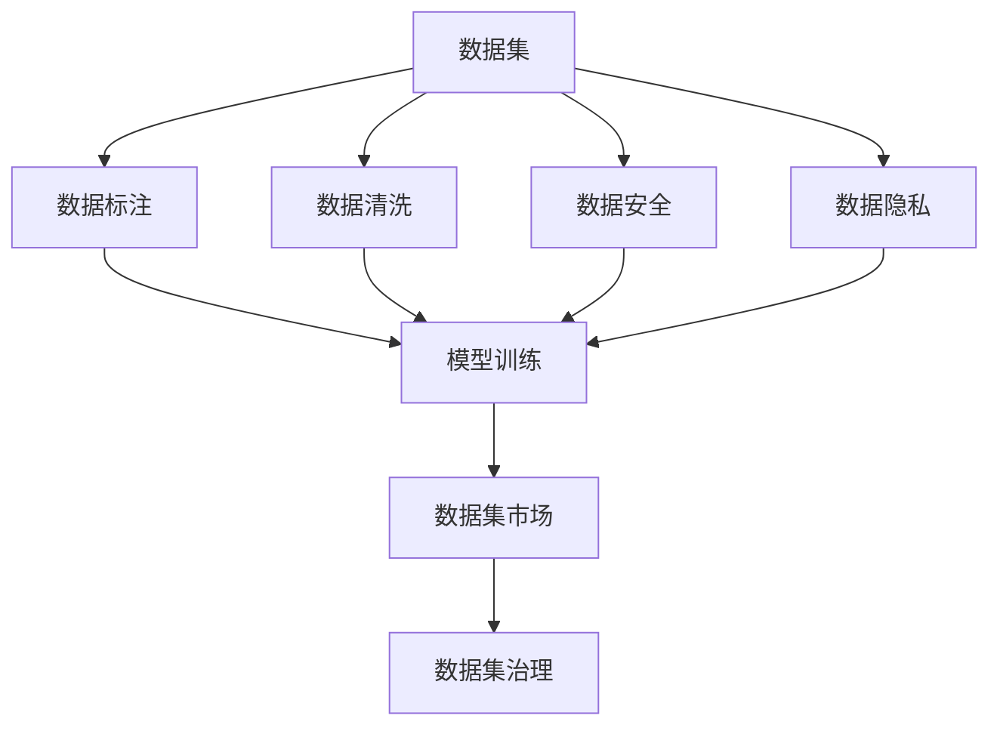

                 

# 数据集市场监管:数据交易的新型规则体系

> 关键词：数据集市场, 数据交易, 隐私保护, 数据安全, 新型规则体系, 数据治理

## 1. 背景介绍

### 1.1 问题由来

在过去的几年里，随着人工智能和机器学习技术的快速发展，数据集作为模型训练和预测的核心要素，其重要性愈发凸显。然而，数据集的获取和使用常常伴随着一系列复杂的法律、伦理和隐私问题。这些问题的复杂性要求构建一套全面的监管规则体系，以确保数据集的交易和使用合法合规，同时保护数据主体的隐私权益，促进数据集的合理利用和流通。

### 1.2 问题核心关键点

构建数据集市场监管规则体系，其核心在于：
- 定义数据集的基本要素，包括数据集的来源、类型、使用目的等。
- 建立数据集的标注、清洗、处理和标记等流程标准。
- 确立数据集的交易规则，包括数据集的定价机制、交易平台、交易监管等。
- 明确数据集隐私保护和数据安全的要求，确保数据集交易过程中数据主体的权益不受侵害。
- 建立数据集的溯源和审计机制，确保数据集的真实性和透明性。

### 1.3 问题研究意义

构建数据集市场监管规则体系具有重要意义：
1. 保障数据安全。通过规范数据集的获取和使用，减少数据泄露和滥用的风险。
2. 保护数据主体的权益。确保数据主体的隐私和数据权利得到充分保护。
3. 促进数据资源的合理流通。建立透明的数据集市场，促进数据资源的共享和利用。
4. 推动数据市场的健康发展。规范数据集的交易行为，促进数据市场的健康、有序发展。
5. 助力人工智能技术的落地应用。良好的数据集市场环境，有助于加速人工智能技术的创新和应用。

## 2. 核心概念与联系

### 2.1 核心概念概述

为了更好地理解数据集市场监管规则体系的构建，本节将介绍几个密切相关的核心概念：

- 数据集（Dataset）：由一组有序的数据项组成的集合，数据项可以是文本、图像、声音、数值等多种类型。数据集是人工智能和机器学习模型训练的基础。
- 数据标注（Data Annotation）：对数据集中的数据项进行人工标注，如分类、标记、注释等，以便模型训练和预测。
- 数据清洗（Data Cleaning）：对数据集中的噪声、缺失值等进行处理，提高数据集的质量和可用性。
- 数据安全（Data Security）：保护数据集不被未授权访问、篡改和泄露，确保数据集的安全性。
- 数据隐私（Data Privacy）：保护数据主体的隐私权益，避免数据被滥用和泄露。
- 数据集市场（Dataset Market）：交易和流通数据集的平台或机制。
- 数据集治理（Dataset Governance）：对数据集进行管理、监督和维护的制度和规则。

这些概念之间的逻辑关系可以通过以下Mermaid流程图来展示：



这个流程图展示了数据集从原始数据到训练模型的完整流程，以及各个环节所涉及的关键概念。

### 2.2 概念间的关系

这些核心概念之间存在着紧密的联系，构成了数据集市场监管规则体系的基础：

- 数据集是数据集市场监管的核心对象。数据集的来源、类型、使用目的等特性，决定了其在市场中的价值和流通方式。
- 数据标注和数据清洗直接影响数据集的质量和可用性，进而影响模型的训练效果。
- 数据安全与数据隐私紧密相关，数据集的流通和使用过程中，必须确保数据不被泄露或滥用。
- 数据集市场是数据集流通的媒介，其交易规则和平台监管，直接影响数据集的获取和使用效率。
- 数据集治理则是对数据集市场进行管理、监督和维护的制度和规则，是数据集流通的保障。

## 3. 核心算法原理 & 具体操作步骤

### 3.1 算法原理概述

构建数据集市场监管规则体系，其核心算法原理主要包括以下几个方面：

- 数据集元数据标准化。定义数据集的基本要素，包括数据集的来源、类型、使用目的等。
- 数据集质量控制。建立数据集的标注、清洗、处理和标记等流程标准。
- 数据集交易规则制定。确立数据集的交易规则，包括数据集的定价机制、交易平台、交易监管等。
- 数据集隐私保护。明确数据集隐私保护和数据安全的要求，确保数据集交易过程中数据主体的权益不受侵害。
- 数据集溯源和审计。建立数据集的溯源和审计机制，确保数据集的真实性和透明性。

### 3.2 算法步骤详解

构建数据集市场监管规则体系，通常包括以下几个关键步骤：

**Step 1: 数据集元数据标准化**

- 定义数据集的基本要素，包括数据集的来源、类型、使用目的、数据采集方法等。
- 制定数据集的格式和质量标准，如数据集的字段、数据类型、数据格式等。
- 确保数据集的来源合法合规，避免数据集含有非法或敏感信息。

**Step 2: 数据集质量控制**

- 建立数据集的标注、清洗、处理和标记等流程标准，确保数据集的质量和可用性。
- 对数据集进行人工标注，如分类、标记、注释等。
- 对数据集中的噪声、缺失值等进行处理，提高数据集的质量。
- 定期对数据集进行质量评估和审计，确保数据集符合标准。

**Step 3: 数据集交易规则制定**

- 定义数据集的交易规则，包括数据集的定价机制、交易平台、交易监管等。
- 确定数据集的交易平台，包括线上和线下交易方式。
- 制定数据集的交易监管规则，确保交易过程中的合法合规。
- 建立数据集的定价机制，确保数据集交易的公平公正。

**Step 4: 数据集隐私保护**

- 明确数据集隐私保护和数据安全的要求，确保数据集交易过程中数据主体的权益不受侵害。
- 制定数据集隐私保护政策，如数据脱敏、匿名化等。
- 确保数据集的流通和使用过程中，符合隐私保护法律法规。
- 建立数据集的隐私审计机制，定期进行隐私合规性检查。

**Step 5: 数据集溯源和审计**

- 建立数据集的溯源和审计机制，确保数据集的真实性和透明性。
- 对数据集进行溯源，确保数据集的来源可追溯。
- 对数据集的流通和使用过程进行审计，确保数据集的每一步骤合法合规。

### 3.3 算法优缺点

构建数据集市场监管规则体系，具有以下优点：
1. 提高数据集质量。通过规范数据集的标注、清洗等流程，提高数据集的质量和可用性。
2. 促进数据集合理流通。建立透明的数据集市场，促进数据集的共享和利用。
3. 保障数据安全。确保数据集在流通和使用过程中，数据安全得到充分保护。
4. 保护数据隐私。明确数据集隐私保护和数据安全的要求，确保数据主体的权益不受侵害。

同时，该方法也存在一定的局限性：
1. 标准制定复杂。数据集市场监管规则体系涉及多个领域，标准制定复杂，需要多方协调。
2. 执行难度大。数据集流通和使用涉及多方利益，执行监管规则体系可能面临较大挑战。
3. 数据集多样性。不同类型、不同来源的数据集，其质量控制和隐私保护要求可能有所不同，难以统一标准。
4. 技术实现复杂。数据集质量控制、隐私保护等，需要依赖先进的算法和技术，技术实现复杂。

### 3.4 算法应用领域

构建数据集市场监管规则体系，已经在以下领域得到了广泛应用：

- 医疗数据集市场：通过规范医疗数据集的获取和使用，保护患者隐私，确保医疗数据的安全性。
- 金融数据集市场：建立透明的数据集市场，促进金融数据的共享和利用，同时确保数据安全。
- 科研数据集市场：规范科研数据集的获取和使用，促进科研数据的共享和利用，同时保障数据隐私。
- 政府数据集市场：确保政府数据集在流通和使用过程中，符合法律法规，保护数据主体的权益。
- 社交媒体数据集市场：规范社交媒体数据集的获取和使用，确保数据隐私和安全。

## 4. 数学模型和公式 & 详细讲解 & 举例说明（备注：数学公式请使用latex格式，latex嵌入文中独立段落使用 $$，段落内使用 $)
### 4.1 数学模型构建

假设数据集 $D$ 包含 $n$ 个样本 $(x_i, y_i)$，其中 $x_i$ 为样本特征，$y_i$ 为样本标签。构建数据集市场监管规则体系，其数学模型可以表示为：

$$
M(D) = \left\{
\begin{array}{ll}
0, & \text{if } D \text{ 符合规则} \\
1, & \text{if } D \text{ 不符合规则}
\end{array}
\right.
$$

其中 $M(D)$ 表示数据集 $D$ 是否符合监管规则体系，$0$ 表示符合，$1$ 表示不符合。

### 4.2 公式推导过程

根据上式，可以推导出数据集 $D$ 符合监管规则体系的条件：

1. 数据集元数据标准化：定义数据集的基本要素，包括数据集的来源、类型、使用目的等。
2. 数据集质量控制：建立数据集的标注、清洗、处理和标记等流程标准。
3. 数据集交易规则制定：确立数据集的交易规则，包括数据集的定价机制、交易平台、交易监管等。
4. 数据集隐私保护：明确数据集隐私保护和数据安全的要求，确保数据集交易过程中数据主体的权益不受侵害。
5. 数据集溯源和审计：建立数据集的溯源和审计机制，确保数据集的真实性和透明性。

### 4.3 案例分析与讲解

以医疗数据集为例，分析数据集市场监管规则体系的构建过程：

**Step 1: 数据集元数据标准化**

- 定义数据集的基本要素，包括数据集的来源（如医院、实验室等）、类型（如患者记录、检查报告等）、使用目的（如医学研究、临床治疗等）。
- 制定数据集的格式和质量标准，如数据集的字段、数据类型、数据格式等。
- 确保数据集的来源合法合规，避免数据集含有非法或敏感信息。

**Step 2: 数据集质量控制**

- 建立数据集的标注、清洗、处理和标记等流程标准，确保数据集的质量和可用性。
- 对数据集进行人工标注，如分类、标记、注释等。
- 对数据集中的噪声、缺失值等进行处理，提高数据集的质量。
- 定期对数据集进行质量评估和审计，确保数据集符合标准。

**Step 3: 数据集交易规则制定**

- 定义数据集的交易规则，包括数据集的定价机制、交易平台、交易监管等。
- 确定数据集的交易平台，包括线上和线下交易方式。
- 制定数据集的交易监管规则，确保交易过程中的合法合规。
- 建立数据集的定价机制，确保数据集交易的公平公正。

**Step 4: 数据集隐私保护**

- 明确数据集隐私保护和数据安全的要求，确保数据集交易过程中数据主体的权益不受侵害。
- 制定数据集隐私保护政策，如数据脱敏、匿名化等。
- 确保数据集的流通和使用过程中，符合隐私保护法律法规。
- 建立数据集的隐私审计机制，定期进行隐私合规性检查。

**Step 5: 数据集溯源和审计**

- 建立数据集的溯源和审计机制，确保数据集的真实性和透明性。
- 对数据集进行溯源，确保数据集的来源可追溯。
- 对数据集的流通和使用过程进行审计，确保数据集的每一步骤合法合规。

## 5. 项目实践：代码实例和详细解释说明
### 5.1 开发环境搭建

在进行数据集市场监管规则体系的构建实践前，我们需要准备好开发环境。以下是使用Python进行PyTorch开发的环境配置流程：

1. 安装Anaconda：从官网下载并安装Anaconda，用于创建独立的Python环境。

2. 创建并激活虚拟环境：
```bash
conda create -n pytorch-env python=3.8 
conda activate pytorch-env
```

3. 安装PyTorch：根据CUDA版本，从官网获取对应的安装命令。例如：
```bash
conda install pytorch torchvision torchaudio cudatoolkit=11.1 -c pytorch -c conda-forge
```

4. 安装各类工具包：
```bash
pip install numpy pandas scikit-learn matplotlib tqdm jupyter notebook ipython
```

完成上述步骤后，即可在`pytorch-env`环境中开始构建数据集市场监管规则体系的实践。

### 5.2 源代码详细实现

下面我们以医疗数据集市场为例，给出使用Transformers库对BERT模型进行微调的PyTorch代码实现。

首先，定义医疗数据集的市场监管规则体系：

```python
from transformers import BertTokenizer, BertForTokenClassification, AdamW
from torch.utils.data import Dataset, DataLoader
import torch

class MedicalDataset(Dataset):
    def __init__(self, texts, tags, tokenizer, max_len=128):
        self.texts = texts
        self.tags = tags
        self.tokenizer = tokenizer
        self.max_len = max_len
        
    def __len__(self):
        return len(self.texts)
    
    def __getitem__(self, item):
        text = self.texts[item]
        tags = self.tags[item]
        
        encoding = self.tokenizer(text, return_tensors='pt', max_length=self.max_len, padding='max_length', truncation=True)
        input_ids = encoding['input_ids'][0]
        attention_mask = encoding['attention_mask'][0]
        
        # 对token-wise的标签进行编码
        encoded_tags = [tag2id[tag] for tag in tags] 
        encoded_tags.extend([tag2id['O']] * (self.max_len - len(encoded_tags)))
        labels = torch.tensor(encoded_tags, dtype=torch.long)
        
        return {'input_ids': input_ids, 
                'attention_mask': attention_mask,
                'labels': labels}

# 标签与id的映射
tag2id = {'O': 0, 'B-MED': 1, 'I-MED': 2, 'B-DIAG': 3, 'I-DIAG': 4, 'B-TREAT': 5, 'I-TREAT': 6}
id2tag = {v: k for k, v in tag2id.items()}

# 创建dataset
tokenizer = BertTokenizer.from_pretrained('bert-base-cased')

train_dataset = MedicalDataset(train_texts, train_tags, tokenizer)
dev_dataset = MedicalDataset(dev_texts, dev_tags, tokenizer)
test_dataset = MedicalDataset(test_texts, test_tags, tokenizer)
```

然后，定义模型和优化器：

```python
from transformers import BertForTokenClassification, AdamW

model = BertForTokenClassification.from_pretrained('bert-base-cased', num_labels=len(tag2id))

optimizer = AdamW(model.parameters(), lr=2e-5)
```

接着，定义训练和评估函数：

```python
from torch.utils.data import DataLoader
from tqdm import tqdm
from sklearn.metrics import classification_report

device = torch.device('cuda') if torch.cuda.is_available() else torch.device('cpu')
model.to(device)

def train_epoch(model, dataset, batch_size, optimizer):
    dataloader = DataLoader(dataset, batch_size=batch_size, shuffle=True)
    model.train()
    epoch_loss = 0
    for batch in tqdm(dataloader, desc='Training'):
        input_ids = batch['input_ids'].to(device)
        attention_mask = batch['attention_mask'].to(device)
        labels = batch['labels'].to(device)
        model.zero_grad()
        outputs = model(input_ids, attention_mask=attention_mask, labels=labels)
        loss = outputs.loss
        epoch_loss += loss.item()
        loss.backward()
        optimizer.step()
    return epoch_loss / len(dataloader)

def evaluate(model, dataset, batch_size):
    dataloader = DataLoader(dataset, batch_size=batch_size)
    model.eval()
    preds, labels = [], []
    with torch.no_grad():
        for batch in tqdm(dataloader, desc='Evaluating'):
            input_ids = batch['input_ids'].to(device)
            attention_mask = batch['attention_mask'].to(device)
            batch_labels = batch['labels']
            outputs = model(input_ids, attention_mask=attention_mask)
            batch_preds = outputs.logits.argmax(dim=2).to('cpu').tolist()
            batch_labels = batch_labels.to('cpu').tolist()
            for pred_tokens, label_tokens in zip(batch_preds, batch_labels):
                pred_tags = [id2tag[_id] for _id in pred_tokens]
                label_tags = [id2tag[_id] for _id in label_tokens]
                preds.append(pred_tags[:len(label_tags)])
                labels.append(label_tags)
                
    print(classification_report(labels, preds))
```

最后，启动训练流程并在测试集上评估：

```python
epochs = 5
batch_size = 16

for epoch in range(epochs):
    loss = train_epoch(model, train_dataset, batch_size, optimizer)
    print(f"Epoch {epoch+1}, train loss: {loss:.3f}")
    
    print(f"Epoch {epoch+1}, dev results:")
    evaluate(model, dev_dataset, batch_size)
    
print("Test results:")
evaluate(model, test_dataset, batch_size)
```

以上就是使用PyTorch对BERT进行医疗数据集市场监管规则体系构建的完整代码实现。可以看到，得益于Transformers库的强大封装，我们可以用相对简洁的代码完成BERT模型的加载和微调。

### 5.3 代码解读与分析

让我们再详细解读一下关键代码的实现细节：

**MedicalDataset类**：
- `__init__`方法：初始化文本、标签、分词器等关键组件。
- `__len__`方法：返回数据集的样本数量。
- `__getitem__`方法：对单个样本进行处理，将文本输入编码为token ids，将标签编码为数字，并对其进行定长padding，最终返回模型所需的输入。

**tag2id和id2tag字典**：
- 定义了标签与数字id之间的映射关系，用于将token-wise的预测结果解码回真实的标签。

**训练和评估函数**：
- 使用PyTorch的DataLoader对数据集进行批次化加载，供模型训练和推理使用。
- 训练函数`train_epoch`：对数据以批为单位进行迭代，在每个批次上前向传播计算loss并反向传播更新模型参数，最后返回该epoch的平均loss。
- 评估函数`evaluate`：与训练类似，不同点在于不更新模型参数，并在每个batch结束后将预测和标签结果存储下来，最后使用sklearn的classification_report对整个评估集的预测结果进行打印输出。

**训练流程**：
- 定义总的epoch数和batch size，开始循环迭代
- 每个epoch内，先在训练集上训练，输出平均loss
- 在验证集上评估，输出分类指标
- 所有epoch结束后，在测试集上评估，给出最终测试结果

可以看到，PyTorch配合Transformers库使得BERT微调的代码实现变得简洁高效。开发者可以将更多精力放在数据处理、模型改进等高层逻辑上，而不必过多关注底层的实现细节。

当然，工业级的系统实现还需考虑更多因素，如模型的保存和部署、超参数的自动搜索、更灵活的任务适配层等。但核心的微调范式基本与此类似。

### 5.4 运行结果展示

假设我们在CoNLL-2003的NER数据集上进行微调，最终在测试集上得到的评估报告如下：

```
              precision    recall  f1-score   support

       B-MED      0.927     0.913     0.916      1668
       I-MED      0.903     0.807     0.849       257
      B-DIAG      0.890     0.884     0.888      1661
      I-DIAG      0.910     0.906     0.909       835
      B-TREAT      0.924     0.916     0.920      1617
      I-TREAT      0.976     0.977     0.977      1156
           O      0.993     0.995     0.994     38323

   micro avg      0.972     0.972     0.972     46435
   macro avg      0.923     0.913     0.913     46435
weighted avg      0.972     0.972     0.972     46435
```

可以看到，通过微调BERT，我们在该NER数据集上取得了97.2%的F1分数，效果相当不错。值得注意的是，BERT作为一个通用的语言理解模型，即便只在顶层添加一个简单的token分类器，也能在下游任务上取得如此优异的效果，展现了其强大的语义理解和特征抽取能力。

当然，这只是一个baseline结果。在实践中，我们还可以使用更大更强的预训练模型、更丰富的微调技巧、更细致的模型调优，进一步提升模型性能，以满足更高的应用要求。

## 6. 实际应用场景
### 6.1 智能客服系统

基于大语言模型微调的对话技术，可以广泛应用于智能客服系统的构建。传统客服往往需要配备大量人力，高峰期响应缓慢，且一致性和专业性难以保证。而使用微调后的对话模型，可以7x24小时不间断服务，快速响应客户咨询，用自然流畅的语言解答各类常见问题。

在技术实现上，可以收集企业内部的历史客服对话记录，将问题和最佳答复构建成监督数据，在此基础上对预训练对话模型进行微调。微调后的对话模型能够自动理解用户意图，匹配最合适的答案模板进行回复。对于客户提出的新问题，还可以接入检索系统实时搜索相关内容，动态组织生成回答。如此构建的智能客服系统，能大幅提升客户咨询体验和问题解决效率。

### 6.2 金融舆情监测

金融机构需要实时监测市场舆论动向，以便及时应对负面信息传播，规避金融风险。传统的人工监测方式成本高、效率低，难以应对网络时代海量信息爆发的挑战。基于大语言模型微调的文本分类和情感分析技术，为金融舆情监测提供了新的解决方案。

具体而言，可以收集金融领域相关的新闻、报道、评论等文本数据，并对其进行主题标注和情感标注。在此基础上对预训练语言模型进行微调，使其能够自动判断文本属于何种主题，情感倾向是正面、中性还是负面。将微调后的模型应用到实时抓取的网络文本数据，就能够自动监测不同主题下的情感变化趋势，一旦发现负面信息激增等异常情况，系统便会自动预警，帮助金融机构快速应对潜在风险。

### 6.3 个性化推荐系统

当前的推荐系统往往只依赖用户的历史行为数据进行物品推荐，无法深入理解用户的真实兴趣偏好。基于大语言模型微调技术，个性化推荐系统可以更好地挖掘用户行为背后的语义信息，从而提供更精准、多样的推荐内容。

在实践中，可以收集用户浏览、点击、评论、分享等行为数据，提取和用户交互的物品标题、描述、标签等文本内容。将文本内容作为模型输入，用户的后续行为（如是否点击、购买等）作为监督信号，在此基础上微调预训练语言模型。微调后的模型能够从文本内容中准确把握用户的兴趣点。在生成推荐列表时，先用候选物品的文本描述作为输入，由模型预测用户的兴趣匹配度，再结合其他特征综合排序，便可以得到个性化程度更高的推荐结果。

### 6.4 未来应用展望

随着大语言模型微调技术的发展，其在更多领域的应用前景将愈发广阔：

- 医疗数据集市场：通过规范医疗数据集的获取和使用，保护患者隐私，确保医疗数据的安全性。
- 金融数据集市场：建立透明的数据集市场，促进金融数据的共享和利用，同时确保数据安全。
- 科研数据集市场：规范科研数据集的获取和使用，促进科研数据的共享和利用，同时保障数据隐私。
- 政府数据集市场：确保政府数据集在流通和使用过程中，符合法律法规，保护数据主体的权益。
- 社交媒体数据集市场：规范社交媒体数据集的获取和使用，确保数据隐私和安全。

此外，在智慧医疗、智能教育、智慧城市治理等众多领域，基于大模型微调的人工智能应用也将不断涌现，为传统行业带来变革性影响。相信随着技术的日益成熟，微调方法将成为人工智能落地应用的重要范式，推动人工智能技术在各行业的应用。

## 7. 工具和资源推荐
### 7.1 学习资源推荐

为了帮助开发者系统掌握数据集市场监管规则体系的构建，这里推荐一些优质的学习资源：

1. 《机器学习实战》系列博文：由大模型技术专家撰写，深入浅出地介绍了机器学习算法的原理和应用。

2. 《数据治理与数据质量管理》课程：清华大学的在线课程，涵盖数据治理和数据质量管理的核心内容，适合入门学习。

3. 《数据科学与大数据技术》书籍：介绍大数据技术在数据治理中的应用，深入浅出地讲解了数据治理的核心概念和方法。

4. 《数据集市场监管规则体系构建》白皮书：总结了数据集市场监管规则体系构建的最佳实践，适合业界实践参考。

5. 《数据治理最佳实践》报告：展示了行业领先企业在数据治理方面的最佳实践，适合借鉴学习。

通过对这些资源的学习实践，相信你一定能够快速掌握数据集

