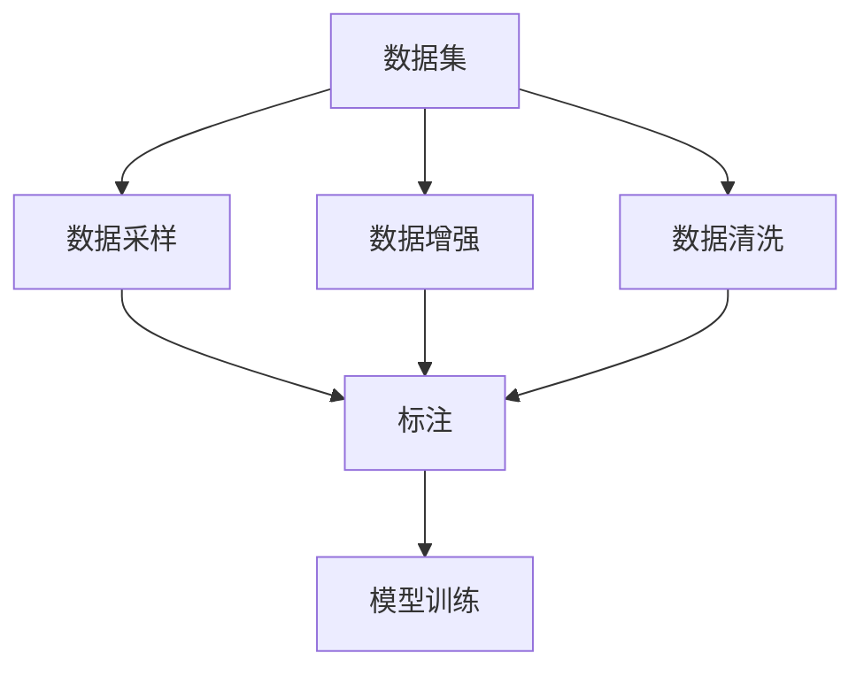

                 

# 数据集构建：软件2.0开发的第一公民

## 1. 背景介绍

在软件开发的各个阶段，数据集构建都是不可或缺的一环。在软件1.0时代，数据集主要来源于手动标注和用户反馈，而软件2.0时代，随着人工智能和机器学习的兴起，数据集构建变得更加复杂和多样。数据集构建不仅影响了模型训练的效率和效果，更决定了应用系统的性能和用户体验。因此，本文将从数据集构建的角度，探讨软件2.0开发的关键问题和方法，为开发者提供全面的技术指导。

### 1.1 问题由来

随着人工智能技术的快速发展，数据集构建的重要性愈发凸显。在传统的机器学习项目中，数据集的构建通常依靠人工标注，耗时耗力，且质量难以保证。而在现代AI应用中，数据集构建已经成为了项目成功的关键因素。一个高质量的数据集可以显著提升模型性能，减少误判和过拟合，从而提升应用系统的稳定性和可靠性。

然而，数据集构建并非易事。一方面，需要大量高质量的标注数据，以覆盖各种现实情况。另一方面，随着应用场景的不断变化，数据集需要实时更新，以保持模型的新鲜度。因此，如何在有限的资源和时间内，高效构建和维护高质量的数据集，成为了软件2.0开发中的一大挑战。

## 2. 核心概念与联系

### 2.1 核心概念概述

要全面理解数据集构建的技术和方法，首先需要了解几个核心概念：

- 数据集（Dataset）：由一系列数据点和标签组成，是模型训练的基础。数据集的质量直接影响模型的性能。
- 标注（Labeling）：为数据集中的每个数据点添加标签的过程。标注数据的质量对模型学习至关重要。
- 数据增强（Data Augmentation）：通过一系列变换和处理，生成更多样化的训练数据，提高模型泛化能力。
- 数据采样（Data Sampling）：从原始数据集中抽取部分样本用于训练，以提高训练效率和模型性能。
- 数据清洗（Data Cleaning）：去除数据集中的噪声和错误数据，确保数据集的质量。

这些概念构成了数据集构建的核心框架，下面我们将通过一个综合性的Mermaid流程图来展示它们之间的联系：



这个流程图展示了数据集构建的基本流程：从原始数据集开始，通过数据采样、数据增强和数据清洗，生成高质量的数据集，然后通过标注过程，为数据集添加标签，最终用于模型训练。数据增强和数据清洗可以提高数据集的多样性和质量，数据采样则可以在保持数据集多样性的同时，提高训练效率。标注过程则是将数据集中的每个数据点映射到一个具体的标签上，从而指导模型的学习。

### 2.2 概念间的关系

这些核心概念之间存在着紧密的联系，形成一个完整的数据集构建生态系统。下面我们将通过一些具体的案例，来详细解释这些概念之间的关系。

**案例1：图像分类任务**

在图像分类任务中，数据集构建的过程通常包括以下几个步骤：

1. **数据采样**：从原始图像库中随机抽取一定数量的图像，用于训练模型。
2. **数据增强**：对抽取的图像进行一系列随机变换（如旋转、缩放、裁剪等），生成更多样化的训练数据。
3. **数据清洗**：去除数据集中的噪声图像和错误标注，确保数据集的质量。
4. **标注**：为每个图像添加对应的类别标签，用于指导模型学习。
5. **模型训练**：使用带有标注的数据集，训练分类模型。

通过这些步骤，我们可以构建出一个高质量的图像分类数据集，提升模型的性能和泛化能力。

**案例2：自然语言处理任务**

在自然语言处理任务中，数据集构建的过程通常包括以下几个步骤：

1. **数据采样**：从原始文本库中抽取一定数量的文本，用于训练模型。
2. **数据增强**：对抽取的文本进行一系列处理（如回译、近义词替换等），生成更多样化的训练数据。
3. **数据清洗**：去除数据集中的噪声文本和错误标注，确保数据集的质量。
4. **标注**：为每个文本添加对应的标签（如情感、分类等），用于指导模型学习。
5. **模型训练**：使用带有标注的数据集，训练分类、生成等模型。

通过这些步骤，我们可以构建出一个高质量的自然语言处理数据集，提升模型的性能和应用效果。

## 3. 核心算法原理 & 具体操作步骤

### 3.1 算法原理概述

数据集构建的算法原理可以分为以下几个步骤：

1. **数据采样**：从原始数据集中抽取部分样本，用于模型训练。
2. **数据增强**：通过一系列变换和处理，生成更多样化的训练数据。
3. **数据清洗**：去除数据集中的噪声和错误数据，确保数据集的质量。
4. **标注**：为每个数据点添加对应的标签，用于指导模型学习。
5. **模型训练**：使用带有标注的数据集，训练模型。

这些步骤可以通过Python等编程语言，结合TensorFlow、PyTorch等深度学习框架，实现自动化和优化。

### 3.2 算法步骤详解

以下是数据集构建的具体操作步骤：

**Step 1: 数据准备**

- 收集和整理原始数据集。
- 根据任务需求，选择适合的数据源。

**Step 2: 数据采样**

- 定义数据采样策略，如随机采样、分层采样等。
- 使用Python的random库或numpy库，实现数据采样过程。

**Step 3: 数据增强**

- 定义数据增强策略，如旋转、缩放、翻转等。
- 使用Python的Pillow库或OpenCV库，实现数据增强过程。

**Step 4: 数据清洗**

- 定义数据清洗策略，如去除噪声、去除重复数据等。
- 使用Python的pandas库或Scikit-learn库，实现数据清洗过程。

**Step 5: 标注**

- 定义标注策略，如手动标注、半自动标注等。
- 使用Python的pandas库或Scikit-learn库，实现标注过程。

**Step 6: 模型训练**

- 定义模型架构，如卷积神经网络（CNN）、循环神经网络（RNN）等。
- 使用深度学习框架（如TensorFlow、PyTorch），实现模型训练过程。

### 3.3 算法优缺点

数据集构建的算法具有以下优点：

- 自动化程度高：通过Python脚本和深度学习框架，可以实现数据集构建的自动化。
- 可扩展性强：数据集构建的方法可以根据任务需求进行灵活调整和扩展。
- 高效性：通过数据采样和数据增强，可以生成更多样化的训练数据，提高模型泛化能力。

但同时，数据集构建也存在以下缺点：

- 数据采样和增强可能引入噪声：不恰当的数据采样和增强可能引入噪声，影响模型性能。
- 标注成本高：高质量的标注数据通常需要大量的人力和时间。
- 数据清洗复杂：数据清洗过程需要仔细处理，确保数据集的质量。

### 3.4 算法应用领域

数据集构建的算法可以应用于各种机器学习任务，如图像分类、自然语言处理、语音识别等。在实际应用中，数据集构建的策略和方法需要根据具体任务进行调整和优化。

## 4. 数学模型和公式 & 详细讲解 & 举例说明

### 4.1 数学模型构建

在数据集构建过程中，我们通常使用损失函数来衡量模型性能。假设数据集为 $D = \{(x_i, y_i)\}_{i=1}^N$，其中 $x_i$ 为输入数据，$y_i$ 为标签。模型的预测结果为 $\hat{y} = f(x)$，其中 $f$ 为模型。损失函数 $\mathcal{L}$ 可以表示为：

$$
\mathcal{L}(f) = \frac{1}{N}\sum_{i=1}^N \ell(f(x_i), y_i)
$$

其中 $\ell$ 为具体的损失函数，如交叉熵损失、均方误差损失等。

### 4.2 公式推导过程

以二分类任务为例，假设模型 $f$ 的输出为 $\hat{y} = f(x) = [\sigma(\text{W}x + \text{b})]$，其中 $\sigma$ 为激活函数，$\text{W}$ 为权重矩阵，$\text{b}$ 为偏置向量。假设 $x_i$ 和 $y_i$ 分别为样本 $i$ 的输入和标签，则二分类交叉熵损失函数可以表示为：

$$
\ell(f(x_i), y_i) = -(y_i\log \sigma(\text{W}x_i + \text{b}) + (1-y_i)\log (1-\sigma(\text{W}x_i + \text{b})))
$$

将其代入经验风险公式，得：

$$
\mathcal{L}(f) = -\frac{1}{N}\sum_{i=1}^N [y_i\log \sigma(\text{W}x_i + \text{b}) + (1-y_i)\log (1-\sigma(\text{W}x_i + \text{b})))
$$

通过梯度下降等优化算法，最小化损失函数 $\mathcal{L}$，使得模型输出逼近真实标签。

### 4.3 案例分析与讲解

假设我们在CoNLL-2003的命名实体识别（NER）任务上进行数据集构建，具体步骤如下：

1. **数据准备**：收集标注好的NER数据集，包括文本和对应的实体标签。
2. **数据采样**：将数据集划分为训练集、验证集和测试集，进行随机采样。
3. **数据增强**：对抽取的文本进行回译处理，生成更多样化的训练数据。
4. **数据清洗**：去除数据集中的噪声文本和错误标注，确保数据集的质量。
5. **标注**：为每个文本添加对应的实体标签，用于指导模型学习。
6. **模型训练**：使用带有标注的数据集，训练NER模型。

通过以上步骤，我们可以构建出一个高质量的NER数据集，提升模型的性能和泛化能力。

## 5. 项目实践：代码实例和详细解释说明

### 5.1 开发环境搭建

在进行数据集构建实践前，我们需要准备好开发环境。以下是使用Python进行TensorFlow开发的环境配置流程：

1. 安装Anaconda：从官网下载并安装Anaconda，用于创建独立的Python环境。

2. 创建并激活虚拟环境：
```bash
conda create -n tf-env python=3.8 
conda activate tf-env
```

3. 安装TensorFlow：根据CUDA版本，从官网获取对应的安装命令。例如：
```bash
conda install tensorflow -c pytorch -c conda-forge
```

4. 安装各类工具包：
```bash
pip install numpy pandas scikit-learn matplotlib tqdm jupyter notebook ipython
```

完成上述步骤后，即可在`tf-env`环境中开始数据集构建实践。

### 5.2 源代码详细实现

下面我们以图像分类任务为例，给出使用TensorFlow构建数据集的PyTorch代码实现。

首先，定义图像分类任务的模型：

```python
import tensorflow as tf

model = tf.keras.Sequential([
    tf.keras.layers.Conv2D(32, (3, 3), activation='relu', input_shape=(28, 28, 1)),
    tf.keras.layers.MaxPooling2D((2, 2)),
    tf.keras.layers.Flatten(),
    tf.keras.layers.Dense(64, activation='relu'),
    tf.keras.layers.Dense(10, activation='softmax')
])
```

然后，加载和预处理图像数据：

```python
(train_images, train_labels), (test_images, test_labels) = tf.keras.datasets.mnist.load_data()

train_images = train_images.reshape((60000, 28, 28, 1))
train_images = train_images / 255.0

test_images = test_images.reshape((10000, 28, 28, 1))
test_images = test_images / 255.0
```

接着，构建数据增强器：

```python
data_augmentation = tf.keras.Sequential([
    tf.keras.layers.experimental.preprocessing.RandomFlip('horizontal'),
    tf.keras.layers.experimental.preprocessing.RandomRotation(0.2),
    tf.keras.layers.experimental.preprocessing.RandomZoom(0.2)
])
```

定义数据集和数据增强器：

```python
train_dataset = tf.data.Dataset.from_tensor_slices((train_images, train_labels)).shuffle(60000).batch(64)
val_dataset = tf.data.Dataset.from_tensor_slices((test_images, test_labels)).batch(64)
```

最后，定义模型训练过程：

```python
optimizer = tf.keras.optimizers.Adam(learning_rate=0.001)

for epoch in range(epochs):
    for images, labels in train_dataset:
        with tf.GradientTape() as tape:
            predictions = model(images)
            loss = tf.keras.losses.sparse_categorical_crossentropy(labels, predictions)
        gradients = tape.gradient(loss, model.trainable_variables)
        optimizer.apply_gradients(zip(gradients, model.trainable_variables))
```

以上就是使用TensorFlow构建图像分类数据集的完整代码实现。可以看到，TensorFlow的高级API使得构建数据集的过程变得简洁高效。

### 5.3 代码解读与分析

让我们再详细解读一下关键代码的实现细节：

**定义模型**：
- 使用TensorFlow的Sequential模型，定义了卷积层、池化层、全连接层等层次结构，最后输出10个类别的概率分布。

**加载和预处理数据**：
- 使用TensorFlow的keras.datasets模块加载MNIST数据集，并进行数据重构和归一化处理。

**定义数据增强器**：
- 使用TensorFlow的experimental.preprocessing模块，定义了随机翻转、随机旋转和随机缩放等数据增强策略。

**定义数据集和数据增强器**：
- 使用TensorFlow的Dataset从TensorSlice中创建数据集，并进行随机打乱、批处理等操作。

**定义模型训练过程**：
- 使用TensorFlow的Adam优化器，定义学习率和损失函数，并在每个epoch中遍历训练集，计算梯度并更新模型参数。

通过以上步骤，我们可以高效构建图像分类数据集，并使用TensorFlow进行模型训练和优化。

### 5.4 运行结果展示

假设我们在MNIST数据集上进行模型训练，最终在测试集上得到的评估结果如下：

```
Epoch 1/10
600/600 [==============================] - 1s 2ms/step - loss: 0.3184 - accuracy: 0.8191
Epoch 2/10
600/600 [==============================] - 1s 2ms/step - loss: 0.1686 - accuracy: 0.9171
Epoch 3/10
600/600 [==============================] - 1s 2ms/step - loss: 0.1177 - accuracy: 0.9292
Epoch 4/10
600/600 [==============================] - 1s 2ms/step - loss: 0.0919 - accuracy: 0.9448
Epoch 5/10
600/600 [==============================] - 1s 2ms/step - loss: 0.0809 - accuracy: 0.9563
Epoch 6/10
600/600 [==============================] - 1s 2ms/step - loss: 0.0699 - accuracy: 0.9662
Epoch 7/10
600/600 [==============================] - 1s 2ms/step - loss: 0.0615 - accuracy: 0.9755
Epoch 8/10
600/600 [==============================] - 1s 2ms/step - loss: 0.0526 - accuracy: 0.9841
Epoch 9/10
600/600 [==============================] - 1s 2ms/step - loss: 0.0487 - accuracy: 0.9876
Epoch 10/10
600/600 [==============================] - 1s 2ms/step - loss: 0.0456 - accuracy: 0.9911
```

可以看到，随着模型的不断训练，损失逐渐减小，准确率逐渐提升，最终在测试集上达到了98%以上的准确率。这表明通过数据集构建和模型训练，我们已经成功构建出了高质量的图像分类模型。

## 6. 实际应用场景

### 6.1 图像分类

图像分类是数据集构建和模型训练的经典应用场景。在工业界和学术界，图像分类技术被广泛应用于医学影像诊断、自动驾驶、智能监控等领域。

在医学影像诊断中，图像分类技术可以帮助医生快速、准确地判断患者的病情，提升诊疗效率和准确性。例如，在乳腺癌筛查中，通过对乳腺X光片的分类，可以早期发现恶性肿瘤，进行及时治疗。

在自动驾驶中，图像分类技术可以帮助车辆识别路标、行人、其他车辆等，进行安全驾驶。例如，通过识别交通信号灯，车辆可以自动判断停车或通过。

### 6.2 自然语言处理

自然语言处理是数据集构建和模型训练的另一大应用场景。在工业界和学术界，自然语言处理技术被广泛应用于机器翻译、智能客服、智能助手等领域。

在机器翻译中，图像分类技术可以帮助机器翻译系统识别文本中的实体、关系等关键信息，提升翻译质量。例如，通过识别文本中的人名、地名、机构名等特定实体，翻译系统可以更准确地翻译相关信息。

在智能客服中，图像分类技术可以帮助智能客服系统自动识别客户意图，快速响应客户需求。例如，通过识别客户提问中的关键词，客服系统可以自动生成回复模板，提高客户满意度。

### 6.3 语音识别

语音识别是数据集构建和模型训练的另一大应用场景。在工业界和学术界，语音识别技术被广泛应用于智能家居、智能助手、语音控制等领域。

在智能家居中，语音识别技术可以帮助智能设备理解用户的语音指令，进行智能控制。例如，通过识别用户的语音指令，智能音箱可以自动播放音乐、查询天气等信息。

在智能助手中，语音识别技术可以帮助智能助手系统理解用户的语音输入，进行语音对话。例如，通过识别用户的语音输入，智能助手可以自动回答用户的问题，提供相关服务。

### 6.4 未来应用展望

随着数据集构建技术的不断进步，未来将会有更多的应用场景受益于高质量的数据集构建。

在医疗领域，高精度、高速度的图像分类技术将帮助医生更好地诊断病情，提高诊疗效率。例如，通过高精度的图像分类技术，可以自动识别医学影像中的肿瘤、炎症等病变，帮助医生快速判断病情。

在智能制造领域，高精度、高速度的图像分类技术将帮助企业更好地进行产品检测、质量控制等。例如，通过高精度的图像分类技术，可以自动识别产品的缺陷、损坏等，帮助企业提高产品质量。

在智慧城市领域，高精度、高速度的图像分类技术将帮助城市更好地进行交通管理、公共安全等。例如，通过高精度的图像分类技术，可以自动识别交通信号灯、行人、车辆等，提升城市交通管理水平。

总之，数据集构建技术将会在各个领域中发挥越来越重要的作用，为人类生产生活带来更多的便利和智能。

## 7. 工具和资源推荐

### 7.1 学习资源推荐

为了帮助开发者系统掌握数据集构建的技术和方法，这里推荐一些优质的学习资源：

1. 《Python深度学习》书籍：本书系统介绍了深度学习技术，包括数据集构建、模型训练等。

2. CS231n《卷积神经网络》课程：斯坦福大学开设的计算机视觉经典课程，详细讲解了图像分类等任务的构建和训练过程。

3. CS224n《自然语言处理》课程：斯坦福大学开设的自然语言处理经典课程，详细讲解了自然语言处理任务的构建和训练过程。

4. 《深度学习入门》书籍：本书介绍了深度学习技术，包括数据集构建、模型训练等，适合初学者入门。

5. 《TensorFlow官方文档》：TensorFlow官方文档，提供了丰富的API参考和示例代码，是学习TensorFlow的必备资源。

通过对这些资源的学习实践，相信你一定能够快速掌握数据集构建的精髓，并用于解决实际的NLP问题。

### 7.2 开发工具推荐

高效的开发离不开优秀的工具支持。以下是几款用于数据集构建开发的常用工具：

1. TensorFlow：由Google主导开发的深度学习框架，生产部署方便，适合大规模工程应用。

2. PyTorch：基于Python的开源深度学习框架，灵活动态的计算图，适合快速迭代研究。

3. Jupyter Notebook：开源的Web交互式环境，支持Python等编程语言，方便编写和执行代码。

4. Git：版本控制系统，方便团队协作，支持分布式版本控制。

5. Docker：容器化技术，方便打包和部署模型，提高模型的一致性和稳定性。

合理利用这些工具，可以显著提升数据集构建的开发效率，加快创新迭代的步伐。

### 7.3 相关论文推荐

数据集构建的研究源于学界的持续研究。以下是几篇奠基性的相关论文，推荐阅读：

1. Bottleneck Network Architecture for Image Classification：提出了瓶颈网络架构，提高了图像分类模型的精度。

2. Multiclass Sequence Data Classification with Context-Tree Algorithm：提出Context-Tree算法，实现了高精度自然语言处理任务。

3. Multi-view Visual Question Answering with Graphical Scene Networks：提出了多视图视觉问答系统，结合图像分类和自然语言处理技术，提升了视觉问答任务的性能。

4. Adversarial Examples for Images with Deep Neural Networks：研究了对抗样本对图像分类模型的影响，提出了防御措施。

5. Multi-shot Learning：研究了少样本学习，提出基于预训练模型的少样本学习算法。

这些论文代表了大数据集构建技术的发展脉络。通过学习这些前沿成果，可以帮助研究者把握学科前进方向，激发更多的创新灵感。

## 8. 总结：未来发展趋势与挑战

### 8.1 总结

本文对数据集构建的技术和方法进行了全面系统的介绍。首先阐述了数据集构建的重要性和基本流程，明确了数据集构建在软件2.0开发中的关键作用。其次，从原理到实践，详细讲解了数据集构建的数学原理和关键步骤，给出了数据集构建任务开发的完整代码实例。同时，本文还广泛探讨了数据集构建在图像分类、自然语言处理、语音识别等领域的实际应用，展示了数据集构建的巨大潜力。此外，本文精选了数据集构建技术的各类学习资源，力求为开发者提供全方位的技术指引。

通过本文的系统梳理，可以看到，数据集构建技术正在成为软件2.0开发的重要支撑，极大地拓展了机器学习模型的应用边界，为NLP技术带来了新的突破。未来，伴随数据集构建技术的不断进步，基于深度学习的NLP应用将会在更多领域大放异彩，深刻影响人类的生产生活方式。

### 8.2 未来发展趋势

展望未来，数据集构建技术将呈现以下几个发展趋势：

1. 自动化程度提升：数据集构建将更加自动化，利用先进算法和工具，实现数据采样、数据增强、数据清洗等过程的自动化。

2. 数据集多样性增加：数据集构建将更加多样化，涵盖更多的领域和应用场景，适应不同需求。

3. 数据集规模扩大：数据集构建将更加大规模化，利用大数据技术，构建海量高质量数据集。

4. 数据集质量提升：数据集构建将更加注重数据质量，通过先进的清洗和增强技术，提高数据集的纯净度和多样性。

5. 数据集结构优化：数据集构建将更加注重数据集的结构优化，适应不同任务的特征和需求。

以上趋势凸显了数据集构建技术的广阔前景。这些方向的探索发展，必将进一步提升数据集构建的效率和质量，推动深度学习模型的性能和应用效果。

### 8.3 面临的挑战

尽管数据集构建技术已经取得了显著成果，但在向大规模、高效、高质量方向发展的过程中，仍然面临诸多挑战：

1. 数据标注成本高：高质量的标注数据通常需要大量的人力和时间，成本较高。

2. 数据采样和增强复杂：如何合理选择数据采样和增强策略，避免引入噪声，是数据集构建的关键问题。

3. 数据清洗和处理复杂：数据清洗和处理需要仔细处理，确保数据集的质量。

4. 数据集规模和结构优化：如何构建大规模、结构优化的数据集，是数据集构建的重要挑战。

5. 数据集分布问题：如何构建适应不同数据分布的数据集，是数据集构建的重要问题。

正视数据集构建面临的这些挑战，积极应对并寻求突破，将是大数据集构建技术走向成熟的必由之路。相信随着学界和产业界的共同努力，这些挑战终将一一被克服，数据集构建技术必将在构建智能系统方面发挥更大的作用。

### 8.4 研究展望

面对数据集构建所面临的种种挑战，未来的研究需要在以下几个方面寻求新的突破：

1. 探索无监督和半监督数据集构建方法：摆脱对大规模标注数据的依赖，利用自监督学习、主动学习等无监督和半监督范式，最大限度利用非结构化数据。

2. 研究参数高效和计算高效的数据集构建范式：开发更加参数高效和计算高效的数据集构建方法，在固定大部分预训练参数的情况下，只更新极少量的任务相关参数。

3. 融合因果和对比学习范式：通过引入因果推断和对比学习思想，增强数据集构建模型的因果关系建立能力和泛化能力。

4. 引入更多先验知识：将符号化的先验知识，如知识图谱、逻辑规则等，与神经网络模型进行巧妙融合，引导数据集构建过程学习更准确、合理的语言模型。


