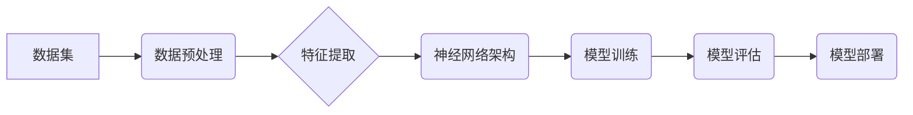

> 数据集,神经网络,软件架构,机器学习,深度学习,人工智能,软件2.0,源代码

## 1. 背景介绍

软件行业正处于一个前所未有的变革时期。传统的软件开发模式，依赖于人类程序员手动编写代码，已经难以满足日益增长的需求。随着人工智能（AI）技术的飞速发展，特别是深度学习的突破，我们看到了一个全新的软件开发 paradigm：数据驱动软件开发。

在这个新 paradigm 中，软件不再仅仅是人类编写的代码，而是由大量数据和神经网络架构共同构建。数据集成为软件开发的“源代码”，神经网络架构则成为软件的“设计图纸”。通过训练神经网络，我们可以让软件能够从数据中学习，自动生成代码、识别模式、做出决策，甚至创造新的内容。

## 2. 核心概念与联系

### 2.1 数据集

数据集是机器学习和深度学习的基础。它包含了大量结构化或非结构化数据，这些数据可以是文本、图像、音频、视频等各种形式。

数据集的质量直接影响着神经网络的训练效果。高质量的数据集应该具有以下特点：

* **代表性:** 数据集应该能够全面地代表目标领域的数据分布。
* **完整性:** 数据集应该包含足够多的数据样本，以确保模型能够充分学习。
* **准确性:** 数据集中的数据应该准确无误，避免噪声和错误信息。
* **标签化:** 对于监督学习任务，数据集中的数据应该被标记为相应的类别或标签。

### 2.2 神经网络架构

神经网络架构是指神经网络的结构和参数设置。它决定了神经网络的学习能力和性能。常见的深度学习架构包括卷积神经网络（CNN）、循环神经网络（RNN）和Transformer等。

神经网络架构的设计是一个复杂的工程问题，需要根据具体的应用场景和数据集特点进行选择和调整。



## 3. 核心算法原理 & 具体操作步骤

### 3.1 算法原理概述

数据驱动软件开发的核心算法是深度学习算法。深度学习算法是一种基于多层神经网络的机器学习算法，能够从海量数据中自动学习复杂的特征和模式。

深度学习算法的训练过程可以概括为以下步骤：

1. **数据预处理:** 对原始数据进行清洗、转换和格式化，使其适合深度学习模型的训练。
2. **特征提取:** 从数据中提取有用的特征，这些特征可以是原始数据的直接表示，也可以是经过变换后的特征。
3. **模型训练:** 使用深度学习模型对数据进行训练，调整模型参数，使其能够准确地预测或分类数据。
4. **模型评估:** 使用测试数据评估模型的性能，并根据评估结果进行模型调优。
5. **模型部署:** 将训练好的模型部署到实际应用场景中，用于进行预测或分类任务。

### 3.2 算法步骤详解

1. **数据收集和预处理:**

   * 收集来自各种来源的数据，例如文本、图像、音频、视频等。
   * 对数据进行清洗，去除噪声和错误信息。
   * 对数据进行转换，例如将文本数据转换为数字向量。
   * 对数据进行格式化，例如将数据存储为特定的文件格式。

2. **特征工程:**

   * 从数据中提取有用的特征，例如文本中的关键词、图像中的边缘信息、音频中的音调等。
   * 使用特征选择技术，选择最相关的特征，提高模型的性能。
   * 使用特征转换技术，将特征转换为更适合深度学习模型的格式。

3. **模型选择和训练:**

   * 选择合适的深度学习模型，例如CNN、RNN或Transformer等。
   * 使用训练数据对模型进行训练，调整模型参数，使其能够准确地预测或分类数据。
   * 使用优化算法，例如梯度下降，来更新模型参数。

4. **模型评估和调优:**

   * 使用测试数据评估模型的性能，例如准确率、召回率、F1-score等。
   * 根据评估结果进行模型调优，例如调整模型参数、增加训练数据、改进特征工程等。

5. **模型部署和监控:**

   * 将训练好的模型部署到实际应用场景中，例如网站、应用程序、嵌入式设备等。
   * 监控模型的性能，并定期进行模型更新和维护。

### 3.3 算法优缺点

**优点:**

* **高精度:** 深度学习算法能够从海量数据中学习复杂的特征，从而实现高精度的预测和分类。
* **自动化:** 深度学习算法能够自动学习特征，无需人工特征工程。
* **泛化能力强:** 深度学习模型能够泛化到新的数据，即使是未见过的数据。

**缺点:**

* **数据依赖:** 深度学习算法需要大量的训练数据，否则模型性能会下降。
* **计算资源消耗大:** 深度学习模型训练需要大量的计算资源，例如GPU。
* **可解释性差:** 深度学习模型的决策过程难以解释，难以理解模型是如何做出决策的。

### 3.4 算法应用领域

深度学习算法在各个领域都有广泛的应用，例如：

* **计算机视觉:** 图像识别、物体检测、图像分割、人脸识别等。
* **自然语言处理:** 文本分类、情感分析、机器翻译、文本生成等。
* **语音识别:** 语音转文本、语音合成等。
* **推荐系统:** 商品推荐、内容推荐等。
* **医疗诊断:** 疾病诊断、影像分析等。

## 4. 数学模型和公式 & 详细讲解 & 举例说明

### 4.1 数学模型构建

深度学习模型的核心是神经网络，它由多个层组成，每一层包含多个神经元。每个神经元接收来自上一层的输入，并通过激活函数进行处理，输出到下一层。

神经网络的数学模型可以表示为：

$$
y = f(W x + b)
$$

其中：

* $y$ 是神经元的输出
* $x$ 是神经元的输入
* $W$ 是权重矩阵
* $b$ 是偏置向量
* $f$ 是激活函数

### 4.2 公式推导过程

深度学习模型的训练过程是通过优化模型参数来最小化损失函数的过程。损失函数衡量模型预测结果与真实结果之间的差异。常用的损失函数包括均方误差（MSE）和交叉熵损失（Cross-Entropy Loss）。

**均方误差 (MSE):**

$$
MSE = \frac{1}{n} \sum_{i=1}^{n} (y_i - \hat{y}_i)^2
$$

其中：

* $y_i$ 是真实值
* $\hat{y}_i$ 是模型预测值
* $n$ 是样本数量

**交叉熵损失 (Cross-Entropy Loss):**

$$
Cross-Entropy Loss = -\sum_{i=1}^{n} y_i \log(\hat{y}_i)
$$

其中：

* $y_i$ 是真实值
* $\hat{y}_i$ 是模型预测值

模型参数的更新可以使用梯度下降算法，例如随机梯度下降 (SGD) 和动量梯度下降 (Momentum SGD)。

### 4.3 案例分析与讲解

**图像分类案例:**

假设我们有一个图像分类任务，目标是将图像分类为不同的类别，例如猫、狗、鸟等。

我们可以使用卷积神经网络 (CNN) 来解决这个问题。CNN 可以自动学习图像特征，例如边缘、纹理、形状等。

训练 CNN 模型的过程如下：

1. 使用大量的图像数据训练 CNN 模型。
2. 使用交叉熵损失函数来衡量模型预测结果与真实结果之间的差异。
3. 使用梯度下降算法来更新模型参数，最小化损失函数。

经过训练，CNN 模型能够准确地识别图像中的类别。

## 5. 项目实践：代码实例和详细解释说明

### 5.1 开发环境搭建

* **操作系统:** Ubuntu 20.04 LTS
* **编程语言:** Python 3.8
* **深度学习框架:** TensorFlow 2.x
* **其他工具:** Jupyter Notebook, Git

### 5.2 源代码详细实现

```python
import tensorflow as tf

# 定义模型结构
model = tf.keras.models.Sequential([
    tf.keras.layers.Conv2D(32, (3, 3), activation='relu', input_shape=(28, 28, 1)),
    tf.keras.layers.MaxPooling2D((2, 2)),
    tf.keras.layers.Conv2D(64, (3, 3), activation='relu'),
    tf.keras.layers.MaxPooling2D((2, 2)),
    tf.keras.layers.Flatten(),
    tf.keras.layers.Dense(10, activation='softmax')
])

# 编译模型
model.compile(optimizer='adam',
              loss='sparse_categorical_crossentropy',
              metrics=['accuracy'])

# 加载 MNIST 数据集
(x_train, y_train), (x_test, y_test) = tf.keras.datasets.mnist.load_data()

# 数据预处理
x_train = x_train.astype('float32') / 255.0
x_test = x_test.astype('float32') / 255.0
x_train = x_train.reshape((x_train.shape[0], 28, 28, 1))
x_test = x_test.reshape((x_test.shape[0], 28, 28, 1))

# 训练模型
model.fit(x_train, y_train, epochs=5)

# 评估模型
loss, accuracy = model.evaluate(x_test, y_test)
print('Test loss:', loss)
print('Test accuracy:', accuracy)
```

### 5.3 代码解读与分析

这段代码实现了 MNIST 手写数字识别任务。

* 首先，定义了一个简单的 CNN 模型结构，包含两个卷积层、两个最大池化层、一个全连接层和一个 softmax 输出层。
* 然后，使用 Adam 优化器、交叉熵损失函数和准确率指标编译模型。
* 加载 MNIST 数据集，并对数据进行预处理，例如归一化和 reshape。
* 使用 `model.fit()` 方法训练模型，指定训练 epochs 和 batch size。
* 使用 `model.evaluate()` 方法评估模型在测试集上的性能。

### 5.4 运行结果展示

训练完成后，模型能够准确地识别 MNIST 手写数字。

## 6. 实际应用场景

### 6.1 代码生成

数据驱动软件开发可以用于自动生成代码。通过训练神经网络，我们可以让它从自然语言描述或代码示例中学习，并自动生成相应的代码。

### 6.2 自动测试

数据驱动软件开发可以用于自动生成测试用例。通过分析代码和数据，我们可以训练神经网络，使其能够自动生成测试用例，并评估代码的质量。

### 6.3 软件缺陷修复

数据驱动软件开发可以用于自动修复软件缺陷。通过分析缺陷报告和代码，我们可以训练神经网络，使其能够自动识别缺陷并生成修复代码。

### 6.4 未来应用展望

数据驱动软件开发的未来应用前景广阔，例如：

* **个性化软件定制:** 根据用户的需求和偏好，自动生成个性化的软件。
* **自动软件维护:** 自动识别和修复软件缺陷，提高软件的稳定性和可靠性。
* **跨语言代码转换:** 自动将代码从一种编程语言转换为另一种编程语言。

## 7. 工具和资源推荐

### 7.1 学习资源推荐

* **书籍:**
    * Deep Learning by Ian Goodfellow, Yoshua Bengio, and Aaron Courville
    * Hands-On Machine Learning with Scikit-Learn, Keras & TensorFlow by Aurélien Géron
* **在线课程:**
    * TensorFlow