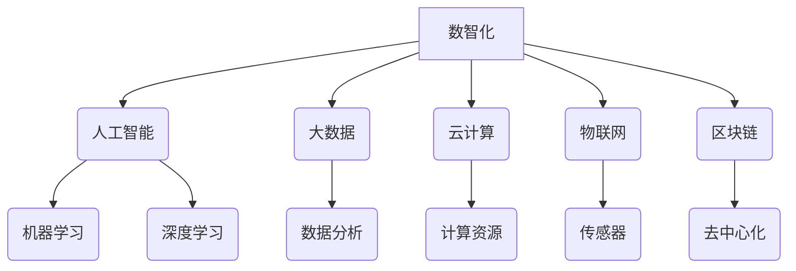

> 数智化、人工智能、机器学习、深度学习、大数据、云计算、区块链、物联网

## 1. 背景介绍

我们正处在一个前所未有的时代，信息技术飞速发展，深刻地改变着人类社会。从智能手机到自动驾驶，从个性化推荐到医疗诊断，人工智能（AI）正在无处不在地改变着我们的生活。

数智化时代，以数据为基础，以智能为核心，以网络为纽带，融合了数字技术和物理世界，构建了一个全新的智能生态系统。在这个生态系统中，数据是重要的生产要素，智能是核心驱动力，网络是连接和协同的基础。

## 2. 核心概念与联系

**2.1 数智化**

数智化是指利用数字技术和智能技术，对实体世界进行数字化、智能化改造，实现数据化、智能化、网络化、协同化、可视化等方面的提升。

**2.2 人工智能（AI）**

人工智能是指模拟人类智能行为的计算机系统。它涵盖了多个领域，包括机器学习、深度学习、自然语言处理、计算机视觉等。

**2.3 大数据**

大数据是指海量、高速、多样化的数据。它蕴含着巨大的价值，但需要强大的计算能力和分析技术才能挖掘出来。

**2.4 云计算**

云计算是指通过互联网提供计算资源、存储资源和软件服务的模式。它为数智化时代提供了强大的计算和存储基础设施。

**2.5 物联网（IoT）**

物联网是指将各种物理设备连接到互联网，形成一个互联互通的网络。它为数智化时代提供了海量数据和实时感知能力。

**2.6 区块链**

区块链是一种分布式账本技术，它可以实现数据安全、透明和不可篡改。它为数智化时代提供了新的信任机制和数据管理方式。

**2.7 核心概念联系**

数智化时代的核心概念相互关联，共同构成了一个完整的生态系统。



## 3. 核心算法原理 & 具体操作步骤

### 3.1 算法原理概述

机器学习算法是人工智能的核心，它通过学习数据，发现隐藏的模式和规律，从而实现预测、分类、聚类等任务。常见的机器学习算法包括：

* **监督学习:** 利用标记数据训练模型，预测新的数据标签。例如，图像分类、文本分类等。
* **无监督学习:** 利用未标记数据发现数据结构和模式。例如，聚类分析、异常检测等。
* **强化学习:** 通过试错学习，在环境中获得最大奖励。例如，游戏AI、机器人控制等。

### 3.2 算法步骤详解

以监督学习为例，其基本步骤如下：

1. **数据收集和预处理:** 收集相关数据，并进行清洗、转换、特征工程等预处理操作。
2. **模型选择:** 根据任务需求选择合适的机器学习算法模型。
3. **模型训练:** 利用标记数据训练模型，调整模型参数，使其能够准确预测新的数据标签。
4. **模型评估:** 利用测试数据评估模型的性能，例如准确率、召回率、F1-score等。
5. **模型部署:** 将训练好的模型部署到实际应用场景中，用于预测新的数据。

### 3.3 算法优缺点

不同的机器学习算法具有不同的优缺点，需要根据具体任务选择合适的算法。

* **线性回归:** 优点：简单易懂，计算速度快。缺点：对非线性关系的拟合能力较差。
* **决策树:** 优点：易于理解和解释，可以处理分类和回归问题。缺点：容易过拟合，对数据噪声敏感。
* **支持向量机:** 优点：对高维数据具有较好的泛化能力。缺点：训练时间较长，参数选择较复杂。
* **神经网络:** 优点：可以学习复杂的非线性关系，具有强大的表达能力。缺点：训练时间长，参数众多，容易过拟合。

### 3.4 算法应用领域

机器学习算法广泛应用于各个领域，例如：

* **图像识别:** 人脸识别、物体检测、图像分类等。
* **自然语言处理:** 文本分类、情感分析、机器翻译等。
* **推荐系统:** 商品推荐、内容推荐、用户画像等。
* **医疗诊断:** 疾病预测、影像分析、药物研发等。
* **金融风险控制:** 欺诈检测、信用评估、投资决策等。

## 4. 数学模型和公式 & 详细讲解 & 举例说明

### 4.1 数学模型构建

机器学习算法通常基于数学模型，例如线性回归模型、逻辑回归模型、神经网络模型等。这些模型通过数学公式来描述数据之间的关系。

### 4.2 公式推导过程

例如，线性回归模型的目标是找到一条直线，使得这条直线与数据点之间的误差最小。

**公式:**

$$
y = w_0 + w_1x
$$

其中：

* $y$ 是预测值
* $x$ 是输入特征
* $w_0$ 和 $w_1$ 是模型参数

**损失函数:**

$$
L = \frac{1}{n}\sum_{i=1}^{n}(y_i - \hat{y}_i)^2
$$

其中：

* $n$ 是数据点的数量
* $y_i$ 是真实值
* $\hat{y}_i$ 是预测值

**梯度下降算法:**

通过梯度下降算法，可以迭代更新模型参数，使得损失函数最小化。

### 4.3 案例分析与讲解

例如，假设我们有一个数据集，包含房屋面积和房屋价格的信息。我们可以使用线性回归模型来预测房屋价格。

**数据:**

| 房屋面积 (平方米) | 房屋价格 (万元) |
|---|---|
| 60 | 100 |
| 80 | 150 |
| 100 | 200 |
| 120 | 250 |

**模型训练:**

使用梯度下降算法训练线性回归模型，得到模型参数 $w_0$ 和 $w_1$。

**预测:**

使用训练好的模型，可以预测新的房屋价格。例如，如果一个房屋面积为 90 平方米，则预测价格为：

$$
\hat{y} = w_0 + w_1 \times 90
$$

## 5. 项目实践：代码实例和详细解释说明

### 5.1 开发环境搭建

* Python 3.x
* Jupyter Notebook
* scikit-learn

### 5.2 源代码详细实现

```python
from sklearn.linear_model import LinearRegression
from sklearn.model_selection import train_test_split
import numpy as np

# 数据
X = np.array([[60], [80], [100], [120]])
y = np.array([100, 150, 200, 250])

# 数据分割
X_train, X_test, y_train, y_test = train_test_split(X, y, test_size=0.2, random_state=42)

# 模型训练
model = LinearRegression()
model.fit(X_train, y_train)

# 模型预测
y_pred = model.predict(X_test)

# 模型评估
print('Coefficients:', model.coef_)
print('Intercept:', model.intercept_)
print('R-squared:', model.score(X_test, y_test))
```

### 5.3 代码解读与分析

* 首先，我们导入必要的库，并定义数据。
* 然后，我们使用 `train_test_split` 函数将数据分割成训练集和测试集。
* 接下来，我们创建线性回归模型，并使用 `fit` 方法训练模型。
* 然后，我们使用 `predict` 方法预测测试集的标签。
* 最后，我们使用 `coef_`、`intercept_` 和 `score` 方法评估模型的性能。

### 5.4 运行结果展示

运行代码后，会输出模型的系数、截距和 R-squared 值。R-squared 值表示模型对数据的拟合程度，值越高表示拟合越好。

## 6. 实际应用场景

### 6.1 医疗诊断

机器学习算法可以用于分析医疗影像数据，辅助医生诊断疾病。例如，可以用于检测肺癌、乳腺癌、脑肿瘤等。

### 6.2 金融风险控制

机器学习算法可以用于识别欺诈交易、评估信用风险、预测股票价格等。

### 6.3 个性化推荐

机器学习算法可以根据用户的行为数据，推荐个性化的商品、内容和服务。例如，电商平台的商品推荐、视频网站的影视推荐等。

### 6.4 未来应用展望

随着人工智能技术的不断发展，机器学习算法将在更多领域得到应用，例如：

* 自动驾驶
* 机器人
* 语音助手
* 虚拟现实
* 增强现实

## 7. 工具和资源推荐

### 7.1 学习资源推荐

* **在线课程:** Coursera、edX、Udacity 等平台提供丰富的机器学习课程。
* **书籍:** 《机器学习》 (周志华)、《深入理解机器学习》 (李航) 等。
* **博客:** 机器学习 Mastery、Towards Data Science 等。

### 7.2 开发工具推荐

* **Python:** 机器学习的常用编程语言。
* **scikit-learn:** 机器学习算法库。
* **TensorFlow:** 深度学习框架。
* **PyTorch:** 深度学习框架。

### 7.3 相关论文推荐

* **《机器学习》 (周志华)**
* **《深入理解机器学习》 (李航)**
* **《神经网络与深度学习》 (Michael Nielsen)**

## 8. 总结：未来发展趋势与挑战

### 8.1 研究成果总结

数智化时代，人工智能技术取得了长足进步，机器学习算法在各个领域得到了广泛应用。

### 8.2 未来发展趋势

* **模型更加强大:** 深度学习模型将继续发展，拥有更强的学习能力和表达能力。
* **数据更加丰富:** 海量数据将为人工智能算法提供更丰富的训练素材。
* **应用更加广泛:** 人工智能将应用于更多领域，改变人们的生活方式。

### 8.3 面临的挑战

* **数据安全和隐私保护:** 人工智能算法依赖于大量数据，如何保障数据安全和隐私是重要的挑战。
* **算法可解释性:** 许多人工智能算法是黑箱模型，难以解释其决策过程，这可能会导致信任问题。
* **伦理问题:** 人工智能技术的发展引发了伦理问题，例如算法偏见、工作岗位替代等。

### 8.4 研究展望

未来，人工智能研究将继续探索更强大的算法、更丰富的应用场景和更完善的伦理规范，为人类社会创造更多价值。

## 9. 附录：常见问题与解答

### 9.1 什么是机器学习？

机器学习是一种人工智能技术，它通过学习数据，发现隐藏的模式和规律，从而实现预测、分类、聚类等任务。

### 9.2 什么是深度学习？

深度学习是一种机器学习的子领域，它使用多层神经网络来模拟人类大脑的学习过程。

### 9.3 如何选择合适的机器学习算法？

选择合适的机器学习算法需要根据具体任务需求、数据特点和模型性能等因素综合考虑。

### 9.4 如何评估机器学习模型的性能？

常用的机器学习模型性能评估指标包括准确率、召回率、F1-score、AUC等。

### 9.5 人工智能技术有哪些伦理问题？

