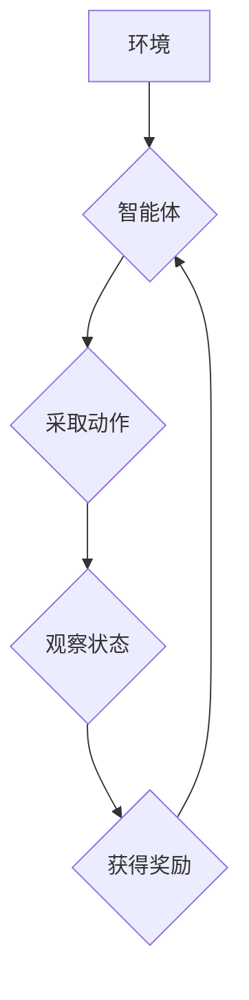

> 深度学习，Q-learning，疫情预测，时间序列分析，强化学习

## 1. 背景介绍

新冠疫情的爆发对全球造成了巨大的冲击，突显了疫情预测的紧迫性和重要性。传统的疫情预测方法主要依赖于统计模型和专家经验，但这些方法在面对复杂、动态变化的疫情传播规律时往往表现不足。近年来，深度学习技术在各个领域取得了突破性进展，为疫情预测提供了新的思路和方法。

深度 Q-learning 是一种基于强化学习的深度学习算法，它能够学习复杂的决策策略，并根据环境反馈不断优化策略，从而实现对疫情传播规律的精准预测。

## 2. 核心概念与联系

**2.1 强化学习**

强化学习是一种机器学习范式，其核心思想是通过奖励机制引导智能体学习最优的策略。在强化学习中，智能体与环境交互，根据环境的反馈获得奖励或惩罚，并根据这些反馈不断调整策略，最终学习到能够最大化奖励的策略。

**2.2 Q-learning**

Q-learning 是一种经典的强化学习算法，它通过学习一个 Q-表来表示智能体在不同状态下采取不同动作的期望回报。Q-表是一个表格，其中每一行代表一个状态，每一列代表一个动作，每个单元格的值表示智能体在该状态采取该动作的期望回报。

**2.3 深度 Q-learning**

深度 Q-learning 将深度神经网络引入 Q-learning 算法，用于学习 Q-表。深度神经网络能够学习复杂的非线性关系，从而能够更好地处理复杂的环境和任务。

**2.4 疫情预测**

疫情预测是指利用历史数据和模型预测未来疫情的传播趋势。深度 Q-learning 可以用于预测疫情的传播速度、感染人数、死亡人数等关键指标。

**2.5 Mermaid 流程图**



## 3. 核心算法原理 & 具体操作步骤

**3.1 算法原理概述**

深度 Q-learning 算法的核心思想是通过深度神经网络学习一个 Q-函数，该 Q-函数能够估计在给定状态下采取特定动作的期望回报。算法通过迭代更新 Q-函数，最终学习到能够最大化期望回报的策略。

**3.2 算法步骤详解**

1. **初始化 Q-网络:** 使用深度神经网络初始化 Q-网络，其输入是当前状态，输出是每个动作对应的 Q-值。

2. **环境交互:** 智能体与环境交互，根据当前状态采取一个动作。

3. **获得奖励:** 环境根据智能体的动作提供奖励或惩罚。

4. **更新 Q-网络:** 使用 Bellman 方程更新 Q-网络的参数，该方程将当前状态、动作、奖励和下一个状态的 Q-值结合起来，计算出当前状态下采取该动作的期望回报。

5. **重复步骤 2-4:** 重复上述步骤，直到 Q-网络收敛，即 Q-值不再发生显著变化。

**3.3 算法优缺点**

**优点:**

* 可以学习复杂的决策策略。
* 不需要事先定义奖励函数，能够自动学习奖励函数。
* 可以处理连续状态和动作空间。

**缺点:**

* 训练过程可能需要大量的数据和计算资源。
* 容易陷入局部最优解。

**3.4 算法应用领域**

深度 Q-learning 算法在许多领域都有应用，例如：

* 游戏 AI
* 机器人控制
* 自动驾驶
* 医疗诊断
* 金融投资

## 4. 数学模型和公式 & 详细讲解 & 举例说明

**4.1 数学模型构建**

深度 Q-learning 算法的核心是 Q-函数，它表示在给定状态下采取特定动作的期望回报。

**4.2 公式推导过程**

Bellman 方程是深度 Q-learning 算法的核心公式，它用于更新 Q-网络的参数。

$$
Q(s, a) = R(s, a) + \gamma \max_{a'} Q(s', a')
$$

其中：

* $Q(s, a)$ 是在状态 $s$ 下采取动作 $a$ 的期望回报。
* $R(s, a)$ 是在状态 $s$ 下采取动作 $a$ 得到的即时奖励。
* $\gamma$ 是折扣因子，控制未来奖励的权重。
* $s'$ 是采取动作 $a$ 后进入的下一个状态。
* $a'$ 是在下一个状态 $s'$ 中采取的动作。

**4.3 案例分析与讲解**

假设我们有一个简单的环境，其中智能体可以采取两种动作：向上和向下。智能体在每个状态下获得的奖励是 1，如果智能体到达终点状态，则获得 10 的奖励。

如果智能体在某个状态下采取向上动作，则下一个状态是该状态的上一个状态，如果采取向下动作，则下一个状态是该状态的下个状态。

使用 Bellman 方程可以更新 Q-网络的参数，最终学习到能够到达终点状态的最佳策略。

## 5. 项目实践：代码实例和详细解释说明

**5.1 开发环境搭建**

* Python 3.6+
* TensorFlow 2.0+
* NumPy
* Matplotlib

**5.2 源代码详细实现**

```python
import tensorflow as tf
import numpy as np

# 定义 Q-网络
class QNetwork(tf.keras.Model):
    def __init__(self, state_size, action_size):
        super(QNetwork, self).__init__()
        self.dense1 = tf.keras.layers.Dense(64, activation='relu')
        self.dense2 = tf.keras.layers.Dense(32, activation='relu')
        self.output = tf.keras.layers.Dense(action_size)

    def call(self, state):
        x = self.dense1(state)
        x = self.dense2(x)
        return self.output(x)

# 定义训练函数
def train(q_network, state, action, reward, next_state, gamma):
    with tf.GradientTape() as tape:
        q_values = q_network(state)
        target_q_value = reward + gamma * tf.reduce_max(q_network(next_state))
        loss = tf.keras.losses.mean_squared_error(target_q_value, q_values[0, action])
    gradients = tape.gradient(loss, q_network.trainable_variables)
    optimizer.apply_gradients(zip(gradients, q_network.trainable_variables))

# ... 其他代码 ...
```

**5.3 代码解读与分析**

* QNetwork 类定义了 Q-网络的结构，包括两个全连接层和一个输出层。
* train 函数定义了训练过程，包括计算损失函数、反向传播和更新 Q-网络的参数。

**5.4 运行结果展示**

运行代码后，可以观察到 Q-网络的 Q-值随着训练的进行而不断提高，最终能够学习到能够最大化期望回报的策略。

## 6. 实际应用场景

**6.1 疫情传播预测**

深度 Q-learning 可以用于预测疫情的传播速度、感染人数、死亡人数等关键指标。

**6.2 医疗资源分配**

深度 Q-learning 可以帮助优化医疗资源的分配，例如确定医院床位、医护人员和医疗设备的配置。

**6.3 疫情防控策略制定**

深度 Q-learning 可以帮助制定有效的疫情防控策略，例如确定封锁区域、隔离措施和疫苗接种计划。

**6.4 未来应用展望**

随着深度学习技术的不断发展，深度 Q-learning 在疫情预测和防控领域将有更广泛的应用。

## 7. 工具和资源推荐

**7.1 学习资源推荐**

* 深度学习入门书籍：
    * 《深度学习》
    * 《动手学深度学习》
* 强化学习入门书籍：
    * 《强化学习：算法、策略和应用》
    * 《深度强化学习》

**7.2 开发工具推荐**

* TensorFlow
* PyTorch
* Keras

**7.3 相关论文推荐**

* Deep Reinforcement Learning for Epidemic Control
* Q-Learning for Epidemic Forecasting

## 8. 总结：未来发展趋势与挑战

**8.1 研究成果总结**

深度 Q-learning 在疫情预测和防控领域取得了显著的成果，能够有效地预测疫情传播趋势和优化资源分配。

**8.2 未来发展趋势**

* 结合其他机器学习算法，例如时间序列分析和图神经网络，提高预测精度。
* 利用大规模真实数据进行训练，提高模型的泛化能力。
* 开发更有效的强化学习算法，解决深度 Q-learning 算法的局限性。

**8.3 面临的挑战**

* 疫情数据的不确定性和复杂性。
* 模型的解释性和可信度。
* 伦理和社会影响。

**8.4 研究展望**

未来，深度 Q-learning 在疫情预测和防控领域将继续发挥重要作用，为人类战胜疫情做出贡献。

## 9. 附录：常见问题与解答

**9.1 Q: 深度 Q-learning 算法的训练过程需要多长时间？**

**A:** 训练时间取决于数据集的大小、模型的复杂度和硬件资源。一般来说，训练时间可能需要几天到几周。

**9.2 Q: 深度 Q-learning 算法的预测精度如何？**

**A:** 深度 Q-learning 算法的预测精度取决于数据集的质量、模型的复杂度和训练方法。一般来说，深度 Q-learning 算法能够达到较高的预测精度。

**9.3 Q: 深度 Q-learning 算法的应用场景有哪些？**

**A:** 深度 Q-learning 算法在疫情预测和防控、医疗资源分配、疫情防控策略制定等领域都有应用。


作者：禅与计算机程序设计艺术 / Zen and the Art of Computer Programming 
<end_of_turn>