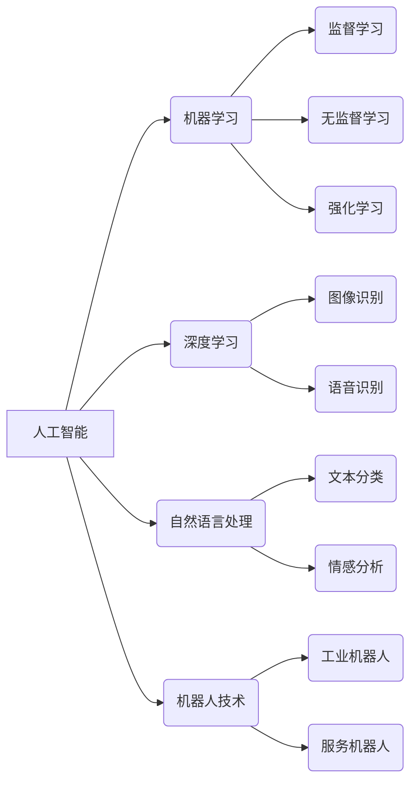

> 人工智能，机器学习，深度学习，自然语言处理，机器人技术，情感识别，伦理问题，未来趋势

## 1. 背景介绍

电影《我，机器人》以未来世界为背景，讲述了机器人与人类之间的关系，以及人工智能发展带来的伦理问题。影片中，机器人拥有高度的智能，能够学习、思考、情感表达，甚至可以模仿人类的行为。这部电影引发了人们对人工智能未来的思考，也让我们看到了人工智能技术发展带来的机遇与挑战。

## 2. 核心概念与联系

### 2.1 人工智能 (AI)

人工智能是指模拟人类智能行为的计算机系统。它涵盖了多个领域，包括机器学习、深度学习、自然语言处理、计算机视觉等。

### 2.2 机器学习 (ML)

机器学习是人工智能的一个子领域，它使计算机能够从数据中学习，并根据学习到的知识进行预测或决策。机器学习算法可以分为监督学习、无监督学习和强化学习三种类型。

### 2.3 深度学习 (DL)

深度学习是机器学习的一个子领域，它使用多层神经网络来模拟人类大脑的学习过程。深度学习算法能够处理海量数据，并从中提取出复杂的特征，从而实现更精准的预测和决策。

### 2.4 自然语言处理 (NLP)

自然语言处理是指使计算机能够理解和处理人类语言的技术。NLP算法可以用于文本分类、情感分析、机器翻译等任务。

### 2.5 机器人技术

机器人技术是指设计、制造和控制机器人的技术。机器人可以执行各种任务，例如工业自动化、医疗服务、家务服务等。

**核心概念与联系流程图:**



## 3. 核心算法原理 & 具体操作步骤

### 3.1 算法原理概述

在电影《我，机器人》中，机器人拥有高度的智能，这得益于先进的人工智能算法。这些算法可以模拟人类的学习、思考和决策过程，使机器人能够理解人类语言、识别图像、做出判断并执行任务。

### 3.2 算法步骤详解

1. **数据收集和预处理:** 首先，需要收集大量的数据来训练人工智能模型。这些数据可以是文本、图像、音频等多种形式。数据预处理包括清洗、转换和格式化数据，使其能够被模型理解。

2. **模型选择和训练:** 选择合适的机器学习算法，并根据训练数据对模型进行训练。训练过程是一个迭代的过程，模型会不断学习和优化，直到达到预设的性能指标。

3. **模型评估和调优:** 对训练好的模型进行评估，并根据评估结果进行调优。调优过程包括调整模型参数、增加训练数据等，以提高模型的性能。

4. **模型部署和应用:** 将训练好的模型部署到实际应用场景中，例如机器人控制系统、语音助手等。

### 3.3 算法优缺点

**优点:**

* **自动化:** 人工智能算法可以自动化许多任务，提高效率和准确性。
* **个性化:** 人工智能算法可以根据用户的需求进行个性化定制，提供更贴心的服务。
* **创新:** 人工智能算法可以帮助人类探索新的领域，推动科技创新。

**缺点:**

* **数据依赖:** 人工智能算法需要大量的数据进行训练，数据质量直接影响模型性能。
* **黑盒效应:** 一些人工智能算法过于复杂，难以理解其内部工作机制，这可能导致模型不可解释性。
* **伦理问题:** 人工智能技术的发展可能带来伦理问题，例如算法偏见、隐私泄露等。

### 3.4 算法应用领域

人工智能算法已广泛应用于各个领域，例如：

* **医疗保健:** 疾病诊断、药物研发、个性化治疗
* **金融服务:** 风险评估、欺诈检测、投资决策
* **交通运输:** 自动驾驶、交通流量预测、物流优化
* **教育:** 个性化学习、智能辅导、自动批改

## 4. 数学模型和公式 & 详细讲解 & 举例说明

### 4.1 数学模型构建

在人工智能领域，数学模型是描述算法逻辑和关系的工具。常见的数学模型包括线性回归、逻辑回归、支持向量机、神经网络等。

### 4.2 公式推导过程

例如，线性回归模型的目标是找到一条直线，将输入特征与输出标签关联起来。其数学公式如下：

$$y = w_0 + w_1x_1 + w_2x_2 + ... + w_nx_n$$

其中：

* $y$ 是输出标签
* $w_0, w_1, w_2, ..., w_n$ 是模型参数
* $x_1, x_2, ..., x_n$ 是输入特征

通过最小化预测值与真实值的误差，可以求解出模型参数。

### 4.3 案例分析与讲解

假设我们想要预测房屋价格，输入特征包括房屋面积、房间数量、地理位置等。我们可以使用线性回归模型来构建预测模型。通过训练数据，模型可以学习到房屋价格与输入特征之间的关系，并预测新房子的价格。

## 5. 项目实践：代码实例和详细解释说明

### 5.1 开发环境搭建

为了实现人工智能项目，需要搭建相应的开发环境。常见的开发环境包括Python、TensorFlow、PyTorch等。

### 5.2 源代码详细实现

以下是一个使用Python和Scikit-learn库实现线性回归模型的代码示例：

```python
from sklearn.linear_model import LinearRegression
from sklearn.model_selection import train_test_split
from sklearn.metrics import mean_squared_error

# 加载数据
data = ...

# 将数据分为训练集和测试集
X_train, X_test, y_train, y_test = train_test_split(data.drop('price', axis=1), data['price'], test_size=0.2)

# 创建线性回归模型
model = LinearRegression()

# 训练模型
model.fit(X_train, y_train)

# 预测测试集数据
y_pred = model.predict(X_test)

# 计算模型性能
mse = mean_squared_error(y_test, y_pred)
print(f'Mean Squared Error: {mse}')
```

### 5.3 代码解读与分析

这段代码首先加载数据，然后将数据分为训练集和测试集。接着，创建线性回归模型并训练模型。最后，使用训练好的模型预测测试集数据，并计算模型性能。

### 5.4 运行结果展示

运行代码后，会输出模型的性能指标，例如均方误差。

## 6. 实际应用场景

### 6.1 智能客服

人工智能技术可以用于构建智能客服系统，自动回答用户问题，提供24小时服务。

### 6.2 个性化推荐

人工智能算法可以分析用户的行为数据，并推荐个性化的商品、服务或内容。

### 6.3 自动化办公

人工智能可以自动化许多办公任务，例如文档处理、邮件分类、日程安排等，提高工作效率。

### 6.4 未来应用展望

人工智能技术的发展将带来更多新的应用场景，例如：

* **医疗诊断:** 人工智能可以辅助医生进行疾病诊断，提高诊断准确率。
* **自动驾驶:** 人工智能可以实现自动驾驶汽车，提高交通安全和效率。
* **个性化教育:** 人工智能可以提供个性化的学习方案，帮助学生更好地掌握知识。

## 7. 工具和资源推荐

### 7.1 学习资源推荐

* **在线课程:** Coursera、edX、Udacity等平台提供丰富的机器学习和深度学习课程。
* **书籍:** 《深度学习》、《机器学习实战》等书籍是学习人工智能的经典教材。
* **开源项目:** TensorFlow、PyTorch等开源项目提供了丰富的代码示例和学习资源。

### 7.2 开发工具推荐

* **Python:** 人工智能开发的常用编程语言。
* **TensorFlow:** 深度学习框架。
* **PyTorch:** 深度学习框架。
* **Scikit-learn:** 机器学习库。

### 7.3 相关论文推荐

* **《ImageNet Classification with Deep Convolutional Neural Networks》**
* **《Attention Is All You Need》**
* **《BERT: Pre-training of Deep Bidirectional Transformers for Language Understanding》**

## 8. 总结：未来发展趋势与挑战

### 8.1 研究成果总结

近年来，人工智能技术取得了长足的进步，在各个领域都取得了显著的应用成果。

### 8.2 未来发展趋势

未来，人工智能技术将朝着以下方向发展：

* **更强大的计算能力:** 更强大的计算能力将推动人工智能模型的规模和复杂度不断提升。
* **更丰富的传感器数据:** 更丰富的传感器数据将为人工智能模型提供更全面的信息，使其能够更好地理解世界。
* **更强的解释性:** 人工智能模型的解释性将得到加强，使其能够更好地被人类理解和信任。

### 8.3 面临的挑战

人工智能技术的发展也面临着一些挑战：

* **数据安全和隐私保护:** 人工智能模型需要大量的数据进行训练，如何保护数据安全和隐私是一个重要的挑战。
* **算法偏见:** 人工智能算法可能存在偏见，导致不公平的结果。如何解决算法偏见是一个重要的研究课题。
* **伦理问题:** 人工智能技术的发展可能带来伦理问题，例如人工智能的责任和义务、人工智能的控制等。

### 8.4 研究展望

未来，人工智能研究将继续深入，探索人工智能的更深层次问题，并推动人工智能技术更好地服务于人类社会。

## 9. 附录：常见问题与解答

### 9.1 什么是机器学习？

机器学习是人工智能的一个子领域，它使计算机能够从数据中学习，并根据学习到的知识进行预测或决策。

### 9.2 深度学习与机器学习有什么区别？

深度学习是机器学习的一个子领域，它使用多层神经网络来模拟人类大脑的学习过程。深度学习算法能够处理海量数据，并从中提取出复杂的特征，从而实现更精准的预测和决策。

### 9.3 人工智能技术有哪些应用场景？

人工智能技术已广泛应用于各个领域，例如医疗保健、金融服务、交通运输、教育等。

### 9.4 人工智能技术的发展趋势是什么？

未来，人工智能技术将朝着更强大的计算能力、更丰富的传感器数据、更强的解释性等方向发展。

### 9.5 人工智能技术面临哪些挑战？

人工智能技术的发展也面临着一些挑战，例如数据安全和隐私保护、算法偏见、伦理问题等。


作者：禅与计算机程序设计艺术 / Zen and the Art of Computer Programming 
<end_of_turn>