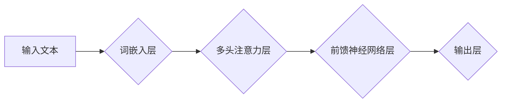

> 自然语言处理，神经网络，深度学习，Transformer，BERT，GPT，语言模型，文本生成，机器翻译

## 1. 背景介绍

自然语言处理（NLP）是人工智能领域的一个重要分支，旨在使计算机能够理解、处理和生成人类语言。传统的NLP方法主要依赖于手工设计的规则和特征工程，但随着深度学习的兴起，基于神经网络的NLP模型取得了显著的突破。

神经网络能够学习语言的复杂模式和语义关系，从而实现更准确、更自然的语言理解和生成。近年来，深度学习在NLP领域的应用取得了令人瞩目的成果，例如机器翻译、文本摘要、问答系统、情感分析等。

## 2. 核心概念与联系

### 2.1 神经网络

神经网络是一种模仿人脑神经网络结构的计算模型。它由多个层级的神经元组成，每个神经元接收来自前一层神经元的输入，并通过权重进行加权求和，然后通过激活函数进行非线性变换，最后输出到下一层神经元。

神经网络通过训练学习权重，从而能够从数据中学习模式和关系。

### 2.2 自然语言处理

自然语言处理（NLP）的目标是使计算机能够理解、处理和生成人类语言。NLP任务包括：

* **文本分类:** 将文本分类到预定义的类别中，例如情感分析、主题分类等。
* **文本摘要:** 从长文本中提取关键信息生成短文本摘要。
* **机器翻译:** 将文本从一种语言翻译成另一种语言。
* **问答系统:** 回答用户提出的问题。
* **文本生成:** 生成新的文本，例如文章、故事、对话等。

### 2.3 深度学习

深度学习是机器学习的一个子领域，它使用多层神经网络来学习数据中的复杂模式。深度学习模型能够自动学习特征，无需人工特征工程，从而在许多任务中取得了优异的性能。

### 2.4 Transformer

Transformer是一种新的神经网络架构，专门设计用于处理序列数据，例如文本。Transformer引入了注意力机制，能够学习文本中单词之间的长距离依赖关系，从而在许多NLP任务中取得了突破性的性能。

**Mermaid 流程图**



## 3. 核心算法原理 & 具体操作步骤

### 3.1 算法原理概述

Transformer模型的核心是注意力机制和多头注意力机制。注意力机制能够学习文本中单词之间的重要关系，并赋予它们不同的权重。多头注意力机制则使用多个注意力头来捕捉不同类型的语义关系。

Transformer模型还包含编码器和解码器两个部分。编码器负责将输入文本编码成一个隐藏表示，解码器则根据编码后的表示生成输出文本。

### 3.2 算法步骤详解

1. **词嵌入:** 将输入文本中的每个单词映射到一个低维向量空间中，称为词嵌入。
2. **编码器:** 将词嵌入输入到编码器中，编码器包含多个Transformer块，每个块包含多头注意力层和前馈神经网络层。
3. **解码器:** 将编码器的输出作为输入，解码器也包含多个Transformer块，并使用注意力机制来生成输出文本。
4. **输出层:** 将解码器的输出映射到目标词汇表，得到最终的输出文本。

### 3.3 算法优缺点

**优点:**

* 能够学习长距离依赖关系，在许多NLP任务中取得了优异的性能。
* 并行计算能力强，训练速度快。

**缺点:**

* 参数量大，训练成本高。
* 对训练数据要求高。

### 3.4 算法应用领域

Transformer模型在许多NLP任务中取得了突破性的成果，例如：

* **机器翻译:** Google Translate、DeepL等机器翻译系统都使用了Transformer模型。
* **文本摘要:** BART、T5等模型能够生成高质量的文本摘要。
* **问答系统:** BERT、XLNet等模型能够回答用户提出的问题。
* **文本生成:** GPT-3、LaMDA等模型能够生成高质量的文本，例如文章、故事、对话等。

## 4. 数学模型和公式 & 详细讲解 & 举例说明

### 4.1 数学模型构建

Transformer模型的数学模型主要包括以下几个部分：

* **词嵌入层:** 将每个单词映射到一个低维向量空间中。
* **多头注意力层:** 学习文本中单词之间的注意力权重。
* **前馈神经网络层:** 对每个单词的隐藏表示进行非线性变换。

### 4.2 公式推导过程

**多头注意力机制公式:**

$$
Attention(Q, K, V) = softmax(\frac{QK^T}{\sqrt{d_k}})V
$$

其中：

* $Q$：查询矩阵
* $K$：键矩阵
* $V$：值矩阵
* $d_k$：键向量的维度
* $softmax$：softmax函数

**多头注意力机制的计算过程:**

1. 将查询矩阵 $Q$、键矩阵 $K$ 和值矩阵 $V$ 分别线性变换，得到 $Q'$, $K'$ 和 $V'$。
2. 计算每个单词对所有其他单词的注意力权重，使用公式 $Attention(Q', K', V')$。
3. 将注意力权重与值矩阵 $V'$ 相乘，得到每个单词的上下文表示。
4. 将多个注意力头的上下文表示拼接起来，得到最终的上下文表示。

### 4.3 案例分析与讲解

**举例说明:**

假设我们有一个句子 "The cat sat on the mat"，我们使用多头注意力机制来计算每个单词对其他单词的注意力权重。

例如，对于单词 "cat"，它会对 "the"、"sat"、"on"、"the"、"mat" 等单词有不同的注意力权重。

注意力权重高的单词表示与 "cat" 相关性强，注意力权重低的单词表示与 "cat" 相关性弱。

## 5. 项目实践：代码实例和详细解释说明

### 5.1 开发环境搭建

* Python 3.6+
* TensorFlow 或 PyTorch
* CUDA 和 cuDNN (可选，用于GPU加速)

### 5.2 源代码详细实现

```python
import tensorflow as tf

# 定义词嵌入层
embedding_layer = tf.keras.layers.Embedding(vocab_size, embedding_dim)

# 定义多头注意力层
attention_layer = tf.keras.layers.MultiHeadAttention(num_heads=8, key_dim=64)

# 定义前馈神经网络层
ffn_layer = tf.keras.layers.Dense(units=128, activation="relu")

# 定义Transformer块
def transformer_block(inputs, num_heads, key_dim):
    attention_output = attention_layer(inputs, inputs, inputs)
    ffn_output = ffn_layer(attention_output)
    return ffn_output

# 定义编码器
encoder_layers = [transformer_block(inputs, num_heads, key_dim) for _ in range(num_layers)]

# 定义解码器
decoder_layers = [transformer_block(inputs, num_heads, key_dim) for _ in range(num_layers)]

# 定义模型
model = tf.keras.Sequential([
    embedding_layer,
    encoder_layers,
    decoder_layers,
    tf.keras.layers.Dense(vocab_size, activation="softmax")
])

# 编译模型
model.compile(optimizer="adam", loss="sparse_categorical_crossentropy", metrics=["accuracy"])

# 训练模型
model.fit(train_data, train_labels, epochs=10)
```

### 5.3 代码解读与分析

* **词嵌入层:** 将每个单词映射到一个低维向量空间中，例如Word2Vec或GloVe。
* **多头注意力层:** 学习文本中单词之间的注意力权重，并使用多个注意力头来捕捉不同类型的语义关系。
* **前馈神经网络层:** 对每个单词的隐藏表示进行非线性变换。
* **Transformer块:** 将注意力层和前馈神经网络层组合在一起，构成一个基本的Transformer模块。
* **编码器和解码器:** 编码器负责将输入文本编码成一个隐藏表示，解码器则根据编码后的表示生成输出文本。

### 5.4 运行结果展示

训练完成后，可以使用模型对新的文本进行预测，例如机器翻译、文本摘要、问答系统等。

## 6. 实际应用场景

### 6.1 机器翻译

Transformer模型在机器翻译领域取得了显著的成果，例如Google Translate、DeepL等机器翻译系统都使用了Transformer模型。

### 6.2 文本摘要

BART、T5等模型能够生成高质量的文本摘要，可以用于新闻报道、学术论文等领域的文本压缩。

### 6.3 问答系统

BERT、XLNet等模型能够回答用户提出的问题，可以用于客服机器人、搜索引擎等领域的应用。

### 6.4 文本生成

GPT-3、LaMDA等模型能够生成高质量的文本，例如文章、故事、对话等，可以用于内容创作、聊天机器人等领域的应用。

### 6.5 未来应用展望

Transformer模型在NLP领域的应用前景广阔，未来可能在以下领域得到更广泛的应用：

* **个性化推荐:** 根据用户的阅读历史和偏好，推荐个性化的文章、书籍、电影等。
* **自动写作:** 自动生成新闻报道、广告文案、诗歌等文本。
* **代码生成:** 自动生成代码，提高开发效率。
* **跨语言理解:** 突破语言障碍，实现不同语言之间的理解和交流。

## 7. 工具和资源推荐

### 7.1 学习资源推荐

* **书籍:**
    * "Deep Learning" by Ian Goodfellow, Yoshua Bengio, and Aaron Courville
    * "Speech and Language Processing" by Daniel Jurafsky and James H. Martin
* **在线课程:**
    * Coursera: "Deep Learning Specialization" by Andrew Ng
    * Stanford CS224N: "Natural Language Processing with Deep Learning"

### 7.2 开发工具推荐

* **TensorFlow:** 开源深度学习框架，支持GPU加速。
* **PyTorch:** 开源深度学习框架，灵活易用。
* **Hugging Face Transformers:** 提供预训练的Transformer模型和工具。

### 7.3 相关论文推荐

* "Attention Is All You Need" by Vaswani et al. (2017)
* "BERT: Pre-training of Deep Bidirectional Transformers for Language Understanding" by Devlin et al. (2018)
* "GPT-3: Language Models are Few-Shot Learners" by Brown et al. (2020)

## 8. 总结：未来发展趋势与挑战

### 8.1 研究成果总结

近年来，基于Transformer的NLP模型取得了显著的突破，在许多NLP任务中取得了优异的性能。

### 8.2 未来发展趋势

* **模型规模的进一步扩大:** 更大的模型规模能够学习更复杂的语言模式，从而提高模型性能。
* **模型效率的提升:** 降低模型参数量和计算复杂度，提高模型的效率和可部署性。
* **多模态学习:** 将文本与其他模态数据（例如图像、音频）结合起来，实现更全面的语言理解。
* **可解释性研究:** 研究Transformer模型的决策过程，提高模型的可解释性和可信度。

### 8.3 面临的挑战

* **数据获取和标注:** 训练高质量的Transformer模型需要大量的标注数据，数据获取和标注成本高昂。
* **模型训练成本:** 大型Transformer模型的训练成本很高，需要强大的计算资源。
* **模型偏见和公平性:** Transformer模型可能存在偏见和不公平性，需要进行更深入的研究和解决措施。

### 8.4 研究展望

未来，Transformer模型将在NLP领域继续发挥重要作用，并推动人工智能技术的进一步发展。

## 9. 附录：常见问题与解答

**Q1: Transformer模型的优势是什么？**