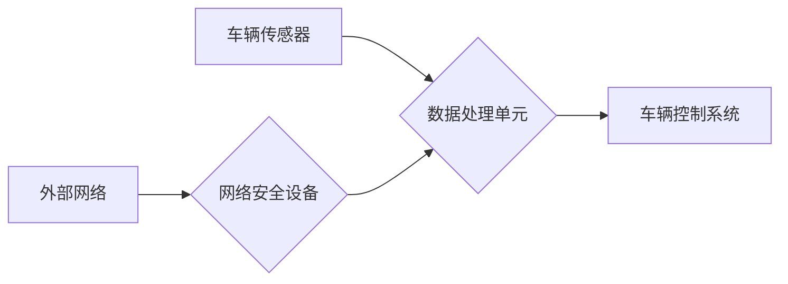

> 自动驾驶, 网络安全, 车联网, 威胁模型, 安全架构, 攻击防御, 隐私保护, 漏洞检测, 恶意软件, 数据加密

## 1. 背景介绍

自动驾驶技术作为未来交通运输的重要发展方向，其核心是通过传感器、计算平台和控制系统实现车辆自主行驶。然而，随着自动驾驶系统的复杂性和网络连接程度的不断提高，其网络安全问题也日益突出。车辆网络安全防护已成为自动驾驶技术发展和推广的关键保障。

**1.1 自动驾驶技术发展现状**

自动驾驶技术经历了从感知、决策到控制的逐步发展，目前已进入L3级自动驾驶的应用阶段。L3级自动驾驶车辆在特定条件下能够实现自动驾驶，但仍需驾驶员随时准备接管车辆控制。未来，随着技术进步和法规完善，L4和L5级自动驾驶将逐步实现商业化应用。

**1.2 自动驾驶网络安全面临的挑战**

自动驾驶系统依赖于大量的传感器数据、通信网络和计算平台，这些环节都可能成为攻击目标。常见的网络安全威胁包括：

* **数据篡改:** 攻击者可以篡改车辆传感器数据，导致车辆失控或发生事故。
* **拒绝服务攻击:** 攻击者可以发起拒绝服务攻击，使车辆无法正常行驶。
* **恶意软件感染:** 攻击者可以利用漏洞将恶意软件植入车辆系统，窃取数据或控制车辆。
* **隐私泄露:** 车辆收集的个人数据可能被攻击者窃取，侵犯用户隐私。

## 2. 核心概念与联系

**2.1 车联网安全架构**

车联网安全架构通常包括以下几个关键层级：

* **物理层:** 包括车辆的硬件设备、传感器和通信模块。
* **网络层:** 包括车辆之间的无线通信网络和与外部网络的连接。
* **应用层:** 包括自动驾驶系统、信息娱乐系统和车辆管理系统等应用软件。

**2.2 威胁模型**

威胁模型是分析潜在安全威胁的一种方法，它可以帮助我们识别可能发生的攻击场景和攻击者的动机。常见的自动驾驶车辆网络安全威胁模型包括：

* **MITRE ATT&CK for Automotive:** 基于MITRE ATT&CK框架，针对汽车行业的威胁模型。
* **NIST Cybersecurity Framework for Connected Vehicles:** 由美国国家标准与技术研究院（NIST）发布的连接车辆网络安全框架。

**2.3 安全控制措施**

为了应对网络安全威胁，自动驾驶车辆需要采用多种安全控制措施，例如：

* **身份验证和授权:** 确保只有授权用户才能访问车辆系统。
* **数据加密:** 保护车辆数据在传输和存储过程中的安全。
* **入侵检测和防御:** 检测和防御网络攻击。
* **漏洞管理:** 及时修复系统漏洞。

**2.4 Mermaid 流程图**



## 3. 核心算法原理 & 具体操作步骤

**3.1 算法原理概述**

自动驾驶车辆网络安全防护涉及多种算法和技术，例如：

* **密码学算法:** 用于数据加密、身份验证和签名验证。
* **机器学习算法:** 用于入侵检测、恶意软件识别和异常行为检测。
* **安全协议:** 用于车辆之间安全通信和数据交换。

**3.2 算法步骤详解**

以数据加密为例，其具体操作步骤如下：

1. **密钥生成:** 生成用于加密和解密数据的密钥对。
2. **数据加密:** 使用私钥对数据进行加密，生成密文。
3. **数据传输:** 将密文传输到接收方。
4. **数据解密:** 使用公钥解密密文，恢复原始数据。

**3.3 算法优缺点**

不同的算法具有不同的优缺点，需要根据实际应用场景选择合适的算法。例如，对称加密算法速度快，但密钥管理较为复杂；非对称加密算法密钥管理相对简单，但速度较慢。

**3.4 算法应用领域**

自动驾驶车辆网络安全防护算法广泛应用于以下领域：

* **车辆数据加密:** 保护车辆传感器数据、驾驶记录和用户隐私。
* **车辆身份验证:** 确保车辆的身份合法性。
* **车辆通信安全:** 保证车辆之间安全通信。
* **车辆软件更新安全:** 防止恶意软件攻击。

## 4. 数学模型和公式 & 详细讲解 & 举例说明

**4.1 数学模型构建**

车辆网络安全防护可以建模为一个博弈论问题，其中攻击者和防御者是参与者，攻击目标是窃取数据或控制车辆，防御目标是保护数据和车辆安全。

**4.2 公式推导过程**

可以使用概率论和统计学方法来分析攻击者的成功概率和防御者的成功概率。例如，可以计算攻击者窃取数据的成功概率，以及防御者检测攻击的成功概率。

**4.3 案例分析与讲解**

假设攻击者试图通过网络攻击窃取车辆的传感器数据。我们可以使用以下公式来计算攻击者的成功概率：

$$P_{success} = P_{attack} \times P_{vulnerability} \times P_{exploitation}$$

其中：

* $P_{attack}$ 是攻击者发起攻击的概率。
* $P_{vulnerability}$ 是车辆系统存在漏洞的概率。
* $P_{exploitation}$ 是攻击者利用漏洞成功窃取数据的概率。

通过分析这些概率，我们可以评估攻击者的成功风险，并采取相应的防御措施。

## 5. 项目实践：代码实例和详细解释说明

**5.1 开发环境搭建**

自动驾驶车辆网络安全防护项目可以使用多种开发环境搭建，例如：

* **虚拟机:** 使用虚拟机软件创建模拟的车辆网络环境。
* **云平台:** 使用云平台提供的虚拟机和网络服务搭建环境。

**5.2 源代码详细实现**

以下是一个简单的车辆数据加密代码示例，使用Python语言实现：

```python
from cryptography.fernet import Fernet

# 生成密钥对
key = Fernet.generate_key()
cipher = Fernet(key)

# 加密数据
message = "This is a secret message".encode()
encrypted_message = cipher.encrypt(message)

# 解密数据
decrypted_message = cipher.decrypt(encrypted_message)
print(decrypted_message.decode())
```

**5.3 代码解读与分析**

这段代码使用Python的Fernet库实现数据加密。首先，生成一个密钥对，其中私钥用于加密，公钥用于解密。然后，使用私钥加密数据，生成密文。最后，使用公钥解密密文，恢复原始数据。

**5.4 运行结果展示**

运行这段代码后，会输出加密后的密文，以及解密后的原始数据。

## 6. 实际应用场景

**6.1 自动驾驶车辆数据安全**

自动驾驶车辆收集大量的传感器数据，这些数据包含车辆位置、速度、方向等敏感信息。数据加密可以保护这些数据免受攻击者窃取。

**6.2 车辆远程控制安全**

远程控制功能可以方便用户远程操作车辆，但同时也存在安全风险。身份验证和授权机制可以确保只有授权用户才能远程控制车辆。

**6.3 车辆软件更新安全**

车辆软件更新可以提升车辆性能和安全性，但恶意软件攻击也可能通过软件更新渠道传播。软件更新安全机制可以防止恶意软件攻击。

**6.4 未来应用展望**

随着自动驾驶技术的不断发展，车辆网络安全防护将变得更加重要。未来，我们将看到更多新的安全技术和应用场景，例如：

* **人工智能驱动的安全防护:** 利用人工智能技术，实现更智能、更有效的安全防护。
* **区块链技术应用:** 利用区块链技术的去中心化和不可篡改特性，提升车辆网络安全。
* **联邦学习:** 利用联邦学习技术，在不泄露敏感数据的情况下，训练安全模型。

## 7. 工具和资源推荐

**7.1 学习资源推荐**

* **NIST Cybersecurity Framework for Connected Vehicles:** https://www.nist.gov/cyberframework/connected-vehicles
* **MITRE ATT&CK for Automotive:** https://attack.mitre.org/matrices/automotive/
* **SAE International J3061:** https://standards.sae.org/j3061/

**7.2 开发工具推荐**

* **Docker:** https://www.docker.com/
* **Kubernetes:** https://kubernetes.io/
* **OWASP ZAP:** https://owasp.org/www-project-zap/

**7.3 相关论文推荐**

* **Securing Connected and Autonomous Vehicles: A Comprehensive Survey**
* **A Survey on Security and Privacy Issues in Autonomous Vehicles**
* **Towards Secure and Reliable Autonomous Driving: A Comprehensive Review**

## 8. 总结：未来发展趋势与挑战

**8.1 研究成果总结**

自动驾驶车辆网络安全防护研究取得了显著进展，涌现出多种安全算法、安全架构和安全工具。

**8.2 未来发展趋势**

未来，自动驾驶车辆网络安全防护将朝着以下方向发展：

* **更加智能化:** 利用人工智能技术，实现更智能、更有效的安全防护。
* **更加协同化:** 建立车辆、网络和云平台之间的安全协同机制。
* **更加可信赖:** 通过安全认证和标准化，提升车辆网络安全可信赖度。

**8.3 面临的挑战**

自动驾驶车辆网络安全防护仍然面临着许多挑战，例如：

* **技术复杂性:** 自动驾驶系统复杂度高，安全防护难度大。
* **安全标准缺失:** 目前缺乏统一的自动驾驶车辆网络安全标准。
* **法律法规不完善:** 自动驾驶车辆网络安全相关的法律法规尚不完善。

**8.4 研究展望**

未来，我们需要继续加强自动驾驶车辆网络安全防护的研究，探索新的安全技术和解决方案，为自动驾驶技术的健康发展提供保障。

## 9. 附录：常见问题与解答

**9.1 如何保护车辆数据安全？**

可以使用数据加密、身份验证和授权等技术保护车辆数据安全。

**9.2 如何防止恶意软件攻击？**

可以使用漏洞扫描、恶意软件检测和安全更新等技术防止恶意软件攻击。

**9.3 如何应对网络攻击？**

可以使用入侵检测系统、防火墙和安全响应机制等技术应对网络攻击。


作者：禅与计算机程序设计艺术 / Zen and the Art of Computer Programming 
<end_of_turn>