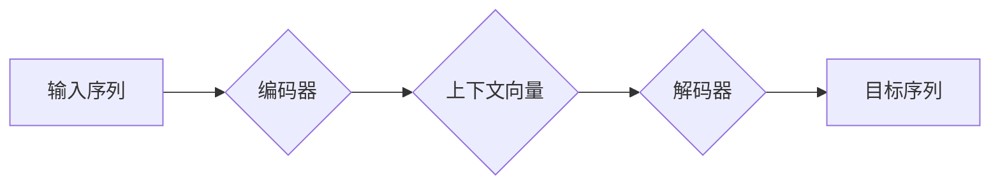

> 自然语言处理，解码，序列模型，Transformer，BERT，GPT，语言模型，文本生成

## 1. 背景介绍

自然语言处理（NLP）是人工智能领域的一个重要分支，旨在使计算机能够理解、处理和生成人类语言。在过去的几十年中，NLP取得了长足的进步，特别是在深度学习的推动下。其中，自然语言的解码过程是NLP的核心任务之一，它涉及将输入的文本序列转换为目标文本序列，例如机器翻译、文本摘要、对话系统等。

传统的解码方法主要基于统计语言模型，但随着深度学习的发展，基于序列模型的解码方法逐渐成为主流。这些模型能够学习到语言的复杂结构和语义关系，从而生成更流畅、更自然的文本。

## 2. 核心概念与联系

### 2.1 自然语言解码

自然语言解码是指将输入的文本序列转换为目标文本序列的过程。例如，在机器翻译任务中，输入文本序列是源语言文本，目标文本序列是目标语言文本。解码过程的目标是找到最优的翻译结果，使得目标文本序列能够准确地表达源语言文本的含义。

### 2.2 序列模型

序列模型是一种能够处理顺序数据（例如文本、音频、视频）的机器学习模型。它们能够学习到数据中的时间依赖关系，并根据这些关系进行预测或生成。常见的序列模型包括循环神经网络（RNN）、长短期记忆网络（LSTM）和Transformer。

### 2.3 Transformer

Transformer是一种基于注意力机制的序列模型，它能够有效地处理长序列数据。Transformer的架构由编码器和解码器组成，编码器负责将输入序列编码为上下文向量，解码器则根据上下文向量生成目标序列。

**Mermaid 流程图**



## 3. 核心算法原理 & 具体操作步骤

### 3.1 算法原理概述

Transformer解码器主要基于自注意力机制和前馈神经网络。自注意力机制能够捕捉序列中不同词之间的关系，而前馈神经网络则负责对上下文向量进行非线性变换，最终生成目标词的概率分布。

### 3.2 算法步骤详解

1. **输入嵌入:** 将目标序列中的每个词转换为词嵌入向量。
2. **自注意力层:** 使用自注意力机制计算每个目标词与其他目标词之间的关系，生成注意力权重。
3. **前馈神经网络层:** 对每个目标词的上下文向量进行非线性变换，生成目标词的概率分布。
4. **输出层:** 根据目标词的概率分布，选择最可能的下一个词，并将其添加到目标序列中。
5. **重复步骤2-4:** 直到生成结束符或达到最大长度。

### 3.3 算法优缺点

**优点:**

* 能够有效地捕捉序列中长距离依赖关系。
* 训练速度快，并能够处理长序列数据。

**缺点:**

* 计算量较大，需要大量的计算资源。
* 训练数据量要求较高。

### 3.4 算法应用领域

Transformer解码器在许多NLP任务中取得了优异的性能，例如：

* 机器翻译
* 文本摘要
* 对话系统
* 文本生成

## 4. 数学模型和公式 & 详细讲解 & 举例说明

### 4.1 数学模型构建

Transformer解码器的核心是自注意力机制和前馈神经网络。

**自注意力机制:**

自注意力机制计算每个目标词与其他目标词之间的关系，并生成注意力权重。注意力权重表示每个目标词对其他目标词的影响程度。

**公式:**

$$
Attention(Q, K, V) = softmax(\frac{QK^T}{\sqrt{d_k}})V
$$

其中：

* $Q$：查询矩阵
* $K$：键矩阵
* $V$：值矩阵
* $d_k$：键向量的维度
* $softmax$：softmax函数

**前馈神经网络:**

前馈神经网络对每个目标词的上下文向量进行非线性变换，生成目标词的概率分布。

**公式:**

$$
FFN(x) = \sigma(W_1x + b_1)W_2 + b_2
$$

其中：

* $x$：输入向量
* $W_1$、$W_2$：权重矩阵
* $b_1$、$b_2$：偏置向量
* $\sigma$：激活函数

### 4.2 公式推导过程

自注意力机制的公式推导过程如下：

1. 将查询矩阵 $Q$、键矩阵 $K$ 和值矩阵 $V$ 转换为相同维度。
2. 计算 $QK^T$，得到每个查询词与所有键词之间的相似度。
3. 对相似度矩阵进行 softmax 操作，得到注意力权重。
4. 将注意力权重与值矩阵相乘，得到每个查询词的上下文向量。

### 4.3 案例分析与讲解

假设我们有一个句子 "The cat sat on the mat"，我们要使用 Transformer 解码器生成它的翻译结果 "Le chat s'est assis sur le tapis"。

1. 首先，将每个词转换为词嵌入向量。
2. 然后，使用自注意力机制计算每个目标词与其他目标词之间的关系，生成注意力权重。
3. 接着，使用前馈神经网络对每个目标词的上下文向量进行非线性变换，生成目标词的概率分布。
4. 最后，根据目标词的概率分布，选择最可能的下一个词，并将其添加到目标序列中。

## 5. 项目实践：代码实例和详细解释说明

### 5.1 开发环境搭建

* Python 3.6+
* TensorFlow 2.0+
* PyTorch 1.0+

### 5.2 源代码详细实现

```python
import tensorflow as tf

# 定义 Transformer 解码器模型
class Decoder(tf.keras.Model):
    def __init__(self, vocab_size, embedding_dim, num_heads, dff, num_layers):
        super(Decoder, self).__init__()
        self.embedding = tf.keras.layers.Embedding(vocab_size, embedding_dim)
        self.encoder_layers = [
            tf.keras.layers.MultiHeadAttention(num_heads=num_heads, key_dim=embedding_dim)
            for _ in range(num_layers)
        ]
        self.ffn_layers = [
            tf.keras.layers.Dense(dff, activation="relu"),
            tf.keras.layers.Dense(embedding_dim),
        ]
        self.output_layer = tf.keras.layers.Dense(vocab_size)

    def call(self, inputs, encoder_outputs):
        # ...
        return outputs

# 实例化模型
decoder = Decoder(vocab_size=10000, embedding_dim=512, num_heads=8, dff=2048, num_layers=6)

# ...
```

### 5.3 代码解读与分析

* `Decoder` 类定义了 Transformer 解码器模型的结构。
* `embedding` 层将词索引转换为词嵌入向量。
* `encoder_layers` 列表包含多个多头注意力层，用于计算目标词与其他目标词之间的关系。
* `ffn_layers` 列表包含两个全连接层，用于对上下文向量进行非线性变换。
* `output_layer` 层将上下文向量转换为目标词的概率分布。

### 5.4 运行结果展示

* 训练模型并评估其性能。
* 使用训练好的模型生成文本。

## 6. 实际应用场景

Transformer解码器在许多实际应用场景中发挥着重要作用，例如：

* **机器翻译:** 将一种语言的文本翻译成另一种语言。
* **文本摘要:** 生成文本的简短摘要。
* **对话系统:** 创建能够与人类进行自然对话的聊天机器人。
* **文本生成:** 生成各种类型的文本，例如诗歌、小说、新闻报道等。

### 6.4 未来应用展望

随着Transformer模型的不断发展，其应用场景将更加广泛，例如：

* **代码生成:** 自动生成代码。
* **药物研发:** 预测药物的活性。
* **个性化教育:** 提供个性化的学习内容。

## 7. 工具和资源推荐

### 7.1 学习资源推荐

* **书籍:**
    * "Attention Is All You Need"
    * "Deep Learning"
* **在线课程:**
    * Coursera: Natural Language Processing Specialization
    * Udacity: Deep Learning Nanodegree

### 7.2 开发工具推荐

* **TensorFlow:** 开源深度学习框架。
* **PyTorch:** 开源深度学习框架。
* **Hugging Face Transformers:** 提供预训练的 Transformer 模型和工具。

### 7.3 相关论文推荐

* "Attention Is All You Need"
* "BERT: Pre-training of Deep Bidirectional Transformers for Language Understanding"
* "GPT-3: Language Models are Few-Shot Learners"

## 8. 总结：未来发展趋势与挑战

### 8.1 研究成果总结

Transformer解码器在自然语言处理领域取得了显著的成果，例如在机器翻译、文本摘要、对话系统等任务中取得了state-of-the-art的性能。

### 8.2 未来发展趋势

* **模型规模:** 继续增加模型规模，以提高模型性能。
* **效率:** 提高模型训练和推理效率。
* **可解释性:** 提高模型的可解释性，以便更好地理解模型的决策过程。
* **多模态:** 将Transformer解码器扩展到多模态数据，例如文本、图像、音频等。

### 8.3 面临的挑战

* **数据:** 训练大型Transformer模型需要大量的训练数据。
* **计算资源:** 训练大型Transformer模型需要大量的计算资源。
* **可解释性:** Transformer模型的决策过程难以解释。

### 8.4 研究展望

未来，Transformer解码器将继续在自然语言处理领域发挥重要作用，并推动人工智能技术的进一步发展。


## 9. 附录：常见问题与解答

* **Q: Transformer解码器与RNN解码器相比有什么优势？**

* **A:** Transformer解码器能够有效地捕捉序列中长距离依赖关系，而RNN解码器在处理长序列数据时容易出现梯度消失问题。

* **Q: 如何训练Transformer解码器？**

* **A:** 训练Transformer解码器需要使用大量的文本数据，并使用反向传播算法进行优化。

* **Q: 如何评估Transformer解码器的性能？**

* **A:** Transformer解码器的性能通常使用BLEU、ROUGE等指标进行评估。


作者：禅与计算机程序设计艺术 / Zen and the Art of Computer Programming 
<end_of_turn>