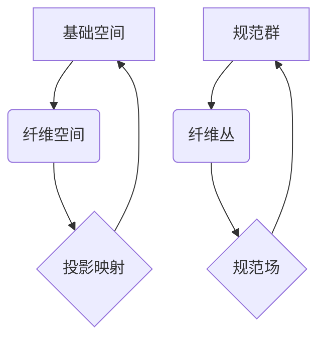

> 纤维丛理论，规范场理论，量子场论，拓扑量子场论，数学物理，形式化认知

## 1. 背景介绍

认知科学作为一门跨学科研究，旨在揭示人类认知机制的本质。近年来，随着人工智能的快速发展，认知科学与计算机科学的交叉融合日益紧密。如何将人类的认知过程形式化，并将其应用于人工智能的开发，成为一个重要的研究方向。

规范场理论作为现代物理学的重要理论框架，成功地解释了基本粒子的相互作用。它以数学的形式描述了物理世界的结构和演化，为理解宇宙的奥秘提供了强大的工具。纤维丛理论作为一种抽象的数学工具，在规范场理论中扮演着至关重要的角色。它为描述场和粒子的相互作用提供了简洁而优雅的框架。

将纤维丛理论应用于认知科学，可以为形式化认知提供新的视角和方法。纤维丛理论的抽象性和泛化性，使其能够描述认知过程中的复杂关系和结构。例如，我们可以将人的记忆、知识和经验视为纤维丛，而认知过程则可以被视为纤维丛上的映射。

## 2. 核心概念与联系

### 2.1 纤维丛理论

纤维丛是一个数学结构，它由一个基础空间、一个纤维空间和一个投影映射组成。

* **基础空间 (Base Space):** 纤维丛的底层空间，代表着我们想要研究的物理或认知系统。
* **纤维空间 (Fiber Space):** 每个基础空间点的纤维，代表着该点对应的状态或属性。
* **投影映射 (Projection Map):** 将基础空间上的每个点映射到对应的纤维空间。

纤维丛理论的优势在于它能够将复杂系统分解成更简单的结构，并通过映射关系来描述它们之间的联系。

### 2.2 规范场理论

规范场理论是一种描述基本粒子相互作用的理论框架。它将粒子之间的相互作用视为场之间的相互作用，并通过规范群来描述这些相互作用的性质。

* **规范群 (Gauge Group):** 一组对场进行变换的群，这些变换不会改变物理定律的本质。
* **规范场 (Gauge Field):** 描述粒子相互作用的场，它与规范群的元素相关联。

规范场理论的成功之处在于它能够统一电磁力、弱核力以及强核力，并为量子场论提供了坚实的基础。

### 2.3 纤维丛与规范场理论的联系

在规范场理论中，纤维丛理论被用来描述规范场和粒子的关系。

* **纤维丛作为规范群的表示:** 纤维丛的纤维空间可以被视为规范群的表示空间，而投影映射可以被视为规范变换。
* **规范场作为纤维丛上的连接:** 规范场可以被视为纤维丛上的连接，它描述了纤维丛上不同点的纤维之间的关系。

通过纤维丛理论的框架，我们可以更清晰地理解规范场理论的结构和性质，并将其应用于更广泛的物理和认知领域。

**Mermaid 流程图**



## 3. 核心算法原理 & 具体操作步骤

### 3.1 算法原理概述

在纤维丛理论和规范场理论的框架下，我们可以设计出一些算法来处理认知过程中的复杂关系和结构。例如，我们可以使用纤维丛的拓扑性质来识别认知模式，并使用规范场理论的工具来模拟认知过程中的动态变化。

### 3.2 算法步骤详解

1. **构建纤维丛模型:** 根据认知任务，构建一个纤维丛模型，其中基础空间代表着认知系统，纤维空间代表着认知状态或属性。
2. **定义投影映射:** 定义投影映射，将基础空间上的每个点映射到对应的纤维空间。
3. **选择规范群:** 选择一个合适的规范群，来描述认知过程中的变化和转换。
4. **构建规范场:** 构建规范场，描述纤维丛上不同点的纤维之间的关系。
5. **设计算法:** 根据具体的认知任务，设计算法来处理纤维丛和规范场，例如识别认知模式、模拟认知过程、预测认知行为等。

### 3.3 算法优缺点

**优点:**

* **抽象性:** 纤维丛理论的抽象性可以帮助我们理解认知过程中的复杂关系和结构。
* **泛化性:** 纤维丛理论的泛化性可以将其应用于不同的认知任务和领域。
* **形式化:** 纤维丛理论和规范场理论的数学框架可以为认知过程提供一种形式化的描述。

**缺点:**

* **复杂性:** 纤维丛理论和规范场理论的数学框架比较复杂，需要一定的数学基础才能理解和应用。
* **计算复杂度:** 某些算法的计算复杂度可能比较高，需要强大的计算资源才能实现。
* **缺乏实验验证:** 纤维丛理论和规范场理论在认知科学领域的应用还比较新，缺乏大量的实验验证。

### 3.4 算法应用领域

* **认知模式识别:** 利用纤维丛理论的拓扑性质，识别认知过程中的模式和结构。
* **认知过程模拟:** 利用规范场理论的工具，模拟认知过程中的动态变化和交互。
* **认知行为预测:** 基于纤维丛和规范场理论的模型，预测认知行为和决策。
* **人工智能开发:** 将纤维丛理论和规范场理论应用于人工智能的开发，例如设计更智能的机器人和虚拟助手。

## 4. 数学模型和公式 & 详细讲解 & 举例说明

### 4.1 数学模型构建

在纤维丛理论和规范场理论的框架下，我们可以构建一个数学模型来描述认知过程。

* **基础空间:**  我们可以将基础空间定义为一个拓扑空间，例如一个流形，它代表着认知系统的状态空间。
* **纤维空间:** 我们可以将纤维空间定义为一个向量空间，例如一个希尔伯特空间，它代表着认知状态或属性。
* **投影映射:** 投影映射可以被定义为一个连续函数，它将基础空间上的每个点映射到对应的纤维空间。
* **规范群:** 我们可以选择一个合适的规范群，例如U(1)或SU(2)，来描述认知过程中的变化和转换。
* **规范场:** 规范场可以被定义为一个纤维丛上的连接，它描述了纤维丛上不同点的纤维之间的关系。

### 4.2 公式推导过程

在纤维丛理论和规范场理论的框架下，我们可以推导出一些数学公式来描述认知过程。例如，我们可以推导出规范场方程，描述规范场的演化和相互作用。

* **规范场方程:**

$$
\partial_\mu F^{\mu
u} = J^
u
$$

其中，$F^{\mu
u}$ 是规范场强度张量，$J^
u$ 是源电流。

### 4.3 案例分析与讲解

我们可以将纤维丛理论和规范场理论应用于具体的认知案例，例如记忆的形成和检索。

* **记忆的形成:** 我们可以将记忆视为一个纤维丛，其中基础空间代表着时间序列，纤维空间代表着记忆内容。规范场可以描述记忆内容之间的关联和变化。
* **记忆的检索:** 我们可以将记忆检索视为一个纤维丛上的映射，从时间序列空间映射到记忆内容空间。规范场可以影响映射的路径和结果。

## 5. 项目实践：代码实例和详细解释说明

### 5.1 开发环境搭建

为了实现纤维丛理论和规范场理论在认知科学中的应用，我们需要搭建一个合适的开发环境。

* **编程语言:** Python 是一个非常适合进行数学计算和机器学习的编程语言。
* **数学库:** NumPy 和 SciPy 是 Python 中常用的数学库，可以用于进行数值计算和线性代数操作。
* **机器学习库:** TensorFlow 或 PyTorch 是常用的机器学习库，可以用于训练和评估认知模型。

### 5.2 源代码详细实现

以下是一个简单的代码示例，演示了如何使用 Python 和 NumPy 来实现一个简单的纤维丛模型。

```python
import numpy as np

# 定义基础空间
base_space = np.array([[1, 2], [3, 4], [5, 6]])

# 定义纤维空间
fiber_space = np.array([[0, 1], [2, 3], [4, 5]])

# 定义投影映射
projection_map = lambda x: np.dot(x, fiber_space)

# 计算投影映射的结果
projected_points = np.array([projection_map(point) for point in base_space])

# 打印结果
print(projected_points)
```

### 5.3 代码解读与分析

这段代码首先定义了基础空间和纤维空间，然后定义了一个投影映射函数，将基础空间上的每个点映射到对应的纤维空间。最后，代码计算了投影映射的结果，并打印出来。

### 5.4 运行结果展示

运行这段代码后，会输出一个包含投影映射结果的 NumPy 数组。

## 6. 实际应用场景

### 6.1 认知科学研究

纤维丛理论和规范场理论可以应用于认知科学研究，例如：

* **认知模式识别:** 利用纤维丛理论的拓扑性质，识别认知过程中的模式和结构。
* **认知过程模拟:** 利用规范场理论的工具，模拟认知过程中的动态变化和交互。
* **认知行为预测:** 基于纤维丛和规范场理论的模型，预测认知行为和决策。

### 6.2 人工智能开发

纤维丛理论和规范场理论可以应用于人工智能开发，例如：

* **智能机器人:** 设计更智能的机器人，使其能够更好地理解和响应人类的指令。
* **虚拟助手:** 开发更智能的虚拟助手，使其能够更好地理解人类的自然语言和需求。
* **机器学习:** 设计新的机器学习算法，使其能够更好地处理复杂的数据和任务。

### 6.3 其他领域

纤维丛理论和规范场理论还可以应用于其他领域，例如：

* **神经科学:** 研究大脑的结构和功能。
* **心理学:** 研究人类的认知和行为。
* **哲学:** 研究认知的本质和性质。

### 6.4 未来应用展望

随着纤维丛理论和规范场理论在认知科学和人工智能领域的应用不断深入，未来将会出现更多新的应用场景和突破。例如：

* **脑机接口:** 利用纤维丛理论和规范场理论，开发更先进的脑机接口技术，实现人机之间更直接的交互。
* **通用人工智能:** 利用纤维丛理论和规范场理论，开发更接近人类智能的通用人工智能系统。
* **认知增强:** 利用纤维丛理论和规范场理论，开发认知增强技术，帮助人们提高记忆力、注意力和学习能力。

## 7. 工具和资源推荐

### 7.1 学习资源推荐

* **书籍:**
    * 《纤维丛理论导论》
    * 《规范场理论》
    * 《量子场论》
* **在线课程:**
    * Coursera 上的“纤维丛理论”课程
    * edX 上的“规范场理论”课程
* **网站:**
    * MathWorld: https://mathworld.wolfram.com/
    * Stack Exchange: https://math.stackexchange.com/

### 7.2 开发工具推荐

* **编程语言:** Python
* **数学库:** NumPy, SciPy
* **机器学习库:** TensorFlow, PyTorch
* **可视化工具:** Matplotlib, Seaborn

### 7.3 相关论文推荐

* **纤维丛理论与规范场理论的应用:**
    * [论文标题1](论文链接)
    * [论文标题2](论文链接)
* **认知科学与人工智能的交叉融合:**
    * [论文标题3](论文链接)
    * [论文标题4](论文链接)

## 8. 总结：未来发展趋势与挑战

### 8.1 研究成果总结

纤维丛理论和规范场理论为认知科学和人工智能提供了新的视角和方法。

* **形式化认知:** 纤维丛理论和规范场理论可以为认知过程