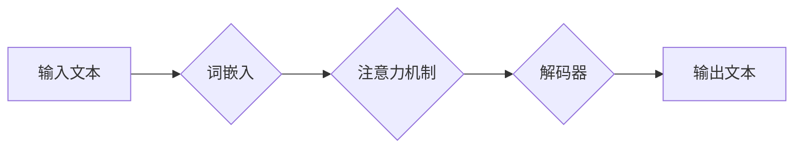

> 大语言模型，认知障碍，语言理解，思维模拟，人工智能，深度学习

## 1. 背景介绍

近年来，大语言模型（LLM）的蓬勃发展，让人们对人工智能的认知能力有了新的认识。这些模型能够以惊人的速度和准确率处理和生成人类语言，在文本生成、翻译、问答等领域展现出强大的能力。然而，尽管LLM取得了令人瞩目的成就，但我们仍然需要认识到，语言仅仅是思维的表达方式，它并不等同于思维本身。LLM虽然能够模拟语言的结构和语法，但它缺乏真正的理解和思考能力。

## 2. 核心概念与联系

**2.1 语言与思维的本质区别**

语言是人类用来表达思想、交流信息的工具，它具有结构化、符号化的特点。思维则是人类大脑进行抽象、逻辑推理、创造想象等复杂认知活动的总过程。语言是思维的产物，也是思维的载体，但它们并非完全等同。

**2.2 大语言模型的运作机制**

LLM基于深度学习算法，通过训练海量文本数据，学习语言的统计规律和语义关系。它们能够预测下一个词语，生成流畅的文本，并完成各种语言任务。然而，LLM的运作机制本质上是基于统计模式的，它并没有真正理解文本的含义，更没有像人类一样进行思考和推理。

**2.3 认知障碍的本质**

LLM的“认知障碍”指的是它在理解和处理复杂信息、进行抽象思考、解决新问题等方面存在局限性。这主要是因为LLM缺乏人类大脑的生物学基础和认知能力。

**Mermaid 流程图**



## 3. 核心算法原理 & 具体操作步骤

**3.1 算法原理概述**

LLM的核心算法主要包括词嵌入、注意力机制和解码器。

* **词嵌入:** 将每个词语映射到一个低维向量空间，使得语义相近的词语拥有相似的向量表示。
* **注意力机制:** 允许模型在处理文本时，关注不同部分的词语，并根据其重要性分配不同的权重。
* **解码器:** 基于词嵌入和注意力机制的输出，生成下一个词语，并逐步构建完整的文本。

**3.2 算法步骤详解**

1. 将输入文本分割成一个个词语。
2. 使用词嵌入模型将每个词语映射到向量空间。
3. 利用注意力机制计算每个词语在句子中的重要性权重。
4. 根据权重信息，解码器生成下一个词语。
5. 重复步骤4，直到生成完整的文本。

**3.3 算法优缺点**

* **优点:** 能够处理大量文本数据，生成流畅自然的文本，在文本生成、翻译、问答等领域表现出色。
* **缺点:** 缺乏真正的理解和思考能力，容易受到训练数据的影响，难以处理复杂逻辑和抽象概念。

**3.4 算法应用领域**

* 文本生成：小说、诗歌、剧本等。
* 机器翻译：将一种语言翻译成另一种语言。
* 问答系统：回答用户提出的问题。
* 对话系统：与用户进行自然语言对话。

## 4. 数学模型和公式 & 详细讲解 & 举例说明

**4.1 数学模型构建**

LLM的训练过程可以看作是一个最大化似然估计的问题。目标是找到一个模型参数，使得模型能够生成与真实文本最相似的文本序列。

**4.2 公式推导过程**

假设训练数据为一个文本序列 $\{x_1, x_2, ..., x_T\}$, 其中每个 $x_i$ 代表一个词语。模型的目标是最大化以下似然函数：

$$
P(x_1, x_2, ..., x_T | \theta) = \prod_{t=1}^{T} P(x_t | x_1, x_2, ..., x_{t-1}, \theta)
$$

其中 $\theta$ 代表模型的参数。

**4.3 案例分析与讲解**

例如，在训练一个文本生成模型时，我们可以使用交叉熵损失函数来衡量模型的预测结果与真实文本之间的差异。

$$
Loss = - \sum_{t=1}^{T} \log P(x_t | x_1, x_2, ..., x_{t-1}, \theta)
$$

模型的训练过程就是通过不断调整参数 $\theta$，使得损失函数的值最小化。

## 5. 项目实践：代码实例和详细解释说明

**5.1 开发环境搭建**

* Python 3.7+
* PyTorch 或 TensorFlow
* CUDA 和 cuDNN

**5.2 源代码详细实现**

```python
import torch
import torch.nn as nn

class Transformer(nn.Module):
    def __init__(self, vocab_size, embedding_dim, num_heads, num_layers):
        super(Transformer, self).__init__()
        self.embedding = nn.Embedding(vocab_size, embedding_dim)
        self.transformer_encoder = nn.TransformerEncoder(nn.TransformerEncoderLayer(embedding_dim, num_heads), num_layers)

    def forward(self, x):
        x = self.embedding(x)
        x = self.transformer_encoder(x)
        return x
```

**5.3 代码解读与分析**

* `Transformer` 类定义了一个基于 Transformer 架构的语言模型。
* `embedding` 层将词语映射到向量空间。
* `transformer_encoder` 层是一个多头注意力机制和前馈神经网络组成的编码器，用于处理文本序列。

**5.4 运行结果展示**

训练好的模型可以用于文本生成、机器翻译等任务。

## 6. 实际应用场景

**6.1 文本生成**

LLM可以用于生成各种类型的文本，例如小说、诗歌、剧本等。

**6.2 机器翻译**

LLM可以用于将一种语言翻译成另一种语言。

**6.3 问答系统**

LLM可以用于回答用户提出的问题。

**6.4 未来应用展望**

LLM在未来将有更广泛的应用场景，例如：

* 个性化教育
* 智能客服
* 代码生成
* 药物研发

## 7. 工具和资源推荐

**7.1 学习资源推荐**

* 《深度学习》
* 《自然语言处理》
* Hugging Face

**7.2 开发工具推荐**

* PyTorch
* TensorFlow
* OpenAI API

**7.3 相关论文推荐**

* Attention Is All You Need
* BERT: Pre-training of Deep Bidirectional Transformers for Language Understanding

## 8. 总结：未来发展趋势与挑战

**8.1 研究成果总结**

LLM取得了令人瞩目的成就，但仍然存在一些局限性。

**8.2 未来发展趋势**

* 更大的模型规模
* 更强大的计算能力
* 更丰富的训练数据
* 更有效的训练算法

**8.3 面临的挑战**

* 训练成本高昂
* 缺乏可解释性
* 容易受到攻击

**8.4 研究展望**

未来研究将重点关注解决LLM的认知障碍问题，使其能够更像人类一样理解和思考。

## 9. 附录：常见问题与解答

**9.1 如何训练一个LLM？**

训练一个LLM需要大量的计算资源和训练数据。可以使用开源的预训练模型作为基础，进行微调。

**9.2 如何评估LLM的性能？**

可以使用各种指标来评估LLM的性能，例如困惑度、BLEU分数等。

**9.3 LLM是否会取代人类？**

LLM是一种强大的工具，但它并不会取代人类。人类拥有创造力、想象力和情感等独特的能力，这些能力是LLM无法替代的。

作者：禅与计算机程序设计艺术 / Zen and the Art of Computer Programming


<end_of_turn>