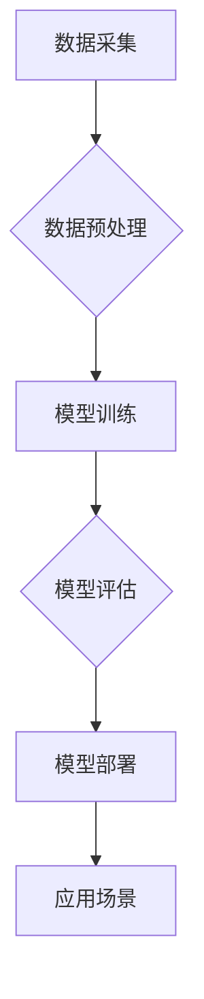

> 人工智能，软件 2.0，深度学习，机器学习，自然语言处理，计算机视觉，哲学思考

## 1. 背景介绍

软件已经深刻地改变了我们的生活，从智能手机到云计算，从自动驾驶到医疗诊断，软件无处不在。然而，我们所熟知的软件，本质上是基于人类逻辑和指令编写的静态程序。随着人工智能技术的飞速发展，我们正站在一个新的技术革命的边缘，即“软件 2.0”时代。

软件 2.0 的核心是将人工智能技术融入软件开发，赋予软件更强的学习、适应和自主决策能力。它不再是简单的指令执行者，而是能够理解、学习和进化的人工智能实体。

## 2. 核心概念与联系

**2.1 人工智能 (AI)**

人工智能是指模拟人类智能行为的计算机系统。它涵盖了广泛的领域，包括机器学习、深度学习、自然语言处理、计算机视觉等。

**2.2 机器学习 (ML)**

机器学习是人工智能的一个子领域，它使计算机能够从数据中学习，无需明确编程。通过训练模型，机器学习算法可以识别模式、做出预测和执行决策。

**2.3 深度学习 (DL)**

深度学习是机器学习的一个更高级的子领域，它使用多层神经网络来模拟人类大脑的结构和功能。深度学习算法能够处理海量数据，并从中提取更深层次的特征，从而实现更准确的预测和更复杂的决策。

**2.4 软件 2.0 架构**

软件 2.0 的架构将人工智能技术与传统软件开发方法相结合。它通常包括以下几个关键组件：

* **数据层:** 提供训练机器学习模型的数据。
* **模型层:** 包含训练好的机器学习模型。
* **应用层:** 将机器学习模型应用于实际场景，提供智能功能。

**2.5 Mermaid 流程图**



## 3. 核心算法原理 & 具体操作步骤

### 3.1 算法原理概述

深度学习算法的核心是多层神经网络。神经网络由许多相互连接的神经元组成，每个神经元接收输入信号，对其进行处理，并输出信号。通过调整神经元之间的连接权重，深度学习算法可以学习数据中的模式和关系。

### 3.2 算法步骤详解

1. **数据准备:** 收集和预处理训练数据，将其转换为深度学习模型可以理解的格式。
2. **网络结构设计:** 根据任务需求设计神经网络的结构，包括层数、神经元数量和激活函数等。
3. **模型训练:** 使用训练数据训练神经网络模型，通过反向传播算法调整神经元之间的连接权重，使模型的预测结果越来越准确。
4. **模型评估:** 使用测试数据评估模型的性能，并根据评估结果进行模型调优。
5. **模型部署:** 将训练好的模型部署到实际应用场景中，用于进行预测或决策。

### 3.3 算法优缺点

**优点:**

* 能够处理海量数据，并从中提取更深层次的特征。
* 能够实现更准确的预测和更复杂的决策。
* 能够不断学习和进化，随着数据量的增加，模型性能会不断提升。

**缺点:**

* 需要大量的训练数据和计算资源。
* 模型训练过程复杂，需要专业的技术人员进行操作。
* 模型的解释性较差，难以理解模型的决策过程。

### 3.4 算法应用领域

深度学习算法已广泛应用于各个领域，包括：

* **计算机视觉:** 图像识别、物体检测、图像分割、人脸识别等。
* **自然语言处理:** 文本分类、情感分析、机器翻译、对话系统等。
* **语音识别:** 语音转文本、语音助手等。
* **医疗诊断:** 疾病预测、图像分析、药物研发等。
* **金融分析:** 风险评估、欺诈检测、投资预测等。

## 4. 数学模型和公式 & 详细讲解 & 举例说明

### 4.1 数学模型构建

深度学习模型通常使用神经网络来模拟人类大脑的结构和功能。神经网络由许多相互连接的神经元组成，每个神经元接收输入信号，对其进行处理，并输出信号。

**4.1.1 神经元模型:**

一个简单的感知器模型可以表示一个神经元：

$$
y = f(w^T x + b)
$$

其中：

* $x$ 是输入向量。
* $w$ 是权重向量。
* $b$ 是偏置项。
* $f$ 是激活函数。

**4.1.2 多层神经网络:**

多层神经网络由多个感知器层组成，每一层的神经元接收上一层的输出作为输入。

### 4.2 公式推导过程

深度学习模型的训练过程是通过反向传播算法来实现的。反向传播算法的核心思想是通过计算误差信号，并反向传播到各层神经元，调整神经元之间的连接权重，使得模型的预测结果越来越准确。

**4.2.1 损失函数:**

损失函数用于衡量模型的预测结果与真实值的差异。常用的损失函数包括均方误差 (MSE) 和交叉熵 (Cross-Entropy)。

**4.2.2 反向传播算法:**

反向传播算法通过计算梯度，更新神经元之间的连接权重。梯度表示损失函数对权重的导数，方向指示权重需要调整的方向，大小指示调整的幅度。

### 4.3 案例分析与讲解

**4.3.1 图像分类:**

假设我们有一个图像分类任务，目标是将图像分类为不同的类别，例如猫、狗、鸟等。我们可以使用深度学习模型，例如卷积神经网络 (CNN)，来实现这个任务。CNN 可以学习图像中的特征，并将其用于分类。

**4.3.2 文本生成:**

我们可以使用深度学习模型，例如循环神经网络 (RNN)，来生成文本。RNN 可以学习文本中的语法和语义关系，并根据输入的文本生成新的文本。

## 5. 项目实践：代码实例和详细解释说明

### 5.1 开发环境搭建

* Python 3.x
* TensorFlow 或 PyTorch
* Jupyter Notebook

### 5.2 源代码详细实现

```python
import tensorflow as tf

# 定义模型结构
model = tf.keras.models.Sequential([
    tf.keras.layers.Dense(128, activation='relu', input_shape=(784,)),
    tf.keras.layers.Dense(10, activation='softmax')
])

# 编译模型
model.compile(optimizer='adam',
              loss='sparse_categorical_crossentropy',
              metrics=['accuracy'])

# 训练模型
model.fit(x_train, y_train, epochs=10)

# 评估模型
loss, accuracy = model.evaluate(x_test, y_test)
print('Test loss:', loss)
print('Test accuracy:', accuracy)
```

### 5.3 代码解读与分析

* **模型结构:** 代码定义了一个简单的多层感知器模型，包含两层全连接层。第一层有 128 个神经元，使用 ReLU 激活函数。第二层有 10 个神经元，使用 softmax 激活函数，用于分类 10 个类别。
* **模型编译:** 代码使用 Adam 优化器、稀疏类别交叉熵损失函数和准确率作为评估指标来编译模型。
* **模型训练:** 代码使用训练数据训练模型 10 个 epochs。
* **模型评估:** 代码使用测试数据评估模型的性能，并打印测试损失和准确率。

### 5.4 运行结果展示

运行代码后，会输出模型的训练过程和测试结果，包括训练损失、训练准确率、测试损失和测试准确率。

## 6. 实际应用场景

### 6.1 智能客服

深度学习算法可以用于构建智能客服系统，能够理解用户的自然语言输入，并提供准确的回复。

### 6.2 个性化推荐

深度学习算法可以分析用户的行为数据，并推荐个性化的商品、服务或内容。

### 6.3 自动驾驶

深度学习算法可以用于自动驾驶汽车的视觉感知、路径规划和决策控制。

### 6.4 医疗诊断

深度学习算法可以辅助医生进行疾病诊断，例如识别肿瘤、分析医学影像等。

### 6.5 未来应用展望

随着人工智能技术的不断发展，软件 2.0 将在更多领域得到应用，例如：

* **教育:** 个性化学习、智能辅导。
* **金融:** 风险管理、欺诈检测。
* **制造业:** 自动化生产、质量控制。
* **能源:** 能源预测、智能调度。

## 7. 工具和资源推荐

### 7.1 学习资源推荐

* **书籍:**
    * 深度学习 (Deep Learning) - Ian Goodfellow, Yoshua Bengio, Aaron Courville
    * 人工智能：一种现代方法 (Artificial Intelligence: A Modern Approach) - Stuart Russell, Peter Norvig
* **在线课程:**
    * Coursera: 深度学习 Specialization
    * Udacity: 
    * fast.ai: Practical Deep Learning for Coders

### 7.2 开发工具推荐

* **TensorFlow:** 开源深度学习框架。
* **PyTorch:** 开源深度学习框架。
* **Keras:** 高级深度学习 API，可以运行在 TensorFlow、Theano 或 CNTK 后端。

### 7.3 相关论文推荐

* **ImageNet Classification with Deep Convolutional Neural Networks** - Alex Krizhevsky, Ilya Sutskever, Geoffrey E. Hinton
* **Sequence to Sequence Learning with Neural Networks** - Ilya Sutskever, Oriol Vinyals, Quoc V. Le

## 8. 总结：未来发展趋势与挑战

### 8.1 研究成果总结

软件 2.0 的发展取得了显著的成果，人工智能技术已在各个领域得到广泛应用。深度学习算法的不断发展，使得人工智能系统能够处理更复杂的任务，并取得更准确的结果。

### 8.2 未来发展趋势

* **更强大的计算能力:** 随着硬件技术的进步，人工智能系统将能够处理更大的数据，并学习更复杂的模型。
* **更有效的算法:** 研究人员将继续开发更有效的深度学习算法，提高人工智能系统的性能和效率。
* **更广泛的应用场景:** 人工智能技术将应用于更多领域，例如医疗、教育、金融等。

### 8.3 面临的挑战

* **数据隐私和安全:** 人工智能系统需要大量数据进行训练，如何保护数据隐私和安全是一个重要的挑战。
* **算法可解释性:** 深度学习算法的决策过程难以理解，如何提高算法的可解释性是一个重要的研究方向。
* **伦理问题:** 人工智能技术的应用可能会带来一些伦理问题，例如算法偏见、工作岗位替代等，需要认真思考和解决。

### 8.4 研究展望

未来，人工智能技术将继续发展，并对我们的生活产生更深远的影响。我们需要加强对人工智能技术的研究和应用，并积极应对其带来的挑战，以确保人工智能技术能够造福人类。

## 9. 附录：常见问题与解答

**9.1 如何选择合适的深度学习框架？**

选择深度学习框架需要根据具体的需求和应用场景进行考虑。TensorFlow 和 PyTorch 是两个流行的深度学习框架，各有优缺点。

**9.2 如何处理数据不平衡问题？**

数据不平衡问题是指训练数据中某些类别的数据比其他类别的数据多。可以使用数据增强、权重调整等方法来解决数据不平衡问题。

**9.3 如何评估深度学习模型的性能？**

常用的评估指标包括准确率、召回率、F1-score 等。选择合适的评估指标需要根据具体任务的需求进行考虑。


作者：禅与计算机程序设计艺术 / Zen and the Art of Computer Programming 
<end_of_turn>