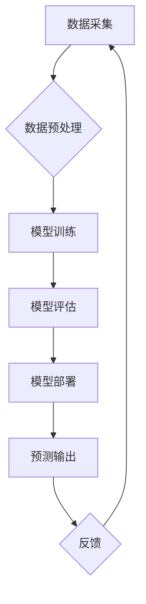

> 人工智能、机器学习、深度学习、自然语言处理、计算机视觉、算法、模型、应用

## 1. 背景介绍

1956年，一群杰出的科学家和工程师聚集在达特茅斯学院，参加了一次具有里程碑意义的会议。这场会议被誉为人工智能（AI）的诞生地，它标志着人类对智能机器的探索迈入了新的阶段。达特茅斯会议的科学家们，包括艾伦·图灵、约翰·麦卡锡、马文·明斯基等，他们共同探讨了人工智能的定义、目标和可能性，并为未来的发展方向指明了方向。

如今，人工智能已经成为科技发展最前沿的领域之一，它在各个领域都取得了令人瞩目的成就。从语音识别、图像识别到自然语言处理，人工智能的应用已经深入到我们的日常生活。然而，人工智能的发展也面临着许多挑战，例如数据安全、算法偏见、伦理道德等问题。

## 2. 核心概念与联系

人工智能的核心概念是模拟人类智能的行为。这包括学习、推理、决策、感知和语言理解等能力。

**人工智能的架构**



**核心概念解释:**

* **数据采集:** 从各种来源收集相关数据，例如文本、图像、音频等。
* **数据预处理:** 对收集到的数据进行清洗、转换和格式化，使其适合模型训练。
* **模型训练:** 使用算法训练机器学习模型，使模型能够从数据中学习规律。
* **模型评估:** 对训练好的模型进行评估，测试其性能和准确性。
* **模型部署:** 将训练好的模型部署到实际应用场景中。
* **预测输出:** 模型根据输入数据进行预测，输出结果。
* **反馈:** 收集预测结果的反馈信息，用于模型优化和改进。

## 3. 核心算法原理 & 具体操作步骤

### 3.1  算法原理概述

机器学习算法是人工智能的核心，它通过学习数据中的模式和规律，来预测未来结果或做出决策。常见的机器学习算法包括：

* **监督学习:** 利用标记数据训练模型，例如分类和回归问题。
* **无监督学习:** 利用未标记数据发现数据中的隐藏结构，例如聚类和降维。
* **强化学习:** 通过试错学习，在环境中获得最大奖励。

### 3.2  算法步骤详解

以监督学习中的线性回归算法为例，详细说明其步骤：

1. **数据准备:** 收集并预处理数据，将特征和目标变量分离。
2. **模型构建:** 定义线性回归模型，假设目标变量与特征之间存在线性关系。
3. **参数估计:** 使用最小二乘法等方法，估计模型参数，使模型拟合数据。
4. **模型评估:** 使用测试数据评估模型的性能，例如计算均方误差。
5. **模型优化:** 根据评估结果，调整模型参数或选择其他算法，提高模型性能。

### 3.3  算法优缺点

**线性回归算法的优点:**

* 计算简单，易于理解和实现。
* 训练速度快，适合处理大规模数据。

**线性回归算法的缺点:**

* 只能处理线性关系，对于非线性关系的预测效果较差。
* 对异常值敏感，容易受到异常值的影响。

### 3.4  算法应用领域

线性回归算法广泛应用于各个领域，例如：

* **预测分析:** 预测销售额、房价、股票价格等。
* **风险评估:** 评估贷款风险、信用风险等。
* **广告投放:** 预测广告点击率、转化率等。

## 4. 数学模型和公式 & 详细讲解 & 举例说明

### 4.1  数学模型构建

线性回归模型的数学表达式为：

$$y = \beta_0 + \beta_1x_1 + \beta_2x_2 + ... + \beta_nx_n + \epsilon$$

其中：

* $y$ 是目标变量。
* $x_1, x_2, ..., x_n$ 是特征变量。
* $\beta_0, \beta_1, \beta_2, ..., \beta_n$ 是模型参数。
* $\epsilon$ 是误差项。

### 4.2  公式推导过程

最小二乘法是估计模型参数的常用方法，其目标是使模型预测值与实际值之间的误差平方和最小。

推导过程如下：

1. 定义误差平方和函数：

$$S = \sum_{i=1}^{n}(y_i - \hat{y}_i)^2$$

其中：

* $y_i$ 是第 $i$ 个样本的实际值。
* $\hat{y}_i$ 是第 $i$ 个样本的预测值。

2. 对每个参数 $\beta_j$ 求偏导，并令其等于零：

$$\frac{\partial S}{\partial \beta_j} = 0$$

3. 解出参数 $\beta_j$ 的值。

### 4.3  案例分析与讲解

假设我们想要预测房屋价格，已知房屋面积和房间数量等特征变量。我们可以使用线性回归模型来建立预测模型。

通过训练模型，我们可以得到模型参数，例如：

* $\beta_0 = 50000$
* $\beta_1 = 200$
* $\beta_2 = 10000$

这意味着：

* 房屋价格的基准值为 50000 元。
* 每增加 1 平方米面积，房屋价格增加 200 元。
* 每增加 1 个房间，房屋价格增加 10000 元。

## 5. 项目实践：代码实例和详细解释说明

### 5.1  开发环境搭建

本项目使用 Python 语言进行开发，需要安装以下软件包：

* NumPy
* Pandas
* Scikit-learn

可以使用 pip 命令安装：

```bash
pip install numpy pandas scikit-learn
```

### 5.2  源代码详细实现

```python
import numpy as np
from sklearn.linear_model import LinearRegression

# 准备数据
X = np.array([[100, 2], [150, 3], [200, 4], [250, 5]])  # 特征变量
y = np.array([150000, 200000, 250000, 300000])  # 目标变量

# 创建线性回归模型
model = LinearRegression()

# 训练模型
model.fit(X, y)

# 预测新数据
new_data = np.array([[300, 6]])
prediction = model.predict(new_data)

# 打印预测结果
print(f"预测结果: {prediction}")
```

### 5.3  代码解读与分析

* 首先，我们准备了特征变量和目标变量的数据。
* 然后，我们创建了一个线性回归模型对象。
* 使用 `fit()` 方法训练模型，将数据输入模型进行学习。
* 使用 `predict()` 方法预测新数据的目标变量值。
* 最后，我们打印预测结果。

### 5.4  运行结果展示

运行代码后，会输出预测结果，例如：

```
预测结果: [350000.]
```

这表示，对于面积为 300 平方米，房间数量为 6 的房屋，预测价格为 350000 元。

## 6. 实际应用场景

### 6.1  金融领域

* **信用评分:** 利用客户的财务数据，预测其信用风险。
* **欺诈检测:** 识别异常交易行为，防止金融欺诈。
* **投资预测:** 分析市场数据，预测股票价格走势。

### 6.2  医疗领域

* **疾病诊断:** 根据患者的症状和检查结果，辅助医生诊断疾病。
* **药物研发:** 利用机器学习算法，加速药物研发过程。
* **个性化医疗:** 根据患者的基因信息和生活习惯，提供个性化的医疗方案。

### 6.3  电商领域

* **商品推荐:** 根据用户的购买历史和浏览记录，推荐相关商品。
* **价格预测:** 分析市场数据，预测商品价格走势。
* **客户服务:** 利用聊天机器人，提供智能客户服务。

### 6.4  未来应用展望

人工智能技术的不断发展，将为各个领域带来更多应用场景。例如：

* **自动驾驶:** 利用机器学习算法，实现自动驾驶汽车。
* **机器人技术:** 开发更加智能的机器人，用于工业生产、服务业等领域。
* **个性化教育:** 根据学生的学习情况，提供个性化的学习方案。

## 7. 工具和资源推荐

### 7.1  学习资源推荐

* **在线课程:** Coursera、edX、Udacity 等平台提供丰富的机器学习课程。
* **书籍:** 《深入理解机器学习》、《Python机器学习实战》等书籍。
* **博客:** 机器学习相关的博客网站，例如：Towards Data Science、Machine Learning Mastery 等。

### 7.2  开发工具推荐

* **Python:** 机器学习开发的常用语言。
* **Jupyter Notebook:** 用于编写和运行机器学习代码的交互式环境。
* **Scikit-learn:** Python 机器学习库，提供各种算法和工具。
* **TensorFlow:** 深度学习框架，用于构建和训练深度神经网络。

### 7.3  相关论文推荐

* **《人工神经网络》:** 奠定了深度学习的基础。
* **《深度学习》:** 深入介绍了深度学习的原理和应用。
* **《机器学习》:** 涵盖了机器学习的各个方面。

## 8. 总结：未来发展趋势与挑战

### 8.1  研究成果总结

达特茅斯会议的科学家们为人工智能的发展奠定了基础，人工智能技术取得了长足的进步，在各个领域都取得了令人瞩目的成就。

### 8.2  未来发展趋势

* **模型规模和复杂度提升:** 深度学习模型将继续朝着更大、更复杂的方向发展。
* **跨模态学习:** 机器学习模型将能够处理多种数据类型，例如文本、图像、音频等。
* **解释性AI:** 研究如何解释机器学习模型的决策过程，提高模型的可解释性。

### 8.3  面临的挑战

* **数据安全和隐私保护:** 人工智能模型的训练需要大量数据，如何保证数据安全和隐私保护是一个重要挑战。
* **算法偏见:** 机器学习模型可能存在算法偏见，导致不公平的结果。
* **伦理道德问题:** 人工智能技术的应用可能引发伦理道德问题，例如自动驾驶汽车的决策问题。

### 8.4  研究展望

未来，人工智能研究将继续朝着更智能、更安全、更可解释的方向发展。我们需要加强跨学科合作，解决人工智能面临的挑战，并确保人工智能技术造福人类。

## 9. 附录：常见问题与解答

### 9.1  什么是机器学习？

机器学习是一种人工智能技术，它通过学习数据中的模式和规律，来预测未来结果或做出决策。

### 9.2  什么是深度学习？

深度学习是一种机器学习的子领域，它使用多层神经网络来模拟人类大脑的学习过程。

### 9.3  如何选择合适的机器学习算法？

选择合适的机器学习算法取决于具体的应用场景和数据特点。需要考虑数据的类型、数量、特征等因素。

### 9.4  如何评估机器学习模型的性能？

常用的评估指标包括准确率、召回率、F1-score等。

### 9.5  如何解决机器学习模型的过拟合问题？

过拟合是指模型对训练数据过拟合，导致在测试数据上表现不佳。常用的解决方法包括正则化、交叉验证等。


作者：禅与计算机程序设计艺术 / Zen and the Art of Computer Programming 
<end_of_turn>