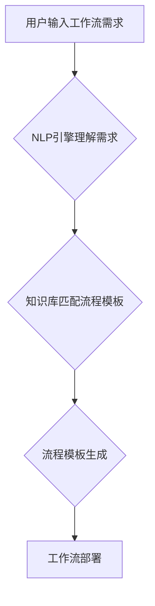
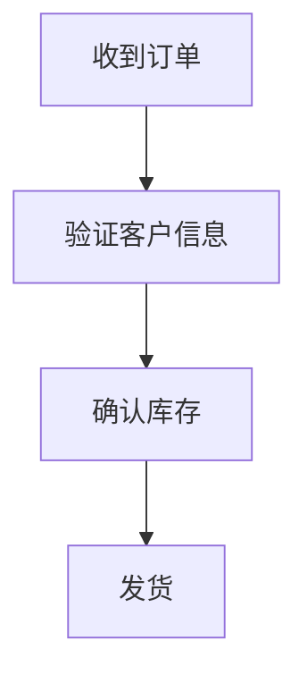

> 自然语言处理，工作流自动化，流程建模，人工智能，机器学习，低代码平台

## 1. 背景介绍

在当今数字化时代，工作流自动化已成为企业提高效率、降低成本和增强竞争力的关键驱动力。传统的流程建模方法通常依赖于专业的流程设计工具和技术人员，这导致了流程建模的门槛较高，难以满足快速变化的业务需求。

近年来，自然语言处理（NLP）技术取得了长足的进步，能够理解和生成人类语言。这为通过自然语言创建工作流提供了新的可能性。

## 2. 核心概念与联系

### 2.1 自然语言工作流建模

自然语言工作流建模是指利用自然语言描述和构建工作流的过程。它将自然语言作为工作流建模的输入和输出，无需复杂的流程图或代码编写。

### 2.2 流程建模与人工智能

流程建模与人工智能的结合可以实现更智能、更灵活的工作流自动化。人工智能技术可以帮助识别工作流中的模式和异常，并自动优化流程设计。

**Mermaid 流程图**



## 3. 核心算法原理 & 具体操作步骤

### 3.1 算法原理概述

自然语言工作流建模的核心算法通常基于以下几个方面：

* **自然语言理解（NLU）：** 将自然语言文本转换为机器可理解的结构化数据。
* **知识图谱：** 建立工作流相关的知识库，包含各种流程模板、任务类型、数据结构等信息。
* **规则引擎：** 根据用户需求和知识库中的规则，自动生成工作流流程图。
* **代码生成：** 将流程图转换为可执行的代码，实现工作流自动化。

### 3.2 算法步骤详解

1. **用户输入工作流需求：** 用户使用自然语言描述需要实现的工作流程，例如“审批流程”、“订单处理流程”等。
2. **NLP引擎理解需求：** NLP引擎对用户输入的自然语言文本进行分析，识别关键信息，例如任务类型、参与者、数据流等。
3. **知识库匹配流程模板：** 根据识别出的关键信息，知识库匹配相应的流程模板。
4. **流程模板生成：** 根据匹配到的流程模板，规则引擎根据用户需求进行调整，生成最终的工作流流程图。
5. **代码生成：** 将流程图转换为可执行的代码，实现工作流自动化。

### 3.3 算法优缺点

**优点：**

* **易用性高：** 无需专业技术知识，即可通过自然语言描述工作流。
* **灵活性强：** 可以根据业务需求灵活调整工作流设计。
* **效率提升：** 自动化工作流建模，节省时间和人力成本。

**缺点：**

* **语义理解复杂：** 自然语言的语义理解仍然是一个挑战，可能导致模型误解用户需求。
* **知识库建设困难：** 需要构建庞大的工作流知识库，才能支持更复杂的流程建模。
* **安全性问题：** 自然语言输入可能存在安全风险，需要进行严格的安全验证。

### 3.4 算法应用领域

自然语言工作流建模技术在以下领域具有广泛的应用前景：

* **企业流程自动化：** 自动化审批流程、订单处理流程、客户服务流程等。
* **软件开发：** 自动生成代码、构建测试用例、管理项目进度等。
* **数据分析：** 自动化数据清洗、数据转换、数据分析等。
* **智能客服：** 自动化客户咨询、问题解答、订单处理等。

## 4. 数学模型和公式 & 详细讲解 & 举例说明

### 4.1 数学模型构建

自然语言工作流建模可以采用基于图的数学模型来表示工作流结构。

* **节点：** 代表工作流中的任务或活动。
* **边：** 代表任务之间的依赖关系或数据流。

**图模型：**

$$G = (V, E)$$

其中：

* $V$ 是节点集合。
* $E$ 是边集合。

### 4.2 公式推导过程

工作流执行路径可以表示为图模型中的路径。

**路径：**

$$P = (v_1, v_2, ..., v_n)$$

其中：

* $v_1, v_2, ..., v_n$ 是路径上的节点。

工作流执行时间可以根据节点执行时间和边权重进行计算。

**执行时间：**

$$T = \sum_{i=1}^{n-1} w(v_i, v_{i+1}) + t(v_n)$$

其中：

* $w(v_i, v_{i+1})$ 是边 $(v_i, v_{i+1})$ 的权重，表示任务之间的时间延迟。
* $t(v_n)$ 是节点 $v_n$ 的执行时间。

### 4.3 案例分析与讲解

假设有一个简单的订单处理流程，包含以下任务：

* 收到订单
* 验证客户信息
* 确认库存
* 发货

可以将这些任务表示为图模型中的节点，边表示任务之间的依赖关系。

**图模型：**



根据节点执行时间和边权重，可以计算出订单处理流程的执行时间。

## 5. 项目实践：代码实例和详细解释说明

### 5.1 开发环境搭建

* Python 3.x
* TensorFlow 或 PyTorch
* NLTK 或 SpaCy

### 5.2 源代码详细实现

```python
# 导入必要的库
import nltk
from nltk.tokenize import word_tokenize
from nltk.tag import pos_tag

# 定义一个函数，用于解析自然语言工作流需求
def parse_workflow_requirement(text):
    # 使用 NLTK 进行分词和词性标注
    tokens = word_tokenize(text)
    pos_tags = pos_tag(tokens)

    # 识别关键信息，例如任务类型、参与者、数据流等
    # ...

    # 生成工作流流程图
    # ...

# 示例代码
requirement = "请创建一个审批流程，需要三个审批人进行审批。"
workflow = parse_workflow_requirement(requirement)
```

### 5.3 代码解读与分析

* `parse_workflow_requirement()` 函数用于解析用户输入的自然语言工作流需求。
* 使用 NLTK 库进行分词和词性标注，识别关键信息。
* 根据识别出的关键信息，生成工作流流程图。

### 5.4 运行结果展示

运行上述代码，可以生成一个简单的审批流程的工作流流程图。

## 6. 实际应用场景

### 6.1 企业流程自动化

自然语言工作流建模可以帮助企业自动化各种业务流程，例如：

* **审批流程：** 自动化文档审批、合同审批等流程。
* **订单处理流程：** 自动化订单接收、订单处理、发货等流程。
* **客户服务流程：** 自动化客户咨询、问题解答、订单处理等流程。

### 6.2 软件开发

自然语言工作流建模可以帮助软件开发团队自动化代码生成、测试用例构建、项目进度管理等流程。

### 6.3 数据分析

自然语言工作流建模可以帮助数据分析师自动化数据清洗、数据转换、数据分析等流程。

### 6.4 未来应用展望

随着自然语言处理技术的不断发展，自然语言工作流建模技术将在更多领域得到应用，例如：

* **医疗保健：** 自动化病历记录、诊断分析、治疗方案制定等流程。
* **教育：** 自动化课程设计、学生评估、个性化学习等流程。
* **金融：** 自动化风险评估、投资决策、客户服务等流程。

## 7. 工具和资源推荐

### 7.1 学习资源推荐

* **书籍：**
    * 《自然语言处理》
    * 《深度学习》
* **在线课程：**
    * Coursera 上的自然语言处理课程
    * edX 上的深度学习课程

### 7.2 开发工具推荐

* **自然语言处理库：**
    * NLTK
    * SpaCy
    * Gensim
* **流程建模工具：**
    * BPMN
    * Flowchart.js

### 7.3 相关论文推荐

* **ACL：** Association for Computational Linguistics
* **EMNLP：** Empirical Methods in Natural Language Processing
* **NAACL：** North American Chapter of the Association for Computational Linguistics

## 8. 总结：未来发展趋势与挑战

### 8.1 研究成果总结

自然语言工作流建模技术取得了显著的进展，能够实现更智能、更灵活的工作流自动化。

### 8.2 未来发展趋势

* **更强大的语义理解能力：** 提高模型对自然语言的理解能力，能够处理更复杂的业务需求。
* **更丰富的知识库：** 建立更庞大、更全面的工作流知识库，支持更复杂的流程建模。
* **更智能的流程优化：** 利用人工智能技术，自动优化工作流设计，提高效率和准确性。

### 8.3 面临的挑战

* **语义歧义：** 自然语言存在语义歧义，需要开发更有效的解决方法。
* **知识库维护：** 知识库的维护是一个持续的过程，需要不断更新和完善。
* **安全性问题：** 自然语言输入可能存在安全风险，需要加强安全防护措施。

### 8.4 研究展望

未来，自然语言工作流建模技术将继续发展，成为企业自动化流程的重要工具。

## 9. 附录：常见问题与解答

* **Q：如何训练自然语言工作流建模模型？**
* **A：** 需要使用大量的标注数据进行训练。

* **Q：如何解决自然语言语义歧义问题？**
* **A：** 可以使用上下文信息、词向量等技术进行语义解析。

* **Q：如何保证自然语言工作流建模系统的安全性？**
* **A：** 需要进行严格的安全验证和授权机制。


作者：禅与计算机程序设计艺术 / Zen and the Art of Computer Programming 
<end_of_turn>