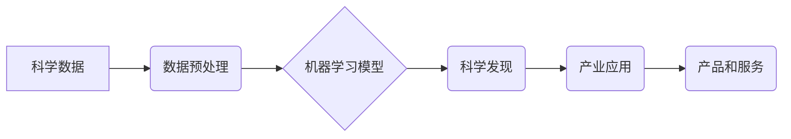

>人工智能，科学计算，机器学习，深度学习，自然语言处理，计算机视觉，数据分析，产业应用

## 1. 背景介绍

人工智能（AI）技术近年来取得了飞速发展，其强大的学习和推理能力正在深刻地改变着科学研究和产业发展。AI for Science，即人工智能助力科学，是指利用人工智能技术加速科学发现、推动科学研究和解决科学难题。

传统科学研究往往依赖于人类的经验和直觉，耗费大量时间和资源。而AI技术可以帮助科学家处理海量数据、发现隐藏模式、进行快速模拟和预测，从而显著提高科研效率和创新能力。

同时，AI技术在各个产业领域也展现出巨大的应用潜力。从医疗保健、金融服务到制造业、农业，AI正在帮助企业优化流程、提高效率、降低成本，并创造新的商业价值。

## 2. 核心概念与联系

**2.1 AI for Science 的核心概念**

* **机器学习 (Machine Learning):** 算法从数据中学习，识别模式并做出预测。
* **深度学习 (Deep Learning):** 使用多层神经网络，能够处理更复杂的数据和任务。
* **自然语言处理 (Natural Language Processing):** 理解和处理人类语言，用于科学文献分析、知识图谱构建等。
* **计算机视觉 (Computer Vision):** 理解和分析图像和视频，用于科学图像分析、物体的识别和跟踪等。

**2.2 AI for Science 与产业的联系**

AI for Science 和产业的结合可以促进科技创新和经济发展。

* **加速科学发现:** AI可以帮助科学家更快地发现新的药物、材料、能源等，推动科技进步。
* **优化产业流程:** AI可以帮助企业优化生产流程、提高效率、降低成本，提升产业竞争力。
* **创造新产品和服务:** AI可以帮助企业开发新的产品和服务，满足市场需求，推动经济增长。

**2.3 AI for Science 与产业的融合架构**



## 3. 核心算法原理 & 具体操作步骤

**3.1 算法原理概述**

机器学习算法的核心是通过学习数据中的模式来进行预测或分类。常见的机器学习算法包括：

* **监督学习:** 利用标记数据训练模型，例如分类和回归问题。
* **无监督学习:** 从未标记数据中发现模式，例如聚类和降维。
* **强化学习:** 通过试错学习，在环境中获得最大奖励。

**3.2 算法步骤详解**

1. **数据收集和预处理:** 收集相关数据，并进行清洗、转换和特征工程等预处理步骤。
2. **模型选择:** 根据具体任务选择合适的机器学习算法。
3. **模型训练:** 利用训练数据训练模型，调整模型参数以达到最佳性能。
4. **模型评估:** 使用测试数据评估模型的性能，例如准确率、召回率、F1-score等。
5. **模型部署:** 将训练好的模型部署到实际应用场景中。

**3.3 算法优缺点**

* **优点:** 能够自动学习数据模式，无需人工特征工程，具有较高的自动化程度。
* **缺点:** 需要大量数据进行训练，对数据质量要求较高，解释性较差。

**3.4 算法应用领域**

* **药物发现:** 利用机器学习预测药物的活性，加速药物研发过程。
* **材料科学:** 利用机器学习设计新的材料，具有特定性能。
* **气候模型:** 利用机器学习模拟气候变化，预测未来气候趋势。

## 4. 数学模型和公式 & 详细讲解 & 举例说明

**4.1 数学模型构建**

机器学习模型通常可以表示为一个函数，将输入数据映射到输出结果。例如，线性回归模型可以表示为：

$$y = w_0 + w_1x_1 + w_2x_2 + ... + w_nx_n$$

其中：

* $y$ 是输出结果
* $w_0, w_1, ..., w_n$ 是模型参数
* $x_1, x_2, ..., x_n$ 是输入特征

**4.2 公式推导过程**

机器学习模型的训练过程通常是通过优化模型参数来最小化模型预测误差。常用的优化算法包括梯度下降法和随机梯度下降法。

**4.3 案例分析与讲解**

例如，在图像分类任务中，可以使用卷积神经网络 (CNN) 模型进行训练。CNN模型利用卷积操作和池化操作来提取图像特征，并使用全连接层进行分类。

## 5. 项目实践：代码实例和详细解释说明

**5.1 开发环境搭建**

可以使用 Python 语言和相关的机器学习库，例如 TensorFlow、PyTorch 等，进行 AI for Science 项目开发。

**5.2 源代码详细实现**

```python
import tensorflow as tf

# 定义模型结构
model = tf.keras.models.Sequential([
    tf.keras.layers.Conv2D(32, (3, 3), activation='relu', input_shape=(28, 28, 1)),
    tf.keras.layers.MaxPooling2D((2, 2)),
    tf.keras.layers.Conv2D(64, (3, 3), activation='relu'),
    tf.keras.layers.MaxPooling2D((2, 2)),
    tf.keras.layers.Flatten(),
    tf.keras.layers.Dense(10, activation='softmax')
])

# 编译模型
model.compile(optimizer='adam',
              loss='sparse_categorical_crossentropy',
              metrics=['accuracy'])

# 训练模型
model.fit(x_train, y_train, epochs=5)

# 评估模型
loss, accuracy = model.evaluate(x_test, y_test)
print('Test loss:', loss)
print('Test accuracy:', accuracy)
```

**5.3 代码解读与分析**

这段代码定义了一个简单的卷积神经网络模型，用于手写数字识别任务。

* `tf.keras.models.Sequential` 创建了一个顺序模型，将层级依次连接。
* `tf.keras.layers.Conv2D` 定义了一个卷积层，用于提取图像特征。
* `tf.keras.layers.MaxPooling2D` 定义了一个最大池化层，用于降维和提高模型鲁棒性。
* `tf.keras.layers.Flatten` 将多维特征转换为一维向量。
* `tf.keras.layers.Dense` 定义了一个全连接层，用于分类。
* `model.compile` 编译模型，指定优化器、损失函数和评价指标。
* `model.fit` 训练模型，使用训练数据进行迭代训练。
* `model.evaluate` 评估模型，使用测试数据计算损失和准确率。

**5.4 运行结果展示**

训练完成后，模型可以用于预测新的手写数字。

## 6. 实际应用场景

**6.1 医疗保健**

* **疾病诊断:** 利用机器学习算法分析患者的医疗影像、基因数据和临床记录，辅助医生进行疾病诊断。
* **药物研发:** 利用机器学习算法预测药物的活性、毒性等，加速药物研发过程。
* **个性化医疗:** 利用机器学习算法分析患者的个体特征，提供个性化的治疗方案。

**6.2 金融服务**

* **欺诈检测:** 利用机器学习算法分析交易数据，识别异常交易行为，防止欺诈行为。
* **风险管理:** 利用机器学习算法评估投资风险，帮助金融机构进行风险管理。
* **客户服务:** 利用机器学习算法构建智能客服系统，提供24小时在线服务。

**6.3 制造业**

* **质量控制:** 利用机器学习算法分析生产过程中的数据，识别产品缺陷，提高产品质量。
* **预测性维护:** 利用机器学习算法分析设备运行数据，预测设备故障，进行及时维护。
* **生产优化:** 利用机器学习算法优化生产流程，提高生产效率。

**6.4 未来应用展望**

AI for Science 和产业的结合将带来更多创新应用，例如：

* **精准农业:** 利用机器学习算法分析土壤、气候和作物数据，实现精准施肥、精准灌溉等，提高农业生产效率。
* **可持续发展:** 利用机器学习算法分析环境数据，预测环境变化，帮助实现可持续发展目标。
* **新材料研发:** 利用机器学习算法设计新的材料，具有特定性能，例如高强度、轻质、耐腐蚀等。

## 7. 工具和资源推荐

**7.1 学习资源推荐**

* **在线课程:** Coursera、edX、Udacity 等平台提供丰富的机器学习和深度学习课程。
* **书籍:** 《深度学习》、《机器学习实战》等书籍是学习机器学习和深度学习的经典教材。
* **开源项目:** TensorFlow、PyTorch 等开源项目提供了丰富的代码示例和学习资源。

**7.2 开发工具推荐**

* **Python:** Python 语言是机器学习和深度学习开发的常用语言。
* **TensorFlow:** TensorFlow 是 Google 开发的开源机器学习框架。
* **PyTorch:** PyTorch 是 Facebook 开发的开源机器学习框架。

**7.3 相关论文推荐**

* **ImageNet Classification with Deep Convolutional Neural Networks**
* **Attention Is All You Need**
* **BERT: Pre-training of Deep Bidirectional Transformers for Language Understanding**

## 8. 总结：未来发展趋势与挑战

**8.1 研究成果总结**

AI for Science 取得了显著进展，在药物发现、材料科学、气候模型等领域取得了突破性成果。

**8.2 未来发展趋势**

* **模型规模和复杂度提升:** 未来将开发更大型、更复杂的 AI 模型，能够处理更复杂的任务。
* **跨领域融合:** AI for Science 将与其他领域，例如生物学、物理学等，进行跨领域融合，推动科学发现。
* **解释性 AI:** 研究如何提高 AI 模型的解释性，帮助科学家理解 AI 模型的决策过程。

**8.3 面临的挑战**

* **数据获取和质量:** AI for Science 需要大量高质量的数据，数据获取和质量控制仍然是一个挑战。
* **算法效率:** 训练大型 AI 模型需要大量的计算资源，提高算法效率是一个重要方向。
* **伦理和安全:** AI for Science 需要考虑伦理和安全问题，例如数据隐私、算法偏见等。

**8.4 研究展望**

未来，AI for Science 将继续推动科学发现和产业发展，为人类社会带来更多福祉。


## 9. 附录：常见问题与解答

**9.1 如何选择合适的机器学习算法？**

选择合适的机器学习算法取决于具体的任务和数据特点。例如，对于分类任务，可以使用逻辑回归、支持向量机、决策树等算法；对于回归任务，可以使用线性回归、支持向量回归等算法。

**9.2 如何处理不平衡数据？**

不平衡数据是指训练数据中不同类别样本数量不均衡的情况。可以使用数据采样、算法调整等方法处理不平衡数据。

**9.3 如何评估机器学习模型的性能？**

常用的机器学习模型性能评估指标包括准确率、召回率、F1-score、AUC等。

**9.4 如何部署机器学习模型？**

机器学习模型可以部署到云端、边缘设备等平台，可以使用容器技术、微服务架构等技术进行部署。


作者：禅与计算机程序设计艺术 / Zen and the Art of Computer Programming 
<end_of_turn>