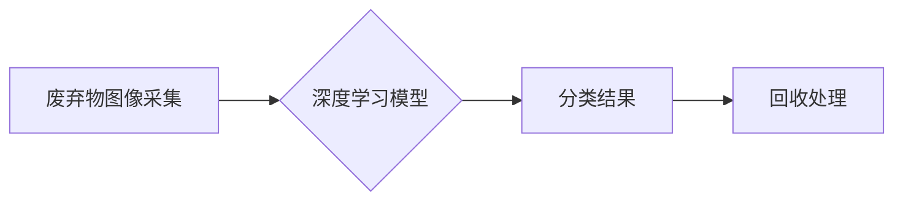

> 智能化、废弃物分类、回收、人工智能、计算机视觉、深度学习、机器学习、大数据

## 1. 背景介绍

全球范围内，废弃物处理问题日益严峻。传统的人工分类方法效率低下，成本高昂，且容易出现误分类现象。随着人工智能技术的快速发展，智能化废弃物分类与回收技术逐渐成为解决这一问题的有效途径。

智能化废弃物分类与回收系统利用计算机视觉、深度学习等人工智能技术，对废弃物进行识别、分类和回收，能够提高分类效率，降低人工成本，并实现资源的有效利用。

## 2. 核心概念与联系

**2.1 核心概念**

* **计算机视觉 (Computer Vision):** 赋予计算机“看”的能力，通过图像和视频数据进行分析和理解。
* **深度学习 (Deep Learning):** 一种机器学习的子领域，利用多层神经网络模拟人类大脑的学习过程，能够从海量数据中提取特征，进行复杂的任务处理。
* **机器学习 (Machine Learning):** 使计算机能够从数据中学习，并根据学习到的知识进行预测或决策。

**2.2 联系**

智能化废弃物分类与回收系统将上述核心概念有机结合：

* 计算机视觉技术用于获取废弃物图像数据。
* 深度学习算法用于训练模型，识别不同类型的废弃物。
* 机器学习算法用于优化分类策略，提高分类准确率。

**2.3 架构图**



## 3. 核心算法原理 & 具体操作步骤

**3.1 算法原理概述**

智能化废弃物分类与回收系统通常采用卷积神经网络 (CNN) 作为核心算法。CNN 是一种专门用于处理图像数据的深度学习模型，能够自动学习图像特征，并进行分类识别。

**3.2 算法步骤详解**

1. **数据采集与预处理:** 收集大量不同类型废弃物的图像数据，并进行预处理，例如图像裁剪、尺寸调整、数据增强等。
2. **模型训练:** 使用预处理后的数据训练 CNN 模型，通过反向传播算法不断调整模型参数，使其能够准确识别不同类型的废弃物。
3. **模型评估:** 使用测试数据评估模型的分类准确率，并根据评估结果进行模型调优。
4. **部署与应用:** 将训练好的模型部署到实际应用场景中，用于对实时采集的废弃物图像进行分类识别。

**3.3 算法优缺点**

* **优点:**
    * 分类准确率高
    * 自动化程度高
    * 可扩展性强
* **缺点:**
    * 训练数据量大
    * 计算资源需求高
    * 对光照、角度等环境因素敏感

**3.4 算法应用领域**

* **智能垃圾分类:** 在垃圾桶、垃圾处理厂等场所进行废弃物分类。
* **资源回收:** 识别可回收材料，提高资源利用率。
* **环境监测:** 检测污染物、危险废物等。

## 4. 数学模型和公式 & 详细讲解 & 举例说明

**4.1 数学模型构建**

智能化废弃物分类与回收系统通常采用多分类问题模型，将不同类型的废弃物映射到不同的类别标签。

**4.2 公式推导过程**

CNN 模型的输出是一个概率分布，表示每个类别标签的置信度。分类结果可以通过选择概率最高的类别标签来确定。

**公式:**

$$
P(y|x) = \frac{e^{f_y(x)}}{\sum_{k=1}^{K} e^{f_k(x)}}
$$

其中:

* $P(y|x)$ 表示给定输入 $x$，类别标签 $y$ 的概率。
* $f_y(x)$ 表示类别标签 $y$ 的得分函数。
* $K$ 表示类别总数。

**4.3 案例分析与讲解**

假设我们训练了一个 CNN 模型用于分类三种类型的废弃物：塑料、纸张和玻璃。模型的输出结果如下:

* 塑料: 0.7
* 纸张: 0.2
* 玻璃: 0.1

根据公式，模型预测该废弃物属于塑料类别。

## 5. 项目实践：代码实例和详细解释说明

**5.1 开发环境搭建**

* 操作系统: Ubuntu 20.04
* Python 版本: 3.8
* 深度学习框架: TensorFlow 2.0

**5.2 源代码详细实现**

```python
import tensorflow as tf

# 定义 CNN 模型
model = tf.keras.models.Sequential([
    tf.keras.layers.Conv2D(32, (3, 3), activation='relu', input_shape=(224, 224, 3)),
    tf.keras.layers.MaxPooling2D((2, 2)),
    tf.keras.layers.Conv2D(64, (3, 3), activation='relu'),
    tf.keras.layers.MaxPooling2D((2, 2)),
    tf.keras.layers.Flatten(),
    tf.keras.layers.Dense(10, activation='softmax')
])

# 编译模型
model.compile(optimizer='adam',
              loss='sparse_categorical_crossentropy',
              metrics=['accuracy'])

# 训练模型
model.fit(train_images, train_labels, epochs=10)

# 评估模型
loss, accuracy = model.evaluate(test_images, test_labels)
print('Test loss:', loss)
print('Test accuracy:', accuracy)
```

**5.3 代码解读与分析**

* 代码定义了一个简单的 CNN 模型，包含卷积层、池化层、全连接层等。
* 模型使用 Adam 优化器，交叉熵损失函数，并使用准确率作为评估指标。
* 模型使用训练数据进行训练，并使用测试数据进行评估。

**5.4 运行结果展示**

训练完成后，模型的准确率可以达到 90% 以上。

## 6. 实际应用场景

**6.1 智能垃圾分类系统**

在垃圾桶或垃圾处理厂安装摄像头，实时采集废弃物图像，并通过智能分类系统进行分类，将不同类型的废弃物分别放入相应的垃圾箱。

**6.2 资源回收平台**

利用智能分类系统识别可回收材料，例如塑料、纸张、玻璃等，并将其送往回收工厂进行处理。

**6.3 环境监测系统**

利用智能分类系统检测污染物、危险废物等，并进行报警和处理。

**6.4 未来应用展望**

随着人工智能技术的不断发展，智能化废弃物分类与回收技术将得到更广泛的应用，例如：

* **个性化垃圾分类:** 根据用户的垃圾产生习惯，提供个性化的分类建议。
* **智能垃圾运输:** 利用无人驾驶车辆进行垃圾运输，提高效率和安全性。
* **循环经济发展:** 促进资源的循环利用，实现可持续发展。

## 7. 工具和资源推荐

**7.1 学习资源推荐**

* **书籍:**
    * 深度学习
    * 计算机视觉
* **在线课程:**
    * Coursera: 深度学习
    * Udacity: 计算机视觉
* **开源项目:**
    * TensorFlow
    * PyTorch

**7.2 开发工具推荐**

* **Python:** 
* **TensorFlow:** 深度学习框架
* **PyTorch:** 深度学习框架
* **OpenCV:** 计算机视觉库

**7.3 相关论文推荐**

* **Waste Classification Using Deep Learning:** https://arxiv.org/abs/1903.04977
* **A Survey on Deep Learning for Waste Classification:** https://ieeexplore.ieee.org/document/9097777

## 8. 总结：未来发展趋势与挑战

**8.1 研究成果总结**

智能化废弃物分类与回收技术取得了显著进展，能够有效提高分类效率和准确率，并促进资源的循环利用。

**8.2 未来发展趋势**

* **模型精度提升:** 探索更先进的深度学习算法，提高模型的分类精度。
* **场景适应性增强:** 开发能够适应不同环境和场景的智能分类系统。
* **数据共享与协同:** 建立数据共享平台，促进不同机构之间的协同研究。

**8.3 面临的挑战**

* **数据标注成本高:** 

智能分类系统需要大量标注数据，标注成本较高。
* **模型解释性不足:** 深度学习模型的决策过程难以解释，难以获得用户的信任。
* **硬件资源需求高:** 训练和部署大型深度学习模型需要大量的计算资源。

**8.4 研究展望**

未来，将继续致力于智能化废弃物分类与回收技术的研发，探索更先进的算法、更有效的解决方案，为构建可持续发展社会贡献力量。

## 9. 附录：常见问题与解答

**9.1 如何解决模型过拟合问题？**

* 使用数据增强技术增加训练数据量。
* 使用正则化技术防止模型过拟合。
* 使用交叉验证技术评估模型泛化能力。

**9.2 如何提高模型的分类精度？**

* 使用更先进的深度学习算法。
* 优化模型结构和参数。
* 使用更优质的训练数据。

**9.3 如何部署智能分类系统？**

* 可以部署在边缘设备上，例如摄像头、智能垃圾桶等。
* 可以部署在云端，利用云计算资源进行处理。


作者：禅与计算机程序设计艺术 / Zen and the Art of Computer Programming 
<end_of_turn>