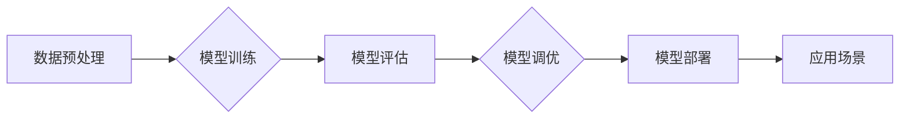

> AI大模型，创业，技术优势，商业模式，应用场景，发展趋势

## 1. 背景介绍

近年来，人工智能（AI）技术取得了飞速发展，特别是大模型的涌现，为各行各业带来了前所未有的机遇。大模型是指参数规模庞大、训练数据海量的人工智能模型，具备强大的泛化能力和学习能力，能够在自然语言处理、计算机视觉、语音识别等领域取得突破性进展。

对于创业者来说，AI大模型的出现带来了新的机遇和挑战。一方面，大模型的强大能力可以帮助创业公司快速构建创新产品和服务，提升效率和竞争力。另一方面，大模型的训练和部署需要大量的计算资源和技术 expertise，创业公司需要克服技术门槛和成本压力。

## 2. 核心概念与联系

**2.1 AI大模型概述**

AI大模型是指参数规模庞大、训练数据海量的人工智能模型，其核心特点包括：

* **规模化：** 大模型拥有数亿甚至数十亿个参数，远超传统机器学习模型。
* **泛化能力强：** 由于训练数据量大，大模型能够更好地泛化到未知数据，表现出更强的学习能力。
* **多任务学习：** 大模型可以同时学习多个任务，例如文本生成、图像识别、语音合成等，提高效率和灵活性。

**2.2 大模型的架构**

大模型的架构通常基于 Transformer 网络，其特点是：

* **自注意力机制：** Transformer 网络通过自注意力机制，能够捕捉文本序列中不同词语之间的关系，理解上下文信息。
* **多头注意力：** 多头注意力机制可以同时关注多个方面的信息，提高模型的表达能力。
* **堆叠结构：** Transformer 网络通常由多个编码器和解码器层堆叠而成，深度学习能够提取更深层次的语义特征。

**2.3 大模型的训练**

大模型的训练需要海量数据和强大的计算资源。训练过程通常包括以下步骤：

* **数据预处理：** 将原始数据清洗、格式化、标记等。
* **模型训练：** 使用梯度下降算法，不断调整模型参数，使其能够准确预测目标输出。
* **模型评估：** 使用测试数据评估模型的性能，例如准确率、召回率等。
* **模型调优：** 根据评估结果，调整模型参数、训练策略等，提高模型性能。

**2.4 大模型的应用场景**

大模型在各个领域都有广泛的应用场景，例如：

* **自然语言处理：** 文本生成、机器翻译、问答系统、情感分析等。
* **计算机视觉：** 图像识别、物体检测、图像分割、视频分析等。
* **语音识别：** 语音转文本、语音合成、语音助手等。
* **推荐系统：** 商品推荐、内容推荐、个性化服务等。

**Mermaid 流程图**



## 3. 核心算法原理 & 具体操作步骤

### 3.1  算法原理概述

大模型的训练主要基于深度学习算法，其中 Transformer 网络是目前最主流的架构。Transformer 网络的核心是自注意力机制，它能够捕捉文本序列中不同词语之间的关系，理解上下文信息。

### 3.2  算法步骤详解

1. **数据预处理：** 将原始数据清洗、格式化、标记等，例如将文本数据转换为词向量表示。
2. **模型构建：** 根据 Transformer 网络架构，构建模型结构，包括编码器和解码器层。
3. **模型训练：** 使用梯度下降算法，不断调整模型参数，使其能够准确预测目标输出。
4. **模型评估：** 使用测试数据评估模型的性能，例如准确率、召回率等。
5. **模型调优：** 根据评估结果，调整模型参数、训练策略等，提高模型性能。

### 3.3  算法优缺点

**优点：**

* 泛化能力强：大模型能够更好地泛化到未知数据。
* 多任务学习：大模型可以同时学习多个任务。
* 表达能力强：Transformer 网络的注意力机制能够捕捉文本序列中更深层次的语义特征。

**缺点：**

* 计算资源需求高：大模型的训练需要大量的计算资源。
* 训练时间长：大模型的训练时间通常较长。
* 数据依赖性强：大模型的性能取决于训练数据的质量和数量。

### 3.4  算法应用领域

大模型的应用领域非常广泛，包括：

* 自然语言处理：文本生成、机器翻译、问答系统、情感分析等。
* 计算机视觉：图像识别、物体检测、图像分割、视频分析等。
* 语音识别：语音转文本、语音合成、语音助手等。
* 推荐系统：商品推荐、内容推荐、个性化服务等。

## 4. 数学模型和公式 & 详细讲解 & 举例说明

### 4.1  数学模型构建

大模型的训练基于深度学习算法，其数学模型主要包括：

* **损失函数：** 用于衡量模型预测结果与真实值的差距。常见的损失函数包括交叉熵损失函数、均方误差损失函数等。
* **优化算法：** 用于更新模型参数，使其能够最小化损失函数。常见的优化算法包括梯度下降算法、Adam 算法等。

### 4.2  公式推导过程

**交叉熵损失函数：**

$$
H(p, q) = -\sum_{i=1}^{n} p(i) \log q(i)
$$

其中：

* $p(i)$ 是真实标签的概率分布。
* $q(i)$ 是模型预测的概率分布。

**梯度下降算法：**

$$
\theta = \theta - \alpha \nabla L(\theta)
$$

其中：

* $\theta$ 是模型参数。
* $\alpha$ 是学习率。
* $\nabla L(\theta)$ 是损失函数对模型参数的梯度。

### 4.3  案例分析与讲解

假设我们训练一个文本分类模型，目标是将文本分类为正类或负类。我们可以使用交叉熵损失函数来衡量模型预测结果与真实标签的差距。

如果模型预测文本属于正类的概率为 0.8，而真实标签是正类，则损失函数值为：

$$
H(p, q) = -0.8 \log 0.8 = 0.22
$$

通过梯度下降算法，我们可以不断调整模型参数，使其能够最小化损失函数值，从而提高模型的分类准确率。

## 5. 项目实践：代码实例和详细解释说明

### 5.1  开发环境搭建

* **操作系统：** Linux 或 macOS
* **编程语言：** Python
* **深度学习框架：** TensorFlow 或 PyTorch
* **其他工具：** Git、Jupyter Notebook

### 5.2  源代码详细实现

```python
import tensorflow as tf

# 定义模型结构
model = tf.keras.Sequential([
    tf.keras.layers.Embedding(input_dim=10000, output_dim=128),
    tf.keras.layers.LSTM(units=128),
    tf.keras.layers.Dense(units=1, activation='sigmoid')
])

# 编译模型
model.compile(optimizer='adam', loss='binary_crossentropy', metrics=['accuracy'])

# 训练模型
model.fit(x_train, y_train, epochs=10)

# 评估模型
loss, accuracy = model.evaluate(x_test, y_test)
print('Loss:', loss)
print('Accuracy:', accuracy)
```

### 5.3  代码解读与分析

* **Embedding 层：** 将词向量表示转换为固定长度的向量。
* **LSTM 层：** 用于处理文本序列数据，捕捉文本中的上下文信息。
* **Dense 层：** 全连接层，用于将 LSTM 层的输出映射到输出类别。
* **编译模型：** 指定优化算法、损失函数和评估指标。
* **训练模型：** 使用训练数据训练模型。
* **评估模型：** 使用测试数据评估模型的性能。

### 5.4  运行结果展示

训练完成后，我们可以使用测试数据评估模型的性能，例如准确率、召回率等。

## 6. 实际应用场景

### 6.1  文本生成

大模型可以用于生成各种类型的文本，例如：

* **小说、诗歌、剧本等创意写作**
* **新闻报道、文章摘要、产品描述等内容创作**
* **聊天机器人、虚拟助手等对话系统**

### 6.2  机器翻译

大模型可以实现高质量的机器翻译，例如：

* **将文本从一种语言翻译成另一种语言**
* **跨语言对话、多语言搜索等应用**

### 6.3  图像识别

大模型可以用于识别图像中的物体、场景、人物等，例如：

* **自动驾驶、安防监控、医疗诊断等应用**

### 6.4  未来应用展望

大模型的应用场景还在不断扩展，未来可能应用于：

* **个性化教育：** 根据学生的学习情况，提供个性化的学习内容和辅导。
* **科学研究：** 帮助科学家分析大规模数据，发现新的规律和知识。
* **艺术创作：** 辅助艺术家创作新的艺术作品。

## 7. 工具和资源推荐

### 7.1  学习资源推荐

* **书籍：**
    * 《深度学习》
    * 《自然语言处理》
    * 《机器学习》
* **在线课程：**
    * Coursera
    * edX
    * Udacity

### 7.2  开发工具推荐

* **深度学习框架：** TensorFlow、PyTorch
* **编程语言：** Python
* **云计算平台：** AWS、Google Cloud、Azure

### 7.3  相关论文推荐

* **Attention Is All You Need**
* **BERT: Pre-training of Deep Bidirectional Transformers for Language Understanding**
* **GPT-3: Language Models are Few-Shot Learners**

## 8. 总结：未来发展趋势与挑战

### 8.1  研究成果总结

近年来，大模型在各个领域取得了显著的进展，其强大的能力为人工智能的发展带来了新的机遇。

### 8.2  未来发展趋势

* **模型规模化：** 大模型的规模将继续扩大，参数量将达到数千亿甚至万亿级别。
* **多模态学习：** 大模型将能够处理多种模态数据，例如文本、图像、音频等。
* **可解释性增强：** 研究人员将致力于提高大模型的可解释性，使其决策过程更加透明。

### 8.3  面临的挑战

* **计算资源需求：** 大模型的训练和部署需要大量的计算资源，这对于资源有限的机构和个人来说是一个挑战。
* **数据安全和隐私：** 大模型的训练需要海量数据，如何保证数据安全和隐私是一个重要问题。
* **伦理问题：** 大模型的应用可能带来一些伦理问题，例如算法偏见、信息操纵等，需要引起重视。

### 8.4  研究展望

未来，大模型的研究将继续深入，其应用场景将更加广泛，为人类社会带来更多福祉。

## 9. 附录：常见问题与解答

**Q1：如何选择合适的深度学习框架？**

**A1：** TensorFlow 和 PyTorch 是目前最流行的深度学习框架， TensorFlow 更适合于生产环境，PyTorch 更适合于研究和开发。

**Q2：如何训练一个大模型？**

**A2：** 训练一个大模型需要大量的计算资源、海量数据和专业的技术 expertise。

**Q3：如何评估大模型的性能？**

**A3：** 大模型的性能可以评估指标包括准确率、召回率、F1-score 等。

**Q4：大模型的应用有哪些？**

**A4：** 大模型