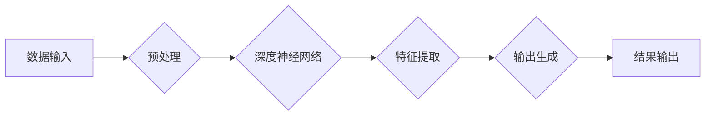

> AI大模型, Andrej Karpathy, OpenAI, 深度学习, 计算机视觉, 自然语言处理, 计算机科学, 创新

## 1. 背景介绍

在人工智能领域蓬勃发展的今天，大模型已经成为研究和应用的热点。这些模型拥有惊人的参数规模和强大的泛化能力，在自然语言处理、计算机视觉、代码生成等领域取得了突破性的进展。其中，OpenAI作为一家领先的AI研究机构，在推动大模型发展方面发挥着重要作用。作为OpenAI首席科学家，Andrej Karpathy是一位杰出的计算机科学家，他对大模型的研究和应用做出了卓越贡献。

Andrej Karpathy是一位拥有丰富经验和深厚学识的计算机科学家，他在计算机视觉、深度学习等领域取得了令人瞩目的成就。他曾就读于斯坦福大学，并于2015年加入OpenAI，担任首席科学家一职。在OpenAI期间，他领导了多个重要项目，包括GPT-3、DALL-E等，这些项目都取得了巨大的成功，推动了大模型的发展。

## 2. 核心概念与联系

大模型的核心概念是利用海量数据训练深度神经网络，从而获得强大的泛化能力和知识表示能力。这些模型通常拥有数亿甚至数十亿的参数，能够处理复杂的任务，并生成高质量的输出。

**大模型的架构通常包括以下几个部分：**

* **输入层:**接收原始数据，例如文本、图像等。
* **隐藏层:**通过多层神经网络进行特征提取和表示学习。
* **输出层:**根据训练数据生成相应的输出，例如文本、图像、代码等。

**大模型与其他AI技术的关系:**

* **深度学习:**大模型是深度学习的应用，依赖于深度神经网络的强大能力。
* **自然语言处理:**大模型在自然语言理解、文本生成等任务上取得了突破性进展。
* **计算机视觉:**大模型在图像识别、物体检测等任务上也展现出强大的能力。

**Mermaid 流程图:**



## 3. 核心算法原理 & 具体操作步骤

### 3.1  算法原理概述

大模型训练的核心算法是**反向传播算法**，它通过不断调整模型参数，使模型的输出与真实值之间的误差最小化。

**反向传播算法的步骤:**

1. 将输入数据输入模型，得到模型的输出。
2. 计算模型输出与真实值的误差。
3. 根据误差反向传播，计算每个参数的梯度。
4. 使用梯度下降算法更新模型参数。
5. 重复步骤1-4，直到模型的误差达到预设阈值。

### 3.2  算法步骤详解

1. **数据预处理:** 将原始数据转换为模型可以理解的格式，例如文本数据需要进行词嵌入，图像数据需要进行尺寸调整等。
2. **模型初始化:** 为模型参数赋予初始值，通常使用随机初始化。
3. **前向传播:** 将输入数据输入模型，计算模型的输出。
4. **损失函数计算:** 计算模型输出与真实值的误差，使用损失函数衡量误差的大小。
5. **反向传播:** 计算每个参数的梯度，即误差对每个参数的偏导数。
6. **参数更新:** 使用梯度下降算法更新模型参数，例如使用Adam优化器。
7. **迭代训练:** 重复步骤3-6，直到模型的误差达到预设阈值。

### 3.3  算法优缺点

**优点:**

* 能够学习复杂的非线性关系。
* 具有强大的泛化能力。
* 可以处理海量数据。

**缺点:**

* 训练时间长，计算资源消耗大。
* 容易过拟合，需要进行正则化等技巧。
* 缺乏可解释性，难以理解模型的决策过程。

### 3.4  算法应用领域

* **自然语言处理:** 文本分类、情感分析、机器翻译、文本生成等。
* **计算机视觉:** 图像识别、物体检测、图像分割、图像生成等。
* **语音识别:** 语音转文本、语音合成等。
* **推荐系统:** 商品推荐、用户画像等。

## 4. 数学模型和公式 & 详细讲解 & 举例说明

### 4.1  数学模型构建

大模型的数学模型通常基于**多层感知机(MLP)**或**卷积神经网络(CNN)**。

**多层感知机(MLP):**

MLP由多个全连接层组成，每个层的神经元都与上一层的每个神经元连接。

**卷积神经网络(CNN):**

CNN利用卷积核进行特征提取，能够有效地学习图像的局部特征。

### 4.2  公式推导过程

**损失函数:**

常用的损失函数包括**交叉熵损失函数**和**均方误差损失函数**。

**交叉熵损失函数:**

$$
L = -\sum_{i=1}^{N} y_i \log(\hat{y}_i)
$$

其中，$y_i$是真实标签，$\hat{y}_i$是模型预测的概率。

**均方误差损失函数:**

$$
L = \frac{1}{N} \sum_{i=1}^{N} (y_i - \hat{y}_i)^2
$$

其中，$y_i$是真实值，$\hat{y}_i$是模型预测值。

**梯度下降算法:**

$$
\theta = \theta - \alpha \nabla L(\theta)
$$

其中，$\theta$是模型参数，$\alpha$是学习率，$\nabla L(\theta)$是损失函数对参数的梯度。

### 4.3  案例分析与讲解

**GPT-3:**

GPT-3是一个基于Transformer架构的大语言模型，拥有1750亿参数。它能够进行文本生成、翻译、问答等任务，并展现出令人惊叹的语言理解和生成能力。

**DALL-E:**

DALL-E是一个基于Transformer架构的图像生成模型，能够根据文本描述生成逼真的图像。它能够理解复杂的文本指令，并生成符合描述的图像，展现出强大的图像生成能力。

## 5. 项目实践：代码实例和详细解释说明

### 5.1  开发环境搭建

* **操作系统:** Linux/macOS
* **编程语言:** Python
* **深度学习框架:** TensorFlow/PyTorch
* **硬件环境:** GPU

### 5.2  源代码详细实现

```python
# 使用TensorFlow构建一个简单的多层感知机模型
import tensorflow as tf

# 定义模型输入层
input_layer = tf.keras.Input(shape=(10,))

# 定义隐藏层
hidden_layer = tf.keras.layers.Dense(64, activation='relu')(input_layer)

# 定义输出层
output_layer = tf.keras.layers.Dense(10, activation='softmax')(hidden_layer)

# 创建模型
model = tf.keras.Model(inputs=input_layer, outputs=output_layer)

# 编译模型
model.compile(optimizer='adam', loss='sparse_categorical_crossentropy', metrics=['accuracy'])

# 训练模型
model.fit(x_train, y_train, epochs=10)
```

### 5.3  代码解读与分析

* **输入层:** 定义模型的输入形状，例如输入数据为10维向量。
* **隐藏层:** 使用全连接层进行特征提取，并使用ReLU激活函数。
* **输出层:** 使用softmax激活函数，输出10个类别的概率分布。
* **模型编译:** 使用Adam优化器、交叉熵损失函数和准确率作为评估指标。
* **模型训练:** 使用训练数据训练模型，训练10个epochs。

### 5.4  运行结果展示

训练完成后，可以使用测试数据评估模型的性能，例如计算准确率。

## 6. 实际应用场景

### 6.1  自然语言处理

* **机器翻译:** 将文本从一种语言翻译成另一种语言。
* **文本摘要:** 将长文本压缩成短文本，保留关键信息。
* **情感分析:** 分析文本的情感倾向，例如正面、负面或中性。

### 6.2  计算机视觉

* **图像识别:** 将图像分类到不同的类别，例如猫、狗、汽车等。
* **物体检测:** 在图像中检测到特定物体的位置和类别。
* **图像分割:** 将图像分割成不同的区域，例如前景和背景。

### 6.3  语音识别

* **语音转文本:** 将语音信号转换为文本。
* **语音合成:** 将文本转换为语音信号。

### 6.4  未来应用展望

大模型在未来将应用于更广泛的领域，例如：

* **医疗保健:** 辅助诊断、预测疾病风险。
* **教育:** 个性化学习、智能辅导。
* **金融:** 风险评估、欺诈检测。

## 7. 工具和资源推荐

### 7.1  学习资源推荐

* **书籍:**
    * Deep Learning by Ian Goodfellow, Yoshua Bengio, and Aaron Courville
    * Hands-On Machine Learning with Scikit-Learn, Keras & TensorFlow by Aurélien Géron
* **在线课程:**
    * Stanford CS231n: Convolutional Neural Networks for Visual Recognition
    * Deep Learning Specialization by Andrew Ng

### 7.2  开发工具推荐

* **深度学习框架:** TensorFlow, PyTorch
* **编程语言:** Python
* **云计算平台:** Google Cloud Platform, Amazon Web Services, Microsoft Azure

### 7.3  相关论文推荐

* **Attention Is All You Need** (Vaswani et al., 2017)
* **BERT: Pre-training of Deep Bidirectional Transformers for Language Understanding** (Devlin et al., 2018)
* **ImageNet Classification with Deep Convolutional Neural Networks** (Krizhevsky et al., 2012)

## 8. 总结：未来发展趋势与挑战

### 8.1  研究成果总结

大模型在自然语言处理、计算机视觉等领域取得了突破性进展，展现出强大的泛化能力和应用潜力。

### 8.2  未来发展趋势

* **模型规模继续扩大:** 随着计算资源的提升，模型规模将继续扩大，从而提升模型的性能。
* **模型架构创新:** 研究人员将探索新的模型架构，例如Transformer变体、混合模型等，以提升模型的效率和性能。
* **多模态学习:** 研究人员将探索跨模态学习，例如文本-图像、文本-语音等，以构建更智能的模型。

### 8.3  面临的挑战

* **训练成本高:** 大模型的训练成本非常高，需要大量的计算资源和数据。
* **可解释性差:** 大模型的决策过程难以理解，缺乏可解释性。
* **伦理问题:** 大模型的应用可能带来伦理问题，例如偏见、隐私等。

### 8.4  研究展望

未来研究将集中在解决大模型面临的挑战，例如降低训练成本、提升可解释性、解决伦理问题等。


## 9. 附录：常见问题与解答

**Q1: 大模型的训练需要多少数据？**

**A1:** 大模型的训练需要海量数据，通常需要数十亿甚至数千亿个数据点。

**Q2: 大模型的训练需要多少计算资源？**

**A2:** 大模型的训练需要大量的计算资源，通常需要数百甚至数千个GPU。

**Q3: 大模型的应用有哪些？**

**A3:** 大模型的应用非常广泛，例如自然语言处理、计算机视觉、语音识别等。

**Q4: 如何评估大模型的性能？**

