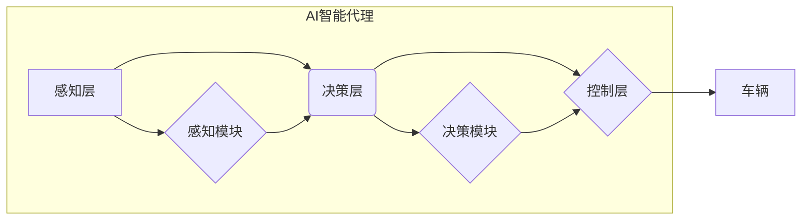

> AI, 人工智能, Agent, 无人驾驶, 深度学习, 决策控制, 计算机视觉, 规划算法, 仿真测试

## 1. 背景介绍

随着科技的飞速发展，人工智能（AI）已成为引领未来科技发展的重要力量之一。其中，AI智能代理（Agent）作为AI的核心概念，在无人驾驶领域展现出巨大的应用潜力。无人驾驶汽车作为智能代理的典型应用场景，其目标是实现车辆自主行驶，无需人工干预。

无人驾驶汽车的实现需要解决一系列复杂的技术难题，包括感知、决策、控制等。AI智能代理为解决这些难题提供了强大的工具和框架。通过学习和理解周围环境信息，智能代理能够做出合理的决策，并控制车辆进行安全、高效的驾驶。

## 2. 核心概念与联系

**2.1 AI智能代理**

AI智能代理是指能够感知环境、做出决策并执行动作的智能系统。它通常由以下几个核心组件组成：

* **感知模块:** 用于收集环境信息，例如摄像头、雷达、激光雷达等传感器数据。
* **决策模块:** 基于感知到的环境信息，做出合理的驾驶决策，例如转向、加速、刹车等。
* **控制模块:** 将决策转化为车辆的实际动作，例如控制油门、刹车、方向盘等。
* **学习模块:** 用于学习驾驶经验，不断优化决策和控制策略。

**2.2 无人驾驶汽车架构**

无人驾驶汽车通常采用分层架构，将任务分解为多个子任务，每个子任务由相应的模块负责。常见的无人驾驶汽车架构包括：

* **感知层:** 负责收集环境信息，例如车辆、行人、道路等。
* **决策层:** 负责根据感知到的环境信息，做出驾驶决策。
* **控制层:** 负责将决策转化为车辆的实际动作。

**2.3 AI智能代理与无人驾驶汽车的关系**

AI智能代理是无人驾驶汽车的核心技术之一。感知层、决策层和控制层都可以利用AI智能代理技术进行实现。例如，决策层可以使用强化学习算法训练一个AI智能代理，使其能够在复杂的环境中做出合理的驾驶决策。



## 3. 核心算法原理 & 具体操作步骤

**3.1 算法原理概述**

在无人驾驶领域，AI智能代理通常采用强化学习算法进行训练。强化学习是一种机器学习方法，它通过奖励和惩罚机制，训练智能代理在特定环境中做出最优决策。

**3.2 算法步骤详解**

1. **环境建模:** 建立无人驾驶汽车行驶环境的数学模型，包括车辆动力学、道路几何、交通规则等。
2. **状态空间定义:** 定义无人驾驶汽车行驶状态的特征，例如车辆位置、速度、方向、周围环境信息等。
3. **动作空间定义:** 定义无人驾驶汽车可以执行的动作，例如加速、减速、转向等。
4. **奖励函数设计:** 设计一个奖励函数，根据无人驾驶汽车的行为和环境状态，给予相应的奖励或惩罚。
5. **智能代理训练:** 使用强化学习算法，例如Q学习、SARSA等，训练智能代理在环境中学习最优决策策略。
6. **策略评估:** 在训练完成后，评估智能代理在不同环境下的驾驶性能，例如行驶距离、安全系数、效率等。

**3.3 算法优缺点**

**优点:**

* 可以学习复杂的环境和任务。
* 可以适应不断变化的环境。
* 可以实现自主决策和控制。

**缺点:**

* 训练时间长，需要大量的训练数据。
* 算法复杂，需要专业的知识和技能。
* 难以保证在所有情况下都能做出最优决策。

**3.4 算法应用领域**

强化学习算法在无人驾驶领域有广泛的应用，例如：

* **路径规划:** 训练智能代理规划最优行驶路径，避免障碍物和交通拥堵。
* **决策控制:** 训练智能代理做出合理的驾驶决策，例如加速、减速、转向等。
* **驾驶行为预测:** 训练智能代理预测其他车辆和行人的驾驶行为，提高安全性。

## 4. 数学模型和公式 & 详细讲解 & 举例说明

**4.1 数学模型构建**

无人驾驶汽车的数学模型通常采用状态空间模型，将车辆的状态表示为一个状态向量，动作表示为一个动作向量。

状态向量：

$$
x = [p_x, p_y, v, \theta]
$$

其中：

* $p_x$：车辆横坐标
* $p_y$：车辆纵坐标
* $v$：车辆速度
* $\theta$：车辆方向角

动作向量：

$$
u = [a, \omega]
$$

其中：

* $a$：车辆加速度
* $\omega$：车辆转角速度

**4.2 公式推导过程**

根据车辆动力学方程，可以推导出状态转移方程：

$$
x_{t+1} = f(x_t, u_t)
$$

其中：

* $x_t$：时间 $t$ 的状态向量
* $u_t$：时间 $t$ 的动作向量
* $f$：状态转移函数

**4.3 案例分析与讲解**

假设无人驾驶汽车的目标是到达指定位置，可以使用强化学习算法训练智能代理，使其能够规划最优行驶路径。

在训练过程中，智能代理会根据当前状态和动作，获得奖励或惩罚。例如，如果智能代理能够到达指定位置，则会获得高奖励；如果智能代理发生碰撞，则会获得低惩罚。

通过不断学习和调整决策策略，智能代理最终能够学习到最优行驶路径，实现无人驾驶汽车的目标。

## 5. 项目实践：代码实例和详细解释说明

**5.1 开发环境搭建**

* 操作系统：Ubuntu 20.04
* Python 版本：3.8
* 库依赖：TensorFlow、OpenCV、NumPy、PyTorch等

**5.2 源代码详细实现**

```python
# 导入必要的库
import tensorflow as tf
import numpy as np

# 定义神经网络模型
model = tf.keras.models.Sequential([
    tf.keras.layers.Dense(128, activation='relu', input_shape=(4,)),
    tf.keras.layers.Dense(64, activation='relu'),
    tf.keras.layers.Dense(2, activation='linear')
])

# 定义损失函数和优化器
loss_fn = tf.keras.losses.MeanSquaredError()
optimizer = tf.keras.optimizers.Adam()

# 训练模型
for epoch in range(100):
    # 训练数据
    x_train = np.random.rand(100, 4)
    y_train = np.random.rand(100, 2)

    # 计算损失
    with tf.GradientTape() as tape:
        predictions = model(x_train)
        loss = loss_fn(y_train, predictions)

    # 反向传播
    gradients = tape.gradient(loss, model.trainable_variables)
    optimizer.apply_gradients(zip(gradients, model.trainable_variables))

    # 打印损失
    print(f'Epoch {epoch+1}, Loss: {loss.numpy()}')
```

**5.3 代码解读与分析**

这段代码实现了基于深度学习的无人驾驶汽车决策控制模型。

* 模型结构：使用多层感知机（MLP）构建神经网络模型，输入为车辆状态向量，输出为动作向量。
* 损失函数：使用均方误差（MSE）作为损失函数，衡量模型预测结果与真实值之间的差异。
* 优化器：使用Adam优化器更新模型参数，使其能够最小化损失函数。
* 训练过程：使用随机生成的训练数据进行模型训练，并打印每轮训练的损失值。

**5.4 运行结果展示**

训练完成后，可以将模型应用于实际环境中，例如使用仿真平台进行测试。通过观察模型在不同环境下的驾驶性能，可以评估模型的有效性和可靠性。

## 6. 实际应用场景

**6.1 自动驾驶汽车**

无人驾驶汽车是AI智能代理最典型的应用场景之一。通过感知环境、决策控制，无人驾驶汽车能够实现自主行驶，提高交通效率和安全性。

**6.2 无人机**

无人机也能够利用AI智能代理技术实现自主飞行。例如，无人机可以根据任务目标，自动规划飞行路径，避开障碍物，并完成任务。

**6.3 机器人**

机器人也可以利用AI智能代理技术实现自主操作。例如，工业机器人可以根据生产任务，自动完成装配、焊接等操作。

**6.4 其他应用场景**

AI智能代理还可以应用于其他领域，例如医疗诊断、金融交易、游戏开发等。

**6.4 未来应用展望**

随着AI技术的不断发展，AI智能代理将在更多领域得到应用，并发挥越来越重要的作用。例如，未来可能出现更加智能、更加安全的无人驾驶汽车，以及能够自主学习和适应环境的智能机器人。

## 7. 工具和资源推荐

**7.1 学习资源推荐**

* **书籍:**
    * 《Reinforcement Learning: An Introduction》 by Richard S. Sutton and Andrew G. Barto
    * 《Deep Learning》 by Ian Goodfellow, Yoshua Bengio, and Aaron Courville
* **在线课程:**
    * Coursera: Reinforcement Learning Specialization
    * Udacity: Self-Driving Car Engineer Nanodegree

**7.2 开发工具推荐**

* **TensorFlow:** 开源深度学习框架
* **PyTorch:** 开源深度学习框架
* **OpenCV:** 图像处理库
* **ROS:** 机器人操作系统

**7.3 相关论文推荐**

* **Deep Reinforcement Learning for Autonomous Driving**
* **End-to-End Learning for Self-Driving Cars**
* **Learning to Drive with Deep Reinforcement Learning**

## 8. 总结：未来发展趋势与挑战

**8.1 研究成果总结**

近年来，AI智能代理在无人驾驶领域取得了显著进展，例如：

* 深度强化学习算法在无人驾驶任务中的应用取得了成功。
* 仿真环境和测试平台的不断完善，为无人驾驶汽车的开发和测试提供了有力保障。
* 硬件技术的进步，例如传感器和计算能力的提升，为无人驾驶汽车的实现提供了硬件基础。

**8.2 未来发展趋势**

* **更安全可靠的AI智能代理:** 提高AI智能代理的鲁棒性、安全性、可靠性，使其能够应对复杂和不确定的环境。
* **更智能的决策控制:** 开发更智能的决策控制算法，使无人驾驶汽车能够做出更合理的驾驶决策。
* **更广泛的应用场景:** 将AI智能代理技术应用于更多领域，例如物流、农业、医疗等。

**8.3 面临的挑战**

* **数据获取和标注:** 训练AI智能代理需要大量的训练数据，而获取和标注这些数据成本高昂。
* **算法复杂度:** 许多AI智能代理算法非常复杂，需要专业的知识和技能进行开发和维护。
* **伦理和法律问题:** 无人驾驶汽车的应用引发了一些伦理和法律问题，例如责任归属、数据隐私等。

**8.4 研究展望**

未来，AI智能代理将在无人驾驶领域继续发挥重要作用，并推动无人驾驶技术的快速发展。

## 9. 附录：常见问题与解答

**9.1 如何训练AI智能代理？**

训练AI智能代理需要使用强化学习算法，并提供大量的训练数据和奖励机制。

**9.2 如何评估AI智能代理的性能？**

可以使用各种指标评估AI智能代理的性能，例如行驶距离、安全系数、效率等。

**9.3 AI智能代理是否能够完全替代人类驾驶员？**

目前，AI智能代理还无法完全替代人类驾驶员，但随着技术的不断