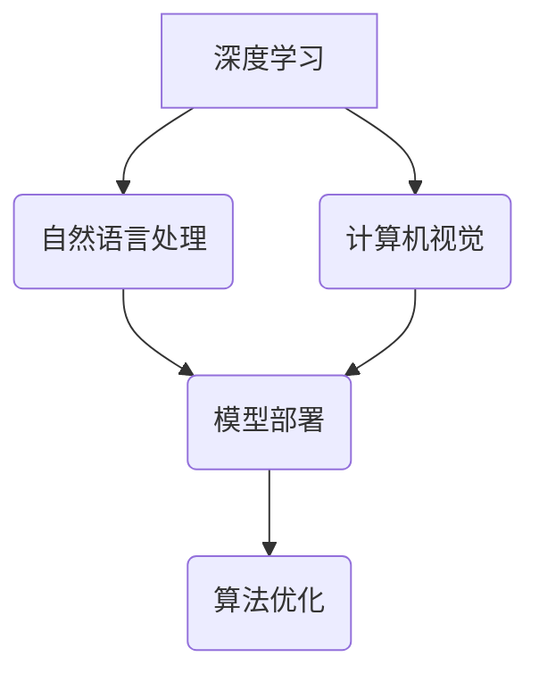

> AI创业, 技术壁垒, 深度学习, 自然语言处理, 计算机视觉, 模型部署, 算法优化, 数据标注

## 1. 背景介绍

在人工智能（AI）蓬勃发展的时代，AI创业公司如雨后春笋般涌现。然而，在激烈的市场竞争中，技术壁垒成为了创业公司面临的重大挑战。突破技术壁垒，才能在AI领域立足，实现可持续发展。

AI创业公司面临的技术壁垒主要体现在以下几个方面：

* **算法研发:** 构建高性能的AI模型需要强大的算法研发能力，包括深度学习、自然语言处理、计算机视觉等领域。
* **数据获取和标注:** AI模型的训练需要海量高质量的数据，而数据获取和标注是一个耗时、耗力的过程。
* **模型部署和优化:** 将训练好的AI模型部署到实际应用场景中，并进行性能优化，也是一个重要的技术挑战。
* **人才短缺:** AI领域人才紧缺，高素质的AI工程师和数据科学家是AI创业公司的核心竞争力。

## 2. 核心概念与联系

AI创业公司突破技术壁垒的关键在于掌握核心概念和技术，并将其有效地结合起来。

**核心概念:**

* **深度学习:** 深度学习是一种机器学习的子领域，利用多层神经网络来模拟人类大脑的学习过程。
* **自然语言处理 (NLP):** 自然语言处理是指让计算机能够理解和处理人类语言的技术。
* **计算机视觉 (CV):** 计算机视觉是指让计算机能够“看”和理解图像的技术。
* **模型部署:** 将训练好的AI模型部署到实际应用场景中，使其能够提供服务。
* **算法优化:** 通过调整算法参数和模型结构，提高AI模型的性能。

**核心技术联系:**



## 3. 核心算法原理 & 具体操作步骤

### 3.1  算法原理概述

深度学习算法的核心是多层神经网络。神经网络由多个层组成，每层包含多个神经元。神经元之间通过连接进行信息传递，每个连接都有一个权重。通过训练，神经网络可以学习到这些权重的最佳值，从而实现对数据的学习和预测。

### 3.2  算法步骤详解

1. **数据预处理:** 将原始数据进行清洗、转换和特征提取，使其适合深度学习模型的训练。
2. **模型构建:** 根据具体的应用场景，选择合适的深度学习模型架构，例如卷积神经网络 (CNN)、循环神经网络 (RNN) 或 Transformer。
3. **模型训练:** 使用训练数据训练深度学习模型，通过调整模型参数，使模型的预测结果与真实值尽可能接近。
4. **模型评估:** 使用测试数据评估模型的性能，例如准确率、召回率和F1-score。
5. **模型部署:** 将训练好的模型部署到实际应用场景中，使其能够提供服务。

### 3.3  算法优缺点

**优点:**

* **高精度:** 深度学习算法能够学习到数据的复杂模式，从而实现高精度的预测。
* **自动化特征提取:** 深度学习模型能够自动提取数据的特征，无需人工特征工程。
* **可扩展性:** 深度学习模型可以很容易地扩展到更大的数据集和更复杂的模型架构。

**缺点:**

* **数据依赖:** 深度学习模型对数据的质量和数量有很高的依赖性。
* **训练时间长:** 深度学习模型的训练时间通常很长，需要大量的计算资源。
* **可解释性差:** 深度学习模型的决策过程难以解释，这可能会导致模型的信任度降低。

### 3.4  算法应用领域

深度学习算法在各个领域都有广泛的应用，例如：

* **图像识别:** 人脸识别、物体检测、图像分类
* **自然语言处理:** 机器翻译、文本摘要、情感分析
* **语音识别:** 语音转文本、语音助手
* **推荐系统:** 商品推荐、内容推荐
* **医疗诊断:** 病情预测、疾病诊断

## 4. 数学模型和公式 & 详细讲解 & 举例说明

### 4.1  数学模型构建

深度学习模型的数学基础是神经网络。神经网络由多个层组成，每层包含多个神经元。每个神经元接收来自上一层的输入信号，并通过激活函数进行处理，输出到下一层。

**神经元模型:**

$$
y = f(w^T x + b)
$$

其中：

* $y$ 是神经元的输出
* $x$ 是输入向量
* $w$ 是权重向量
* $b$ 是偏置项
* $f$ 是激活函数

**激活函数:**

激活函数的作用是将神经元的输入信号转换为输出信号。常用的激活函数包括：

* **Sigmoid函数:**

$$
f(x) = \frac{1}{1 + e^{-x}}
$$

* **ReLU函数:**

$$
f(x) = max(0, x)
$$

* **Tanh函数:**

$$
f(x) = \frac{e^x - e^{-x}}{e^x + e^{-x}}
$$

### 4.2  公式推导过程

深度学习模型的训练过程是通过优化模型参数来最小化损失函数的过程。损失函数衡量模型的预测结果与真实值的差距。常用的损失函数包括：

* **均方误差 (MSE):**

$$
L = \frac{1}{n} \sum_{i=1}^{n} (y_i - \hat{y}_i)^2
$$

其中：

* $L$ 是损失函数
* $n$ 是样本数量
* $y_i$ 是真实值
* $\hat{y}_i$ 是模型预测值

* **交叉熵损失 (Cross-Entropy Loss):**

$$
L = - \sum_{i=1}^{n} y_i \log(\hat{y}_i)
$$

其中：

* $L$ 是损失函数
* $n$ 是样本数量
* $y_i$ 是真实值
* $\hat{y}_i$ 是模型预测值

### 4.3  案例分析与讲解

**案例:**

假设我们有一个图像分类任务，目标是将图像分类为猫或狗。我们可以使用卷积神经网络 (CNN) 来构建模型。

**分析:**

CNN模型能够自动提取图像特征，例如边缘、纹理和形状。通过训练CNN模型，它可以学习到猫和狗的特征，并能够准确地将图像分类。

## 5. 项目实践：代码实例和详细解释说明

### 5.1  开发环境搭建

* **操作系统:** Ubuntu 20.04
* **编程语言:** Python 3.8
* **深度学习框架:** TensorFlow 2.0
* **其他工具:** Jupyter Notebook、Git

### 5.2  源代码详细实现

```python
import tensorflow as tf

# 定义模型架构
model = tf.keras.models.Sequential([
    tf.keras.layers.Conv2D(32, (3, 3), activation='relu', input_shape=(28, 28, 1)),
    tf.keras.layers.MaxPooling2D((2, 2)),
    tf.keras.layers.Conv2D(64, (3, 3), activation='relu'),
    tf.keras.layers.MaxPooling2D((2, 2)),
    tf.keras.layers.Flatten(),
    tf.keras.layers.Dense(10, activation='softmax')
])

# 编译模型
model.compile(optimizer='adam',
              loss='sparse_categorical_crossentropy',
              metrics=['accuracy'])

# 训练模型
model.fit(x_train, y_train, epochs=10)

# 评估模型
loss, accuracy = model.evaluate(x_test, y_test)
print('Test loss:', loss)
print('Test accuracy:', accuracy)
```

### 5.3  代码解读与分析

* **模型架构:** 代码定义了一个简单的卷积神经网络模型，包含两个卷积层、两个最大池化层、一个全连接层和一个输出层。
* **激活函数:** 模型中使用了ReLU激活函数，它能够提高模型的学习能力。
* **损失函数:** 使用了sparse_categorical_crossentropy损失函数，它适用于多分类问题。
* **优化器:** 使用了Adam优化器，它是一种常用的优化算法。
* **训练过程:** 模型使用训练数据进行训练，训练过程持续10个epochs。
* **评估过程:** 使用测试数据评估模型的性能，并打印测试损失和准确率。

### 5.4  运行结果展示

运行代码后，会输出模型的训练过程和测试结果。测试结果包括测试损失和准确率。

## 6. 实际应用场景

### 6.1  图像识别

* **人脸识别:** 用于身份验证、安全监控等场景。
* **物体检测:** 用于自动驾驶、安防监控等场景。
* **图像分类:** 用于医疗诊断、产品分类等场景。

### 6.2  自然语言处理

* **机器翻译:** 将文本从一种语言翻译成另一种语言。
* **文本摘要:** 自动生成文本的简短摘要。
* **情感分析:** 分析文本的情感倾向，例如正面、负面或中性。

### 6.3  语音识别

* **语音转文本:** 将语音转换为文本。
* **语音助手:** 例如Siri、Alexa等，能够理解用户的语音指令并提供相应的服务。

### 6.4  未来应用展望

AI技术的发展将带来更多新的应用场景，例如：

* **个性化推荐:** 基于用户的行为和偏好，提供个性化的产品和服务推荐。
* **智能客服:** 使用AI技术，提供更加智能和高效的客户服务。
* **自动驾驶:** 使用AI技术，实现自动驾驶汽车。

## 7. 工具和资源推荐

### 7.1  学习资源推荐

* **在线课程:** Coursera、edX、Udacity等平台提供丰富的AI课程。
* **书籍:** 《深度学习》、《机器学习》、《自然语言处理》等经典书籍。
* **博客和论坛:** TensorFlow博客、PyTorch博客、Kaggle论坛等。

### 7.2  开发工具推荐

* **深度学习框架:** TensorFlow、PyTorch、Keras等。
* **数据处理工具:** Pandas、NumPy等。
* **可视化工具:** Matplotlib、Seaborn等。

### 7.3  相关论文推荐

* **《ImageNet Classification with Deep Convolutional Neural Networks》**
* **《Attention Is All You Need》**
* **《BERT: Pre-training of Deep Bidirectional Transformers for Language Understanding》**

## 8. 总结：未来发展趋势与挑战

### 8.1  研究成果总结

近年来，AI技术取得了长足的进步，深度学习算法在各个领域都取得了显著的成果。

### 8.2  未来发展趋势

* **模型规模和能力的提升:** 未来，AI模型的规模和能力将会进一步提升，能够处理更复杂的任务。
* **模型解释性和可信度的提高:** 研究者将更加关注模型的解释性和可信度，使其能够更好地被理解和信任。
* **边缘计算和联邦学习:** AI模型将更加广泛地部署到边缘设备和分布式系统中，实现更智能的本地化服务。

### 8.3  面临的挑战

* **数据获取和隐私保护:** AI模型的训练需要海量数据，如何获取高质量数据并保护用户隐私是一个重要的挑战。
* **算法公平性和可解释性:** AI算法可能存在偏见和不可解释性，需要研究如何确保算法的公平性和可解释性。
* **人才短缺:** AI领域人才紧缺，需要加强人才培养和引进。

### 8.4  研究展望

未来，AI研究将更加注重以下几个方面:

* **通用人工智能:** 研究能够像人类一样学习和解决各种问题的通用人工智能。
* **人机交互:** 研究更加自然和智能的人机交互方式。
* **AI