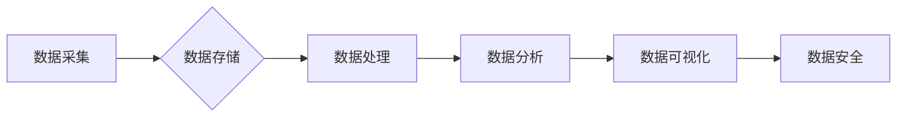

> AI创业, 数据管理, 数据架构, 数据质量, 数据安全, 数据可视化, 数据分析

## 1. 背景介绍

在当今数据爆炸的时代，数据已成为企业最重要的资产。人工智能 (AI) 技术的快速发展，为数据管理带来了新的机遇和挑战。AI创业者需要具备强大的数据管理能力，才能充分利用数据，构建成功的AI产品和服务。

本文将从数据管理的多个方面，分享一些实用经验，帮助AI创业者更好地管理数据，提升数据价值。

## 2. 核心概念与联系

数据管理是一个复杂的过程，涉及多个环节和技术。

**数据管理的核心概念包括：**

* **数据采集:** 从各种来源收集数据，包括结构化数据、非结构化数据和半结构化数据。
* **数据存储:** 将收集到的数据存储在合适的数据库或数据仓库中，确保数据的安全性和可用性。
* **数据处理:** 对数据进行清洗、转换、整合等操作，使其符合分析和应用的需要。
* **数据分析:** 使用统计学、机器学习等方法对数据进行分析，挖掘数据中的价值和洞察。
* **数据可视化:** 将数据以图表、图形等形式呈现，方便用户理解和决策。
* **数据安全:** 保护数据的安全性和隐私性，防止数据泄露和滥用。

**数据管理与AI技术的联系:**

AI技术可以帮助企业更好地管理数据，例如：

* **自动数据采集:** 使用AI算法自动从各种来源收集数据，提高效率和准确性。
* **智能数据处理:** 使用AI算法自动清洗、转换和整合数据，减少人工干预。
* **数据分析自动化:** 使用AI算法自动分析数据，发现隐藏的模式和趋势。
* **数据安全增强:** 使用AI算法检测和预防数据泄露和攻击。

**数据管理架构:**



## 3. 核心算法原理 & 具体操作步骤

### 3.1  算法原理概述

数据管理的核心算法包括：

* **数据清洗算法:** 用于处理数据中的缺失值、重复值、错误值等问题。常见的算法包括：均值填充、中位数填充、KNN填充等。
* **数据转换算法:** 用于将数据从一种格式转换为另一种格式，例如将文本数据转换为数字数据。常见的算法包括：one-hot编码、label encoding等。
* **数据整合算法:** 用于将来自不同来源的数据整合在一起，形成一个统一的数据集。常见的算法包括：数据匹配、数据融合等。

### 3.2  算法步骤详解

以数据清洗算法为例，详细说明其操作步骤：

1. **数据预处理:** 首先需要对数据进行预处理，例如删除重复行、去除无效字符等。
2. **缺失值处理:** 使用合适的算法填充缺失值，例如均值填充、中位数填充等。
3. **异常值处理:** 识别和处理异常值，例如删除异常值、替换异常值等。
4. **数据标准化:** 将数据转换为标准化格式，例如将数值数据转换为0到1之间的范围。
5. **数据验证:** 对清洗后的数据进行验证，确保数据质量符合要求。

### 3.3  算法优缺点

数据清洗算法的优缺点：

* **优点:** 可以有效地提高数据质量，为后续的分析和应用提供可靠的数据基础。
* **缺点:** 算法的选择和参数设置需要根据具体的数据特点进行调整，否则可能会导致数据丢失或偏差。

### 3.4  算法应用领域

数据清洗算法广泛应用于各个领域，例如：

* **金融领域:** 用于清洗银行交易数据、客户信息等。
* **医疗领域:** 用于清洗患者病历、医疗影像数据等。
* **电商领域:** 用于清洗商品信息、用户行为数据等。

## 4. 数学模型和公式 & 详细讲解 & 举例说明

### 4.1  数学模型构建

数据清洗算法的数学模型可以表示为：

$$
X' = f(X)
$$

其中：

* $X$ 表示原始数据。
* $X'$ 表示清洗后的数据。
* $f(X)$ 表示数据清洗算法。

### 4.2  公式推导过程

数据清洗算法的具体公式推导过程取决于具体的算法类型。例如，均值填充算法的公式为：

$$
X'_{i} = \bar{X}
$$

其中：

* $X'_{i}$ 表示清洗后的第 $i$ 个数据点。
* $\bar{X}$ 表示所有数据点的均值。

### 4.3  案例分析与讲解

假设有一个数据集，其中包含一些缺失值。可以使用均值填充算法对缺失值进行填充。例如，如果数据集中的某个数据点缺失，则可以使用该数据点的其他数据点进行平均，填充缺失值。

## 5. 项目实践：代码实例和详细解释说明

### 5.1  开发环境搭建

可以使用Python语言和Pandas库进行数据清洗操作。

### 5.2  源代码详细实现

```python
import pandas as pd

# 读取数据
data = pd.read_csv('data.csv')

# 缺失值填充
data['age'].fillna(data['age'].mean(), inplace=True)

# 保存数据
data.to_csv('cleaned_data.csv', index=False)
```

### 5.3  代码解读与分析

* `pd.read_csv('data.csv')`: 读取数据文件。
* `data['age'].fillna(data['age'].mean(), inplace=True)`: 使用均值填充算法填充'age'列中的缺失值。
* `data.to_csv('cleaned_data.csv', index=False)`: 保存清洗后的数据文件。

### 5.4  运行结果展示

运行代码后，将生成一个名为'cleaned_data.csv'的文件，其中包含了清洗后的数据。

## 6. 实际应用场景

数据管理在AI创业中有着广泛的应用场景，例如：

* **用户画像分析:** 通过对用户数据进行清洗和分析，构建用户画像，帮助企业更好地了解用户需求。
* **产品推荐:** 使用用户行为数据进行清洗和分析，推荐个性化的产品。
* **风险控制:** 使用金融数据进行清洗和分析，识别和预防金融风险。

### 6.4  未来应用展望

随着AI技术的不断发展，数据管理将更加智能化和自动化。未来，数据管理将更加注重数据隐私保护、数据安全和数据可解释性。

## 7. 工具和资源推荐

### 7.1  学习资源推荐

* **书籍:**
    * 《数据科学实战》
    * 《数据挖掘：概念与技术》
* **在线课程:**
    * Coursera上的数据科学课程
    * edX上的数据分析课程

### 7.2  开发工具推荐

* **Python:** 
    * Pandas
    * Scikit-learn
    * TensorFlow
* **数据库:**
    * MySQL
    * PostgreSQL
    * MongoDB

### 7.3  相关论文推荐

* **数据清洗算法:**
    * "A Survey of Data Cleaning Techniques"
    * "Data Cleaning: A Comprehensive Survey"
* **数据管理与AI:**
    * "Data Management for Artificial Intelligence"
    * "The Role of Data Management in AI"

## 8. 总结：未来发展趋势与挑战

### 8.1  研究成果总结

本文介绍了数据管理的核心概念、算法原理、实践案例以及相关工具和资源。数据管理对于AI创业至关重要，可以帮助企业更好地利用数据，构建成功的AI产品和服务。

### 8.2  未来发展趋势

未来，数据管理将更加智能化、自动化和可解释性。

* **智能化:** 使用AI算法自动完成数据清洗、转换、整合等操作。
* **自动化:** 使用自动化工具和流程，提高数据管理效率。
* **可解释性:** 使用可解释的AI算法，帮助用户理解数据管理过程和结果。

### 8.3  面临的挑战

数据管理也面临着一些挑战，例如：

* **数据质量问题:** 数据中的噪声、缺失值和错误值会影响数据分析结果。
* **数据安全问题:** 数据泄露和滥用会造成严重后果。
* **数据隐私问题:** 如何保护用户数据隐私是一个重要的伦理问题。

### 8.4  研究展望

未来，需要进一步研究和开发新的数据管理技术，以应对数据管理的挑战，更好地利用数据，推动AI技术的进步。

## 9. 附录：常见问题与解答

**常见问题:**

* 如何选择合适的算法进行数据清洗？
* 如何保证数据安全和隐私？
* 如何评估数据质量？

**解答:**

* 选择合适的算法需要根据具体的数据特点进行判断。
* 数据安全和隐私可以通过加密、脱敏等技术来保障。
* 数据质量可以通过数据完整性、一致性、准确性等指标进行评估。


作者：禅与计算机程序设计艺术 / Zen and the Art of Computer Programming 
<end_of_turn>