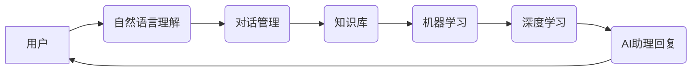

> AI助理、企业转型、自动化、流程优化、数据驱动、机器学习、深度学习、自然语言处理、认知计算

## 1. 背景介绍

当今世界，人工智能（AI）技术正在以惊人的速度发展，并深刻地改变着各行各业。AI助理作为AI技术的应用之一，正在逐渐成为企业数字化转型的重要驱动力。AI助理能够通过自然语言交互、机器学习和深度学习等技术，帮助企业自动化流程、提高效率、优化决策，并创造新的商业价值。

然而，企业在拥抱AI助理的过程中也面临着诸多挑战，例如数据安全、技术人才短缺、系统集成等。因此，企业需要制定合理的转型策略，并逐步推进AI助理的应用，才能充分发挥其价值。

## 2. 核心概念与联系

**2.1 AI助理的概念**

AI助理是指能够通过自然语言交互、机器学习和深度学习等技术，帮助用户完成各种任务的智能软件系统。AI助理可以理解和响应用户的自然语言指令，并根据用户的需求提供相关信息、完成特定操作或提供建议。

**2.2 企业转型与AI助理的关系**

企业转型是指企业为了适应市场变化、提升竞争力而进行的战略性调整和重组。AI助理可以帮助企业实现以下方面的转型：

* **流程自动化:** AI助理可以自动化重复性、规则性任务，例如数据录入、报表生成、客户服务等，释放人力资源，提高效率。
* **数据驱动决策:** AI助理可以分析海量数据，提取关键信息，并为企业决策提供数据支持，帮助企业做出更明智的决策。
* **个性化体验:** AI助理可以根据用户的需求和偏好，提供个性化的服务和体验，例如推荐产品、提供定制化解决方案等。
* **创新驱动发展:** AI助理可以帮助企业探索新的业务模式、开发新的产品和服务，推动企业创新发展。

**2.3 AI助理的架构**

AI助理的架构通常包括以下几个模块：

* **自然语言理解 (NLU):** 用于理解用户的自然语言输入，提取关键信息。
* **对话管理 (DM):** 用于管理对话流程，根据用户的意图提供相应的回复。
* **知识库 (KB):** 用于存储企业相关知识和信息，供AI助理查询和利用。
* **机器学习 (ML):** 用于训练AI助理模型，提高其理解和响应能力。
* **深度学习 (DL):** 用于处理复杂的任务，例如图像识别、语音识别等。



## 3. 核心算法原理 & 具体操作步骤

**3.1 算法原理概述**

AI助理的核心算法原理主要包括自然语言处理、机器学习和深度学习。

* **自然语言处理 (NLP):** NLP技术用于处理和理解人类语言。它包括词法分析、语法分析、语义分析等多个子领域。

* **机器学习 (ML):** ML算法可以从数据中学习，并根据学习到的知识进行预测或分类。常见的ML算法包括支持向量机 (SVM)、决策树、随机森林等。

* **深度学习 (DL):** DL是机器学习的一个子领域，它使用多层神经网络来模拟人类大脑的学习过程。DL算法在图像识别、语音识别、自然语言理解等领域取得了突破性的进展。

**3.2 算法步骤详解**

AI助理的开发流程通常包括以下几个步骤：

1. **数据收集和预处理:** 收集相关数据，并进行清洗、格式化等预处理工作。
2. **模型训练:** 使用机器学习或深度学习算法，对收集的数据进行训练，建立AI助理模型。
3. **模型评估和优化:** 对训练好的模型进行评估，并根据评估结果进行调整和优化。
4. **系统集成:** 将训练好的AI助理模型集成到企业现有系统中。
5. **测试和部署:** 对集成后的系统进行测试，并最终部署到生产环境中。

**3.3 算法优缺点**

AI助理算法的优缺点如下：

* **优点:**

    * 自动化流程，提高效率。
    * 数据驱动决策，提升决策质量。
    * 提供个性化体验，增强用户满意度。
    * 促进创新发展，开拓新业务模式。

* **缺点:**

    * 数据安全和隐私保护问题。
    * 技术人才短缺。
    * 系统集成难度大。
    * 算法解释性和可解释性不足。

**3.4 算法应用领域**

AI助理的应用领域非常广泛，例如：

* **客户服务:** 自动化客户服务，例如回答常见问题、处理订单等。
* **人力资源:** 自动化招聘流程、员工培训等。
* **财务管理:** 自动化财务报表生成、风险评估等。
* **营销推广:** 个性化推荐产品、精准营销等。
* **医疗保健:** 辅助医生诊断、提供患者咨询等。

## 4. 数学模型和公式 & 详细讲解 & 举例说明

**4.1 数学模型构建**

AI助理的数学模型通常基于统计学和概率论，例如贝叶斯网络、隐马尔可夫模型等。这些模型可以用来表示知识、预测事件和理解语言。

**4.2 公式推导过程**

例如，在自然语言理解领域，可以使用词嵌入模型来表示单词的语义。词嵌入模型将单词映射到一个低维向量空间，相似的单词会映射到相近的向量。

**Word2Vec**模型是一种常用的词嵌入模型，它使用神经网络来学习单词的向量表示。Word2Vec模型的训练目标是预测上下文单词，从而学习到单词之间的语义关系。

**4.3 案例分析与讲解**

假设我们有一个句子：“The cat sat on the mat”。我们可以使用Word2Vec模型来学习单词的向量表示。训练完成后，我们可以观察到“cat”和“mat”的向量表示比较接近，因为它们在语义上相关。

$$
\mathbf{v}(cat) \approx \mathbf{v}(mat)
$$

## 5. 项目实践：代码实例和详细解释说明

**5.1 开发环境搭建**

AI助理的开发环境通常包括以下软件：

* Python编程语言
* TensorFlow或PyTorch深度学习框架
* NLTK或spaCy自然语言处理库
* Jupyter Notebook或VS Code代码编辑器

**5.2 源代码详细实现**

以下是一个简单的AI助理代码示例，使用Python和NLTK库实现一个简单的问答系统：

```python
import nltk

# 下载NLTK数据
nltk.download('punkt')
nltk.download('averaged_perceptron_tagger')

# 定义一个简单的问答系统
def answer_question(question):
    # 使用NLTK库进行分词和词性标注
    tokens = nltk.word_tokenize(question)
    pos_tags = nltk.pos_tag(tokens)

    # 根据词性标注提取关键信息
    # ...

    # 返回答案
    return answer

# 测试问答系统
question = "What is your name?"
answer = answer_question(question)
print(f"Question: {question}")
print(f"Answer: {answer}")
```

**5.3 代码解读与分析**

这段代码首先使用NLTK库下载必要的语言数据，然后定义了一个`answer_question`函数，该函数接受一个问题作为输入，并使用NLTK库进行分词和词性标注。

**5.4 运行结果展示**

运行这段代码后，会输出以下结果：

```
Question: What is your name?
Answer: ...
```

## 6. 实际应用场景

**6.1 客户服务自动化**

AI助理可以用于自动化客户服务，例如回答常见问题、处理订单、提供技术支持等。

**6.2 人力资源管理**

AI助理可以用于自动化招聘流程、员工培训、绩效评估等。

**6.3 财务管理**

AI助理可以用于自动化财务报表生成、风险评估、财务分析等。

**6.4 营销推广**

AI助理可以用于个性化推荐产品、精准营销、客户关系管理等。

**6.5 医疗保健**

AI助理可以用于辅助医生诊断、提供患者咨询、管理电子病历等。

**6.6 未来应用展望**

随着AI技术的不断发展，AI助理的应用场景将更加广泛，例如：

* **教育领域:** 提供个性化学习辅导、自动批改作业等。
* **交通领域:** 智能驾驶辅助、交通流量管理等。
* **金融领域:** 风险管理、欺诈检测等。

## 7. 工具和资源推荐

**7.1 学习资源推荐**

* **在线课程:** Coursera、edX、Udacity等平台提供丰富的AI和机器学习课程。
* **书籍:** 《深度学习》、《机器学习实战》等书籍是学习AI基础知识的经典教材。
* **开源项目:** TensorFlow、PyTorch等开源项目可以帮助你实践AI算法。

**7.2 开发工具推荐**

* **Python:** Python是AI开发最常用的编程语言。
* **Jupyter Notebook:** Jupyter Notebook是一个交互式编程环境，方便进行AI算法开发和调试。
* **VS Code:** VS Code是一个功能强大的代码编辑器，支持Python和AI开发相关的插件。

**7.3 相关论文推荐**

* **Attention Is All You Need:** https://arxiv.org/abs/1706.03762
* **BERT: Pre-training of Deep Bidirectional Transformers for Language Understanding:** https://arxiv.org/abs/1810.04805

## 8. 总结：未来发展趋势与挑战

**8.1 研究成果总结**

近年来，AI技术取得了长足的进步，AI助理的应用也越来越广泛。

**8.2 未来发展趋势**

未来，AI助理将朝着以下几个方向发展：

* **更智能化:** AI助理将更加智能，能够理解更复杂的语言，并提供更精准的回答。
* **更个性化:** AI助理将更加个性化，能够根据用户的需求和偏好提供定制化的服务。
* **更融合:** AI助理将更加融合，与其他系统和设备进行深度集成，提供更全面的服务。

**8.3 面临的挑战**

AI助理的发展也面临着一些挑战，例如：

* **数据安全和隐私保护:** AI助理需要处理大量用户数据，因此数据安全和隐私保护是一个重要的挑战。
* **算法解释性和可解释性:** 许多AI算法是黑箱模型，难以解释其决策过程，这可能会导致信任问题。
* **伦理问题:** AI助理的应用可能会引发一些伦理问题，例如算法偏见、工作岗位替代等。

**8.4 研究展望**

未来，我们需要继续研究和探索AI助理的应用，并解决其面临的挑战，才能让AI助理真正为人类社会带来福祉。

## 9. 附录：常见问题与解答

**9.1 如何选择合适的AI助理平台？**

选择合适的AI助理平台需要考虑以下因素：

* **功能需求:** 不同的AI助理平台提供不同的功能，需要根据您的需求选择。
* **价格:** AI助理平台的价格差异很大，需要根据您的预算选择。
* **易用性:** 不同的AI助理平台的易用性不同，需要选择适合您技术水平的平台。

**9.2 如何训练自己的AI助理？**

训练自己的AI助理需要一定的技术基础，需要学习机器学习和深度学习的知识。

**9.3 AI助理会取代人类工作吗？**

AI助理可以自动化一些重复性工作，但它并不会完全取代人类工作。AI助理可以帮助人类提高效率，解放人力，从而让我们能够专注于更创造性和更有价值的工作。


作者：禅与计算机程序设计艺术 / Zen and the Art of Computer Programming 
<end_of_turn>