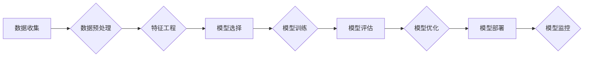

> AI工程,最佳实践,机器学习,深度学习,算法设计,代码实战,模型部署,云计算

## 1. 背景介绍

人工智能（AI）正以惊人的速度发展，深刻地改变着我们生活的方方面面。从自动驾驶汽车到智能语音助手，从医疗诊断到金融风险评估，AI技术正在各个领域展现出强大的应用潜力。然而，将AI技术从实验室转化为现实应用，并非易事。需要具备扎实的AI工程知识和实践经验，才能构建出高效、可靠、可扩展的AI系统。

本篇文章将深入探讨AI工程的最佳实践，涵盖从算法设计到模型部署的各个环节，并通过代码实战案例，帮助读者理解和掌握AI工程的核心原理和技术方法。

## 2. 核心概念与联系

AI工程是一个跨学科的领域，涉及到机器学习、深度学习、数据科学、软件工程等多个领域。其核心目标是构建能够解决实际问题的智能系统。

**2.1 AI工程核心概念**

* **机器学习（Machine Learning）:**  让计算机从数据中学习，无需明确编程，自动发现模式和规律。
* **深度学习（Deep Learning）:**  一种更高级的机器学习方法，利用多层神经网络模拟人类大脑的学习过程。
* **数据科学（Data Science）:**  利用统计学、计算机科学和领域知识，从数据中提取有价值的信息。
* **软件工程（Software Engineering）:**  应用工程原理和方法，设计、开发和维护软件系统。

**2.2 AI工程关键环节**

AI工程流程通常包括以下几个关键环节：

1. **数据收集和预处理:**  收集并清洗数据，使其适合模型训练。
2. **特征工程:**  从原始数据中提取有价值的特征，用于模型训练。
3. **模型选择和训练:**  选择合适的机器学习算法，并根据训练数据进行模型训练。
4. **模型评估和优化:**  评估模型性能，并通过调整模型参数或算法，提高模型精度。
5. **模型部署和监控:**  将训练好的模型部署到生产环境中，并持续监控模型性能。

**2.3 AI工程流程图**



## 3. 核心算法原理 & 具体操作步骤

### 3.1  算法原理概述

本节将介绍一种常用的机器学习算法——线性回归。线性回归是一种监督学习算法，用于预测连续值。其核心思想是找到一条直线，使得这条直线与训练数据点的距离最小。

### 3.2  算法步骤详解

1. **数据准备:**  收集并预处理训练数据，将特征和目标变量分离。
2. **假设函数:**  定义一个线性函数作为假设函数，表示目标变量与特征之间的关系。
3. **损失函数:**  定义一个损失函数，用于衡量模型预测值与真实值的差异。常用的损失函数是均方误差。
4. **梯度下降:**  使用梯度下降算法，迭代更新模型参数，使得损失函数最小化。
5. **模型评估:**  使用测试数据评估模型性能，常用的指标包括均方误差、R-squared等。

### 3.3  算法优缺点

**优点:**

* 算法简单易懂，易于实现。
* 计算效率高，适合处理大规模数据。

**缺点:**

* 只能处理线性关系，对于非线性关系的预测效果较差。
* 对异常值敏感，容易受到异常值的影响。

### 3.4  算法应用领域

线性回归广泛应用于以下领域：

* 房价预测
* 股票价格预测
* 销售额预测
* 医疗诊断

## 4. 数学模型和公式 & 详细讲解 & 举例说明

### 4.1  数学模型构建

线性回归模型的数学表达式为：

$$
y = w_0 + w_1x_1 + w_2x_2 + ... + w_nx_n + \epsilon
$$

其中：

* $y$ 是目标变量
* $x_1, x_2, ..., x_n$ 是特征变量
* $w_0, w_1, w_2, ..., w_n$ 是模型参数
* $\epsilon$ 是误差项

### 4.2  公式推导过程

损失函数通常采用均方误差，定义为：

$$
J(w) = \frac{1}{2m} \sum_{i=1}^{m} (y^{(i)} - h_\theta(x^{(i)}))^2
$$

其中：

* $m$ 是训练样本数量
* $y^{(i)}$ 是第 $i$ 个样本的目标变量
* $h_\theta(x^{(i)})$ 是模型对第 $i$ 个样本的预测值

使用梯度下降算法，迭代更新模型参数，使得损失函数最小化。梯度下降公式为：

$$
w_j = w_j - \alpha \frac{\partial J(w)}{\partial w_j}
$$

其中：

* $\alpha$ 是学习率

### 4.3  案例分析与讲解

假设我们想要预测房屋价格，特征包括房屋面积、房间数量等。我们可以使用线性回归模型，将房屋面积和房间数量作为特征，房屋价格作为目标变量。通过训练模型，我们可以得到房屋价格与特征之间的线性关系，并利用该模型预测新房子的价格。

## 5. 项目实践：代码实例和详细解释说明

### 5.1  开发环境搭建

本示例使用Python语言和Scikit-learn库进行实现。需要安装Python和Scikit-learn库。

### 5.2  源代码详细实现

```python
import pandas as pd
from sklearn.linear_model import LinearRegression
from sklearn.model_selection import train_test_split

# 加载数据
data = pd.read_csv('house_price.csv')

# 分割特征和目标变量
X = data[['area', 'rooms']]
y = data['price']

# 将数据分割为训练集和测试集
X_train, X_test, y_train, y_test = train_test_split(X, y, test_size=0.2, random_state=42)

# 创建线性回归模型
model = LinearRegression()

# 训练模型
model.fit(X_train, y_train)

# 预测测试集数据
y_pred = model.predict(X_test)

# 评估模型性能
from sklearn.metrics import mean_squared_error
mse = mean_squared_error(y_test, y_pred)
print(f'均方误差: {mse}')
```

### 5.3  代码解读与分析

1. 首先，我们加载数据，并将其分割为特征和目标变量。
2. 然后，我们将数据分割为训练集和测试集，用于训练和评估模型。
3. 创建线性回归模型，并使用训练数据进行模型训练。
4. 使用训练好的模型预测测试集数据，并计算模型性能指标，例如均方误差。

### 5.4  运行结果展示

运行上述代码，可以得到模型的均方误差值，该值越小，模型性能越好。

## 6. 实际应用场景

### 6.1  金融领域

* **信用风险评估:**  利用客户的财务数据，预测客户是否会违约。
* **欺诈检测:**  识别异常交易行为，防止金融欺诈。
* **投资决策:**  分析市场数据，预测股票价格走势。

### 6.2  医疗领域

* **疾病诊断:**  根据患者的症状和检查结果，辅助医生诊断疾病。
* **药物研发:**  预测药物的疗效和安全性。
* **个性化医疗:**  根据患者的基因信息，提供个性化的医疗方案。

### 6.3  电商领域

* **商品推荐:**  根据用户的购买历史和浏览记录，推荐相关的商品。
* **价格优化:**  根据市场需求和竞争情况，动态调整商品价格。
* **客户服务:**  利用聊天机器人，提供智能客户服务。

### 6.4  未来应用展望

随着人工智能技术的不断发展，其应用场景将更加广泛，例如：

* **自动驾驶:**  实现无人驾驶汽车，提高交通安全和效率。
* **智能制造:**  利用机器学习，优化生产流程，提高生产效率。
* **个性化教育:**  根据学生的学习情况，提供个性化的学习方案。

## 7. 工具和资源推荐

### 7.1  学习资源推荐

* **在线课程:**  Coursera、edX、Udacity等平台提供丰富的AI课程。
* **书籍:**  《深入理解机器学习》、《Python机器学习实战》等书籍。
* **博客和论坛:**  机器之心、AI科技大本营等网站提供AI领域的最新资讯和讨论。

### 7.2  开发工具推荐

* **Python:**  人工智能开发的常用语言。
* **Scikit-learn:**  机器学习库，提供各种算法和工具。
* **TensorFlow:**  深度学习框架，用于构建和训练深度神经网络。
* **PyTorch:**  另一种流行的深度学习框架。

### 7.3  相关论文推荐

* **《ImageNet Classification with Deep Convolutional Neural Networks》:**  介绍了AlexNet模型，标志着深度学习的兴起。
* **《Attention Is All You Need》:**  提出了Transformer模型，在自然语言处理领域取得了突破性进展。

## 8. 总结：未来发展趋势与挑战

### 8.1  研究成果总结

近年来，人工智能领域取得了显著进展，特别是深度学习技术的突破，推动了AI技术的广泛应用。

### 8.2  未来发展趋势

* **模型规模和能力的提升:**  未来，AI模型将更加强大，能够处理更复杂的任务。
* **模型解释性和可解释性:**  研究如何更好地理解和解释AI模型的决策过程。
* **边缘计算和联邦学习:**  将AI模型部署到边缘设备，并实现数据隐私保护。

### 8.3  面临的挑战

* **数据获取和隐私保护:**  AI模型的训练需要大量数据，如何获取高质量数据并保护数据隐私是一个挑战。
* **算法公平性和可信度:**  确保AI模型的公平性和可信度，避免算法歧视和偏见。
* **伦理和社会影响:**  AI技术的应用可能带来伦理和社会问题，需要进行深入思考和讨论。

### 8.4  研究展望

未来，AI研究将继续朝着更智能、更安全、更可解释的方向发展，并为人类社会带来更多福祉。

## 9. 附录：常见问题与解答

**Q1: 什么是机器学习？**

A1: 机器学习是一种人工智能技术，让计算机从数据中学习，无需明确编程，自动发现模式和规律。

**Q2: 什么是深度学习？**

A2: 深度学习是一种更高级的机器学习方法，利用多层神经网络模拟人类大脑的学习过程。

**Q3: 如何选择合适的机器学习算法？**

A3: 选择合适的机器学习算法需要考虑数据的类型、任务目标和模型复杂度等因素。

**Q4: 如何评估机器学习模型的性能？**

A4: 常用的模型性能指标包括准确率、召回率、F1-score、AUC等。

**Q5: 如何部署机器学习模型？**

A5: 机器学习模型可以部署到云端、边缘设备或本地服务器。


作者：禅与计算机程序设计艺术 / Zen and the Art of Computer Programming 
<end_of_turn>