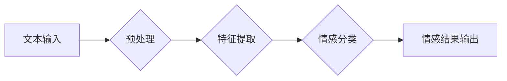

> 情感分析，自然语言处理，机器学习，深度学习，文本分类，情感识别，应用案例

## 1. 背景介绍

在当今数据爆炸的时代，人们通过网络平台表达情感和观点的方式日益增多。如何从海量文本数据中准确识别用户的情感倾向，已成为一个重要的研究课题。情感分析技术，也称为情感计算，正是为了解决这一问题而诞生的。它利用自然语言处理（NLP）和机器学习（ML）等技术，从文本中提取情感信息，并将其分类为正向、负向或中性等类别。

情感分析技术在各个领域都有着广泛的应用，例如：

* **市场营销:** 分析客户对产品和服务的评价，了解用户需求，改进营销策略。
* **社交媒体监测:** 跟踪品牌形象和舆情，及时应对负面评论，维护品牌声誉。
* **客户服务:** 自动识别客户情绪，提供更精准的客服服务，提升客户满意度。
* **医疗保健:** 分析患者的病历和病症描述，识别潜在的情绪问题，提供更有效的治疗方案。
* **教育:** 分析学生的学习态度和情绪变化，帮助老师更好地了解学生需求，提供个性化教学。

## 2. 核心概念与联系

情感分析的核心概念包括：

* **情感极性:** 指文本表达的情感倾向，通常分为正向、负向和中性。
* **情感强度:** 指文本表达的情感程度，例如，"很高兴"比"高兴"表达的情感强度更强。
* **情感分类:** 将文本的情绪归类到特定的情感类别，例如，快乐、悲伤、愤怒、恐惧等。

**情感分析技术架构**



## 3. 核心算法原理 & 具体操作步骤

### 3.1  算法原理概述

情感分析算法主要分为以下几种类型：

* **基于规则的算法:** 基于人工定义的规则和词典，识别文本中的情感词语，并根据规则进行情感分类。
* **基于机器学习的算法:** 利用机器学习算法，从训练数据中学习情感分类模型，对新的文本进行情感分类。常见的机器学习算法包括支持向量机（SVM）、朴素贝叶斯（NB）、决策树（DT）等。
* **基于深度学习的算法:** 利用深度神经网络，例如循环神经网络（RNN）和卷积神经网络（CNN），对文本进行情感分析。深度学习算法能够更好地捕捉文本中的语义和情感信息。

### 3.2  算法步骤详解

以基于机器学习的文本分类算法为例，其具体操作步骤如下：

1. **数据收集和预处理:** 收集包含情感标签的文本数据，并进行预处理，例如，去除停用词、标点符号、HTML标签等。
2. **特征提取:** 将文本转换为机器可理解的特征向量，例如，使用词袋模型（Bag-of-Words）、TF-IDF等方法。
3. **模型训练:** 利用训练数据，训练机器学习模型，例如，SVM、NB、DT等。
4. **模型评估:** 使用测试数据评估模型的性能，例如，计算准确率、召回率、F1-score等指标。
5. **模型部署:** 将训练好的模型部署到实际应用场景中，对新的文本进行情感分类。

### 3.3  算法优缺点

**基于规则的算法:**

* **优点:** 简单易实现，能够处理特定领域的文本数据。
* **缺点:** 规则难以覆盖所有情况，难以处理复杂的情感表达。

**基于机器学习的算法:**

* **优点:** 能够学习复杂的文本特征，对未知文本具有较好的泛化能力。
* **缺点:** 需要大量的训练数据，训练时间较长。

**基于深度学习的算法:**

* **优点:** 能够更好地捕捉文本中的语义和情感信息，性能优于传统机器学习算法。
* **缺点:** 训练数据量要求更高，计算资源消耗较大。

### 3.4  算法应用领域

情感分析算法广泛应用于以下领域：

* **市场营销:** 产品评价分析、客户反馈分析、广告效果评估。
* **社交媒体监测:** 品牌形象监测、舆情分析、用户情绪分析。
* **客户服务:** 自动客服、情绪识别、客户满意度评估。
* **医疗保健:** 患者情绪分析、疾病诊断辅助、心理健康评估。
* **教育:** 学生学习态度分析、情绪识别、个性化教学。

## 4. 数学模型和公式 & 详细讲解 & 举例说明

### 4.1  数学模型构建

情感分析模型通常采用分类模型，将文本分类为不同的情感类别。常用的分类模型包括：

* **逻辑回归:** 是一种线性分类模型，用于预测二元分类问题。其目标函数为：

$$
L(w,b) = -\frac{1}{N} \sum_{i=1}^{N} y_i \log(p(x_i)) + (1-y_i) \log(1-p(x_i))
$$

其中：

* $w$ 为模型参数
* $b$ 为偏置项
* $N$ 为样本数量
* $x_i$ 为第 $i$ 个样本的特征向量
* $y_i$ 为第 $i$ 个样本的标签（0或1）
* $p(x_i)$ 为模型预测第 $i$ 个样本属于正类的概率

* **支持向量机 (SVM):** 是一种基于最大间隔的分类模型，用于寻找最佳的分隔超平面。其目标函数为：

$$
\min_{w,b} \frac{1}{2} ||w||^2 + C \sum_{i=1}^{N} \xi_i
$$

其中：

* $w$ 为模型参数
* $b$ 为偏置项
* $C$ 为惩罚参数
* $\xi_i$ 为松弛变量

### 4.2  公式推导过程

公式推导过程因算法而异，例如，逻辑回归的公式推导过程涉及梯度下降算法，SVM的公式推导过程涉及拉格朗日乘子法等。

### 4.3  案例分析与讲解

以情感分类为例，假设我们训练了一个逻辑回归模型，用于将文本分类为正向、负向和中性三种情感类别。我们可以使用测试数据评估模型的性能，例如，计算准确率、召回率、F1-score等指标。

## 5. 项目实践：代码实例和详细解释说明

### 5.1  开发环境搭建

* 操作系统: Ubuntu 20.04
* Python 版本: 3.8
* 必要的库: NLTK, Scikit-learn, TensorFlow

### 5.2  源代码详细实现

```python
# 导入必要的库
import nltk
from nltk.corpus import stopwords
from sklearn.feature_extraction.text import TfidfVectorizer
from sklearn.model_selection import train_test_split
from sklearn.linear_model import LogisticRegression
from sklearn.metrics import accuracy_score, classification_report

# 下载停用词列表
nltk.download('stopwords')

# 加载情感分类数据集
# ...

# 数据预处理
def preprocess_text(text):
    # 1. 小写转换
    text = text.lower()
    # 2. 去除停用词
    stop_words = set(stopwords.words('english'))
    words = [word for word in text.split() if word not in stop_words]
    # 3. 合并词语
    text = ' '.join(words)
    return text

# 数据特征提取
vectorizer = TfidfVectorizer()
X = vectorizer.fit_transform(data['text'])

# 数据划分
X_train, X_test, y_train, y_test = train_test_split(X, data['label'], test_size=0.2, random_state=42)

# 模型训练
model = LogisticRegression()
model.fit(X_train, y_train)

# 模型评估
y_pred = model.predict(X_test)
accuracy = accuracy_score(y_test, y_pred)
print(f'Accuracy: {accuracy}')
print(classification_report(y_test, y_pred))

```

### 5.3  代码解读与分析

* 代码首先导入必要的库，并下载停用词列表。
* 然后，加载情感分类数据集，并进行数据预处理，例如，小写转换、去除停用词等。
* 接着，使用TF-IDF方法提取文本特征，并将数据划分训练集和测试集。
* 然后，训练逻辑回归模型，并使用测试集评估模型的性能。

### 5.4  运行结果展示

运行结果会显示模型的准确率、召回率、F1-score等指标，以及分类报告，例如，每个类别模型的准确率、召回率、F1-score等。

## 6. 实际应用场景

### 6.1  市场营销

* **产品评价分析:** 分析用户对产品评价的正面、负面情绪，了解产品优缺点，改进产品设计和营销策略。
* **客户反馈分析:** 分析客户反馈的意见和建议，及时解决客户问题，提升客户满意度。
* **广告效果评估:** 分析广告文案和图片的吸引力，评估广告效果，优化广告投放策略。

### 6.2  社交媒体监测

* **品牌形象监测:** 跟踪用户对品牌的评价和讨论，及时发现负面舆情，维护品牌形象。
* **舆情分析:** 分析社会热点事件和用户情绪变化，了解公众对事件的看法，为决策提供参考。
* **用户情绪分析:** 分析用户在社交媒体上的情绪表达，了解用户需求和痛点，提供更精准的营销服务。

### 6.3  客户服务

* **自动客服:** 利用情感分析技术，识别客户情绪，提供更精准的客服服务，例如，根据客户情绪调整客服语调，提供更合适的解决方案。
* **情绪识别:** 分析客户的语气和表达方式，识别客户的情绪状态，例如，判断客户是否生气、沮丧或满意。
* **客户满意度评估:** 分析客户反馈的意见和建议，评估客户满意度，改进服务质量。

### 6.4  未来应用展望

随着人工智能技术的不断发展，情感分析技术将有更广泛的应用场景，例如：

* **个性化教育:** 根据学生的学习态度和情绪变化，提供个性化的学习方案和辅导。
* **医疗保健:** 分析患者的病历和情绪变化，辅助医生诊断疾病，提供更有效的治疗方案。
* **人机交互:** 开发更智能的人机交互系统，能够理解用户的意图和情绪，提供更自然、更人性化的交互体验。

## 7. 工具和资源推荐

### 7.1  学习资源推荐

* **书籍:**
    * "Natural Language Processing with Python" by Steven Bird, Ewan Klein, and Edward Loper
    * "Speech and Language Processing" by Daniel Jurafsky and James H. Martin
* **在线课程:**
    * Coursera: Natural Language Processing Specialization
    * edX: Artificial Intelligence
* **博客和网站:**
    * Towards Data Science
    * Analytics Vidhya

### 7.2  开发工具推荐

* **Python:** 广泛用于自然语言处理和机器学习开发。
* **NLTK:** Python 的自然语言处理库，提供丰富的文本处理工具。
* **Scikit-learn:** Python 的机器学习库，提供各种分类算法和评估指标。
* **TensorFlow:** Google 开发的深度学习框架，用于训练复杂的深度神经网络。

### 7.3  相关论文推荐

* "Sentiment Analysis and Opinion Mining" by Pang and Lee
* "Deep Learning for Sentiment Analysis" by Socher et al.
* "A Survey of Transfer Learning" by Pan and Yang

## 8. 总结：未来发展趋势与挑战

### 8.1  研究成果总结

情感分析技术近年来取得了显著进展，能够准确识别文本中的情感信息，并应用于多个领域。

### 