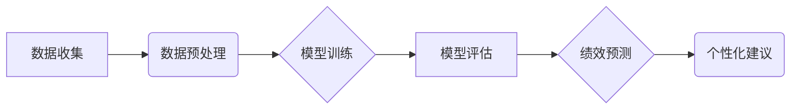

> AI，员工绩效评估，机器学习，深度学习，自然语言处理，数据分析，公平性，透明性

## 1. 背景介绍

传统的员工绩效评估系统主要依赖于主观评价，例如经理的评分和反馈。这种方法存在着许多弊端，例如主观性强、容易受到个人偏见影响、缺乏数据支撑等。随着人工智能技术的快速发展，AI驱动的员工绩效评估系统应运而生，它利用机器学习、深度学习等算法，对员工的工作表现进行客观、精准的评估，并提供个性化的发展建议。

## 2. 核心概念与联系

**2.1 核心概念**

* **员工绩效评估:** 指对员工在工作中表现情况进行量化和评价的过程，旨在了解员工的工作能力、工作态度、工作成果等方面的情况。
* **人工智能 (AI):**  模拟人类智能的计算机系统，能够学习、推理、决策等。
* **机器学习 (ML):**  一种人工智能技术，通过算法从数据中学习，不断提高预测和决策能力。
* **深度学习 (DL):**  一种更高级的机器学习技术，利用多层神经网络模拟人类大脑的学习过程。
* **自然语言处理 (NLP):**  一种人工智能技术，能够理解和处理人类语言。

**2.2 联系**

AI驱动的员工绩效评估系统将上述核心概念有机结合，通过以下步骤实现员工绩效评估：

1. **数据收集:** 收集员工的工作数据，例如工作量、工作效率、项目成果、客户反馈等。
2. **数据预处理:** 对收集到的数据进行清洗、转换、特征提取等处理，使其适合机器学习算法的训练。
3. **模型训练:** 利用机器学习算法，例如回归模型、分类模型、聚类模型等，对员工数据进行训练，建立员工绩效评估模型。
4. **模型评估:** 对训练好的模型进行评估，验证其准确性和可靠性。
5. **绩效预测:** 利用训练好的模型，对员工的未来绩效进行预测。
6. **个性化建议:** 根据员工的绩效评估结果，提供个性化的发展建议。

**2.3 架构图**



## 3. 核心算法原理 & 具体操作步骤

**3.1 算法原理概述**

AI驱动的员工绩效评估系统通常采用以下几种核心算法：

* **回归模型:** 用于预测员工绩效的连续数值，例如工作效率、项目完成度等。常见的回归模型包括线性回归、逻辑回归、支持向量机回归等。
* **分类模型:** 用于将员工绩效分为不同的类别，例如优秀、良好、一般、差等。常见的分类模型包括逻辑回归、支持向量机分类、决策树、随机森林等。
* **聚类模型:** 用于将员工根据其绩效特征进行分组，例如将高绩效员工、中绩效员工、低绩效员工进行分类。常见的聚类模型包括K-means聚类、层次聚类等。

**3.2 算法步骤详解**

以回归模型为例，详细说明其算法步骤：

1. **数据收集:** 收集员工的工作数据，例如工作量、工作效率、项目成果、客户反馈等。
2. **数据预处理:** 对收集到的数据进行清洗、转换、特征提取等处理，使其适合机器学习算法的训练。例如，将文本数据转换为数值数据，处理缺失值等。
3. **模型选择:** 选择合适的回归模型，例如线性回归、逻辑回归等。
4. **模型训练:** 利用训练数据，训练选择的回归模型，学习员工绩效与特征之间的关系。
5. **模型评估:** 利用测试数据，评估模型的准确性和可靠性，例如使用均方误差、R-squared等指标。
6. **模型优化:** 根据评估结果，调整模型参数，提高模型性能。
7. **模型部署:** 将训练好的模型部署到生产环境中，用于预测员工的未来绩效。

**3.3 算法优缺点**

* **优点:**

    * 客观性强：基于数据分析，减少主观评价的影响。
    * 准确性高：利用机器学习算法，能够识别出隐藏的模式和趋势。
    * 可量化：将员工绩效转化为可量化的指标，方便比较和分析。
    * 个性化：可以根据员工的个人情况提供个性化的发展建议。

* **缺点:**

    * 数据依赖：需要大量高质量的数据进行训练。
    * 算法复杂：需要专业的技术人员进行模型开发和维护。
    * 伦理问题：需要考虑算法的公平性、透明性和可解释性等伦理问题。

**3.4 算法应用领域**

AI驱动的员工绩效评估系统可以应用于各个行业，例如：

* 科技行业：评估软件开发人员、数据科学家等技术人员的绩效。
* 金融行业：评估投资银行家、风险管理师等金融专业人员的绩效。
* 医疗行业：评估医生、护士等医疗专业人员的绩效。
* 教育行业：评估教师、学生等教育工作者的绩效。

## 4. 数学模型和公式 & 详细讲解 & 举例说明

**4.1 数学模型构建**

假设我们想要预测员工的绩效得分，我们可以使用线性回归模型，其数学模型如下：

$$
y = \beta_0 + \beta_1x_1 + \beta_2x_2 + ... + \beta_nx_n + \epsilon
$$

其中：

* $y$：员工的绩效得分
* $x_1, x_2, ..., x_n$：员工的特征变量，例如工作量、工作效率、项目成果等
* $\beta_0, \beta_1, ..., \beta_n$：模型参数，需要通过训练数据进行估计
* $\epsilon$：随机误差项

**4.2 公式推导过程**

线性回归模型的目标是找到最佳的模型参数，使得模型预测的绩效得分与实际绩效得分之间的误差最小。常用的误差函数是均方误差 (MSE)，其定义如下：

$$
MSE = \frac{1}{n}\sum_{i=1}^{n}(y_i - \hat{y}_i)^2
$$

其中：

* $n$：样本数量
* $y_i$：第 $i$ 个样本的实际绩效得分
* $\hat{y}_i$：第 $i$ 个样本的预测绩效得分

为了最小化 MSE，可以使用梯度下降算法来迭代更新模型参数。

**4.3 案例分析与讲解**

假设我们收集了 100 名员工的工作数据，包括工作量、工作效率、项目成果等特征变量，以及他们的绩效得分。我们可以使用线性回归模型来预测员工的绩效得分。

通过训练模型，我们发现工作量和工作效率对员工绩效得分有显著的影响，而项目成果的影响相对较小。模型的预测结果与实际绩效得分之间误差较小，说明模型能够有效地预测员工的绩效得分。

## 5. 项目实践：代码实例和详细解释说明

**5.1 开发环境搭建**

* 操作系统：Windows/macOS/Linux
* Python 版本：3.6+
* 必要的库：pandas, numpy, scikit-learn, matplotlib

**5.2 源代码详细实现**

```python
import pandas as pd
from sklearn.linear_model import LinearRegression
from sklearn.model_selection import train_test_split
from sklearn.metrics import mean_squared_error

# 加载数据
data = pd.read_csv('employee_data.csv')

# 选择特征变量和目标变量
X = data[['workload', 'efficiency', 'project_result']]
y = data['performance_score']

# 将数据分为训练集和测试集
X_train, X_test, y_train, y_test = train_test_split(X, y, test_size=0.2, random_state=42)

# 创建线性回归模型
model = LinearRegression()

# 训练模型
model.fit(X_train, y_train)

# 预测测试集的绩效得分
y_pred = model.predict(X_test)

# 计算均方误差
mse = mean_squared_error(y_test, y_pred)

# 打印结果
print(f'均方误差: {mse}')
```

**5.3 代码解读与分析**

* 首先，我们加载员工数据，并选择特征变量和目标变量。
* 然后，我们将数据分为训练集和测试集，用于训练和评估模型。
* 接下来，我们创建线性回归模型，并使用训练数据进行模型训练。
* 训练完成后，我们使用测试数据进行模型预测，并计算模型的均方误差。

**5.4 运行结果展示**

运行上述代码后，会输出模型的均方误差值。较小的均方误差值表示模型的预测精度较高。

## 6. 实际应用场景

**6.1 人才招聘**

AI驱动的员工绩效评估系统可以帮助企业更准确地评估候选人的能力和潜力，从而提高招聘效率和质量。例如，可以利用候选人的简历、面试视频、社交媒体信息等数据，预测其未来的工作表现。

**6.2 员工培训**

AI驱动的员工绩效评估系统可以帮助企业识别员工的技能缺口，并提供个性化的培训建议。例如，可以根据员工的绩效数据和职业目标，推荐相关的培训课程和学习资源。

**6.3 薪酬管理**

AI驱动的员工绩效评估系统可以帮助企业更公平地制定薪酬方案，并根据员工的绩效表现进行调整。例如，可以利用员工的绩效数据和市场薪酬水平，计算出员工的薪酬等级和薪酬幅度。

**6.4 晋升管理**

AI驱动的员工绩效评估系统可以帮助企业更客观地评估员工的晋升资格，并推荐合适的晋升岗位。例如，可以根据员工的绩效数据、技能水平和职业发展规划，预测其在更高职位上的表现。

**6.5 员工激励**

AI驱动的员工绩效评估系统可以帮助企业更好地了解员工的需求和期望，并提供个性化的激励方案。例如，可以根据员工的绩效表现和个人喜好，提供不同的奖励和激励措施。

**6.6 未来应用展望**

随着人工智能技术的不断发展，AI驱动的员工绩效评估系统将更加智能化、个性化和高效化。未来，AI驱动的员工绩效评估系统可能具备以下功能：

* 更准确地预测员工的未来绩效
* 提供更个性化的发展建议
* 自动化员工绩效评估流程
* 帮助企业更好地了解员工的需求和期望
* 促进员工的职业发展和个人成长

## 7. 工具和资源推荐

**7.1 学习资源推荐**

* **书籍:**
    * 《Python机器学习》
    * 《深度学习》
    * 《自然语言处理》
* **在线课程:**
    * Coursera: 机器学习、深度学习
    * edX: 数据科学、人工智能
    * Udacity: 机器学习工程师

**7.2 开发工具推荐**

* **Python:** 
    * scikit-learn: 机器学习库
    * TensorFlow: 深度学习库
    * PyTorch: 深度学习库
* **数据可视化工具:**
    * Matplotlib
    * Seaborn

**7.3 相关论文推荐**

* 《基于深度学习的员工绩效预测模型》
* 《自然语言处理在员工绩效评估中的应用》
* 《AI驱动的员工绩效管理系统》

## 8. 总结：未来发展趋势与挑战

**8.1 研究成果总结**

AI驱动的员工绩效评估系统已经取得了一定的研究成果，能够有效地预测员工的绩效得分，并提供个性化的发展建议。

**8.2 未来发展趋势**

未来，AI驱动的员工绩效评估系统将朝着以下方向发展：

