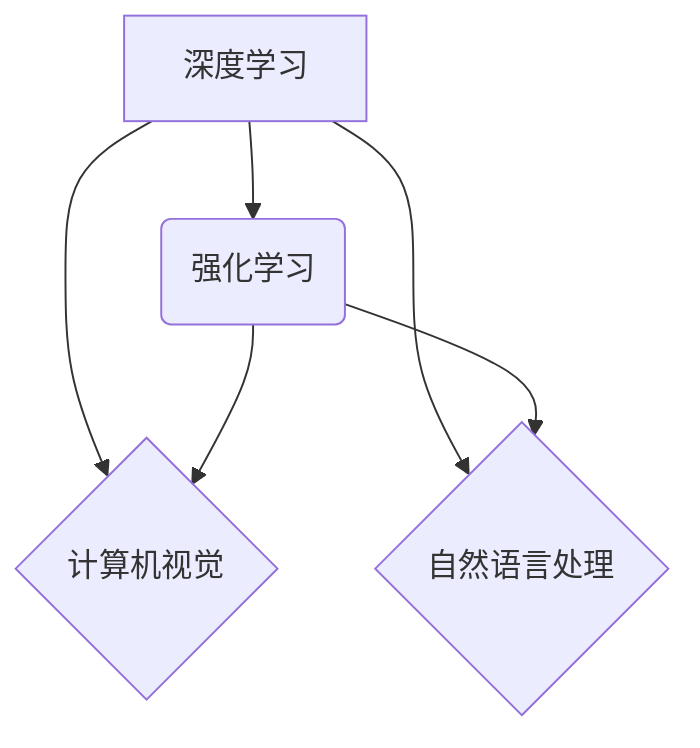

> 人工智能，深度学习，强化学习，计算机视觉，自然语言处理，模型压缩，可解释性，伦理

## 1. 背景介绍

人工智能（AI）正以惊人的速度发展，从自动驾驶到医疗诊断，AI正在改变着我们生活的方方面面。作为AI领域的领军人物，Andrej Karpathy 始终关注着AI技术的未来发展方向，并提出了许多具有前瞻性的观点。本文将探讨Karpathy关于AI未来发展策略的见解，并分析其对AI发展的影响。

## 2. 核心概念与联系

Karpathy认为，AI未来的发展将围绕以下几个核心概念展开：

* **深度学习:** 深度学习是目前AI领域最成功的技术之一，它能够从海量数据中学习复杂的模式。
* **强化学习:** 强化学习是一种基于奖励机制的学习方法，它能够使AI系统在复杂环境中学习最优策略。
* **计算机视觉:** 计算机视觉是让计算机“看”世界的能力，它在图像识别、物体检测等领域有着广泛的应用。
* **自然语言处理:** 自然语言处理是让计算机理解和生成人类语言的能力，它在机器翻译、聊天机器人等领域有着重要的应用。

这些核心概念相互关联，共同推动着AI的发展。例如，深度学习可以用于训练强化学习算法，而强化学习可以用于改进计算机视觉和自然语言处理模型。



## 3. 核心算法原理 & 具体操作步骤

### 3.1  算法原理概述

**深度学习算法**的核心是多层神经网络。这些网络由许多相互连接的神经元组成，每个神经元接收来自其他神经元的输入，并根据这些输入进行计算，最终输出一个结果。通过训练，神经网络能够学习到复杂的模式和关系。

**强化学习算法**的核心是**奖励机制**。在强化学习中，AI系统会与环境进行交互，并根据其行为获得奖励或惩罚。通过不断地尝试不同的行为，AI系统可以学习到在特定情况下获得最大奖励的策略。

### 3.2  算法步骤详解

**深度学习算法的训练步骤:**

1. **数据预处理:** 将原始数据转换为模型可以理解的格式。
2. **网络结构设计:** 设计多层神经网络的结构，包括神经元的数量、连接方式等。
3. **参数初始化:** 为神经网络的参数赋予初始值。
4. **前向传播:** 将输入数据通过神经网络进行计算，得到输出结果。
5. **反向传播:** 计算输出结果与目标值的误差，并根据误差调整神经网络的参数。
6. **迭代训练:** 重复步骤4和5，直到模型的性能达到预期的水平。

**强化学习算法的训练步骤:**

1. **环境建模:** 建立一个模拟真实世界的环境。
2. **策略初始化:** 为AI系统赋予一个初始策略，用于指导其行为。
3. **环境交互:** AI系统与环境进行交互，并根据其行为获得奖励或惩罚。
4. **策略更新:** 根据获得的奖励或惩罚，更新AI系统的策略。
5. **迭代训练:** 重复步骤3和4，直到AI系统的策略达到预期的水平。

### 3.3  算法优缺点

**深度学习算法:**

* **优点:** 能够学习到复杂的模式，在图像识别、自然语言处理等领域取得了突破性的进展。
* **缺点:** 需要大量的训练数据，训练时间长，难以解释模型的决策过程。

**强化学习算法:**

* **优点:** 能够学习到最优策略，适用于复杂环境下的决策问题。
* **缺点:** 训练过程复杂，需要大量的试错，容易陷入局部最优解。

### 3.4  算法应用领域

**深度学习算法:**

* **计算机视觉:** 图像识别、物体检测、图像分割、人脸识别等。
* **自然语言处理:** 机器翻译、文本摘要、情感分析、聊天机器人等。
* **语音识别:** 语音转文本、语音助手等。

**强化学习算法:**

* **自动驾驶:** 控制车辆行驶路线、避开障碍物等。
* **机器人控制:** 控制机器人的运动、抓取物体等。
* **游戏AI:** 训练游戏中的AI对手，使其能够与人类玩家进行对抗。

## 4. 数学模型和公式 & 详细讲解 & 举例说明

### 4.1  数学模型构建

深度学习算法的核心是神经网络，其数学模型可以表示为一系列的矩阵运算。

假设一个神经网络有L层，每层有n个神经元，则神经网络的输出可以表示为：

$$
y = f(W^L * a^{L-1} + b^L)
$$

其中：

* $y$ 是神经网络的输出
* $W^L$ 是第L层的权重矩阵
* $a^{L-1}$ 是第L-1层的激活值
* $b^L$ 是第L层的偏置向量
* $f$ 是激活函数

### 4.2  公式推导过程

强化学习算法的核心是**Bellman方程**，它描述了状态价值函数的更新规则。

$$
V(s) = \max_{\alpha} \sum_{s' \in S} P(s' | s, \alpha) [R(s, \alpha, s') + \gamma V(s')]
$$

其中：

* $V(s)$ 是状态$s$的价值函数
* $\alpha$ 是策略
* $P(s' | s, \alpha)$ 是从状态$s$到状态$s'$的转移概率
* $R(s, \alpha, s')$ 是从状态$s$执行策略$\alpha$到状态$s'$的奖励
* $\gamma$ 是折扣因子

### 4.3  案例分析与讲解

**深度学习算法案例:**

在图像识别任务中，可以使用卷积神经网络（CNN）进行训练。CNN能够学习到图像的特征，并将其用于分类。例如，可以训练一个CNN模型来识别猫和狗的图像。

**强化学习算法案例:**

在自动驾驶任务中，可以使用强化学习算法训练一个AI系统来控制车辆行驶路线。AI系统会与环境进行交互，并根据其行为获得奖励或惩罚。通过不断地试错，AI系统可以学习到在不同路况下最优的驾驶策略。

## 5. 项目实践：代码实例和详细解释说明

### 5.1  开发环境搭建

* **操作系统:** Ubuntu 18.04
* **编程语言:** Python 3.6
* **深度学习框架:** TensorFlow 2.0
* **强化学习库:** OpenAI Gym

### 5.2  源代码详细实现

```python
# 导入必要的库
import tensorflow as tf
from tensorflow.keras.models import Sequential
from tensorflow.keras.layers import Conv2D, MaxPooling2D, Flatten, Dense

# 定义卷积神经网络模型
model = Sequential()
model.add(Conv2D(32, (3, 3), activation='relu', input_shape=(28, 28, 1)))
model.add(MaxPooling2D((2, 2)))
model.add(Conv2D(64, (3, 3), activation='relu'))
model.add(MaxPooling2D((2, 2)))
model.add(Flatten())
model.add(Dense(10, activation='softmax'))

# 编译模型
model.compile(optimizer='adam',
              loss='sparse_categorical_crossentropy',
              metrics=['accuracy'])

# 训练模型
model.fit(x_train, y_train, epochs=10)

```

### 5.3  代码解读与分析

这段代码定义了一个简单的卷积神经网络模型，用于手写数字识别任务。

* `Conv2D`层用于提取图像特征。
* `MaxPooling2D`层用于降维，减少计算量。
* `Flatten`层将多维特征转换为一维向量。
* `Dense`层用于分类。

### 5.4  运行结果展示

训练完成后，可以将模型应用于测试数据，并评估其性能。

## 6. 实际应用场景

### 6.1  医疗诊断

AI可以帮助医生更快、更准确地诊断疾病。例如，AI可以分析医学影像，识别肿瘤和其他异常情况。

### 6.2  金融风险管理

AI可以帮助金融机构识别和管理风险。例如，AI可以分析交易数据，识别欺诈行为。

### 6.3  个性化推荐

AI可以根据用户的喜好和行为，提供个性化的产品和服务推荐。例如，电商平台可以使用AI推荐用户可能感兴趣的商品。

### 6.4  未来应用展望

AI的应用场景还在不断扩展，未来将会有更多新的应用领域出现。例如，AI可以用于自动驾驶、机器人控制、个性化教育等领域。

## 7. 工具和资源推荐

### 7.1  学习资源推荐

* **课程:**
    * Andrew Ng 的机器学习课程
    * DeepLearning.AI 的深度学习课程
* **书籍:**
    * 深度学习
    * 人工智能：一种现代方法
* **网站:**
    * TensorFlow 官网
    * PyTorch 官网
    * OpenAI 官网

### 7.2  开发工具推荐

* **深度学习框架:** TensorFlow, PyTorch, Keras
* **强化学习库:** OpenAI Gym, Stable Baselines3
* **数据可视化工具:** Matplotlib, Seaborn

### 7.3  相关论文推荐

* **深度学习:**
    * ImageNet Classification with Deep Convolutional Neural Networks
    * Attention Is All You Need
* **强化学习:**
    * Deep Reinforcement Learning with Double Q-learning
    * Proximal Policy Optimization Algorithms

## 8. 总结：未来发展趋势与挑战

### 8.1  研究成果总结

近年来，AI领域取得了令人瞩目的进展，深度学习和强化学习等技术取得了突破性的成果。AI已经应用于各个领域，并正在改变着我们的生活。

### 8.2  未来发展趋势

* **模型压缩:** 降低模型大小和计算复杂度，使其能够在移动设备等资源有限的设备上运行。
* **可解释性:** 使AI模型的决策过程更加透明，以便人类能够理解和信任AI系统。
* **安全性和隐私:** 确保AI系统安全可靠，并保护用户隐私。

### 8.3  面临的挑战

* **数据获取和标注:** 训练高性能的AI模型需要大量的标注数据，而数据获取和标注成本很高。
* **算法效率:** 训练大型AI模型需要大量的计算资源，并且训练时间很长。
* **伦理问题:** AI技术的应用可能会带来一些伦理问题，例如算法偏见、工作岗位替代等。

### 8.4  研究展望

未来，AI研究将继续朝着更安全、更可靠、更可解释的方向发展。同时，AI技术也将应用于更多新的领域，为人类社会带来更多福祉。

## 9. 附录：常见问题与解答

**Q1: 深度学习和强化学习有什么区别？**

**A1:** 深度学习主要通过大量数据训练神经网络，学习数据的特征和模式。强化学习则通过与环境交互，学习最优策略，以获得最大奖励。

**Q2: 如何评估AI模型的性能？**

**A2:** 不同的AI任务有不同的评估指标。例如，图像识别任务可以使用准确率、召回率等指标评估模型性能。

**Q3: 如何解决AI算法的偏见问题？**

**A3:** 

* 使用更公平的训练数据。
* 在训练过程中加入公平性约束。
* 对模型的输出进行解释和分析，识别和修正偏见。

作者：禅与计算机程序设计艺术 / Zen and the Art of Computer Programming


<end_of_turn>