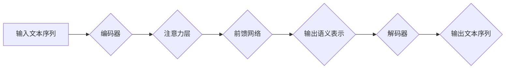

BERT, Transformer, 自然语言处理, 预训练语言模型, 序列标注, 文本分类

## 1. 背景介绍

自然语言处理 (NLP) 领域近年来取得了显著进展，其中预训练语言模型 (PLM) 扮演着越来越重要的角色。BERT (Bidirectional Encoder Representations from Transformers) 是 Google AI 团队于 2018 年提出的一个强大的 PLM，它在许多 NLP 任务上取得了state-of-the-art 的性能。BERT 的核心思想是利用 Transformer 架构和双向上下文信息来学习语言表示，从而更好地理解文本的语义。

传统的语言模型通常采用单向的编码方式，例如 RNN (Recurrent Neural Networks)，只能处理文本序列中的前向或后向信息，而无法捕捉到上下文之间的双向依赖关系。BERT 则通过 Transformer 架构的注意力机制，能够同时学习文本序列中所有词语之间的关系，从而获得更丰富的语义表示。

## 2. 核心概念与联系

BERT 的核心概念包括 Transformer 架构、注意力机制、Masked Language Modeling (MLM) 和 Next Sentence Prediction (NSP)。

**2.1 Transformer 架构**

Transformer 架构是一种新型的序列模型，它摒弃了 RNN 的循环结构，采用并行计算的方式处理文本序列，从而提高了训练效率。Transformer 的核心组件包括：

* **编码器 (Encoder):** 用于将输入文本序列编码成语义表示。
* **解码器 (Decoder):** 用于根据编码后的语义表示生成输出文本序列。

**2.2 注意力机制**

注意力机制是一种机制，它允许模型关注输入序列中与当前任务相关的部分，从而提高模型的性能。BERT 使用多头注意力机制，可以同时关注多个不同的方面，从而获得更全面的语义理解。

**2.3 Masked Language Modeling (MLM)**

MLM 是 BERT 预训练的第一个任务。在 MLM 任务中，模型会随机屏蔽输入文本序列中的部分词语，然后根据上下文信息预测被屏蔽词语。

**2.4 Next Sentence Prediction (NSP)**

NSP 是 BERT 预训练的第二个任务。在 NSP 任务中，模型会输入两个句子，然后预测这两个句子是否相邻。

**2.5 BERT 流程图**



## 3. 核心算法原理 & 具体操作步骤

### 3.1  算法原理概述

BERT 的核心算法原理是基于 Transformer 架构和双向上下文信息学习语言表示。它通过 MLM 和 NSP 两个预训练任务来学习语言的语义和语法结构。

### 3.2  算法步骤详解

1. **输入文本序列:** 将输入文本序列分割成单词或子词，并将其转换为词嵌入向量。
2. **编码器:** 使用 Transformer 架构的编码器对输入文本序列进行编码，生成每个词语的上下文语义表示。
3. **Masked Language Modeling (MLM):** 在编码后的文本序列中随机屏蔽部分词语，然后使用解码器预测被屏蔽词语。
4. **Next Sentence Prediction (NSP):** 输入两个句子，预测这两个句子是否相邻。
5. **微调:** 将预训练好的 BERT 模型微调到特定 NLP 任务，例如文本分类、问答系统、机器翻译等。

### 3.3  算法优缺点

**优点:**

* **双向上下文信息:** BERT 可以捕捉到文本序列中所有词语之间的双向依赖关系，从而获得更丰富的语义理解。
* **预训练:** BERT 在大量的文本数据上进行预训练，可以有效地学习语言的语义和语法结构。
* **强大的性能:** BERT 在许多 NLP 任务上取得了state-of-the-art 的性能。

**缺点:**

* **计算资源消耗:** BERT 的训练和推理过程需要大量的计算资源。
* **参数量大:** BERT 的参数量较大，需要大量的内存来存储和处理。

### 3.4  算法应用领域

BERT 在许多 NLP 任务上都有广泛的应用，例如：

* **文本分类:** 识别文本的类别，例如情感分析、主题分类等。
* **问答系统:** 回答用户提出的问题。
* **机器翻译:** 将文本从一种语言翻译成另一种语言。
* **文本摘要:** 生成文本的简短摘要。
* **对话系统:** 与用户进行自然语言对话。

## 4. 数学模型和公式 & 详细讲解 & 举例说明

### 4.1  数学模型构建

BERT 的数学模型主要基于 Transformer 架构，其核心组件是编码器和解码器。编码器由多个 Transformer 块组成，每个 Transformer 块包含多头注意力机制和前馈网络。解码器也由多个 Transformer 块组成，并使用自注意力机制来生成输出文本序列。

### 4.2  公式推导过程

Transformer 的注意力机制的核心公式如下：

$$
Attention(Q, K, V) = softmax(\frac{QK^T}{\sqrt{d_k}})V
$$

其中：

* $Q$：查询矩阵
* $K$：键矩阵
* $V$：值矩阵
* $d_k$：键向量的维度
* $softmax$：softmax 函数

### 4.3  案例分析与讲解

假设我们有一个句子 "The cat sat on the mat"，我们想要计算 "cat" 这个词语的上下文语义表示。

1. 将句子中的每个词语转换为词嵌入向量。
2. 使用编码器对句子进行编码，生成每个词语的上下文语义表示。
3. 使用注意力机制计算 "cat" 这个词语与其他词语之间的注意力权重。
4. 根据注意力权重，计算 "cat" 这个词语的上下文语义表示。

## 5. 项目实践：代码实例和详细解释说明

### 5.1  开发环境搭建

* Python 3.6+
* TensorFlow 或 PyTorch
* CUDA 和 cuDNN (可选)

### 5.2  源代码详细实现

```python
# 使用 TensorFlow 实现 BERT 的基础结构
import tensorflow as tf

class BERT(tf.keras.Model):
    def __init__(self, vocab_size, embedding_dim, num_heads, num_layers):
        super(BERT, self).__init__()
        self.embedding = tf.keras.layers.Embedding(vocab_size, embedding_dim)
        self.encoder = tf.keras.Sequential([
            tf.keras.layers.MultiHeadAttention(num_heads=num_heads, key_dim=embedding_dim)
            for _ in range(num_layers)
        ])
        self.decoder = tf.keras.Sequential([
            tf.keras.layers.MultiHeadAttention(num_heads=num_heads, key_dim=embedding_dim)
            for _ in range(num_layers)
        ])

    def call(self, inputs):
        embeddings = self.embedding(inputs)
        encoded_outputs = self.encoder(embeddings)
        decoded_outputs = self.decoder(encoded_outputs)
        return decoded_outputs
```

### 5.3  代码解读与分析

* `BERT` 类定义了 BERT 模型的结构。
* `embedding` 层将词语转换为词嵌入向量。
* `encoder` 和 `decoder` 层分别使用多头注意力机制对文本序列进行编码和解码。
* `call` 方法定义了模型的输入和输出。

### 5.4  运行结果展示

运行上述代码，可以训练和评估 BERT 模型的性能。

## 6. 实际应用场景

BERT 在许多实际应用场景中取得了成功，例如：

* **搜索引擎:** BERT 可以用于理解用户搜索意图，并返回更相关的搜索结果。
* **聊天机器人:** BERT 可以用于训练更智能的聊天机器人，能够更好地理解用户的自然语言输入。
* **文本摘要:** BERT 可以用于生成文本的简短摘要，例如新闻文章、会议记录等。

### 6.4  未来应用展望

BERT 的未来应用前景广阔，例如：

* **多语言理解:** BERT 可以用于训练多语言理解模型，能够理解不同语言的文本。
* **跨模态理解:** BERT 可以与其他模态数据，例如图像、音频等进行融合，实现跨模态理解。
* **个性化推荐:** BERT 可以用于个性化推荐系统，根据用户的兴趣和偏好推荐相关内容。

## 7. 工具和资源推荐

### 7.1  学习资源推荐

* **BERT 官方论文:** https://arxiv.org/abs/1810.04805
* **Hugging Face Transformers 库:** https://huggingface.co/transformers/
* **TensorFlow 官方文档:** https://www.tensorflow.org/

### 7.2  开发工具推荐

* **Jupyter Notebook:** https://jupyter.org/
* **VS Code:** https://code.visualstudio.com/

### 7.3  相关论文推荐

* **XLNet:** https://arxiv.org/abs/1906.08237
* **RoBERTa:** https://arxiv.org/abs/1907.11692
* **GPT-3:** https://openai.com/blog/gpt-3/

## 8. 总结：未来发展趋势与挑战

### 8.1  研究成果总结

BERT 的提出和应用推动了 NLP 领域的发展，取得了显著的成果。BERT 的双向上下文信息学习能力和预训练策略为后续研究提供了新的思路和方向。

### 8.2  未来发展趋势

* **更强大的预训练模型:** 研究人员将继续探索更强大的预训练模型，例如更大的模型规模、更丰富的训练数据、更复杂的模型架构。
* **跨模态理解:** 将 BERT 与其他模态数据融合，实现跨模态理解。
* **可解释性:** 研究 BERT 的内部机制，提高模型的可解释性。

### 8.3  面临的挑战

* **计算资源消耗:** 训练和推理大型预训练模型需要大量的计算资源，这对于资源有限的机构和个人来说是一个挑战。
* **数据偏见:** 预训练模型的训练数据可能存在偏见，这会导致模型在某些任务上表现不佳。
* **安全性和隐私性:** 预训练模型的应用可能涉及到用户隐私数据，需要考虑安全性和隐私保护问题。

### 8.4  研究展望

未来，预训练语言模型将继续发展，并在更多领域发挥重要作用。研究人员将继续探索新的模型架构、训练策略和应用场景，推动 NLP 领域的发展。

## 9. 附录：常见问题与解答

**Q1: BERT 的训练数据是什么？**

A1: BERT 的训练数据来自 Google 的公开数据集，包括书籍、文章、网页等。

**Q2: BERT 的参数量是多少？**

A2: BERT 的参数量根据模型大小而不同，例如 BERT-Base 有 1.1 亿个参数，BERT-Large 有 3.3 亿个参数。

**Q3: 如何使用 BERT 进行文本分类？**

A3: 可以将预训练好的 BERT 模型微调到文本分类任务，例如使用分类层将 BERT 的输出映射到不同的类别。


作者：禅与计算机程序设计艺术 / Zen and the Art of Computer Programming 
<end_of_turn>