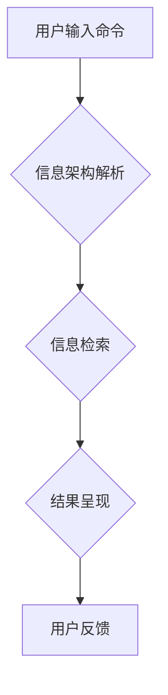

> CUI,信息架构,用户体验,交互设计,可访问性,认知心理学,信息检索,用户行为

## 1. 背景介绍

随着科技的飞速发展，人类与计算机的交互方式也在不断演变。传统的图形用户界面（GUI）已经无法满足用户日益增长的需求，新的交互方式，例如命令行界面（CLI）和自然语言界面（NLI），逐渐崭露头角。其中，基于文本的交互方式，如命令行界面和基于文本的用户界面（CUI），因其简洁、高效、可定制性强等特点，在特定领域和场景中展现出巨大的潜力。

CUI的出现，对信息架构设计提出了新的挑战和机遇。传统的GUI设计注重视觉美感和直观操作，而CUI则更加强调文本信息的组织、检索和呈现。因此，我们需要重新思考如何利用文本信息构建清晰、易懂、高效的信息架构，以提升用户体验。

## 2. 核心概念与联系

### 2.1 信息架构

信息架构是指组织、结构和标记信息以使用户能够轻松找到所需信息的过程。它涉及到信息的分类、导航、搜索和呈现等多个方面。

### 2.2 CUI

CUI是一种基于文本的交互方式，用户通过输入文本命令或指令与系统进行交互。CUI通常使用命令行或文本框作为输入界面，并以文本形式显示输出结果。

### 2.3 联系

CUI与信息架构密切相关。在CUI环境下，信息架构设计需要考虑以下几个关键因素：

* **文本信息的组织和结构:** CUI依赖于文本信息，因此需要采用合理的组织和结构方式，使信息易于理解和检索。
* **命令和指令的设计:** CUI的交互方式基于命令和指令，因此需要设计清晰、简洁、易于记忆的命令和指令，并提供相应的帮助文档。
* **文本信息的呈现:** CUI的输出结果通常以文本形式呈现，因此需要考虑文本的格式、排版和可读性，以提高用户体验。

**Mermaid 流程图**



## 3. 核心算法原理 & 具体操作步骤

### 3.1 算法原理概述

CUI的信息架构设计通常涉及到以下几个核心算法：

* **文本分类算法:** 用于将文本信息进行分类，以便于组织和检索。常见的文本分类算法包括朴素贝叶斯算法、支持向量机算法和深度学习算法。
* **信息检索算法:** 用于根据用户输入的查询词或短语，从文本信息库中检索出相关信息。常见的检索算法包括TF-IDF算法、BM25算法和基于深度学习的检索模型。
* **文本摘要算法:** 用于从长文本中提取关键信息，生成简短的摘要。常见的摘要算法包括抽取式摘要算法和生成式摘要算法。

### 3.2 算法步骤详解

以信息检索算法为例，其具体操作步骤如下：

1. **预处理:** 对用户输入的查询词进行预处理，例如去除停用词、词干化等。
2. **关键词提取:** 从预处理后的查询词中提取关键词。
3. **文本匹配:** 将关键词与文本信息库中的文档进行匹配，计算相关度得分。
4. **排序:** 根据相关度得分对匹配结果进行排序，并将排序结果返回给用户。

### 3.3 算法优缺点

不同的算法具有不同的优缺点，需要根据实际应用场景选择合适的算法。

* **朴素贝叶斯算法:** 优点是简单易实现，缺点是假设特征之间独立，对数据分布敏感。
* **支持向量机算法:** 优点是能够处理高维数据，缺点是训练时间较长，参数选择较复杂。
* **深度学习算法:** 优点是能够学习复杂的特征关系，缺点是需要大量的训练数据，训练时间较长。

### 3.4 算法应用领域

CUI的信息架构设计算法广泛应用于以下领域：

* **搜索引擎:** 用于检索网页、文档和其他类型的文本信息。
* **命令行工具:** 用于组织和检索命令行工具的帮助文档和示例代码。
* **聊天机器人:** 用于理解用户自然语言输入，并提供相应的回复。
* **代码编辑器:** 用于帮助程序员查找和理解代码。

## 4. 数学模型和公式 & 详细讲解 & 举例说明

### 4.1 数学模型构建

信息检索算法通常基于TF-IDF模型，该模型将文档和查询词的权重进行计算，以衡量相关度。

**TF-IDF模型公式:**

$$
TF-IDF(t, d) = TF(t, d) \times IDF(t)
$$

其中：

* $TF(t, d)$ 表示词语 $t$ 在文档 $d$ 中的词频。
* $IDF(t)$ 表示词语 $t$ 在整个语料库中的逆向文档频率。

**TF公式:**

$$
TF(t, d) = \frac{f(t, d)}{\sum_{i=1}^{N} f(i, d)}
$$

其中：

* $f(t, d)$ 表示词语 $t$ 在文档 $d$ 中出现的次数。
* $N$ 表示文档 $d$ 中总词数。

**IDF公式:**

$$
IDF(t) = log_e \frac{N}{df(t)}
$$

其中：

* $N$ 表示语料库中文档总数。
* $df(t)$ 表示词语 $t$ 在语料库中出现的文档数。

### 4.2 公式推导过程

TF-IDF模型的推导过程基于以下假设：

* 词语在文档中出现的频率越高，该词语对文档的主题越相关。
* 在整个语料库中出现的词语越少，该词语的权重越高。

### 4.3 案例分析与讲解

假设我们有一个语料库包含1000篇文档，其中包含以下词语：

* "计算机"
* "编程"
* "人工智能"

如果一个文档包含以下内容：

"计算机科学是一门研究计算机的科学，编程是计算机科学的核心内容，人工智能是计算机科学的未来发展方向。"

那么，该文档中"计算机"、"编程"和"人工智能"的TF-IDF值分别为：

* $TF-IDF("计算机", d) = TF("计算机", d) \times IDF("计算机")$
* $TF-IDF("编程", d) = TF("编程", d) \times IDF("编程")$
* $TF-IDF("人工智能", d) = TF("人工智能", d) \times IDF("人工智能")$

通过计算TF-IDF值，我们可以判断该文档与哪些主题相关。

## 5. 项目实践：代码实例和详细解释说明

### 5.1 开发环境搭建

* 操作系统：Linux
* 编程语言：Python
* 库依赖：NLTK、Scikit-learn

### 5.2 源代码详细实现

```python
import nltk
from sklearn.feature_extraction.text import TfidfVectorizer

# 下载NLTK数据
nltk.download('punkt')
nltk.download('stopwords')

# 文本预处理
def preprocess_text(text):
    # 分词
    tokens = nltk.word_tokenize(text)
    # 去除停用词
    stop_words = nltk.corpus.stopwords.words('english')
    tokens = [word for word in tokens if word not in stop_words]
    # 返回预处理后的文本
    return ' '.join(tokens)

# 文本向量化
vectorizer = TfidfVectorizer()
documents = [
    "This is the first document.",
    "This document is the second document.",
    "And this is the third one.",
    "Is this the first document?"
]
processed_documents = [preprocess_text(doc) for doc in documents]
tfidf_matrix = vectorizer.fit_transform(processed_documents)

# 打印TF-IDF矩阵
print(tfidf_matrix.toarray())
```

### 5.3 代码解读与分析

* 文本预处理函数 `preprocess_text()` 对文本进行分词、去除停用词等操作，以提高文本信息的质量。
* `TfidfVectorizer()` 类用于将文本信息向量化，并计算TF-IDF值。
* `fit_transform()` 方法将训练数据和测试数据进行向量化，并计算TF-IDF值。
* `toarray()` 方法将TF-IDF矩阵转换为NumPy数组，以便于打印和分析。

### 5.4 运行结果展示

运行上述代码后，将输出一个TF-IDF矩阵，其中每个元素代表一个词语在某个文档中的权重。

## 6. 实际应用场景

### 6.1 命令行工具

CUI广泛应用于命令行工具，例如Linux系统中的命令行工具。信息架构设计可以帮助用户更轻松地理解和使用命令行工具。

### 6.2 代码编辑器

一些代码编辑器也采用CUI，例如Vim和Emacs。信息架构设计可以帮助程序员更快速地查找和理解代码。

### 6.3 聊天机器人

一些聊天机器人也采用CUI，例如基于文本的客服机器人。信息架构设计可以帮助用户更清晰地表达需求，并获得更准确的回复。

### 6.4 未来应用展望

随着人工智能技术的不断发展，CUI在未来将有更广泛的应用场景，例如：

* **语音助手:** 将语音转换为文本，并通过CUI与用户交互。
* **智能家居:** 通过CUI控制智能家居设备。
* **远程医疗:** 通过CUI与医生进行远程咨询。

## 7. 工具和资源推荐

### 7.1 学习资源推荐

* **书籍:**
    * "Designing for Voice" by Cathy Pearl
    * "The Design of Everyday Things" by Don Norman
* **在线课程:**
    * Coursera: "Human-Computer Interaction"
    * edX: "Introduction to User Experience Design"

### 7.2 开发工具推荐

* **文本编辑器:** Vim, Emacs, Sublime Text
* **代码库:** GitHub, GitLab
* **机器学习库:** Scikit-learn, TensorFlow

### 7.3 相关论文推荐

* "Information Architecture for Command-Line Interfaces" by Michael J. Smith
* "The Role of Information Architecture in User Experience Design" by Peter Morville

## 8. 总结：未来发展趋势与挑战

### 8.1 研究成果总结

CUI的信息架构设计是一个不断发展的领域，近年来取得了显著的进展。

* **文本分类算法:** 随着深度学习技术的进步，文本分类算法的准确率不断提高。
* **信息检索算法:** 基于深度学习的信息检索模型能够更好地理解用户意图，并提供更精准的检索结果。
* **文本摘要算法:** 生成式文本摘要算法能够生成更流畅、更自然的文本摘要。

### 8.2 未来发展趋势

* **个性化信息架构:** 根据用户的个人喜好和需求，定制个性化的信息架构。
* **多模态交互:** 将文本与其他模态信息，例如语音、图像和视频，进行融合，构建更丰富的交互体验。
* **人工智能辅助设计:** 利用人工智能技术辅助信息架构师设计更有效的架构。

### 8.3 面临的挑战

* **数据稀缺:** CUI的信息架构设计需要大量的文本数据进行训练，而一些领域的数据稀缺性较高。
* **用户体验:** CUI的交互方式相对复杂，需要设计更直观、更易于理解的用户界面。
* **可访问性:** CUI需要考虑不同用户群体的需求，例如视障用户和听障用户。

### 8.4 研究展望

未来，CUI的信息架构设计将继续朝着更智能、更个性化、更易于使用的方向发展。


## 9. 附录：常见问题与解答

### 9.1 如何选择合适的文本分类算法？

选择合适的文本分类算法需要根据实际应用场景和数据特点进行考虑。

* 如果数据量较小，可以使用朴素贝叶斯算法或支持向量