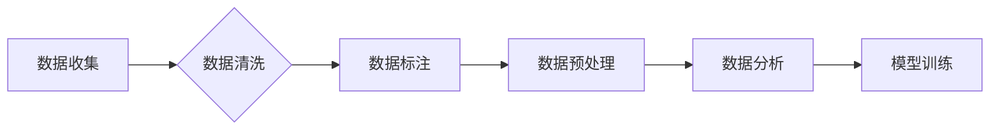

> Dataset, 数据集, 数据标注, 数据清洗, 数据预处理, 数据分析, 机器学习, 深度学习

## 1. 背景介绍

在当今数据爆炸的时代，数据已成为企业和研究机构最重要的资产。数据驱动决策、数据分析、数据挖掘等领域蓬勃发展，而这一切都离不开高质量的 Dataset。Dataset 是机器学习和深度学习模型训练的基础，其质量直接影响模型的性能和准确性。

然而，构建高质量的 Dataset 并非易事，它需要经历多个步骤，包括数据收集、数据清洗、数据标注、数据预处理等。本文将深入探讨 Dataset 的原理和构建方法，并通过代码实例讲解具体的实现步骤。

## 2. 核心概念与联系

**2.1 数据集 (Dataset)**

Dataset 是一个包含大量数据样本的集合，这些样本通常以结构化的表格形式存储，每个样本包含多个特征和一个标签。

**2.2 数据标注 (Data Labeling)**

数据标注是指为数据样本赋予标签的过程，例如图像识别中，需要为图像标注出物体类别；文本分类中，需要为文本标注出情感类别等。数据标注是构建监督学习模型的基础，高质量的标注数据可以提高模型的准确性。

**2.3 数据清洗 (Data Cleaning)**

数据清洗是指对原始数据进行处理，去除噪声、错误和重复数据，以提高数据质量。数据清洗步骤包括：

* 缺失值处理：删除缺失值、填充缺失值或使用其他方法处理缺失值。
* 异常值处理：删除异常值、替换异常值或使用其他方法处理异常值。
* 数据类型转换：将数据转换为合适的类型，例如将字符串转换为数字。

**2.4 数据预处理 (Data Preprocessing)**

数据预处理是指对数据进行一系列的转换和处理，以使其更适合机器学习模型的训练。数据预处理步骤包括：

* 数据标准化：将数据转换为特定范围，例如[0,1]或[-1,1]。
* 数据归一化：将数据转换为均值为0，标准差为1的分布。
* 特征工程：提取新的特征，以提高模型的性能。

**2.5 数据分析 (Data Analysis)**

数据分析是指对数据进行探索和分析，以发现数据中的模式、趋势和异常。数据分析可以帮助我们更好地理解数据，并为决策提供支持。

**2.6 流程图**



## 3. 核心算法原理 & 具体操作步骤

### 3.1 算法原理概述

构建高质量的 Dataset 需要结合多种算法和技术，例如：

* **数据挖掘算法**: 用于发现数据中的模式和趋势，例如关联规则挖掘、聚类分析等。
* **机器学习算法**: 用于对数据进行分类、回归、预测等任务，例如支持向量机、决策树、神经网络等。
* **自然语言处理算法**: 用于处理文本数据，例如词性标注、文本分类、机器翻译等。

### 3.2 算法步骤详解

构建高质量的 Dataset 的步骤可以概括为以下几个阶段：

1. **数据收集**: 从各种来源收集相关数据，例如数据库、文件、网站、传感器等。
2. **数据清洗**: 对收集到的数据进行清洗，去除噪声、错误和重复数据。
3. **数据标注**: 为数据样本赋予标签，例如图像识别中，需要为图像标注出物体类别；文本分类中，需要为文本标注出情感类别等。
4. **数据预处理**: 对数据进行一系列的转换和处理，以使其更适合机器学习模型的训练。
5. **数据分析**: 对数据进行探索和分析，以发现数据中的模式、趋势和异常。
6. **模型训练**: 使用机器学习模型对数据进行训练，以构建预测模型。

### 3.3 算法优缺点

不同的算法有不同的优缺点，需要根据具体任务和数据特点选择合适的算法。

### 3.4 算法应用领域

构建高质量的 Dataset 广泛应用于各个领域，例如：

* **计算机视觉**: 图像识别、目标检测、图像分割等。
* **自然语言处理**: 文本分类、情感分析、机器翻译等。
* **语音识别**: 语音转文本、语音合成等。
* **推荐系统**: 商品推荐、用户画像等。

## 4. 数学模型和公式 & 详细讲解 & 举例说明

### 4.1 数学模型构建

构建 Dataset 的数学模型可以帮助我们更好地理解数据之间的关系，并进行数据分析和预测。例如，我们可以使用线性回归模型来预测房价，使用逻辑回归模型来预测客户是否会购买产品等。

### 4.2 公式推导过程

例如，线性回归模型的公式如下：

$$y = mx + c$$

其中：

* $y$ 是预测值
* $x$ 是输入特征
* $m$ 是模型参数，表示特征的权重
* $c$ 是模型参数，表示截距

### 4.3 案例分析与讲解

例如，我们可以使用线性回归模型来预测房价。假设我们收集了房屋面积和房价的数据，我们可以使用线性回归模型来拟合数据，并得到房价预测模型。

## 5. 项目实践：代码实例和详细解释说明

### 5.1 开发环境搭建

构建 Dataset 需要使用一些工具和软件，例如：

* Python 编程语言
* Pandas 数据分析库
* Scikit-learn 机器学习库
* TensorFlow 深度学习库

### 5.2 源代码详细实现

```python
import pandas as pd
from sklearn.model_selection import train_test_split
from sklearn.linear_model import LinearRegression

# 加载数据
data = pd.read_csv('house_price.csv')

# 分割数据
X = data[['area']]
y = data['price']
X_train, X_test, y_train, y_test = train_test_split(X, y, test_size=0.2, random_state=42)

# 创建线性回归模型
model = LinearRegression()

# 训练模型
model.fit(X_train, y_train)

# 预测房价
y_pred = model.predict(X_test)

# 评估模型性能
print('模型系数:', model.coef_)
print('模型截距:', model.intercept_)
```

### 5.3 代码解读与分析

这段代码首先加载了房价数据，然后将数据分割为训练集和测试集。接着，创建了一个线性回归模型，并使用训练集训练模型。最后，使用测试集预测房价，并评估模型性能。

### 5.4 运行结果展示

运行代码后，会输出模型系数和截距，以及预测房价的结果。

## 6. 实际应用场景

构建高质量的 Dataset 广泛应用于各个领域，例如：

* **医疗保健**: 构建疾病诊断模型、药物研发模型等。
* **金融**: 构建欺诈检测模型、信用评分模型等。
* **教育**: 构建个性化学习模型、学生成绩预测模型等。

### 6.4 未来应用展望

随着人工智能技术的不断发展，构建高质量的 Dataset 将变得更加重要。未来，我们将看到更多基于深度学习的模型应用于各个领域，而这些模型都需要高质量的 Dataset 进行训练。

## 7. 工具和资源推荐

### 7.1 学习资源推荐

* **书籍**:
    * "Hands-On Machine Learning with Scikit-Learn, Keras & TensorFlow" by Aurélien Géron
    * "Deep Learning" by Ian Goodfellow, Yoshua Bengio, and Aaron Courville
* **在线课程**:
    * Coursera: Machine Learning by Andrew Ng
    * Udacity: Deep Learning Nanodegree

### 7.2 开发工具推荐

* **Python**: 
* **Pandas**: 数据分析库
* **Scikit-learn**: 机器学习库
* **TensorFlow**: 深度学习库
* **PyTorch**: 深度学习库

### 7.3 相关论文推荐

* "ImageNet Classification with Deep Convolutional Neural Networks" by Alex Krizhevsky, Ilya Sutskever, and Geoffrey E. Hinton
* "Attention Is All You Need" by Ashish Vaswani, Noam Shazeer, Niki Parmar, Jakob Uszkoreit, Llion Jones, Aidan N. Gomez, Łukasz Kaiser, and Illia Polosukhin

## 8. 总结：未来发展趋势与挑战

### 8.1 研究成果总结

构建高质量的 Dataset 是机器学习和深度学习领域的重要研究方向，取得了显著的成果。

### 8.2 未来发展趋势

未来，构建高质量的 Dataset 将朝着以下几个方向发展：

* **自动化**: 使用自动化工具和技术来构建 Dataset，例如自动数据标注、自动数据清洗等。
* **多样化**: 构建更加多样化的 Dataset，例如跨语言、跨文化、跨领域等。
* **可解释性**: 构建更加可解释的 Dataset，以便更好地理解模型的决策过程。

### 8.3 面临的挑战

构建高质量的 Dataset 仍然面临一些挑战，例如：

* 数据标注成本高
* 数据质量参差不齐
* 数据隐私安全问题

### 8.4 研究展望

未来，我们需要继续探索新的方法和技术来构建高质量的 Dataset，以推动人工智能技术的进步。

## 9. 附录：常见问题与解答

**常见问题**:

* 如何进行数据标注？
* 如何处理缺失值？
* 如何评估 Dataset 的质量？

**解答**:

* 数据标注可以使用人工标注、自动标注或半自动标注等方法。
* 缺失值可以删除、填充或使用其他方法处理。
* Dataset 的质量可以评估指标，例如准确率、召回率、F1-score等。


作者：禅与计算机程序设计艺术 / Zen and the Art of Computer Programming 
<end_of_turn>