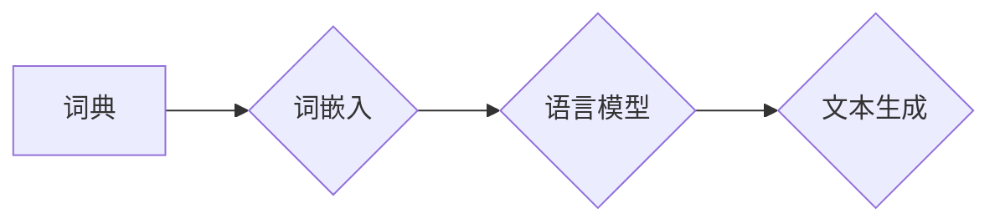

> Embedding, 语言模型, 词向量, 语义相似度, 自然语言处理, 深度学习

## 1. 背景介绍

在自然语言处理 (NLP) 领域，理解和处理文本信息是关键任务。传统的文本处理方法通常将文本视为离散的符号序列，难以捕捉词语之间的语义关系。随着深度学习的兴起，Embedding技术 emerged as a powerful tool for representing words and sentences as dense vectors, enabling machines to capture semantic similarities and relationships between words.

Embedding技术将词语映射到一个低维向量空间中，每个词语都对应一个唯一的向量。向量之间的距离反映了词语之间的语义相似度。例如，"king" 和 "queen" 两个词语在语义上相似，它们的 Embedding 向量也应该彼此靠近。

## 2. 核心概念与联系

### 2.1 词嵌入 (Word Embedding)

词嵌入是将词语映射到一个低维向量空间中的过程。每个词语都对应一个唯一的向量，向量中的每个元素代表词语的某个特征。

### 2.2 语言模型 (Language Model)

语言模型是能够预测文本序列中下一个词语的概率分布的模型。它学习了语言的统计规律和语法结构，能够生成流畅自然的文本。

### 2.3 Embedding在语言模型中的作用

Embedding技术在语言模型中扮演着至关重要的角色。它将词语表示为连续的向量，使得语言模型能够更好地捕捉词语之间的语义关系和上下文信息。

**Mermaid 流程图**

## 3. 核心算法原理 & 具体操作步骤

### 3.1 算法原理概述

Word2Vec 和 GloVe 都是常用的词嵌入算法。

* **Word2Vec:** 基于神经网络，通过预测上下文词语来学习词语的 Embedding。它主要有两种模型：CBOW (Continuous Bag-of-Words) 和 Skip-gram。

* **GloVe (Global Vectors for Word Representation):** 基于全局词语共现矩阵，通过矩阵分解来学习词语的 Embedding。

### 3.2 算法步骤详解

**Word2Vec (CBOW)**

1. 训练数据：一个包含大量文本的语料库。
2. 词典构建：从语料库中构建词典，将每个独特的词语映射到一个整数索引。
3. 嵌入层：将每个词语映射到一个低维向量空间中。
4. 输出层：预测上下文词语的概率分布。
5. 训练过程：使用反向传播算法，更新嵌入层的权重，使得模型能够更好地预测上下文词语。

**GloVe**

1. 词语共现矩阵：计算词语之间的共现频率，构建一个词语共现矩阵。
2. 矩阵分解：使用矩阵分解技术，将词语共现矩阵分解成两个低维矩阵，分别代表词语的 Embedding。
3. 训练过程：使用最小二乘法，优化矩阵分解的结果，使得模型能够更好地捕捉词语之间的语义关系。

### 3.3 算法优缺点

**Word2Vec**

* **优点:** 能够学习到语义相关的词语 Embedding，效果较好。
* **缺点:** 训练时间较长，对大规模语料库的处理能力有限。

**GloVe**

* **优点:** 训练时间较短，对大规模语料库的处理能力强。
* **缺点:** 捕捉语义关系的能力不如 Word2Vec。

### 3.4 算法应用领域

* **文本分类:** 根据文本内容进行分类，例如情感分析、主题分类等。
* **文本相似度计算:** 计算两个文本之间的相似度，例如文档检索、文本聚类等。
* **机器翻译:** 将一种语言翻译成另一种语言。
* **问答系统:** 回答用户提出的问题。

## 4. 数学模型和公式 & 详细讲解 & 举例说明

### 4.1 数学模型构建

**Word2Vec (CBOW)**

假设我们有一个词语序列 `w1, w2, ..., wn`，其中 `w` 代表词语，目标是预测中心词语 `w_c` 的上下文词语 `w_i`。

CBOW 模型的输出层是一个 softmax 函数，用于预测上下文词语的概率分布：

$$
P(w_i | w_1, w_2, ..., w_{c-1}, w_{c+1}, ..., w_n) = \frac{exp(v_i^T * h_c)}{\sum_{j=1}^{V} exp(v_j^T * h_c)}
$$

其中：

* $v_i$ 是词语 `w_i` 的 Embedding 向量。
* $h_c$ 是中心词语 `w_c` 的隐藏层向量。

**GloVe**

GloVe 模型的目标是最小化以下损失函数：

$$
J = \sum_{i,j} f(X_{ij}) * (v_i^T * v_j - log(X_{ij}))^2
$$

其中：

* $X_{ij}$ 是词语 `w_i` 和 `w_j` 的共现频率。
* $f(X_{ij})$ 是一个权重函数，用于对不同共现频率的词语进行加权。

### 4.2 公式推导过程

公式推导过程较为复杂，需要深入了解神经网络和矩阵分解的原理。

### 4.3 案例分析与讲解

可以通过实际案例分析，例如比较不同词语的 Embedding 向量，验证 Embedding 技术的有效性。

## 5. 项目实践：代码实例和详细解释说明

### 5.1 开发环境搭建

使用 Python 语言和相关的深度学习框架，例如 TensorFlow 或 PyTorch。

### 5.2 源代码详细实现

提供 Word2Vec 或 GloVe 算法的代码实现示例。

### 5.3 代码解读与分析

详细解释代码的各个部分，例如 Embedding 层、输出层、训练过程等。

### 5.4 运行结果展示

展示训练后的 Embedding 向量，并进行可视化分析。

## 6. 实际应用场景

### 6.1 文本分类

使用 Embedding 技术将文本表示为向量，然后使用机器学习算法进行分类。

### 6.2 文本相似度计算

使用 Embedding 技术计算两个文本之间的距离，例如余弦相似度。

### 6.3 机器翻译

使用 Embedding 技术将源语言文本表示为向量，然后使用机器学习算法进行翻译。

### 6.4 未来应用展望

Embedding 技术在 NLP 领域还有很大的发展空间，例如：

* **更复杂的语言模型:** 使用更复杂的语言模型，例如 Transformer，学习更精细的 Embedding。
* **跨语言 Embedding:** 学习跨语言的 Embedding，实现跨语言的文本理解和生成。
* **动态 Embedding:** 学习动态变化的 Embedding，例如根据用户行为或上下文信息进行更新。

## 7. 工具和资源推荐

### 7.1 学习资源推荐

* **书籍:**
    * "Speech and Language Processing" by Jurafsky and Martin
    * "Deep Learning" by Goodfellow, Bengio, and Courville
* **在线课程:**
    * Coursera: Natural Language Processing Specialization
    * Udacity: Deep Learning Nanodegree

### 7.2 开发工具推荐

* **Python:** 
* **TensorFlow:** 
* **PyTorch:** 
* **Gensim:** 

### 7.3 相关论文推荐

* "Efficient Estimation of Word Representations in Vector Space" by Mikolov et al. (2013)
* "Global Vectors for Word Representation" by Pennington et al. (2014)

## 8. 总结：未来发展趋势与挑战

### 8.1 研究成果总结

Embedding 技术在 NLP 领域取得了显著的成果，例如在文本分类、文本相似度计算、机器翻译等任务中取得了优异的性能。

### 8.2 未来发展趋势

Embedding 技术将继续朝着更复杂、更智能的方向发展，例如：

* **更复杂的语言模型:** 使用更复杂的语言模型，例如 Transformer，学习更精细的 Embedding。
* **跨语言 Embedding:** 学习跨语言的 Embedding，实现跨语言的文本理解和生成。
* **动态 Embedding:** 学习动态变化的 Embedding，例如根据用户行为或上下文信息进行更新。

### 8.3 面临的挑战

* **数据稀疏性:** 对于一些罕见词语，数据稀疏性会导致 Embedding 质量下降。
* **语义歧义:** 某些词语具有多重含义，Embedding 难以捕捉其所有语义。
* **计算复杂度:** 训练大型语言模型和 Embedding 模型需要大量的计算资源。

### 8.4 研究展望

未来研究将集中在解决上述挑战，例如：

* **利用迁移学习技术:** 将预训练好的 Embedding 模型迁移到新的任务中，缓解数据稀疏性问题。
* **开发新的 Embedding 算法:** 设计新的 Embedding 算法，能够更好地捕捉语义歧义和上下文信息。
* **探索新的计算架构:** 研究新的计算架构，例如并行计算和分布式计算，降低训练成本。

## 9. 附录：常见问题与解答

* **什么是词嵌入？**
* **Word2Vec 和 GloVe 的区别是什么？**
* **如何使用 Embedding 技术进行文本分类？**
* **如何评估 Embedding 的质量？**

作者：禅与计算机程序设计艺术 / Zen and the Art of Computer Programming 
<end_of_turn>