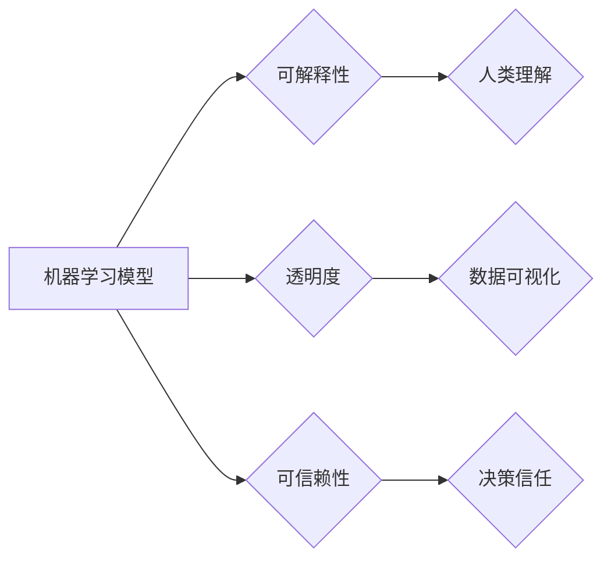

> Explainable AI (XAI), 可解释人工智能, 机器学习模型解释, 算法可解释性, XAI 技术, 决策树, LIME, SHAP

## 1. 背景介绍

人工智能 (AI) 在各个领域取得了令人瞩目的成就，从医疗诊断到金融预测，AI 正在改变着我们的生活。然而，随着 AI 模型的复杂性不断增加，其内部决策过程变得越来越难以理解。这引发了“黑盒”问题，即我们无法解释 AI 模型是如何得出结论的。

可解释 AI (XAI) 应运而生，旨在提高 AI 模型的透明度和可解释性。XAI 的目标是使人类能够理解 AI 模型的决策过程，从而增强对 AI 的信任，并促进 AI 的安全、可靠和公平使用。

## 2. 核心概念与联系

XAI 的核心概念包括：

* **可解释性 (Interpretability):** 指 AI 模型的决策过程能够被人类理解和解释的能力。
* **透明度 (Transparency):** 指 AI 模型的内部工作机制和数据来源能够被公开透明地展示。
* **可信赖性 (Trustworthiness):** 指人类对 AI 模型的决策结果能够建立信任。

XAI 与其他 AI 相关概念的关系如下：



## 3. 核心算法原理 & 具体操作步骤

### 3.1  算法原理概述

XAI 算法旨在揭示 AI 模型的决策逻辑，并将其以人类可理解的形式呈现。常见的 XAI 算法包括：

* **决策树:** 将决策过程分解成一系列规则，以树状结构表示。
* **局部解释模型 (LIME):** 通过构建局部线性模型来解释单个预测结果。
* **SHAP (SHapley Additive exPlanations):** 基于博弈论原理，分配每个特征对预测结果的贡献度。

### 3.2  算法步骤详解

以决策树为例，其构建步骤如下：

1. **选择特征:** 从所有特征中选择一个最能区分不同类别的特征作为根节点。
2. **划分数据集:** 根据根节点的取值，将数据集划分成多个子集。
3. **递归构建树:** 对每个子集重复步骤 1 和 2，直到满足停止条件 (例如，子集大小小于阈值)。
4. **生成决策规则:** 从决策树中提取决策规则，以树状结构表示。

### 3.3  算法优缺点

| 算法 | 优点 | 缺点 |
|---|---|---|
| 决策树 | 易于理解，可视化效果好 | 容易过拟合，对数据噪声敏感 |
| LIME | 可以解释单个预测结果 | 局部解释，可能无法反映全局规律 |
| SHAP | 全局解释，可以分配特征贡献度 | 计算复杂度高 |

### 3.4  算法应用领域

XAI 算法广泛应用于各个领域，例如：

* **医疗诊断:** 解释 AI 模型如何诊断疾病，提高医生对 AI 诊断结果的信任。
* **金融风险评估:** 解释 AI 模型如何评估风险，帮助金融机构做出更明智的决策。
* **自动驾驶:** 解释 AI 模型如何感知周围环境，提高自动驾驶系统的安全性。

## 4. 数学模型和公式 & 详细讲解 & 举例说明

### 4.1  数学模型构建

决策树算法可以利用信息增益或基尼系数等指标来构建决策树模型。

**信息增益:**

$$
Gain(S,A) = Entropy(S) - \sum_{v \in Values(A)} \frac{|S_v|}{|S|} Entropy(S_v)
$$

其中：

* $S$ 是数据集
* $A$ 是特征
* $Values(A)$ 是特征 $A$ 的取值集合
* $S_v$ 是特征 $A$ 取值为 $v$ 的子集
* $Entropy(S)$ 是数据集 $S$ 的熵

**基尼系数:**

$$
Gini(S) = 1 - \sum_{i=1}^{|C|} p_i^2
$$

其中：

* $C$ 是类别集合
* $p_i$ 是类别 $i$ 在数据集 $S$ 中的比例

### 4.2  公式推导过程

信息增益和基尼系数都是用来衡量特征对数据集的划分程度。信息增益越大，特征对数据集的划分越有效。基尼系数越小，特征对数据集的划分越有效。

### 4.3  案例分析与讲解

假设我们有一个数据集，用于预测客户是否会购买商品。数据集包含以下特征：年龄、收入、性别。我们可以使用信息增益或基尼系数来选择最优特征作为根节点。

## 5. 项目实践：代码实例和详细解释说明

### 5.1  开发环境搭建

* Python 3.x
* scikit-learn 库
* matplotlib 库

### 5.2  源代码详细实现

```python
from sklearn.tree import DecisionTreeClassifier
from sklearn.datasets import load_iris
from sklearn.model_selection import train_test_split
import matplotlib.pyplot as plt
from sklearn import tree

# 加载 iris 数据集
iris = load_iris()
X = iris.data
y = iris.target

# 将数据划分为训练集和测试集
X_train, X_test, y_train, y_test = train_test_split(X, y, test_size=0.2, random_state=42)

# 创建决策树模型
clf = DecisionTreeClassifier()

# 训练模型
clf.fit(X_train, y_train)

# 生成决策树可视化图
plt.figure(figsize=(12, 8))
tree.plot_tree(clf, feature_names=iris.feature_names, class_names=iris.target_names, filled=True)
plt.show()

# 预测测试集结果
y_pred = clf.predict(X_test)

# 评估模型性能
from sklearn.metrics import accuracy_score
accuracy = accuracy_score(y_test, y_pred)
print(f"模型准确率: {accuracy:.2f}")
```

### 5.3  代码解读与分析

* 代码首先加载 iris 数据集，并将其划分为训练集和测试集。
* 然后，创建决策树模型，并使用训练集训练模型。
* 接下来，使用 `tree.plot_tree()` 函数生成决策树的可视化图。
* 最后，使用测试集预测结果，并评估模型性能。

### 5.4  运行结果展示

运行代码后，将生成决策树的可视化图，并输出模型的准确率。

## 6. 实际应用场景

XAI 技术在各个领域都有着广泛的应用场景：

### 6.1  医疗诊断

XAI 可以帮助医生理解 AI 模型如何诊断疾病，从而提高对 AI 诊断结果的信任。例如，XAI 可以解释 AI 模型如何根据患者的症状、病史和检查结果得出诊断结果。

### 6.2  金融风险评估

XAI 可以帮助金融机构理解 AI 模型如何评估风险，从而做出更明智的决策。例如，XAI 可以解释 AI 模型如何根据客户的信用记录、收入和支出等信息评估其贷款风险。

### 6.3  自动驾驶

XAI 可以帮助开发人员理解 AI 模型如何感知周围环境，从而提高自动驾驶系统的安全性。例如，XAI 可以解释 AI 模型如何根据摄像头、雷达和激光雷达等传感器数据判断车辆周围的障碍物。

### 6.4  未来应用展望

随着 AI 技术的不断发展，XAI 技术将发挥越来越重要的作用。未来，XAI 技术将应用于更多领域，例如：

* **法律判决:** 解释 AI 模型如何做出法律判决，提高法律判决的透明度和公正性。
* **教育教学:** 解释 AI 模型如何提供个性化学习建议，提高学习效率。
* **科学研究:** 解释 AI 模型如何发现新的科学规律，加速科学研究的进程。

## 7. 工具和资源推荐

### 7.1  学习资源推荐

* **书籍:**
    * "Interpretable Machine Learning" by Christoph Molnar
    * "The Master Algorithm" by Pedro Domingos
* **在线课程:**
    * Coursera: "Machine Learning" by Andrew Ng
    * edX: "Artificial Intelligence" by Columbia University

### 7.2  开发工具推荐

* **LIME:** https://github.com/marcotcr/lime
* **SHAP:** https://github.com/slundberg/shap
* **TensorBoard:** https://www.tensorflow.org/tensorboard

### 7.3  相关论文推荐

* "Towards a Rigorous Science of Interpretable Machine Learning" by Christoph Molnar
* "SHAP: A Unified Approach to Interpreting Model Predictions" by Scott Lundberg and Su-In Lee

## 8. 总结：未来发展趋势与挑战

### 8.1  研究成果总结

XAI 技术取得了显著的进展，为提高 AI 的透明度和可解释性提供了有效的工具和方法。

### 8.2  未来发展趋势

未来，XAI 技术将朝着以下方向发展：

* **更强大的解释性:** 开发更强大的 XAI 算法，能够解释更复杂的 AI 模型。
* **更个性化的解释:** 提供针对不同用户需求的个性化解释。
* **更自动化解释:** 自动生成 AI 模型的解释报告。

### 8.3  面临的挑战

XAI 技术还面临着一些挑战：

* **解释性与准确性之间的权衡:** 提高解释性可能会降低模型的准确性。
* **不同领域解释方法的统一:** 不同领域对解释性的需求不同，需要开发针对不同领域的解释方法。
* **解释结果的可理解性:** 解释结果需要以人类可理解的方式呈现。

### 8.4  研究展望

未来，XAI 技术的研究将继续深入，为 AI 的可信赖性和可持续发展做出更大的贡献。

## 9. 附录：常见问题与解答

**Q1: XAI 技术是否适用于所有 AI 模型？**

**A1:** XAI 技术适用于大多数机器学习模型，但对于一些黑盒模型 (例如深度神经网络) ，解释性可能更困难。

**Q2: XAI 技术的应用场景有哪些？**

**A2:** XAI 技术广泛应用于医疗诊断、金融风险评估、自动驾驶等领域。

**Q3: 如何选择合适的 XAI 算法？**

**A3:** 选择合适的 XAI 算法需要考虑模型类型、解释性需求和计算资源等因素。

**作者：禅与计算机程序设计艺术 / Zen and the Art of Computer Programming**


<end_of_turn>