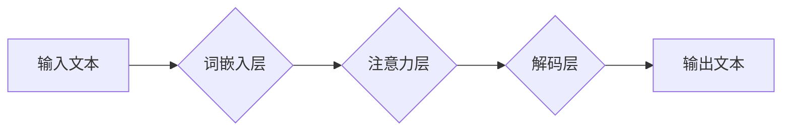

> GLM, 语言模型, 概率图模型, 训练算法, 代码实例, 应用场景

## 1. 背景介绍

近年来，深度学习在自然语言处理领域取得了显著进展，其中语言模型 (Language Model) 作为核心技术，在文本生成、机器翻译、问答系统等领域展现出强大的应用潜力。GLM (General Language Model) 作为一种通用的语言模型，旨在学习语言的统计规律和语义关系，从而实现更广泛的自然语言理解和生成任务。

传统的语言模型主要基于统计方法，如n-gram模型，但其在捕捉长距离依赖关系和语义理解方面存在局限性。深度学习的出现为语言模型的发展带来了新的机遇。基于深度神经网络的语言模型，例如Transformer，能够有效地学习长距离依赖关系，并取得了显著的性能提升。

GLM作为一种基于深度学习的语言模型，其核心思想是利用概率图模型 (Probabilistic Graphical Model) 来表示语言的结构和关系。通过学习概率图模型的参数，GLM能够对语言进行建模，并进行文本生成、文本分类、机器翻译等任务。

## 2. 核心概念与联系

GLM的核心概念包括：

* **概率图模型 (Probabilistic Graphical Model):** 用于表示随机变量之间的依赖关系的图模型。GLM利用概率图模型来表示语言的结构和关系，例如词语之间的依存关系、句子的语法结构等。
* **语言模型 (Language Model):** 用于预测下一个词语出现的概率分布的模型。GLM的目标是学习一个能够准确预测下一个词语的语言模型。
* **深度神经网络 (Deep Neural Network):** 用于学习复杂函数的网络结构。GLM利用深度神经网络来学习概率图模型的参数，从而实现语言建模。

**Mermaid 流程图:**



## 3. 核心算法原理 & 具体操作步骤

### 3.1  算法原理概述

GLM的核心算法原理是基于深度学习的概率图模型训练。具体来说，GLM首先将输入文本转换为词嵌入向量，然后利用注意力机制学习词语之间的依赖关系，最后通过解码层生成输出文本。

### 3.2  算法步骤详解

1. **词嵌入:** 将输入文本中的每个词语转换为一个低维向量，称为词嵌入向量。词嵌入向量能够捕捉词语的语义信息。
2. **注意力机制:** 利用注意力机制学习词语之间的依赖关系。注意力机制可以赋予不同词语不同的权重，从而更好地捕捉长距离依赖关系。
3. **解码层:** 利用解码器生成输出文本。解码器是一个循环神经网络 (RNN) 或Transformer结构，它根据输入文本的词嵌入向量和注意力机制的输出生成下一个词语的概率分布。
4. **训练:** 利用交叉熵损失函数训练GLM模型。交叉熵损失函数衡量模型预测的概率分布与真实概率分布之间的差异。

### 3.3  算法优缺点

**优点:**

* 能够有效地捕捉长距离依赖关系。
* 能够学习语言的语义信息。
* 在文本生成、文本分类、机器翻译等任务中取得了显著的性能提升。

**缺点:**

* 训练成本较高。
* 对训练数据要求较高。
* 难以解释模型的决策过程。

### 3.4  算法应用领域

GLM在以下领域具有广泛的应用前景：

* **文本生成:** 自动生成新闻报道、小说、诗歌等文本。
* **机器翻译:** 将一种语言翻译成另一种语言。
* **问答系统:** 回答用户提出的问题。
* **对话系统:** 与用户进行自然语言对话。
* **文本摘要:** 生成文本的简短摘要。

## 4. 数学模型和公式 & 详细讲解 & 举例说明

### 4.1  数学模型构建

GLM可以利用概率图模型来表示语言的结构和关系。例如，可以使用条件随机场 (Conditional Random Field) 来建模句子中的词语序列，或者使用贝叶斯网络来建模词语之间的语义关系。

### 4.2  公式推导过程

GLM的训练目标是最大化模型对训练数据的似然概率。假设训练数据为一个词语序列 $\{w_1, w_2, ..., w_T\}$, 则GLM的目标函数为：

$$
\mathcal{L} = \log P(w_1, w_2, ..., w_T)
$$

其中，$P(w_1, w_2, ..., w_T)$ 是模型对训练数据的似然概率。

为了计算似然概率，需要对每个词语的概率进行计算。假设每个词语的概率分布为 $P(w_t | w_{1:t-1})$, 则似然概率可以表示为：

$$
P(w_1, w_2, ..., w_T) = \prod_{t=1}^{T} P(w_t | w_{1:t-1})
$$

### 4.3  案例分析与讲解

例如，假设我们有一个训练数据为 "the cat sat on the mat"，GLM需要学习每个词语的概率分布。

* $P(the | \emptyset) = 0.2$
* $P(cat | the) = 0.5$
* $P(sat | the cat) = 0.3$
* $P(on | the cat sat) = 0.4$
* $P(the | the cat sat on) = 0.1$
* $P(mat | the cat sat on the) = 0.6$

通过训练GLM模型，可以学习到这些概率分布，从而实现对新文本的预测和生成。

## 5. 项目实践：代码实例和详细解释说明

### 5.1  开发环境搭建

GLM的开发环境搭建需要以下软件：

* Python 3.6+
* PyTorch 1.0+
* CUDA 10.0+ (可选)

### 5.2  源代码详细实现

```python
import torch
import torch.nn as nn

class GLM(nn.Module):
    def __init__(self, vocab_size, embedding_dim, hidden_dim):
        super(GLM, self).__init__()
        self.embedding = nn.Embedding(vocab_size, embedding_dim)
        self.lstm = nn.LSTM(embedding_dim, hidden_dim)
        self.fc = nn.Linear(hidden_dim, vocab_size)

    def forward(self, x):
        x = self.embedding(x)
        x, _ = self.lstm(x)
        x = self.fc(x[:, -1, :])
        return x
```

### 5.3  代码解读与分析

* `__init__` 方法初始化模型参数，包括词嵌入层、LSTM层和全连接层。
* `forward` 方法定义模型的正向传播过程。首先将输入词语转换为词嵌入向量，然后通过LSTM层进行编码，最后通过全连接层输出每个词语的概率分布。

### 5.4  运行结果展示

训练GLM模型后，可以利用模型对新文本进行预测和生成。例如，可以输入 "the cat"，模型会预测下一个词语为 "sat"。

## 6. 实际应用场景

GLM在以下实际应用场景中具有广泛的应用前景：

### 6.1  文本生成

GLM可以用于自动生成各种类型的文本，例如新闻报道、小说、诗歌、代码等。

### 6.2  机器翻译

GLM可以用于将一种语言翻译成另一种语言。

### 6.3  问答系统

GLM可以用于构建问答系统，回答用户提出的问题。

### 6.4  未来应用展望

随着深度学习技术的不断发展，GLM的应用场景将会更加广泛。例如，GLM可以用于个性化推荐、自动写作、聊天机器人等领域。

## 7. 工具和资源推荐

### 7.1  学习资源推荐

* **书籍:**
    * 《深度学习》
    * 《自然语言处理》
* **在线课程:**
    * Coursera: 自然语言处理
    * Udacity: 深度学习

### 7.2  开发工具推荐

* **PyTorch:** 深度学习框架
* **TensorFlow:** 深度学习框架
* **HuggingFace:** 预训练模型库

### 7.3  相关论文推荐

* **BERT: Pre-training of Deep Bidirectional Transformers for Language Understanding**
* **GPT-3: Language Models are Few-Shot Learners**
* **T5: Text-to-Text Transfer Transformer**

## 8. 总结：未来发展趋势与挑战

### 8.1  研究成果总结

GLM作为一种基于深度学习的语言模型，取得了显著的成果，在文本生成、机器翻译、问答系统等领域展现出强大的应用潜力。

### 8.2  未来发展趋势

GLM的未来发展趋势包括：

* **模型规模的扩大:** 随着计算资源的不断提升，GLM模型的规模将会进一步扩大，从而提升模型的性能。
* **多模态学习:** GLM将与其他模态数据，例如图像、音频，进行融合，实现多模态理解和生成。
* **可解释性增强:** 研究如何提高GLM模型的可解释性，以便更好地理解模型的决策过程。

### 8.3  面临的挑战

GLM的发展也面临着一些挑战：

* **训练成本:** 训练大型GLM模型需要大量的计算资源和时间。
* **数据质量:** GLM模型的性能依赖于训练数据的质量。
* **伦理问题:** GLM模型可能被用于生成虚假信息或进行恶意攻击，需要关注其伦理问题。

### 8.4  研究展望

未来，GLM的研究将继续朝着更强大、更智能、更安全的方向发展。


## 9. 附录：常见问题与解答

**Q1: GLM与BERT有什么区别？**

**A1:** GLM和BERT都是基于Transformer架构的语言模型，但它们在训练目标和应用场景上有所不同。GLM的目标是学习一个通用的语言模型，可以用于各种自然语言处理任务，而BERT则专注于理解文本的语义关系，主要用于下游任务，例如问答、文本分类等。

**Q2: 如何训练GLM模型？**

**A2:** 训练GLM模型需要准备一个语料库，并使用交叉熵损失函数进行训练。可以使用PyTorch或TensorFlow等深度学习框架进行训练。

**Q3: GLM模型的性能如何？**

**A3:** GLM模型在各种自然语言处理任务上都取得了显著的性能提升，例如文本生成、机器翻译、问答系统等。

**Q4: GLM模型的开源代码在哪里？**

**A4:** 许多开源的GLM模型和代码可以在HuggingFace等平台上找到。


作者：禅与计算机程序设计艺术 / Zen and the Art of Computer Programming 
<end_of_turn>