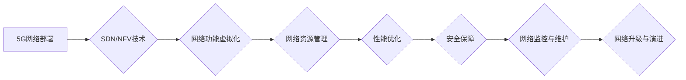

> 5G, 技术管理, 通信网络, 网络架构, 虚拟化, SDN, NFV, 运营管理, 性能优化, 安全保障, 未来趋势

## 1. 背景介绍

第五代移动通信技术（5G）作为新一代通信技术，正在深刻地改变着我们的生活和工作方式。其高速率、低时延、大连接等特性为万物互联、智能化社会的发展提供了强有力的技术支撑。然而，5G技术的部署和管理也面临着诸多挑战，需要全新的技术理念和管理模式来应对。

5G技术的核心优势在于其显著提升的网络性能。相比于4G，5G网络的峰值下载速度可达10Gbps，上传速度可达20Mbps，时延降低至1ms以下，并支持连接数达100万个/平方公里。这些性能提升将为各种新兴应用场景，如虚拟现实、增强现实、物联网、自动驾驶等，提供强大的技术基础。

然而，5G技术的复杂性和规模化部署也带来了新的挑战。5G网络架构更加复杂，包含了大量的网络功能虚拟化（NFV）和软件定义网络（SDN）技术，需要更加精细化的管理和控制。同时，5G网络的规模也更加庞大，需要更加高效的资源调度和优化策略。

## 2. 核心概念与联系

### 2.1  5G网络架构

5G网络架构主要分为三个层次：

* **无线接入网络（RAN）：**负责用户设备与核心网络之间的无线连接。
* **核心网络（CN）：**负责网络的控制、管理和数据转发。
* **服务网络（SN）：**提供各种应用服务，例如语音、数据、视频等。

5G网络架构采用虚拟化和软件定义的理念，将网络功能解耦，并通过软件定义的方式进行控制和管理。

### 2.2  SDN和NFV

* **软件定义网络（SDN）：**将网络控制平面和数据平面分离，通过软件控制器对网络进行集中化管理和控制。
* **网络功能虚拟化（NFV）：**将传统的硬件设备虚拟化，将网络功能作为软件应用程序运行在标准服务器上。

SDN和NFV技术是5G网络架构的核心组成部分，它们使得网络更加灵活、可扩展和可编程。

### 2.3  5G技术管理

5G技术管理是指对5G网络的部署、运营、维护和优化等全生命周期进行管理和控制。

**Mermaid 流程图**



## 3. 核心算法原理 & 具体操作步骤

### 3.1  算法原理概述

5G网络管理中涉及到多种算法，例如网络资源调度算法、流量控制算法、故障恢复算法等。这些算法的目的是为了提高网络的效率、可靠性和安全性。

### 3.2  算法步骤详解

以网络资源调度算法为例，其具体步骤如下：

1. 收集网络资源信息，包括可用带宽、CPU资源、内存资源等。
2. 分析用户需求，包括数据流量、服务质量要求等。
3. 根据用户需求和网络资源信息，选择合适的资源分配方案。
4. 将资源分配方案发送到网络设备，并进行资源调度。
5. 监控资源使用情况，并根据需要进行资源调整。

### 3.3  算法优缺点

不同的算法具有不同的优缺点，需要根据实际情况选择合适的算法。例如，一些算法可能在资源利用率方面表现优异，但可能在响应时间方面存在不足。

### 3.4  算法应用领域

5G网络管理中的算法广泛应用于各个领域，例如：

* **网络资源调度:** 优化网络资源分配，提高网络利用率。
* **流量控制:** 控制网络流量，避免网络拥塞。
* **故障恢复:** 快速恢复网络故障，保证网络服务可用性。
* **安全保障:** 检测和防御网络攻击，保障网络安全。

## 4. 数学模型和公式 & 详细讲解 & 举例说明

### 4.1  数学模型构建

5G网络管理中，可以使用数学模型来描述网络性能、资源分配、流量控制等方面的关系。例如，可以建立一个网络流量模型，用数学公式来描述网络流量的产生、传输和消耗。

### 4.2  公式推导过程

例如，一个简单的网络流量模型可以表示为：

$$
Traffic = DataRate * Time
$$

其中：

* Traffic 表示网络流量
* DataRate 表示数据传输速率
* Time 表示传输时间

### 4.3  案例分析与讲解

假设一个5G网络的DataRate为1Gbps，传输时间为1小时，则其流量为：

$$
Traffic = 1Gbps * 3600s = 3.6Gbps
$$

## 5. 项目实践：代码实例和详细解释说明

### 5.1  开发环境搭建

5G网络管理项目可以使用多种开发环境，例如Linux服务器、虚拟机等。需要安装必要的软件工具，例如Python、Java、Kubernetes等。

### 5.2  源代码详细实现

以下是一个简单的Python代码示例，用于模拟网络流量监控：

```python
import time

def monitor_traffic():
    while True:
        # 获取网络流量数据
        traffic = get_traffic_data()
        # 打印流量数据
        print(f"Current traffic: {traffic} Mbps")
        # 等待一段时间
        time.sleep(10)

if __name__ == "__main__":
    monitor_traffic()
```

### 5.3  代码解读与分析

这段代码定义了一个`monitor_traffic()`函数，用于监控网络流量。该函数会循环执行，每隔10秒获取一次网络流量数据，并将其打印到控制台。

### 5.4  运行结果展示

运行这段代码后，会在控制台输出实时网络流量数据。

## 6. 实际应用场景

### 6.1  运营商网络管理

5G技术管理可以帮助运营商提高网络效率、降低运营成本，并提供更好的用户体验。例如，可以通过网络资源调度算法优化网络资源分配，提高网络利用率；可以通过流量控制算法避免网络拥塞，保证网络服务质量。

### 6.2  企业私有网络管理

企业可以利用5G技术管理构建私有网络，提高网络安全性、可靠性和可扩展性。例如，可以通过SDN技术实现网络虚拟化，方便企业根据业务需求灵活配置网络资源；可以通过NFV技术将网络功能虚拟化，降低硬件成本。

### 6.3  智慧城市建设

5G技术管理可以为智慧城市建设提供技术支撑。例如，可以通过5G网络连接各种传感器和设备，实现城市环境监测、交通管理、公共安全等方面的智能化应用。

### 6.4  未来应用展望

随着5G技术的不断发展，其应用场景将更加广泛。例如，5G技术将推动工业互联网、自动驾驶、远程医疗等领域的快速发展。

## 7. 工具和资源推荐

### 7.1  学习资源推荐

* **书籍:**《5G网络技术》
* **在线课程:**Coursera、edX等平台上的5G相关课程
* **技术博客:**华为、中兴、 Ericsson等厂商的官方博客

### 7.2  开发工具推荐

* **SDN控制器:**OpenFlow、ONOS、SDN-C
* **NFV平台:**OpenStack、Kubernetes
* **网络监控工具:**Prometheus、Grafana

### 7.3  相关论文推荐

* **3GPP标准文档:**https://www.3gpp.org/
* **学术期刊:**IEEE Transactions on Communications、IEEE Journal on Selected Areas in Communications

## 8. 总结：未来发展趋势与挑战

### 8.1  研究成果总结

5G技术管理是一个快速发展的领域，已经取得了一定的研究成果。例如，SDN和NFV技术已经应用于5G网络管理，并取得了良好的效果。

### 8.2  未来发展趋势

未来，5G技术管理将朝着以下几个方向发展：

* **人工智能（AI）应用:** 利用AI技术进行网络预测、优化和自动化管理。
* **边缘计算:** 将网络功能部署到边缘节点，降低网络延迟和提高网络效率。
* **网络安全:** 加强网络安全防护，应对新的网络威胁。

### 8.3  面临的挑战

5G技术管理也面临着一些挑战，例如：

* **网络复杂性:** 5G网络架构更加复杂，需要更加精细化的管理和控制。
* **数据安全:** 5G网络需要处理大量用户数据，需要加强数据安全防护。
* **人才缺口:** 5G技术管理需要专业人才，目前人才缺口较大。

### 8.4  研究展望

未来，需要继续加强对5G技术管理的研究，探索新的技术和方法，以应对新的挑战，推动5G技术的健康发展。

## 9. 附录：常见问题与解答

### 9.1  常见问题

* **什么是5G网络管理？**
* **5G网络管理有哪些核心技术？**
* **5G网络管理有哪些应用场景？**

### 9.2  解答

* 5G网络管理是指对5G网络的部署、运营、维护和优化等全生命周期进行管理和控制。
* 5G网络管理的核心技术包括SDN、NFV、网络资源调度算法、流量控制算法等。
* 5G网络管理的应用场景包括运营商网络管理、企业私有网络管理、智慧城市建设等。


作者：禅与计算机程序设计艺术 / Zen and the Art of Computer Programming 
<end_of_turn>